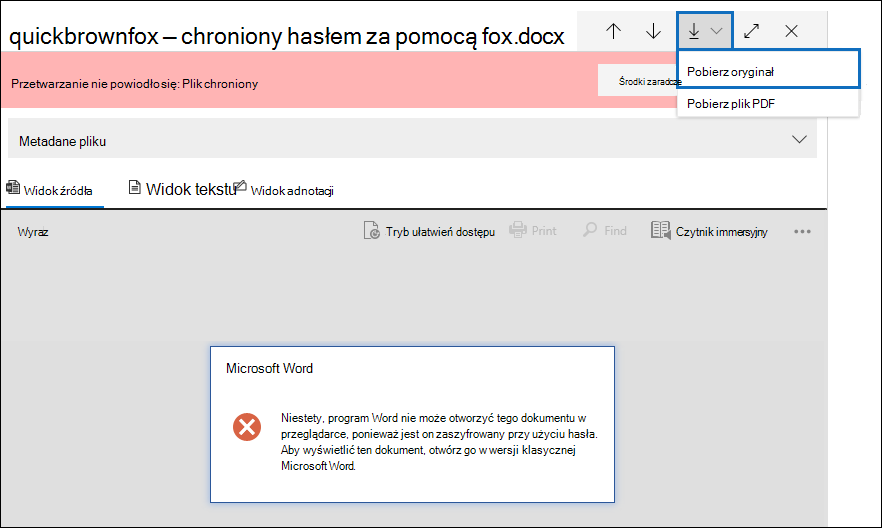
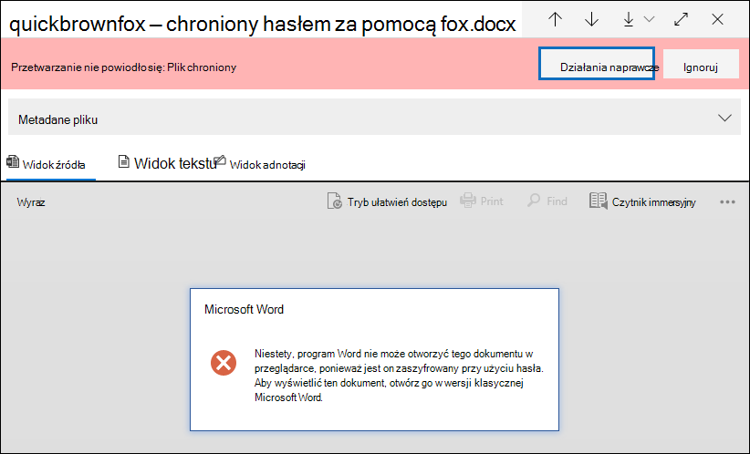
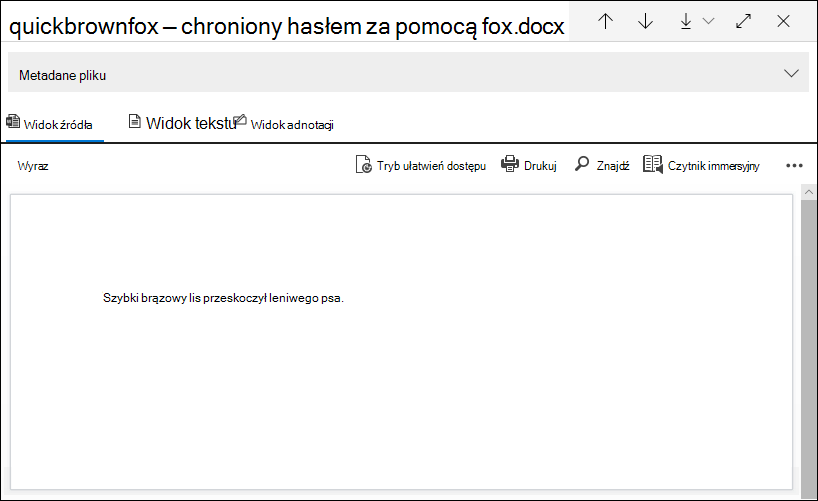

# Korygowanie błędu pojedynczego elementu w funkcji zbierania elektronicznych materiałów dowodowych (Premium)

[!include[Purview banner](../includes/purview-rebrand-banner.md)]

Korygowanie błędów daje użytkownikom usługi Microsoft Purview eDiscovery (Premium) możliwość rozwiązywania problemów z danymi, które uniemożliwiają prawidłowe przetwarzanie zawartości zbierania elektronicznych materiałów dowodowych (Premium). Na przykład nie można przetwarzać plików chronionych hasłem, ponieważ te pliki są zablokowane lub szyfrowane. Wcześniej można było korygować błędy tylko zbiorczo przy użyciu [tego przepływu pracy](error-remediation-when-processing-data-in-advanced-ediscovery.md). Ale czasami nie ma sensu korygować błędów w wielu plikach, gdy nie masz pewności, czy którykolwiek z tych plików reaguje na sprawę, którą badasz. Może również nie mieć sensu korygować błędów, zanim będziesz mieć możliwość przejrzenia metadanych pliku (takich jak lokalizacja pliku lub kto miał dostęp), aby ułatwić podejmowanie decyzji dotyczących czasu odpowiedzi. Nowa funkcja o nazwie *korygowanie błędów pojedynczego elementu* daje menedżerom zbierania elektronicznych materiałów dowodowych możliwość wyświetlania metadanych plików z błędem przetwarzania i w razie potrzeby korygowania błędu bezpośrednio w zestawie przeglądów. W tym artykule omówiono sposób identyfikowania, ignorowania i korygowania plików z błędami przetwarzania w zestawie przeglądów.

## Identyfikowanie dokumentów z błędami

Dokumenty z błędami przetwarzania w zestawie przeglądów są teraz identyfikowane (z banerem). Błąd można skorygować lub zignorować. Poniższy zrzut ekranu przedstawia baner błędu przetwarzania dla dokumentu programu Word w zestawie przeglądów chronionym hasłem. Zwróć również uwagę, że można wyświetlić metadane pliku dokumentów z błędami przetwarzania.

Możesz również wyszukać dokumenty, które mają błędy przetwarzania, używając warunku **Stan przetwarzania** podczas [wykonywania zapytań o dokumenty w zestawie przeglądów](review-set-search.md).

### Ignoruj błędy

Możesz zignorować błąd przetwarzania, klikając pozycję **Ignoruj** na banerze błędu przetwarzania. Po zignorowaniu błędu dokument zostanie usunięty z [przepływu pracy korygowania błędów zbiorczych](error-remediation-when-processing-data-in-advanced-ediscovery.md). Po zignorowaniu błędu baner dokumentu zmienia kolor i wskazuje, że błąd przetwarzania został zignorowany. W dowolnym momencie możesz przywrócić decyzję o zignorowaniu błędu, klikając pozycję **Przywróć**.

Możesz również wyszukać wszystkie dokumenty, w których wystąpił błąd przetwarzania, który został zignorowany przy użyciu warunku *Błędy przetwarzania ignorowanego* podczas wykonywania zapytań o dokumenty w zestawie przeglądów.

## Korygowanie dokumentu z błędami

Czasami może być konieczne skorygowanie błędu przetwarzania w dokumentach (przez usunięcie hasła, odszyfrowanie zaszyfrowanego pliku lub odzyskanie uszkodzonego dokumentu), a następnie dodanie skorygowanego dokumentu do zestawu przeglądów. Dzięki temu można przejrzeć i wyeksportować dokument o błędzie wraz z innymi dokumentami w zestawie przeglądów. 

Aby skorygować pojedynczy dokument, wykonaj następujące kroki:

1. Kliknij pozycję **PobierzPobierz**  >  oryginał, aby pobrać kopię pliku na komputer lokalny.

   

2. Korygowanie błędu w pliku w trybie offline. W przypadku zaszyfrowanych plików wymagałoby to odszyfrowywania oprogramowania w celu usunięcia ochrony hasłem, podania hasła i zapisania pliku lub użycia krakersa haseł. Po skorygowaniu pliku przejdź do następnego kroku.

3. W zestawie przeglądów wybierz plik z skorygowanym błędem przetwarzania, a następnie kliknij pozycję **Korygowanie**.

   

4. Kliknij przycisk **Przeglądaj**, przejdź do lokalizacji skorygowanego pliku na komputerze lokalnym, a następnie wybierz plik.

   

    Po wybraniu skorygowanego pliku jest on automatycznie przekazywany do zestawu przeglądów. Możesz śledzić stan przetwarzania pliku.

    

   Po zakończeniu przetwarzania można wyświetlić skorygowany dokument.

    

Aby uzyskać więcej informacji na temat tego, co się stanie po skorygowaniu dokumentu, zobacz [Co się stanie, gdy pliki zostaną skorygowane](error-remediation-when-processing-data-in-advanced-ediscovery.md#what-happens-when-files-are-remediated).

## Wyszukiwanie skorygowanych dokumentów

Możesz wyszukać wszystkie dokumenty w zestawie przeglądów, które zostały skorygowane przy użyciu warunku **Słowa kluczowe** i określić następującą właściwość:para wartości: **IsFromErrorRemediation:true**. Ta właściwość jest również dostępna w pliku ładowania eksportu podczas eksportowania dokumentów z zestawu przeglądów.
