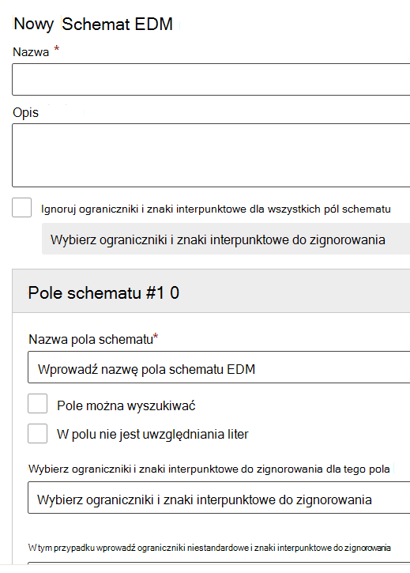

# <a name="create-the-schema-for-exact-data-match-based-sensitive-information-types"></a>Twórz schemat dla dokładnych typów informacji poufnych opartych na dopasowaniu danych

Schemat i interfejs EDM SIT można utworzyć, korzystając z kreatora [ręcznego](#create-exact-data-match-schema-manually-and-upload) używania [schematu dokładnego dopasowania danych i wzorca typów informacji poufnych](#use-the-exact-data-match-schema-and-sensitive-information-type-pattern-wizard). Można również połączyć oba przy użyciu jednej metody, aby utworzyć schemat, a następnie edytować go przy użyciu drugiej metody.

Jeśli nie znasz rozwiązania SITS opartego na protokole EDM lub ich implementacji, zapoznaj się z:

- [Dowiedz się więcej o typach informacji poufnych](sensitive-information-type-learn-about.md#learn-about-sensitive-information-types)
- [Dowiedz się więcej o dokładnych typach informacji poufnych opartych na dopasowaniu danych](sit-learn-about-exact-data-match-based-sits.md#learn-about-exact-data-match-based-sensitive-information-types)
- [Wprowadzenie do dokładnych typów informacji poufnych opartych na dopasowaniu danych](sit-get-started-exact-data-match-based-sits-overview.md#get-started-with-exact-data-match-based-sensitive-information-types)

Pojedynczy schemat EDM może być używany w wielu typach informacji poufnych, które używają tej samej poufnej tabeli danych. W dzierżawie platformy Microsoft 365 można utworzyć maksymalnie 10 różnych schematów EDM.


## <a name="use-the-exact-data-match-schema-and-sensitive-information-type-wizard"></a>Korzystanie z kreatora dokładnego schematu dopasowania danych i typu informacji poufnych

Za pomocą tego kreatora można uprościć proces tworzenia pliku schematu.

## <a name="pre-requisites"></a>Wymagania wstępne

- Wykonaj kroki opisane w [temacie Eksportowanie danych źródłowych, aby uzyskać dokładny typ informacji poufnych zgodny z danymi](sit-get-started-exact-data-match-export-data.md#export-source-data-for-exact-data-match-based-sensitive-information-type).

## <a name="use-the-exact-data-match-schema-and-sensitive-information-type-pattern-wizard"></a>Użyj kreatora dokładnego schematu dopasowania danych i wzorca typów informacji poufnych

1. W portal zgodności Microsoft Purview dzierżawy przejdź do obszaru **Klasyfikacja** > **danych Dokładne dane są zgodne** > **ze schematami EDM**.

2. Wybierz **pozycję Utwórz schemat EDM,** aby otworzyć wysuwaną konfigurację kreatora schematu.

   

3. Podaj odpowiednią **nazwę** i **opis**.

4. Wybierz **pozycję Ignoruj ograniczniki i interpunkcję dla wszystkich pól schematu** , jeśli chcesz, aby to zachowanie było przeznaczone dla całego schematu. Aby dowiedzieć się więcej na temat konfigurowania EDM do ignorowania wielkości liter lub ograniczników, zobacz [Using the caseInsensitive and ignoredDelimiters fields (Używanie pól caseInsensitive i IgnoredDelimiters](#using-the-caseinsensitive-and-ignoreddelimiters-fields) ), aby uzyskać więcej informacji na temat tej funkcji.

5. Wypełnij żądane wartości **pola Schemat nr 1** i dodaj więcej pól zgodnie z potrzebami. Każde pole schematu musi być identyczne z nagłówkami kolumn w pliku źródła informacji poufnych.

6. Jeśli chcesz, ustaw wartości dla każdego pola dla:
    1. **Pole można przeszukiwać**
    1. **Pole nie uwzględnia wielkości liter**
    1. **Wybierz ograniczniki i znaki interpunkcyjne do zignorowania dla tego pola**
    1. **Wprowadź niestandardowe ograniczniki i znaki interpunkcyjne dla tego pola**

   > [!IMPORTANT]
   > Co najmniej jedno, ale nie więcej niż pięć pól schematu musi być wyznaczonych jako możliwe do przeszukiwania.

7. Wybierz pozycję **Zapisz**. Schemat zostanie teraz wyświetlony i będzie dostępny do użycia.

   > [!IMPORTANT]
   > Jeśli chcesz usunąć schemat i jest on już skojarzony z typem informacji poufnych EDM, musisz najpierw usunąć typ informacji poufnych EDM, a następnie usunąć schemat. Usunięcie schematu z skojarzonym z nim magazynem danych powoduje również usunięcie magazynu danych w ciągu 24 godzin.

## <a name="export-of-the-edm-schema-file-in-xml-format"></a>Eksportowanie pliku schematu EDM w formacie XML

Jeśli schemat EDM został utworzony w kreatorze schematu EDM, musisz wyeksportować plik schematu EDM w formacie XML. Będzie ona potrzebna w [tabeli skrótów i przekażesz tabelę źródła informacji poufnych, aby dokładnie dopasować dane do fazy typów informacji poufnych](sit-get-started-exact-data-match-hash-upload.md#hash-and-upload-the-sensitive-information-source-table-for-exact-data-match-sensitive-information-types) .

1. [Połącz się z programem PowerShell security & Compliance](/powershell/exchange/connect-to-scc-powershell).

2. Aby wyeksportować plik schematu EDM, użyj tej składni:

   ```powershell
   $Schema = Get-DlpEdmSchema -Identity "[your EDM Schema name]"
   Set-Content -Path ".\Schemafile.xml" -Value $Schema.EdmSchemaXML
   ```

3. Zapisz ten plik do późniejszego użycia.

## <a name="create-exact-data-match-schema-manually-and-upload"></a>Ręczne tworzenie schematu dokładnego dopasowania danych i przekazywanie

W pliku schematu skonfiguruj wpis dla każdej kolumny w tabeli źródła informacji poufnych przy użyciu składni:

```xml
<Field name="FieldName" searchable="true/false" caseInsensitive="true/false" ignoredDelimiters="delimiter characters" />
```

### <a name="using-the-caseinsensitive-and-ignoreddelimiters-fields"></a>Używanie pól caseInsensitive i IgnoredDelimiters

Poniższy przykład XML schematu korzysta z pól *caseInsensitive* i *ignoredDelimiters* .

Po dodaniu pola *caseInsensitive* ustawionego `true` na wartość w definicji schematu program EDM nie wyklucza elementu na podstawie różnic wielkości liter. Na przykład EDM zobaczy wartości **FOO-1234** i **fOo-1234** jako identyczne dla `PatientID` pola.

Po dodaniu *ignorowanego polaDelimiters z obsługiwanymi znakami* program EDM zignoruje te znaki. Dlatego EDM zobaczy wartości **FOO-1234** i **FOO#1234** jako identyczne dla `PatienID` pola.

W tym przykładzie, gdy są używane zarówno `caseInsensitive` `ignoredDelimiters` i, EDM będzie zobaczyć **FOO-1234** i **fOo #1234** jako identyczne i sklasyfikować element jako typ informacji poufnych rekord pacjenta.

Oba te parametry są używane dla każdego pola.

> [!IMPORTANT]
> Jeśli skonfigurujesz *spacje* do zignorowania, będzie to skuteczne tylko w przypadku podstawowych kolumn pól, dla których zdefiniowano typ informacji poufnych, który może wykrywać ciągi wielosłowne. W przeciwnym razie porównanie zostanie wykonane względem każdego pojedynczego słowa w analizowanej zawartości.

Flaga *IgnoredDelimiters* obsługuje dowolny znak inny niż alfanumeryczny. Oto kilka przykładów:

- \.
- \-
- \/
- \_
- \*
- \^
- \#
- \!
- \?
- \[
- \]
- \{
- \}
- \\
- \~
- \;

Flaga `ignoredDelimiters` nie obsługuje:

- znaki 0–9
- A-Z
- a-z
- \"
- \,

> [!IMPORTANT]
> Podczas definiowania typu informacji poufnych EDM *ignorujDelimiters* nie wpłynie na sposób, w jaki typ informacji poufnych klasyfikacji skojarzony z elementem podstawowym we wzorcu EDM identyfikuje zawartość w elemencie. Dlatego jeśli skonfigurujesz *ignoreDelimiters* dla pola z możliwością wyszukiwania, musisz upewnić się, że typ informacji poufnych używany dla elementu podstawowego na podstawie tego pola będzie wybierał ciągi zarówno z tymi znakami, jak i bez nich.
>
> Liczba kolumn w tabeli źródła informacji poufnych i liczba pól w schemacie muszą być zgodne. Kolejność nie ma znaczenia.

1. Zdefiniuj schemat w formacie XML (podobnie jak w poniższym przykładzie). Nadaj temu plikowi schematu **nazwęedm.xml** i skonfiguruj go w taki sposób, aby dla każdej kolumny w tabeli źródła informacji poufnych istniał wiersz używający składni:

      `\<Field name="" searchable=""/\>`.

      - Użyj nazw kolumn dla wartości *nazw pól* .
      - Użyj *wartości searchable="true"* dla pól, które mają być przeszukiwalne, i pól podstawowych do maksymalnie 5 pól. Co najmniej jedno pole musi być możliwe do przeszukiwania.

      Na przykład następujący plik XML definiuje schemat bazy danych rekordów pacjentów z pięcioma polami określonymi jako możliwe do wyszukiwania: *PatientID*, *MRN*, *SSN*, *Phone* i *DOB*.

      (Możesz skopiować, zmodyfikować i użyć naszego przykładu).

      ```xml
      <EdmSchema xmlns="http://schemas.microsoft.com/office/2018/edm">
            <DataStore name="PatientRecords" description="Schema for patient records" version="1">
                  <Field name="PatientID" searchable="true" caseInsensitive="true" ignoredDelimiters="-,/,*,#,^" />
                  <Field name="MRN" searchable="true" />
                  <Field name="FirstName" />
                  <Field name="LastName" />
                  <Field name="SSN" searchable="true" />
                  <Field name="Phone" searchable="true" />
                  <Field name="DOB" searchable="true" />
                  <Field name="Gender" />
                  <Field name="Address" />
            </DataStore>
      </EdmSchema>
      ```

   Po utworzeniu pliku schematu EDM w formacie XML musisz przekazać go do usługi w chmurze.

2. [Połącz się z programem PowerShell security & Compliance](/powershell/exchange/connect-to-scc-powershell).

3. Aby przekazać schemat bazy danych, uruchom następujące polecenie:

      ```powershell
      New-DlpEdmSchema -FileData ([System.IO.File]::ReadAllBytes('.\\edm.xml')) -Confirm:$true
      ```

      Zostanie wyświetlony monit o potwierdzenie w następujący sposób:

      > Potwierdzić
      >
      > Czy na pewno chcesz wykonać tę akcję?
      >
      > Zostanie zaimportowany nowy schemat EDM dla magazynu danych "patientrecords".
      >
      > \[Y\] Tak tak \[\] do wszystkich \[N\] Nie \[L\] Nie dla wszystkich\[?\] Pomoc (wartość domyślna to "Y"):

   > [!TIP]
   > Jeśli chcesz, aby zmiany wystąpiły bez potwierdzenia, nie używaj ich `-Confirm:$true` w kroku 3.

> [!NOTE]
> Aktualizacja pakietu EDMSchema z dodatkami może potrwać od 10 do 60 minut. Aktualizacja musi zostać ukończona przed wykonaniem kroków korzystających z dodatków.

## <a name="next-step"></a>Następny krok

- [Utwórz skrót i przekaż tabelę źródła informacji poufnych dla dokładnych typów informacji poufnych opartych na dopasowaniu danych ](sit-get-started-exact-data-match-hash-upload.md#hash-and-upload-the-sensitive-information-source-table-for-exact-data-match-sensitive-information-types)
