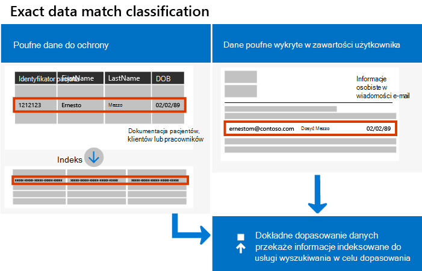

# Informacje o dokładnie tych typach informacji poufnych na podstawie danych

 Typy informacji poufnych ułatwiają identyfikowanie elementów poufnych w celu uniknięcia ich przypadkowego lub nieodpowiedniego udostępniania, ułatwiają zlokalizowanie odpowiednich danych w ramach zbierania elektronicznych materiałów dowodowych i stosowanie akcji zarządzania do określonych typów informacji. Niestandardowy typ informacji poufnych (SIT) definiuje się na podstawie:

- desenie
- informacje kluczowe, takie *jak pracownik*, *numer PEP* lub *identyfikator*
- odległość znaku do dowodu w określonym wzorcu
- poziomy ufności

Ale co zrobić, jeśli potrzebujesz niestandardowego typu informacji poufnych (SIT), który używa dokładnych lub niemal dokładnych wartości danych, zamiast jednego, który znajduje dopasowanie na podstawie ogólnych wzorców? Za pomocą klasyfikacji dokładnego dopasowania danych (EDM) możesz utworzyć niestandardowy typ informacji poufnych, który ma:

- być dynamiczna i łatwo odświeżana
- być bardziej skalowalna
- wynik jest mniej wyników fałszywie dodatnich
- Praca z poufnymi danymi strukturalnymi
- bezpieczniejsza obsługa poufnych informacji bez ich udostępniania innym osobom, w tym firmie Microsoft
- być używana z kilkoma usługami firmy Microsoft w chmurze

Klasyfikacja oparta na programie EDM umożliwia tworzenie niestandardowych typów informacji poufnych, które odwołują się do dokładnych wartości w bazie danych informacji poufnych. Baza danych może być odświeżana codziennie i zawierać maksymalnie 100 milionów wierszy danych. Gdy pracownicy, klienci lub klienci przychodzą i odchodzą, a rekordy się zmieniają, niestandardowe typy informacji poufnych pozostają aktualne i mają zastosowanie. Możesz też użyć klasyfikacji opartej na funkcji EDM z zasadami, takimi jak zasady  ochrony przed utratą danych lub zasady dotyczące Microsoft Cloud App Security [plikach](/cloud-app-security/data-protection-policies).

> [!NOTE]
> Microsoft 365 Informacji obsługuje dwu bajtowe języki zestawu znaków dla:
>
> - Chiński (uproszczony)
> - Chiński (tradycyjny)
> - Korean
> - Japanese
>
> Ta obsługa jest dostępna w przypadku typów informacji poufnych. Aby uzyskać [więcej informacji](mip-dbcs-relnotes.md) , zobacz Obsługa ochrony informacji dla zestawów znaków dwuteowych (wersja Zapoznawcza).

## Co się różni w programie EDM SIT

Podczas pracy z tym programem warto zrozumieć kilka pojęć, które są unikatowe.  

### Schemat

Schemat to plik XML definiujący:

- Nazwa schematu, później określana mianem magazynu *danych*. 
- Nazwy pól, które zawiera tabela źródło informacji poufnych. Istnieje mapowanie nazwy pola schematu w 1:1 na poufne nazwy kolumny tabeli źródłowej informacji.
- Pola, które można wyszukiwać.
- Dowolne wyszukiwanie modyfikujące parametry, nazywane konfigurować *dopasowanie*, na przykład ignoruje ograniczniki i sprawy w wyszukiwanych wartościach.

### Tabela źródło danych poufnych

Tabela źródło poufnych zawiera wartości informacji poufnych, które będzie szukać w programie EDM SIT. Składa się on z kolumn i wierszy. Nagłówki kolumn to nazwy pól, wiersze są wystąpieniem danych, a każda komórka zawiera wartości dla tego pola.

Oto prosty przykład tabeli źródła informacji poufnych.

|Imię  |Nazwisko  |Data urodzenia  |
|---------|---------|---------|
|Isaiah   |Langer  | 05-05-1960 |
|Ana   |Bowman         |11-24-1971 |
|Na wschowa   |Ward         |02-12-1998 |

### Pakiet reguł

Każdy sit ma pakiet reguł. Pakiet reguł w funkcji EDM SIT służy do definiowania:

- Dopasowania, określające pole, które ma być podstawowym elementem używanym w dokładnym odnośniku. Może to być zwykłe wyrażenie ze sprawdzaniem poprawności sumy sprawdzanej lub bez, listą słów kluczowych, słownikiem słów kluczowych lub funkcją.
- Klasyfikacja, określająca dopasowanie typu poufnego, które wyzwala odnośnik funkcji EDM.
- Element obsługujący, który jest elementem, w przypadku którego znaleziono istotne informacje, które zwiększają pewność dopasowania. Na przykład słowo kluczowe "SSN" w odległości od numeru SSN. Może to być zwykłe wyrażenie ze sprawdzaniem poprawności sumy sprawdzanej lub bez, listą słów kluczowych, słownikiem słów kluczowych.
- Poziomy ufności (wysoki, średni, niski) odzwierciedlają informacje potwierdzające, które zostały wykryte wraz z podstawowym elementem. Im więcej dowodów ważnych dla elementu zawiera, tym większa pewność, że dopasowany element zawiera szukane informacje poufne. Zobacz Podstawowe [części typu informacji poufnej, aby uzyskać](sensitive-information-type-learn-about.md#fundamental-parts-of-a-sensitive-information-type) więcej informacji na temat poziomów ufności.
Odległość — liczba znaków między elementem podstawowym a elementem obsługowym

### Ty dostarczasz własny schemat i dane

[Microsoft 365 zawiera ponad 200 funkcji SIT](sensitive-information-type-entity-definitions.md) ze wstępnie zdefiniowanymi schematami, wzorcami regex, słowami kluczowymi i poziomami ufności. Za pomocą podstawowych i pomocniczych pól określających poufne elementy odpowiadasz za zdefiniowanie schematu oraz pól podstawowych i pomocniczych. Schemat oraz podstawowe i pomocnicze wartości danych są bardzo poufne, dlatego należy je zaszyfrować za pomocą skrótu, który  zawiera losowo wygenerowaną lub samodzielne [wartości soli.](https://en.wikipedia.org/wiki/Salt_(cryptography)#:~:text=The%20salt%20value%20is%20generated%20at%20random%20and,the%20salt%20value%20and%20hashed%20value%20are%20stored.) Te wartości skrótów są następnie przekazywane do usługi, więc poufne dane nigdy nie są otwarte.

### Podstawowe i pomocnicze elementy pomocy technicznej

Podczas tworzenia pakietu EDM SIT użytkownik definiuje podstawowe pole *elementu* w pakiecie reguł. Pola podstawowe to elementy, w przypadku których będzie przeszukiwana cała zawartość, które muszą być wskazane zgodnie ze zdefiniowanym wzorcem. Gdy element podstawowy zostanie znaleziony w zeskanowanych elementach, program EDM będzie szukać dodatkowych lub pomocniczych  elementów, które nie muszą być zgodne ze wzorcem, oraz ich odległości od elementu podstawowego. Program EDM wymaga, aby element podstawowy był najpierw wykrywalny za pośrednictwem istniejącego systemu SIT. Zobacz [Definicje encji typu informacji poufnych](sensitive-information-type-entity-definitions.md) , aby uzyskać pełną listę dostępnych list dostępnych typów informacji. Musisz znaleźć jedną z tych, która wykrywa zajęcia, które ma zostać wykryna przez program EDM SIT. Jeśli na przykład podstawowym elementem schematu EDM SIT jest amerykański numer PEZ, podczas tworzenia schematu EDM należy go skojarzyć z amerykańskim numerem PEZ.

## Jak działa dopasowywanie

Wyszukuje dopasowania przez porównanie znalezionej zawartości z zdefiniowaną tabelą danych poufnych. Testowanie dopasowania odbywa się za pomocą kombinacji tradycyjnych reguł i wzorców, aby zagwarantować, że dopasowane dane będą rzeczywistym wystąpieniem danych, które chcesz znaleźć i chronić. Podstawową działaniem funkcji zarządzania danymi jest porównanie ciągów w dokumentach i wiadomościach e-mail z wartościami w tabeli danych poufnych, które są dostarczane, aby sprawdzić, czy wartości w zawartości znajdują się w tabeli, przez porównanie jednokierunkowych skrótów kryptograficznych.

> [!TIP]
> Często spotykanym rozwiązaniem jest połączenie korzystania z typów informacji poufnych w programie EDM oraz zwykłych typów informacji poufnych, na podstawie których są oparte na zasadach DLP, z różnymi progami. Możesz na przykład użyć typu informacji poufnych nr EDM, który wyszukuje numery PESEL i inne dane, z rygorystycznymi wymaganiami i niskim poziomem tolerancji, gdy co najmniej jedno dopasowania będzie powodować alert DLP, i używać zwykłego typu informacji poufnych, takiego jak amerykański numer PESEL, aby uzyskać wyższą liczbę.  

## Zobacz też

- [Wprowadzenie do dokładnych typów informacji poufnych opartych na danych](sit-get-started-exact-data-match-based-sits-overview.md#get-started-with-exact-data-match-based-sensitive-information-types)
   
