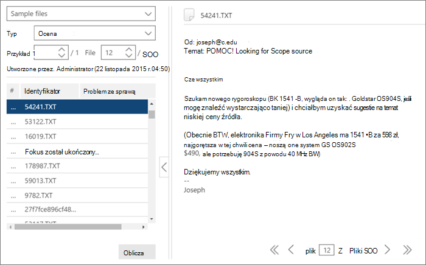

# Szkolenia dotyczące otagowania i istotności w programie Advanced eDiscovery
  
W tym artykule opisano procedurę pracy z modułem szkolenia dotyczące istotności w programie Advanced eDiscovery.
  
Po zakończeniu oceny w programie Advanced eDiscovery i wprowadzeniu etapu szkolenia Istotność na karcie Tag jest przeniesiena próbka szkolenia z 40 plików.
  
## Przeprowadzanie szkolenia z zakresie istotności

1. Na karcie **Tag \> istotności** okienko Otagowanie jest domyślnie wyświetlane w okienku po lewej stronie, a przykładowe pliki są wyświetlane po jednym tagowaniu.

    
  
    Na **karcie Tag** jest wyświetlana nazwa pliku. Może to być ścieżka, temat wiadomości e-mail, tytuł lub nazwa zdefiniowana przez użytkownika. Identyfikator, ścieżkę pliku lub ścieżkę tekstową można skopiować, klikając prawym przyciskiem myszy ścieżkę pliku.

    **Statystyki** tagów na karcie Tag pokazują przykładowy numer pliku (u góry lewego okienka), liczbę obecnie wyświetlanego pliku z wszystkich plików w przykładowym (dolnej części prawego okienka) oraz bieżącą całkowitą liczbę otagowanych plików w przykładzie (na dole lewego okienka), która zmienia się wraz z dodawaniem tagów do plików. Dotyczy to wszelkiego oznaczania istotności wykonanego zarówno w ramach testów, szkoleń, zajęć, jak i testów.

    Ikony oznaczające istnienie komentarzy, tagów i plików rodzinnych są wyświetlane w widoku pliku na pasku nad plikiem.

2. Określ istotność pliku dla problemu i otaguj plik za pomocą przycisków ikon opcji tagowania lub skrótów klawiaturowych, jak pokazano w poniższej tabeli:

   |**Opcja otagowania**|**Opis**|**Skrót klawiaturowy**|**Zbiorczo tagowanie skrótu klawiaturowego (w przypadku wielu problemów)**|
   |-----|-----|-----|-----|
   |R    |Odpowiedni temat    |Z    |`Shift + Z`    |
   |NR    |Nie istotne    |X    |`Shift + X`    |
   |Pomiń    |Pomiń    |C    |`Shift + A`    |
   |||||

   - Jeśli w przypadku pliku występuje wiele problemów, po oznakowaniu jednego problemu zaznaczenie jest przenosowane do następnego problemu (jeśli istnieją).  

   - Słowa kluczowe zdefiniowane przez administratora lub menedżera przypadków podczas wyróżniania słów kluczowych ( \> Wyróżnione słowa kluczowe konfiguracji istotności) zostaną wyświetlone (w określonych kolorach), aby ułatwić identyfikację odpowiednich plików podczas znakowania. Jeśli słowo kluczowe ma podwójne podkreślenie, można je kliknąć, aby wyświetlić etykietkę narzędzia z opisem słowa kluczowego.

     Opcjonalnie na karcie **Tag** kliknij pozycję **Ustawienia tagu** , aby ustawić następujące opcje:

      
  
   - **Tag zbiorczy**: Użyj tej opcji, aby przypisać wiele problemów do pliku,  wybierając pozycję Wszystkie, aby ustawić tag dla wybranego pliku dla wszystkich problemów (zastępuje już otagowane problemy) lub  wybierając pozycję Pozostałe, aby zastosować tag do pozostałych niepoddanych problemów. Wybrana opcja będzie obowiązywać we wszystkich przypadkach tego użytkownika, dopóki nie zostanie zmieniona przez tego użytkownika (ustawienie jest dla każdego użytkownika we wszystkich przypadkach użytkownika).

   - **Tag automatyczny**: Zaznacz to pole wyboru, aby ustawić inne problemy dotyczące pliku jako Nie dotyczy po jednym Odpowiednim otagowaniu.

   - **Automatyczne przechodzenie** do następnego pliku: zaznacz to pole wyboru, aby przenieść wyświetlany plik do następnego pliku podczas otagowania ostatniego lub tylko niezarchiwowanego problemu.

    Pominięte pliki nie będą uznawane za na potrzeby oceniania wyników z oceny istotności i istotności.

3. Komentarze w tekście, skojarzone z plikiem, można wyświetlać i edytować za pomocą opcji Komentarz  na liście rozwijanej okienka po lewej stronie. (opcjonalnie)

4. Wskazówki dotyczące otagowania można wyświetlić, wybierając opcję Wytyczne **dotyczące otagowania** na liście rozwijanej okienka po lewej stronie.

5. Po zakończeniu tagowania wszystkich plików na liście i przygotowaniu się do obliczenia wyników kliknij przycisk **Oblicz**. Zostanie **wyświetlona** karta Śledzenie.  

## Praca z listą plików przykładowych

Lista plików przykładowych umożliwia wyświetlanie listy plików w przykładzie szkolenia i wykonywanie różnych akcji na jednym lub kilku plikach. Na karcie **Tag** \> **istotności** w okienku  po lewej stronie w okienku Przykładowe pliki jest wyświetlana lista przykładowych plików do przetworzenia z procesami Oceny, Szkolenia, Dojścia i Niespójności.
  
1. Na karcie **Tag istotności \>** wybierz pozycję Przykładowe pliki na liście rozwijanej okienka po lewej stronie. Przykładowe pliki są wyświetlane w okienku po lewej stronie.

    
  
2. Wybierz określony przykład lub numer pliku, wprowadzając lub wybierając jego numer w polach **Przykład lub Plik**.

   - W lewej kolumnie wyświetlanej listy plików na karcie Tag jest wyświetlany **numer sekwencji** plików. Klikając nagłówek, zostanie wyświetlona oryginalna kolejność plików, która wraca do pierwotnej kolejności.

   - Kliknięcie wiersza pliku powoduje wyświetlenie jego zawartości w prawym okienku.

   - Przechodzenie między plikami w bieżącym przykładzie przy użyciu dolnej opcji paska menu. Ponadto dostępne są skróty klawiaturowe:
  
     - Aby przejść do pierwszego pliku w przykładzie: `Shift + Ctrl + <`

     - Aby przejść do poprzedniego pliku w przykładzie: `Shift + <`

     - Aby przejść do następnego pliku z przykładu: `Shift + >`

     - Aby przejść do ostatniego pliku w przykładzie: `Shift + Ctrl + >`
