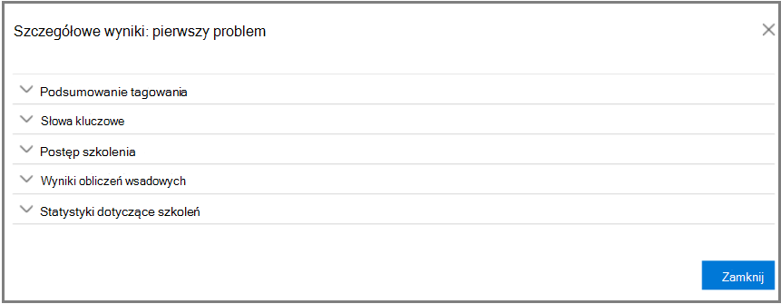

# Śledzenie analizy istotności w programie Advanced eDiscovery
  
Na Advanced eDiscovery na karcie Śledzenie istotności jest wyświetlana obliczona poprawność szkolenia dotyczące istotności przeprowadzonego na karcie Znacznik, a także wskazuje następny krok do podjęcia w procesie szkolenia iteracyjnych na temat istotności. 
  
## Śledzenie istotności szkolenia

1. W artykule Śledzenie istotności problemu można wyświetlić następujące szczegóły, jak pokazano w poniższym przykładzie okna **dialogowego Nazwa** problemu.

   - **Ocena**: Wskaźnik postępu pokazuje, w jakim stopniu szkolenie dotyczące istotności przeprowadzone w tym momencie osiągnięto cel oceny pod względem marginesu błędu. Wyświetlana jest też rozbudowa wyników szkolenia na temat istotności.

   - **Szkolenie**: Ten oznaczony kolorami wskaźnik postępu i etykietka narzędzia wskazują stabilność wyników szkolenia dotyczące istotności oraz skalę liczbową przedstawiającą liczbę próbek szkoleniowych z istotności oznaczonych dla poszczególnych problemów. Ekspert monitoruje postęp procesu szkolenia na temat istotności iteracyjnych. 
  
   - **Obliczanie partii**: Ten wskaźnik postępu dostarcza informacji o ukończeniu obliczania partii.
  
   - **Następny krok**: Wyświetla zalecenia dotyczące następnego kroku do wykonania. 
  
    W tym przykładzie pomyślnie ukończono ocenę problemu, na co wskazuje wskaźnik postępu koloru i znacznik wyboru. Otagowanie jest w toku, ale mimo to sprawa jest niestabilna (stabilność jest również wyświetlana w etykietce narzędzia). Następnym krokiem jest "Szkolenie". 
  
    
  
    W rozwiniętym widoku są wyświetlane dodatkowe informacje i opcje. Wyświetlanym bieżącym marginesem błędu jest margines błędu odwołania w bieżącym stanie oceny z uwagi na istniejące (już otagowane) pliki ocen.
  
    > [!NOTE]
    >  Etap oceny można pominąć, czyszcząc pole **wyboru Ocena** dla każdego problemu, a następnie "wszystkie problemy". W wyniku tego nie będą dostępne żadne statystyki dotyczące tego problemu. > wyczyszczenie pola **wyboru Ocena** jest możliwe tylko przed rozpoczęciem oceniania. Jeśli w przypadku sprawy występuje wiele problemów, ocena jest pomijana tylko wtedy, gdy dla każdego problemu jest wyczyszczane pole wyboru 
  
    W przypadku nieu ukończenia oceny z pierwszym przykładowym zestawem plików kolejnym krokiem do otagowania większej liczby plików może być ocena.
  
    W **narzędziu** \> **Śledzenie istotności** wskaźnik postępu szkolenia i etykietka narzędzia wskazują szacowaną liczbę dodatkowych próbek potrzebnych do osiągnięcia stabilności. Ta oszacowanie stanowi wytyczne dotyczące potrzebnych dodatkowych szkoleń.
  
    
  
2. Po tagize, a jeśli chcesz kontynuować szkolenie, kliknij pozycję **Szkolenie**. Na podstawie załadowanego zestawu plików jest generowany inny przykładowy zestaw plików do dodatkowego szkolenia. Powrócisz do karty Tag, aby oznaczyć i przeszkolić więcej plików.

### Osiągnięcie stabilnego poziomu szkoleń

Po osiągnięciu stabilnego poziomu szkoleń pliki Advanced eDiscovery są gotowe do obliczania wsadowego.
  
> [!NOTE]
> Zazwyczaj po trzech stabilnych przykładach szkoleniowych następnym krokiem jest "Obliczanie wsadowe". Mogą być wyjątki, na przykład w przypadku zmian w oznakowaniu plików z wcześniejszych próbek lub w momencie dodania plików iniektowanych. 
  
### Wykonywanie obliczeń wsadowych

Obliczenia wsadowe są wykonywane jako następny krok po pomyślnym ukończeniu szkolenia (jeśli na pasku postępu widać stabilny stan szkolenia, znacznik wyboru i stabilny stan w etykietce narzędzia). Obliczenia wsadowe dotyczą całej populacji plików na podstawie uzyskanej wiedzy nabytej w ramach szkolenia na temat istotności, a także do oceny istotności plików i przypisania wyników z oceny istotności.
  
Jeśli występuje więcej niż jeden problem, obliczanie wsadowe jest wykonywane dla każdego problemu. Podczas obliczania wsadowego postęp jest monitorowany podczas przetwarzania wszystkich plików. 
  
W tym miejscu zalecanym następnym krokiem jest "Brak", co oznacza, że na tym etapie nie jest wymagane dodatkowe szkolenie na temat istotności. Następnym etapem jest karta **Podjęcie decyzji o \> istotności** . 
  
Jeśli chcesz zaimportować nowe pliki po obliczeniu wsadu, administrator może dodać zaimportowane pliki do nowego ładowania.
  
> [!NOTE]
> Kliknięcie przycisku **Anuluj** podczas obliczania wsadowego powoduje zapisanie już wykonanej pracy. Jeśli ponownie zostanie uruchomione obliczenie wsadowe, proces będzie kontynuowany od ostatniego wykonanego punktu. 
  
### Ocenianie spójności otagowania

Niespójności w otagowaniu plików mogą mieć wpływ na analizę. Proces Advanced eDiscovery otagowania może być używany, gdy wyniki nie są optymalne lub istnieją wątpliwości co do spójności. Zostanie zwrócona lista możliwych niespójnie otagowanych plików, które można w razie potrzeby przeglądać i ponownie zasyłać.
  
> [!NOTE]
> Po co najmniej siedmiu rundach  \>  \>  \> szkoleniowych po ocenach spójność znakowania można wyświetlić w widoku Śledzenie istotności Śledzenia problemu **Szczegółowe** \> wyniki **postępów szkoleń**. Ta recenzja jest wykonywana dla jednego problemu na raz.
  
1. W **śledzenie istotności \>** rozwiń wiersz problemu.
  
2. Po prawej stronie **następnego kroku** kliknij przycisk **Modyfikuj**.
  
3. Wybierz **pozycję Niespójności tagów** jako **opcję Następny krok** po siedmiu próbach szkoleniowych i kliknij przycisk **OK**.
  
4. Wybierz **pozycję Niespójności tagów**. Zostanie **otwarta** karta Tag z listą niespójności do ponownego otagowania w razie potrzeby.
  
5. Kliknij **przycisk Oblicz** , aby przesłać zmiany. Kolejnym krokiem po oznakowaniu niespójności jest "Szkolenie". 
  
## Wyświetlanie i używanie wyników istotności

Na karcie **Śledzenie \> istotności** rozwiń wiersz problemu i obok **przycisku Szczegółowe wyniki** kliknij pozycję **Wyświetl**. Zostaną wyświetlone okienka Wyników szczegółowych, jak pokazano i opisano poniżej.
  

  
### Podsumowanie tagowania

 W poniższym przykładzie w podsumowaniu  Otagowanie są wyświetlane sumy dla poszczególnych procesów oceny, szkolenia i znakowania plików pochwytnych.
  

  
### Słowa kluczowe

Słowo kluczowe to unikatowy ciąg znaków, słowo, fraza lub sekwencja wyrazów w pliku oznaczonym Advanced eDiscovery istotnym wskaźnikiem tego, czy plik jest istotny. Na liście "Uwzględnij" kolumny są wyświetlane słowa kluczowe i wagi w plikach oznaczonych jako Odpowiednie, a w kolumnach "Wyklucz" są wyświetlane słowa kluczowe i wagi w plikach oznaczonych jako Nie istotne.
  
Advanced eDiscovery ujemnych lub dodatnich wartości wagi słów kluczowych. Im wyższa waga, tym większe prawdopodobieństwo, że plikowi, w którym znajduje się słowo kluczowe, zostanie przypisany wyższy wynik istotności podczas obliczania partii.
  
Lista Advanced eDiscovery słów kluczowych może być używana w celu uzupełnienia listy budowaną przez eksperta lub jako pośredniego sprawdzania sanacji w dowolnym momencie procesu przeglądu pliku.
  
### Postęp szkolenia

Okienko **Postęp szkolenia** zawiera wykres postępu szkolenia i wyświetlanie wskaźnika jakości, jak pokazano w poniższym przykładzie.
  

  
**Wskaźnik jakości szkoleń**: Wyświetla klasyfikację spójności otagowania w następujący sposób:
  
- **Dobrze**: pliki są otagowane spójnie. (Wyświetlone zielone światło)
  
- **Średni**: Niektóre pliki mogą być otagowane niespójnie. (Wyświetlone żółte światło)

- **Ostrzeżenie**: Wiele plików może być otagowanych niespójnie. (Zostanie wyświetlone czerwone światło)

**Wykres postępu w szkoleniach**: przedstawia stopień stabilności szkolenia według istotności po wielu cyklach szkoleniowych oceny istotności w porównaniu z wartością miary F. Gdy przechodzimy od lewej do prawej strony wykresu, przedział ufności zawęża się i jest używany razem ze miarą F przez Advanced eDiscovery Istotność w celu określenia stabilności po optymalizacji wyników szkolenia na temat istotności.
  
> [!NOTE]
> Na podstawie istotności jest używana wartość F2 — metryka miary F, w której odwołanie otrzymuje dwukrotnie większą wagę niż dokładność. W przypadku przypadków o wysokim poziomie wartości (powyżej 25%), istotność ma zastosowanie F1 (stosunek 1:1). Współczynnik miary F można skonfigurować w ustawieniach zaawansowanych Konfiguracja **istotności**\>.
  
### Wyniki obliczeń wsadowych

Okienko **Wyniki obliczania partii** zawiera liczbę plików, które zostały uzyskane pod uwagę jako istotność, w następujący sposób: 
  
- **Sukces**
  
- **Puste**: Nie zawiera tekstu, na przykład tylko spacje/tabulatory.
  
- **Nie powiodło** się: Ze względu na nadmiarowy rozmiar lub nie można było go odczytać
  
- **Ignorowane**: ze względu na nadmiarowe rozmiary
  
- **Nieumyślne**: zawiera tekst bezsensowny lub nie zawiera funkcji istotnych dla problemu.
  
> [!NOTE]
> Puste, Niepowodzenie, Zignorowane lub Nieuważne otrzymają ocenę istotności -1.
  
### Statystyki dotyczące szkoleń

W **okienku Statystyka** szkoleń są wyświetlane statystyki i schematy na podstawie wyników Advanced eDiscovery szkolenia dotyczące istotności. 
  

  
W tym widoku są następujące informacje:
  
- **Współczynnik odwołania reenzenta**: Porównanie wyników według wyników istotności w przeglądzie liniowym pod względem hipotezy. Odwołanie jest szacowane przy ustawionym rozmiarze zestawu recenzji.
  
- **Parametry**: Skumulowana obliczona statystyka odnoszące się do zestawu recenzji w odniesieniu do populacji pliku dla całej sprawy.
  
- **Recenzja**: Procent plików do przejrzenia na podstawie tego odciętych plików.
  
- **Odwołaj**: Procent plików w zestawie recenzji. 
  
- **Rozkład według istotności**: Pliki na ciemnoszarym ekranie po lewej stronie znajdują się poniżej wyniku odciętych. Etykietka narzędzia wyświetla wynik istotności i powiązaną wartość procentową plików w zestawie recenzji względem łącznych plików.
