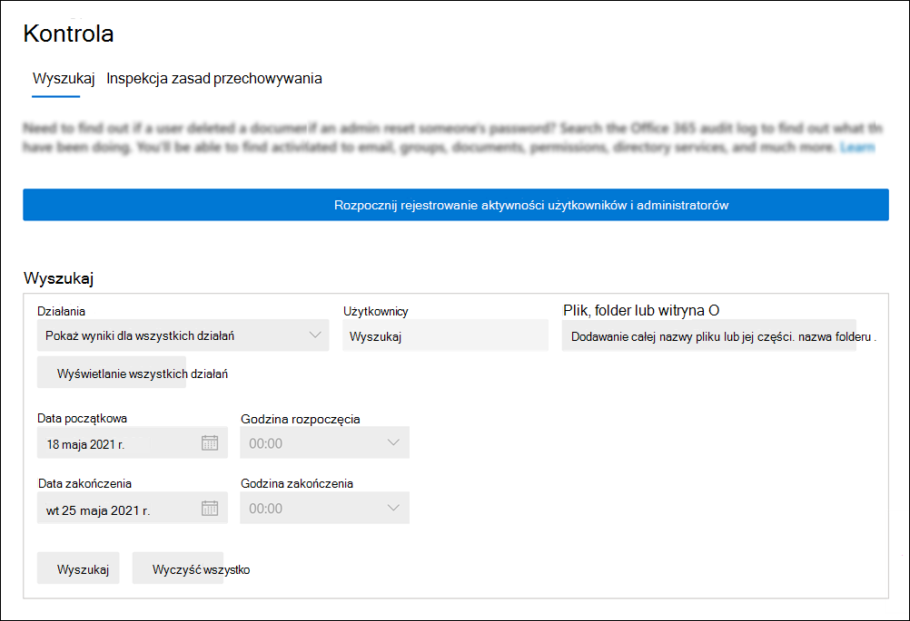

# <a name="turn-auditing-on-or-off"></a>Włączanie i wyłączanie inspekcji

Rejestrowanie inspekcji będzie domyślnie włączone dla Microsoft 365 i Office 365 przedsiębiorstw. Jednak podczas konfigurowania nowej organizacji Microsoft 365 lub Office 365 należy zweryfikować stan inspekcji dla organizacji. Aby uzyskać instrukcje, [zobacz sekcję Sprawdzanie](#verify-the-auditing-status-for-your-organization) stanu inspekcji organizacji w tym artykule. 

W przypadku włączonej inspekcji w aplikacji usługi Centrum zgodności platformy Microsoft 365 działania użytkowników i administratorów w organizacji są rejestrowane w dzienniku inspekcji i przechowywane przez 90 dni, a w zależności od licencji przypisanej do użytkowników do nich maksymalnie rok. Twoja organizacja może jednak nie chcieć rejestrować i zachowywać danych dziennika inspekcji. W takich przypadkach administrator globalny może zadecydować o wyłączenia inspekcji w Microsoft 365.

> [!IMPORTANT]
> Jeśli wyłączysz inspekcję w programie Microsoft 365, nie możesz uzyskać dostępu do danych inspekcji dla organizacji przy użyciu interfejsu API działań zarządzania Office 365 lub programu Microsoft Sentinel. Wyłączenie inspekcji przez czynności opisane w tym artykule oznacza, że żadne wyniki nie zostaną zwrócone podczas przeszukiwania dziennika inspekcji przy użyciu programu Centrum zgodności platformy Microsoft 365 lub po uruchomieniu polecenia cmdlet **Search-UnifiedAuditLog** w programie Exchange Online PowerShell. Oznacza to również, że dzienniki inspekcji nie będą dostępne za pośrednictwem interfejsu API działań zarządzania Office 365 lub programu Microsoft Sentinel.
  
## <a name="before-you-turn-auditing-on-or-off"></a>Przed włączeniem lub wyłączeniem inspekcji

- Aby włączyć lub wyłączyć inspekcję w organizacji Exchange Online w organizacji, musisz mieć przypisaną rolę Dzienniki inspekcji Microsoft 365 organizacji. Domyślnie ta rola jest przypisana do grup ról Zarządzanie zgodnością i Zarządzanie organizacją na stronie Uprawnienia w  centrum administracyjnym usługi Exchange administracyjnego. Administratorzy globalni w Microsoft 365 są członkami grupy ról Zarządzanie organizacją w programie Exchange Online.

    > [!NOTE]
    > Aby włączyć lub wyłączyć inspekcję Exchange Online użytkownicy muszą mieć przypisane uprawnienia w aplikacji. Jeśli przypiszesz użytkownikom rolę Dzienniki inspekcji na  stronie Uprawnienia w Centrum zgodności platformy Microsoft 365, nie będą oni mogli włączyć ani wyłączyć inspekcji. Jest to spowodowane tym, że polecenie cmdlet źródłowe jest poleceniem cmdlet programu Exchange Online programu PowerShell.

- Aby uzyskać instrukcje krok po kroku dotyczące przeszukiwania dziennika inspekcji, zobacz [Przeszukiwanie dziennika inspekcji](search-the-audit-log-in-security-and-compliance.md). Aby uzyskać więcej informacji na temat interfejsu API Microsoft 365 zarządzania, zobacz [Wprowadzenie do Microsoft 365 API zarządzania](/office/office-365-management-api/get-started-with-office-365-management-apis).

## <a name="verify-the-auditing-status-for-your-organization"></a>Sprawdzanie stanu inspekcji dla organizacji

Aby sprawdzić, czy inspekcja jest włączona w organizacji, w programie PowerShell można uruchomić [następujące Exchange Online:](/powershell/exchange/connect-to-exchange-online-powershell)

```powershell
Get-AdminAuditLogConfig | FL UnifiedAuditLogIngestionEnabled
```

Wartość właściwości `True`  _UnifiedAuditLogIngestionEnabled_ wskazuje, że inspekcja jest włączona. Wartość of oznacza `False` , że inspekcja nie jest włączona.

> [!NOTE]
> Pamiętaj o uruchomieniu poprzedniego polecenia w programie Exchange Online PowerShell. Za pomocą programu PowerShell & zabezpieczeń i zgodności nie można uruchomić tego polecenia.

## <a name="turn-on-auditing"></a>Włączanie inspekcji

Jeśli inspekcja nie jest włączona w organizacji, możesz ją włączyć w programie Centrum zgodności platformy Microsoft 365 lub przy użyciu programu Exchange Online PowerShell. Włączenie inspekcji może potrwać kilka godzin, zanim będzie można zwrócić wyniki podczas przeszukiwania dziennika inspekcji.
  
### <a name="use-the-compliance-center-to-turn-on-auditing"></a>Włączanie inspekcji za pomocą Centrum zgodności

1. Przejdź do i <https://compliance.microsoft.com> zaloguj się.

2. W lewym okienku nawigacji okna Centrum zgodności platformy Microsoft 365 pozycję **Inspekcja**.

   Jeśli w organizacji nie włączona jest inspekcja, zostanie wyświetlony transparent z monitem o rozpoczęcie rejestrowania aktywności użytkowników i administratorów.

   

3. Kliknij baner **Rozpocznij rejestrowanie aktywności użytkowników i administratorów** .

   Może upłynieć do 60 minut, aby zmiana obowiązywała.

### <a name="use-powershell-to-turn-on-auditing"></a>Włączanie inspekcji za pomocą programu PowerShell

1. [Połączenie do Exchange Online PowerShell](/powershell/exchange/connect-to-exchange-online-powershell).

2. Uruchom następujące polecenie programu PowerShell, aby włączyć inspekcję.

    ```powershell
    Set-AdminAuditLogConfig -UnifiedAuditLogIngestionEnabled $true
    ```

    Zostanie wyświetlony komunikat informujący, że może upłynieć do 60 minut, aby zmiana została w życie.
  
## <a name="turn-off-auditing"></a>Wyłączanie inspekcji

Aby wyłączyć inspekcję Exchange Online należy użyć programu PowerShell.
  
1. [Połączenie do Exchange Online PowerShell](/powershell/exchange/connect-to-exchange-online-powershell).

2. Uruchom następujące polecenie programu PowerShell, aby wyłączyć inspekcję.

    ```powershell
    Set-AdminAuditLogConfig -UnifiedAuditLogIngestionEnabled $false
    ```

3. Po chwili sprawdź, czy inspekcja jest wyłączona (wyłączona). Istnieją dwa sposoby wykonywania tej czynności:

    - W Exchange Online PowerShell uruchom następujące polecenie:

      ```powershell
      Get-AdminAuditLogConfig | FL UnifiedAuditLogIngestionEnabled
      ```

      Wartość właściwości  `False`  _UnifiedAuditLogIngestionEnabled_ wskazuje, że inspekcja jest wyłączona.

    - Przejdź do strony **Inspekcja** w Centrum zgodności platformy Microsoft 365.

      Jeśli w organizacji nie włączona jest inspekcja, zostanie wyświetlony transparent z monitem o rozpoczęcie rejestrowania aktywności użytkowników i administratorów.

## <a name="audit-records-when-auditing-status-is-changed"></a>Rekordy inspekcji w przypadku zmiany stanu inspekcji

Zmiany stanu inspekcji w organizacji będą podlegały inspekcji. Oznacza to, że rekordy inspekcji są rejestrowane, gdy inspekcja jest włączona lub wyłączona. Te rekordy inspekcji można Exchange przeszukiwać w dzienniku inspekcji administratora.

Aby przeszukać Exchange inspekcji w poszukiwaniu rekordów inspekcji generowanych podczas włączania lub wyłączania inspekcji, uruchom następujące polecenie w [programie Exchange Online PowerShell](/powershell/exchange/connect-to-exchange-online-powershell):

```powershell
Search-AdminAuditLog -Cmdlets Set-AdminAuditLogConfig -Parameters UnifiedAuditLogIngestionEnabled
```

Rekordy inspekcji dotyczące tych zdarzeń zawierają informacje dotyczące zmiany stanu inspekcji, administratora, który go zmienił, oraz adres IP komputera użytego do wymusania tej zmiany. Na poniższych zrzutach ekranu przedstawiono rekordy inspekcji odpowiadające zmianie stanu inspekcji w organizacji.

### <a name="audit-record-for-turning-on-auditing"></a>Rekord inspekcji włączania inspekcji


`Confirm` Wartość właściwości *CmdletParameters* wskazuje, że ujednolicone rejestrowanie inspekcji zostało włączone w centrum zgodności lub przez uruchomienie polecenia cmdlet **Set-AdminAuditLogConfig -UnifiedAuditLogIngestionEnabled** $true cmdlet.

### <a name="audit-record-for-turning-off-auditing"></a>Rekord inspekcji w celu wyłączenia inspekcji


Wartość nie `Confirm` jest uwzględniana we właściwości *CmdletParameters* . Oznacza to, że ujednolicone rejestrowanie inspekcji zostało wyłączone przez uruchomienie polecenia polecenia $false **Set-AdminAuditLogConfig -UnifiedAuditLogIngestionEnabled** .

Aby uzyskać więcej informacji na temat przeszukiwania Exchange inspekcji administratora, zobacz [Search-AdminAuditLog](/powershell/module/exchange/search-adminauditlog).
