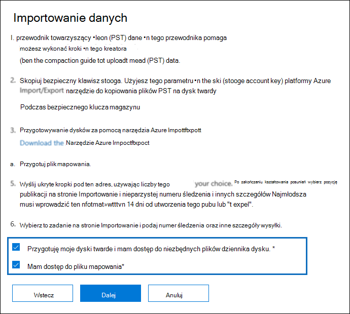
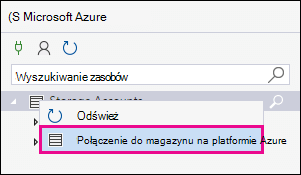
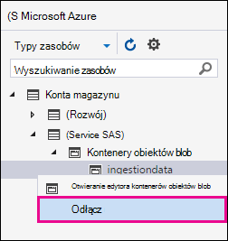

# <a name="use-drive-shipping-to-import-your-organizations-pst-files"></a>Importowanie plików PST organizacji przy użyciu wysyłania dysków

[!include[Purview banner](../includes/purview-rebrand-banner.md)]

**Ten artykuł jest przeznaczony dla administratorów. Czy próbujesz zaimportować pliki PST do własnej skrzynki pocztowej? Zobacz [Importowanie wiadomości e-mail, kontaktów i kalendarza z pliku pst Outlook](https://go.microsoft.com/fwlink/p/?LinkID=785075)**
   
Użyj usługi Office 365 Import i wyślij dysk do zbiorczego importowania plików PST do skrzynek pocztowych użytkowników. Wysyłka dysku oznacza skopiowanie plików PST na dysk twardy, a następnie fizyczne wysłanie dysku do firmy Microsoft. Gdy firma Microsoft otrzyma dysk twardy, pracownicy centrum danych kopiują dane z dysku twardego do obszaru magazynowania w chmurze firmy Microsoft. Następnie możesz przyciąć dane PST zaimportowane do docelowych skrzynek pocztowych, ustawiając filtry kontrolujące importowane dane. Po uruchomieniu zadania importowania usługa Import importuje dane PST z obszaru magazynowania do skrzynek pocztowych użytkowników. Importowanie plików PST do skrzynek pocztowych użytkowników przy użyciu wysyłania dysków jest jednym ze sposobów migrowania poczty e-mail organizacji do Office 365.
  
Poniżej przedstawiono kroki wymagane do użycia wysyłki dysku w celu zaimportowania plików PST do Microsoft 365 skrzynek pocztowych:
  
[Krok 1. Pobieranie narzędzia do importowania PST](#step-1-download-the-pst-import-tool)

[Krok 2. Kopiowanie plików PST na dysk twardy](#step-2-copy-the-pst-files-to-the-hard-drive)

[Krok 3. Tworzenie pliku mapowania importu PST](#step-3-create-the-pst-import-mapping-file)

[Krok 4. Tworzenie zadania importu PST w Office 365](#step-4-create-a-pst-import-job-in-office-365)

[Krok 5. Wysłanie dysku twardego do firmy Microsoft](#step-5-ship-the-hard-drive-to-microsoft)

[Krok 6. Filtrowanie danych i uruchamianie zadania importowania PST](#step-6-filter-data-and-start-the-pst-import-job)
  
> [!IMPORTANT]
> Aby pobrać narzędzie do importowania, należy wykonać krok 1 raz. Po wykonaniu tych kroków wykonaj kroki od kroku 2 do kroku 6 za każdym razem, gdy chcesz wysłać dysk twardy do firmy Microsoft. 
  
Aby uzyskać często zadawane pytania dotyczące importowania plików PST do Office 365 przy użyciu wysyłania [dysków, zobacz Często zadawane pytania dotyczące importowania plików PST za pomocą wysyłania dysków](./faqimporting-pst-files-to-office-365.yml#using-drive-shipping-to-import-pst-files). 
  
## <a name="before-you-import-pst-files"></a>Przed zaimportowaniem plików PST

- Musisz mieć przypisaną rolę eksportu importu skrzynki pocztowej w Exchange Online, aby utworzyć zadania importu w portalu zgodności usługi Microsoft Purview i zaimportować pliki PST do skrzynek pocztowych użytkowników. Domyślnie ta rola nie jest przypisana do żadnej grupy ról w Exchange Online. Rolę Import eksportu skrzynki pocztowej można dodać do grupy ról Zarządzanie organizacją. Możesz też utworzyć grupę ról, przypisać rolę Importuj eksport skrzynki pocztowej, a następnie dodać siebie jako członka. Aby uzyskać więcej informacji, zobacz sekcje "Dodawanie roli do grupy ról" lub "Tworzenie grupy ról" w sekcji [Zarządzanie grupami ról](/Exchange/permissions-exo/role-groups).

    Oprócz roli Importuj eksport skrzynki pocztowej musisz również mieć przypisaną rolę Adresaci poczty w Exchange Online. Domyślnie ta rola jest przypisywana do grup ról Zarządzanie organizacjami i Zarządzanie adresatami w Exchange Online.

    > [!TIP]
    > Rozważ utworzenie nowej grupy ról w Exchange Online, która jest przeznaczona specjalnie do importowania plików PST do Office 365. Aby uzyskać minimalny poziom uprawnień wymaganych do importowania plików PST, przypisz role Eksportuj i Adresaci poczty skrzynki pocztowej do nowej grupy ról, a następnie dodaj członków.
  
- Musisz przechowywać pliki PST, które chcesz skopiować na dysk twardy na serwerze plików lub w folderze udostępnionym w organizacji. W kroku 2 uruchomisz narzędzie Azure Import Export (WAImportExport.exe), które kopiuje pliki PST przechowywane na tym serwerze plików lub w folderze udostępnionym na dysk twardy.

- Duże pliki PST mogą mieć wpływ na wydajność procesu importowania PST. Dlatego zalecamy, aby każdy plik PST skopiowany na dysk twardy w kroku 2 nie był większy niż 20 GB.

- Tylko 2,5-calowe dyski półprzewodnikowe (SSD) lub 2,5 cala lub 3,5-calowe wewnętrzne dyski twarde SATA II/III są obsługiwane do użytku z usługą importu Office 365. Dysków twardych można używać do 10 TB. W przypadku zadań importowania będzie przetwarzany tylko pierwszy wolumin danych na dysku twardym. Wolumin danych musi być sformatowany przy użyciu systemu PLIKÓW NTFS. Podczas kopiowania danych na dysk twardy można dołączyć je bezpośrednio przy użyciu 2,5-calowego dysku SSD lub 2,5-calowego lub 3,5-calowego łącznika SATA II/III lub można dołączyć je zewnętrznie przy użyciu zewnętrznego 2,5-calowego dysku SSD lub 2,5 cala lub 3,5-calowego adaptera USB SATA II/III.
    
    > [!IMPORTANT]
    > Zewnętrzne dyski twarde z wbudowaną kartą USB nie są obsługiwane przez usługę Office 365 Import. Ponadto nie można użyć dysku wewnątrz obudowy zewnętrznego dysku twardego. Nie wysyłaj zewnętrznych dysków twardych. 
  
- Dysk twardy, na który kopiujesz pliki PST, musi być szyfrowany za pomocą funkcji BitLocker. Narzędzie WAImportExport.exe uruchomione w kroku 2 pomoże Ci skonfigurować funkcję BitLocker. Generuje również klucz szyfrowania funkcji BitLocker używany przez personel centrum danych firmy Microsoft do uzyskiwania dostępu do dysku w celu przekazania plików PST do obszaru usługi Azure Storage w chmurze firmy Microsoft.
    
- Wysyłka dysku jest dostępna za pośrednictwem usługi Microsoft Enterprise Agreement (EA). Wysyłka dysku nie jest dostępna za pośrednictwem umowy Microsoft Products and Services Agreement (MPSA).
    
- Koszt importowania plików PST do skrzynek pocztowych platformy Microsoft 365 przy użyciu wysyłki dysków wynosi 2 USD za GB danych. Jeśli na przykład zostanie dostarczony dysk twardy zawierający 1000 GB (1 TB) plików PST, koszt to 2000 USD. Możesz współpracować z partnerem w celu uiszczenia opłaty importowej. Aby uzyskać informacje na temat znajdowania partnera, zobacz [Znajdowanie partnera lub odsprzedawcy firmy Microsoft](../admin/manage/find-your-partner-or-reseller.md).
    
- Ty lub Twoja organizacja musisz mieć konto w usłudze FedEx lub DHL.
    
  - Organizacje w Stany Zjednoczone, Brazylii i Europie muszą mieć konta FedEx.
    
  - Organizacje w Azji Wschodniej, Azji Południowo-Wschodniej, Japonii, Republice Korei i Australii muszą mieć konta DHL.
    
    Firma Microsoft używa (i opłat) tego konta, aby zwrócić ci dysk twardy.
    
- Dysk twardy dostarczany firmie Microsoft może przekraczać granice międzynarodowe. W takim przypadku odpowiadasz za upewnienie się, że dysk twardy i jego dane są importowane i/lub eksportowane zgodnie z obowiązującymi przepisami. Przed wysłaniem dysku twardego skontaktuj się z doradcami, aby sprawdzić, czy dysk i dane mogą być legalnie dostarczane do zidentyfikowanego centrum danych firmy Microsoft. Pomaga to zapewnić, że dotrze ona do firmy Microsoft w odpowiednim czasie.
    
- Ta procedura obejmuje kopiowanie i zapisywanie klucza szyfrowania funkcji BitLocker. Pamiętaj, aby podjąć środki ostrożności w celu ochrony tych kluczy, tak jak w przypadku ochrony haseł lub innych informacji związanych z zabezpieczeniami. Możesz na przykład zapisać je w dokumencie Microsoft Word chronionym hasłem lub zapisać je na zaszyfrowanym dysku USB. Zobacz sekcję [Więcej informacji](#more-information) , aby zapoznać się z przykładem tych kluczy. 
    
- Po zaimportowaniu plików PST do Microsoft 365 skrzynki pocztowej ustawienie przechowywania dla skrzynki pocztowej jest włączone na czas nieokreślony. Oznacza to, że zasady przechowywania przypisane do skrzynki pocztowej nie zostaną przetworzone, dopóki nie wyłączysz blokady przechowywania lub nie ustawisz daty wyłączenia blokady. Dlaczego to robimy? Jeśli wiadomości zaimportowane do skrzynki pocztowej są stare, mogą zostać trwale usunięte (przeczyszczane), ponieważ ich okres przechowywania wygasł na podstawie ustawień przechowywania skonfigurowanych dla skrzynki pocztowej. Umieszczenie skrzynki pocztowej w blokadzie przechowywania daje właścicielowi skrzynki pocztowej czas na zarządzanie tymi nowo zaimportowanymi wiadomościami lub daje czas na zmianę ustawień przechowywania skrzynki pocztowej. Zobacz sekcję [Więcej informacji](#more-information) , aby uzyskać sugestie dotyczące zarządzania blokadą przechowywania. 
    
- Domyślnie maksymalny rozmiar wiadomości, który może zostać odebrany przez skrzynkę pocztową Microsoft 365, wynosi 35 MB. Dzieje się tak, ponieważ wartość domyślna właściwości  *MaxReceiveSize*  dla skrzynki pocztowej jest ustawiona na 35 MB. Jednak limit maksymalnego rozmiaru odbierania komunikatów w Microsoft 365 wynosi 150 MB. Jeśli więc zaimportujesz plik PST zawierający element większy niż 35 MB, usługa Office 365 Import automatycznie zmieni wartość właściwości *MaxReceiveSize* w docelowej skrzynce pocztowej na 150 MB. Dzięki temu do skrzynek pocztowych użytkowników można importować wiadomości o rozmiarze do 150 MB. 
    
    > [!TIP]
    > Aby zidentyfikować rozmiar odbierania wiadomości dla skrzynki pocztowej, możesz uruchomić to polecenie w programie Exchange Online programu PowerShell: `Get-Mailbox <user mailbox> | FL MaxReceiveSize`. 
  
- Pliki PST można zaimportować do nieaktywnej skrzynki pocztowej w Office 365. W tym celu należy określić identyfikator GUID nieaktywnej skrzynki pocztowej w parametrze  `Mailbox` w pliku mapowania importu PST. Aby uzyskać więcej informacji [, zobacz Krok 3. Tworzenie pliku mapowania importu PST](#step-3-create-the-pst-import-mapping-file) . 
    
- W Exchange wdrożenia hybrydowego można zaimportować pliki PST do chmurowej skrzynki pocztowej archiwum dla użytkownika, którego podstawowa skrzynka pocztowa jest lokalna. Można to zrobić, wykonując następujące czynności w pliku mapowania importu PST:
    
  - W parametrze określ adres e-mail lokalnej skrzynki pocztowej  `Mailbox` użytkownika. 
    
  - Określ wartość **TRUE** w parametrze  `IsArchive` . 
    
    Aby uzyskać więcej informacji [, zobacz Krok 3. Tworzenie pliku mapowania importu PST](#step-3-create-the-pst-import-mapping-file) . 

## <a name="step-1-download-the-pst-import-tool"></a>Krok 1. Pobieranie narzędzia do importowania PST

Pierwszym krokiem jest pobranie narzędzia, którego użyjesz w kroku 2, aby skopiować pliki PST na dysk twardy.
  
> [!IMPORTANT]
> Aby pomyślnie zaimportować pliki PST przy użyciu metody wysyłki dysku, należy użyć narzędzia Azure Import/Export w wersji 1 (WAimportExportV1). Wersja 2 narzędzia azure Import/Export nie jest obsługiwana, a użycie go spowoduje nieprawidłowe przygotowanie dysku twardego do zadania importowania. Pamiętaj, aby pobrać narzędzie azure Import/Export z portalu zgodności usługi Microsoft Purview, wykonując procedury opisane w tym kroku. 
  
1. Przejdź do strony <https://compliance.microsoft.com> i zaloguj się przy użyciu poświadczeń konta administratora w organizacji.

2. W okienku nawigacji po lewej stronie portalu zgodności kliknij pozycję **Importowanie** **ładu** \> informacji.
    
    > [!NOTE]
    > Jak wspomniano wcześniej, musisz mieć przypisane odpowiednie uprawnienia, aby uzyskać dostęp do strony **Importuj** w portalu zgodności.
  
3. Na karcie **Import** kliknij pozycję Dodaj ikonę  **Nowe zadanie importu**.
    
4. W kreatorze zadań importowania wpisz nazwę zadania importu PST, a następnie kliknij przycisk **Dalej**. Użyj małych liter, cyfr, łączników i podkreślenia. Nie można używać wielkich liter ani dołączać spacji w nazwie.
    
5. Na stronie **Wybieranie typu zadania importowania** kliknij pozycję **Wyślij dyski twarde do jednej z naszych lokalizacji fizycznych** , a następnie kliknij przycisk **Dalej**.
    
    
  
6. Na stronie **Importuj dane** wykonaj następujące czynności:     
    
    **Pobierz narzędzie azure Import/Export**, aby pobrać i zainstalować narzędzie Azure Import/Export (wersja 1).
    
    - W oknie podręcznym kliknij pozycję **Zapisz** \> **jako** , aby zapisać plik WaImportExportV1.zip w folderze na komputerze lokalnym.
    
    - Wyodrębnij plik WaImportExportV1.zip.
    
7. Kliknij **przycisk Anuluj** , aby zamknąć kreatora.
    
    Po utworzeniu zadania importu w kroku 4 wrócisz do strony **Import** w portalu zgodności.

## <a name="step-2-copy-the-pst-files-to-the-hard-drive"></a>Krok 2. Kopiowanie plików PST na dysk twardy

Następnym krokiem jest użycie narzędzia WAImportExport.exe do kopiowania plików PST na dysk twardy. To narzędzie szyfruje dysk twardy za pomocą funkcji BitLocker, kopiuje pliki PST na dysk twardy i tworzy plik dziennika, który przechowuje informacje o procesie kopiowania. Aby wykonać ten krok, pliki PST muszą znajdować się w udziale plików lub na serwerze plików w organizacji. Jest to znany jako katalog źródłowy w poniższej procedurze.

 Jak wspomniano wcześniej, każdy plik PST skopiowany na dysk twardy nie powinien być większy niż 20 GB. Pliki PST większe niż 20 GB mogą mieć wpływ na wydajność procesu importowania PST rozpoczętego w kroku 6.
  
> [!IMPORTANT]
> Po uruchomieniu narzędzia WAImportExport.exe po raz pierwszy dla dysku twardego należy za każdym razem użyć innej składni. Ta składnia została wyjaśniona w kroku 4 tej procedury, aby skopiować pliki PST na dysk twardy.
  
1. Otwórz wiersz polecenia na komputerze lokalnym.
    
    > [!TIP]
    > Jeśli uruchomisz wiersz polecenia jako administrator (wybierając pozycję "Uruchom jako administrator" po jego otwarciu), w oknie wiersza polecenia zostaną wyświetlone komunikaty o błędzie. Może to pomóc w rozwiązywaniu problemów z uruchamianiem narzędzia WAImportExport.exe.
  
2. Przejdź do katalogu, w którym zainstalowano narzędzie WAImportExport.exe w kroku 1.
3. Uruchom następujące polecenie przy pierwszym użyciu WAImportExport.exe, aby skopiować pliki PST na dysk twardy.

    ```powershell
    WAImportExport.exe PrepImport /j:<Name of journal file> /t:<Drive letter> /id:<Name of session> /srcdir:<Location of PST files> /dstdir:<PST file path> /blobtype:BlockBlob /encrypt /logdir:<Log file location>
    ```

    W poniższej tabeli opisano parametry i ich wymagane wartości.
    
    |**Parametr**|**Opis**|**Przykład**|
    |:-----|:-----|:-----|
    | `/j:` <br/> |Określa nazwę pliku dziennika. Ten plik jest zapisywany w tym samym folderze, w którym znajduje się narzędzie WAImportExport.exe. Każdy dysk twardy dostarczany do firmy Microsoft musi mieć jeden plik dziennika. Za każdym razem, gdy uruchamiasz WAImportTool.exe, aby skopiować pliki PST na dysk twardy, informacje będą dołączane do pliku dziennika dla tego dysku.  <br/> Pracownicy centrum danych firmy Microsoft korzystają z informacji w pliku dziennika, aby skojarzyć dysk twardy z zadaniem importu utworzonym w kroku 4 oraz przekazać pliki PST do obszaru usługi Azure Storage w chmurze firmy Microsoft.  <br/> | `/j:PSTHDD1.jrn` <br/> |
    | `/t:` <br/> |Określa literę dysku twardego po nawiązaniu połączenia z komputerem lokalnym.  <br/> | `/t:h` <br/> |
    | `/id:` <br/> |Określa nazwę sesji kopiowania. Sesja jest definiowana za każdym razem, gdy uruchamiasz narzędzie WAImportExport.exe, aby skopiować pliki na dysk twardy. Pliki PST są kopiowane do folderu o nazwie z nazwą sesji określoną przez ten parametr.  <br/> | `/id:driveship1` <br/> |
    | `/srcdir:` <br/> |Określa katalog źródłowy w organizacji, który zawiera pliki PST, które zostaną skopiowane podczas sesji. Pamiętaj, aby otoczyć wartość tego parametru podwójnym cudzysłowem (" ").  <br/> | `/srcdir:"\\FILESERVER01\PSTs"` <br/> |
    | `/dstdir:` <br/> |Określa katalog docelowy w obszarze Storage platformy Azure w chmurze firmy Microsoft, w którym zostaną przekazane usługi PST. Należy użyć wartości  `ingestiondata/`. Pamiętaj, aby otoczyć wartość tego parametru podwójnym cudzysłowem (" ").  <br/> Opcjonalnie możesz również dodać dodatkową ścieżkę pliku do wartości tego parametru. Na przykład można użyć ścieżki pliku katalogu źródłowego na dysku twardym (przekonwertowanego na format adresu URL), który jest określony w parametrze  `/srcdir:` . Na przykład  `\\FILESERVER01\PSTs` zmieniono wartość na  `FILESERVER01/PSTs`. W takim przypadku nadal musisz dołączyć  `ingestiondata` ścieżkę pliku. W tym przykładzie wartość parametru  `/dstdir:` to  `"ingestiondata/FILESERVER01/PSTs"`.  <br/> Jedną z przyczyn dodania dodatkowej ścieżki pliku jest to, czy masz pliki PSTs o tej samej nazwie pliku.  <br/> > [!NOTE]> Jeśli uwzględnisz opcjonalną nazwę ścieżki, przestrzeń nazw pliku PST po przekazaniu do obszaru usługi Azure Storage zawiera nazwę ścieżki i nazwę pliku PST, na przykład `FILESERVER01/PSTs/annb.pst`. Jeśli nie uwzględnisz nazwy ścieżki, przestrzeń nazw jest tylko nazwą pliku PST; na przykład  `annb.pst`.           | `/dstdir:"ingestiondata/"` <br/> Lub  <br/>  `/dstdir:"ingestiondata/FILESERVER01/PSTs"` <br/> |
    | `/blobtype:` <br/> |Określa typ obiektów blob w obszarze usługi Azure Storage do zaimportowania plików PST. Do importowania plików PST użyj wartości **BlockBlob**. Ten parametr jest wymagany.   <br/> | `/blobtype:BlockBlob` <br/> |
    | `/encrypt` <br/> |Ten przełącznik włącza funkcję BitLocker dla dysku twardego. Ten parametr jest wymagany przy pierwszym uruchomieniu narzędzia WAImportExport.exe.  <br/> Klucz szyfrowania funkcji BitLocker jest kopiowany do pliku dziennika i pliku dziennika utworzonego w przypadku użycia parametru  `/logfile:` . Jak wyjaśniono wcześniej, plik dziennika jest zapisywany w tym samym folderze, w którym znajduje się narzędzie WAImportExport.exe.  <br/> | `/encrypt` <br/> |
    | `/logdir:` <br/> |Ten opcjonalny parametr określa folder do zapisania plików dziennika. Jeśli nie zostanie określony, pliki dziennika są zapisywane w tym samym folderze, w którym znajduje się narzędzie WAImportExport.exe. Pamiętaj, aby otoczyć wartość tego parametru podwójnym cudzysłowem (" ").  <br/> | `/logdir:"c:\users\admin\desktop\PstImportLogs"` <br/> |
   
    Oto przykład składni narzędzia WAImportExport.exe przy użyciu rzeczywistych wartości dla każdego parametru:
    
    ```powershell
    WAImportExport.exe PrepImport /j:PSTHDD1.jrn /t:f /id:driveship1 /srcdir:"\\FILESERVER01\PSTs" /dstdir:"ingestiondata/" blobtype:BlockBlob /encrypt /logdir:"c:\users\admin\desktop\PstImportLogs"
    ```

    Po uruchomieniu polecenia są wyświetlane komunikaty o stanie, które pokazują postęp kopiowania plików PST na dysk twardy. Końcowy komunikat o stanie pokazuje całkowitą liczbę plików, które zostały pomyślnie skopiowane.
    
4. Uruchom to polecenie przy każdym kolejnym uruchomieniu narzędzia WAImportExport.ext, aby skopiować pliki PST na ten sam dysk twardy.

    ```powershell
    WAImportExport.exe PrepImport /j:<Name of journal file> /id:<Name of new session> /srcdir:<Location of PST files> /dstdir:<PST file path> /blobtype:BlockBlob 
    ```

    Oto przykład składni uruchamiania kolejnych sesji w celu skopiowania plików PST na ten sam dysk twardy.

    ```powershell
    WAImportExport.exe PrepImport /j:PSTHDD1.jrn /id:driveship2 /srcdir:"\\FILESERVER01\PSTs\SecondBatch" /dstdir:"ingestiondata/" /blobtype:BlockBlob
    ```

## <a name="step-3-create-the-pst-import-mapping-file"></a>Krok 3. Tworzenie pliku mapowania importu PST

Gdy pracownicy centrum danych firmy Microsoft przekażą pliki PST z dysku twardego do obszaru usługi Azure Storage, usługa Import użyje informacji w pliku mapowania importu PST, który jest plikiem wartości rozdzielanej przecinkami (CSV), który określa, do których skrzynek pocztowych użytkowników są importowane pliki PST. Ten plik CSV zostanie przesłany w następnym kroku podczas tworzenia zadania importu PST.
  
1. [Pobierz kopię pliku mapowania importu PST](https://go.microsoft.com/fwlink/p/?LinkId=544717).
    
2. Otwórz lub zapisz plik CSV na komputerze lokalnym. W poniższym przykładzie przedstawiono ukończony plik mapowania importu PST (otwarty w Notatniku). Znacznie łatwiej jest użyć Microsoft Excel do edytowania pliku CSV.

    ```text
    Workload,FilePath,Name,Mailbox,IsArchive,TargetRootFolder,ContentCodePage,SPFileContainer,SPManifestContainer,SPSiteUrl
    Exchange,FILESERVER01/PSTs,annb.pst,annb@contoso.onmicrosoft.com,FALSE,/,,,,
    Exchange,FILESERVER01/PSTs,annb_archive.pst,annb@contoso.onmicrosoft.com,TRUE,/ImportedPst,,,,
    Exchange,FILESERVER01/PSTs,donh.pst,donh@contoso.onmicrosoft.com,FALSE,/,,,,
    Exchange,FILESERVER01/PSTs,donh_archive.pst,donh@contoso.onmicrosoft.com,TRUE,/ImportedPst,,,,
    Exchange,FILESERVER01/PSTs,pilarp.pst,pilarp@contoso.onmicrosoft.com,FALSE,/,,,,
    Exchange,FILESERVER01/PSTs,pilarp_archive.pst,pilarp@contoso.onmicrosoft.com,TRUE,/ImportedPst,,,,
    Exchange,,tonyk.pst,tonyk@contoso.onmicrosoft.com,FALSE,/,,,,
    Exchange,,tonyk_archive.pst,tonyk@contoso.onmicrosoft.com,TRUE,,,,,
    Exchange,,zrinkam.pst,zrinkam@contoso.onmicrosoft.com,FALSE,/,,,,
    Exchange,,zrinkam_archive.pst,zrinkam@contoso.onmicrosoft.com,TRUE,,,,,
    ```

    Pierwszy wiersz lub wiersz nagłówka pliku CSV zawiera listę parametrów, które będą używane przez usługę importu PST do importowania plików PST do skrzynek pocztowych użytkownika. Każda nazwa parametru jest oddzielona przecinkiem. Każdy wiersz w wierszu nagłówka reprezentuje wartości parametrów importowania pliku PST do określonej skrzynki pocztowej. Potrzebny jest wiersz dla każdego pliku PST skopiowanego na dysk twardy. Pamiętaj, aby zastąpić dane symboli zastępczych w pliku mapowania rzeczywistymi danymi.

    > [!NOTE]
    > Nie zmieniaj niczego w wierszu nagłówka, w tym parametrów SharePoint; zostaną one zignorowane podczas procesu importowania PST. 
  
3. Użyj informacji w poniższej tabeli, aby wypełnić plik CSV wymaganymi informacjami.
    
    |**Parametr**|**Opis**|**Przykład**|
    |:-----|:-----|:-----|
    | `Workload` <br/> |Określa usługę, do którą zostaną zaimportowane dane. Aby zaimportować pliki PST do skrzynek pocztowych użytkownika, użyj polecenia  `Exchange`.  <br/> | `Exchange` <br/> |
    | `FilePath` <br/> | Określa lokalizację folderu w obszarze Storage platformy Azure, do których zostaną skopiowane pliki PST, gdy dysk twardy zostanie wysłany do firmy Microsoft.  <br/>  To, co dodajesz w tej kolumnie w pliku CSV, zależy od tego, co określono w parametrze  `/dstdir:` w poprzednim kroku. Jeśli w lokalizacji źródłowej znajdują się podfoldery, wartość parametru `FilePath` musi zawierać ścieżkę względną podfolderu, na przykład /folder1/user1/.  <br/>  Jeśli użyto  `/dstdir:"ingestiondata/"`polecenia , pozostaw ten parametr pusty w pliku CSV.  <br/>  Jeśli dołączono opcjonalną nazwę ścieżki dla wartości parametru  `/dstdir:` (na przykład  `/dstdir:"ingestiondata/FILESERVER01/PSTs"`, użyj tej nazwy ścieżki (bez uwzględnienia "ingestiondata") dla tego parametru w pliku CSV. Wartość tego parametru uwzględnia wielkość liter.  <br/>  Tak czy inaczej,  *nie*  uwzględniaj wartości "ingestiondata" w wartości parametru  `FilePath` . Pozostaw ten parametr pusty lub określ tylko opcjonalną nazwę ścieżki.  <br/> > [!IMPORTANT]> Przypadku nazwy ścieżki pliku musi być taki sam przypadek, jak określono w parametrze  `/dstdir:` w poprzednim kroku. Jeśli na przykład użyto  `"ingestiondata/FILESERVER01/PSTs"` nazwy podfolderu w poprzednim kroku, ale użyto  `fileserver01/psts` go w  `FilePath` parametrze w pliku CSV, importowanie pliku PST zakończy się niepowodzeniem. Pamiętaj, aby używać tego samego przypadku w obu wystąpieniach.           |(pozostaw puste)  <br/> Lub  <br/>  `FILESERVER01/PSTs` <br/> |
    | `Name` <br/> |Określa nazwę pliku PST, który zostanie zaimportowany do skrzynki pocztowej użytkownika. Wartość tego parametru uwzględnia wielkość liter.  <br/> > [!IMPORTANT]> Przypadek nazwy pliku PST w pliku CSV musi być taki sam jak plik PST przekazany do lokalizacji usługi Azure Storage w kroku 2. Jeśli na przykład używasz  `annb.pst` parametru  `Name` w pliku CSV, ale nazwa rzeczywistego pliku PST to  `AnnB.pst`, importowanie tego pliku PST zakończy się niepowodzeniem. Upewnij się, że nazwa PST w pliku CSV używa tego samego przypadku co rzeczywisty plik PST.           | `annb.pst` <br/> |
    | `Mailbox` <br/> |Określa adres e-mail skrzynki pocztowej, do którą zostanie zaimportowany plik PST. Nie można określić folderu publicznego, ponieważ usługa importowania PST nie obsługuje importowania plików PST do folderów publicznych.  <br/> Aby zaimportować plik PST do nieaktywnej skrzynki pocztowej, należy określić identyfikator GUID skrzynki pocztowej dla tego parametru. Aby uzyskać ten identyfikator GUID, uruchom następujące polecenie programu PowerShell w Exchange Online:`Get-Mailbox <identity of inactive mailbox> -InactiveMailboxOnly | FL Guid` <br/> > [!NOTE]> Czasami możesz mieć wiele skrzynek pocztowych z tym samym adresem e-mail, gdzie jedna skrzynka pocztowa jest aktywną skrzynką pocztową, a druga skrzynka pocztowa jest w stanie nietrwałym (lub nieaktywnym). W takich sytuacjach należy określić identyfikator GUID skrzynki pocztowej, aby jednoznacznie zidentyfikować skrzynkę pocztową, do której ma zostać zaimportowany plik PST. Aby uzyskać ten identyfikator GUID dla aktywnych skrzynek pocztowych, uruchom następujące polecenie programu PowerShell:  `Get-Mailbox <identity of active mailbox> | FL Guid`. Aby uzyskać identyfikator GUID dla skrzynek pocztowych usuniętych nietrwale (lub nieaktywnych), uruchom następujące polecenie:  `Get-Mailbox <identity of soft-deleted or inactive mailbox> -SoftDeletedMailbox | FL Guid`.           | `annb@contoso.onmicrosoft.com` <br/> Lub  <br/>  `2d7a87fe-d6a2-40cc-8aff-1ebea80d4ae7` <br/> |
    | `IsArchive` <br/> | Określa, czy zaimportować plik PST do skrzynki pocztowej archiwum użytkownika. Dostępne są dwie opcje:  <br/> **FALSE** Importuje plik PST do podstawowej skrzynki pocztowej użytkownika.  <br/> **TRUE** Importuje plik PST do archiwum skrzynki pocztowej użytkownika. Przyjęto założenie, że [skrzynka pocztowa archiwum użytkownika jest włączona](enable-archive-mailboxes.md). Jeśli ten parametr zostanie ustawiony na  `TRUE` wartość , a skrzynka pocztowa archiwum użytkownika nie zostanie włączona, importowanie tego użytkownika zakończy się niepowodzeniem. Jeśli importowanie jednego użytkownika zakończy się niepowodzeniem (ponieważ jego archiwum nie jest włączone i ta właściwość jest ustawiona na  `TRUE`), nie będzie to miało wpływu na innych użytkowników w zadaniu importu.  <br/>  Jeśli ten parametr pozostanie pusty, plik PST zostanie zaimportowany do podstawowej skrzynki pocztowej użytkownika.  <br/> **Uwaga:** Aby zaimportować plik PST do skrzynki pocztowej archiwum opartej na chmurze dla użytkownika, którego podstawowa skrzynka pocztowa jest lokalna, wystarczy określić  `TRUE` ten parametr i określić adres e-mail lokalnej skrzynki pocztowej użytkownika dla parametru  `Mailbox` .  <br/> | `FALSE` <br/> Lub  <br/>  `TRUE` <br/> |
    | `TargetRootFolder` <br/> | Określa folder skrzynki pocztowej, do których jest importowany plik PST.  <br/>  Jeśli ten parametr pozostanie pusty, PST zostanie zaimportowany do nowego folderu o nazwie **Importowane** znajdującego się na poziomie głównym skrzynki pocztowej (na tym samym poziomie co folder Skrzynka odbiorcza i inne domyślne foldery skrzynki pocztowej).  <br/>  Jeśli określisz  `/`elementy w pliku PST, zostaną zaimportowane bezpośrednio do folderu skrzynki odbiorczej użytkownika.  <br/>  Jeśli określisz  `/<foldername>`elementy w pliku PST, zostaną zaimportowane do folderu o nazwie  *\<foldername\>*. Jeśli na przykład używasz programu  `/ImportedPst`, elementy zostaną zaimportowane do folderu o nazwie **ImportedPst**. Ten folder będzie znajdować się w skrzynce pocztowej użytkownika na tym samym poziomie co folder Skrzynka odbiorcza.  <br/> |(pozostaw puste)  <br/> Lub  <br/>  `/` <br/> Lub  <br/>  `/ImportedPst` <br/> |
    | `ContentCodePage` <br/> |Ten opcjonalny parametr określa wartość liczbową strony kodowej, która ma być używana do importowania plików PST w formacie pliku ANSI. Ten parametr jest używany do importowania plików PST z organizacji chińskich, japońskich i koreańskich (CJK), ponieważ te języki zwykle używają zestawu znaków dwubajtowych (DBCS) do kodowania znaków. Jeśli ten parametr nie jest używany do importowania plików PST dla języków korzystających z usługi DBCS dla nazw folderów skrzynki pocztowej, nazwy folderów są często zniekształcone po ich zaimportowaniu.  <br/> Aby uzyskać listę obsługiwanych wartości do użycia dla tego parametru, zobacz [Identyfikatory strony kodowej](/windows/win32/intl/code-page-identifiers).  <br/> > [!NOTE]> Jak wspomniano wcześniej, jest to parametr opcjonalny i nie trzeba go dołączać do pliku CSV. Możesz też dołączyć ją i pozostawić wartość pustą dla co najmniej jednego wiersza.           |(pozostaw puste)  <br/> Lub  <br/>  `932` (który jest identyfikatorem strony kodowej dla języka japońskiego ANSI/OEM)  <br/> |
    | `SPFileContainer` <br/> |W przypadku importowania PST pozostaw ten parametr pusty.  <br/> |Nie dotyczy  <br/> |
    | `SPManifestContainer` <br/> |W przypadku importowania PST pozostaw ten parametr pusty.  <br/> |Nie dotyczy  <br/> |
    | `SPSiteUrl` <br/> |W przypadku importowania PST pozostaw ten parametr pusty.  <br/> |Nie dotyczy  <br/> |

## <a name="step-4-create-a-pst-import-job-in-office-365"></a>Krok 4. Tworzenie zadania importu PST w Office 365

Następnym krokiem jest utworzenie zadania importu PST w usłudze Import w Office 365. Jak wyjaśniono wcześniej, należy przesłać plik mapowania importu PST utworzony w kroku 3. Po utworzeniu zadania usługa Import użyje informacji w pliku mapowania, aby zaimportować pliki PST do określonej skrzynki pocztowej użytkownika po skopiowaniu plików PST z dysku twardego do obszaru usługi Azure Storage i utworzeniu i uruchomieniu zadania importu.
  
1. Przejdź do strony <https://compliance.microsoft.com> i zaloguj się przy użyciu poświadczeń konta administratora w organizacji.

2. W okienku nawigacji po lewej stronie portalu zgodności kliknij pozycję **Importowanie** **ładu** \> informacji.

3. Na karcie **Import** kliknij pozycję Dodaj ikonę  **Nowe zadanie importu**.

    > [!NOTE]
    > Jak wspomniano wcześniej, musisz mieć przypisane odpowiednie uprawnienia, aby uzyskać dostęp do strony **Importuj** w portalu zgodności.
  
4. Wpisz nazwę zadania importu PST, a następnie kliknij przycisk **Dalej**. Użyj małych liter, cyfr, łączników i podkreślenia. Nie można używać wielkich liter ani dołączać spacji w nazwie.

5. Na stronie **Wybieranie typu zadania importowania** kliknij pozycję **Wyślij dyski twarde do jednej z naszych lokalizacji fizycznych** , a następnie kliknij przycisk **Dalej**.
  
6. W kroku 6 kliknij **pozycję I've prepared my hard drives and have access to the necessary drive journal files** and **I have access to the mapping file** check boxes, a następnie kliknij przycisk **Dalej**.

    
  
7. Na stronie **Wybierz plik dysku** kliknij **pozycję Wybierz plik dysku**, a następnie przejdź do tego samego folderu, w którym znajduje się narzędzie WAImportExport.exe. Plik dziennika utworzony w kroku 2 został skopiowany do tego folderu.

    
  
8. Wybierz plik dziennika; na przykład `PSTHDD1.jrn`.

    > [!TIP]
    > Po uruchomieniu narzędzia WAImportExport.exe w kroku 2 nazwa pliku dziennika została określona przez  `/j:` parametr .
  
9. Po wyświetleniu nazwy pliku dysku w obszarze **Nazwa pliku dysku** kliknij pozycję **Weryfikuj** , aby sprawdzić, czy w pliku dysku występują błędy.

    
  
    Plik dysku musi zostać pomyślnie zweryfikowany w celu utworzenia zadania importu PST. Po pomyślnym zweryfikowaniu nazwy pliku zostanie zmieniona na zielona. Jeśli weryfikacja nie powiedzie się, kliknij link **Wyświetl dziennik** . Zostanie otwarty raport o błędzie weryfikacji z komunikatem o błędzie z informacjami o tym, dlaczego plik nie powiódł się. 

    > [!NOTE]
    > Musisz dodać i zweryfikować plik dziennika dla każdego dysku twardego dostarczonego firmie Microsoft. 
  
10. Po dodaniu i zweryfikowaniu pliku dziennika dla każdego dysku twardego dostarczonego do firmy Microsoft kliknij przycisk **Dalej**.
    
11. Kliknij pozycję  **Wybierz plik mapowania** , aby przesłać plik mapowania importu PST utworzony w kroku 3. 

    
  
12. Po wyświetleniu nazwy pliku CSV w obszarze **Nazwa pliku mapowania** kliknij pozycję **Weryfikuj** , aby sprawdzić, czy w pliku CSV występują błędy. 

    
  
    Plik CSV musi zostać pomyślnie zweryfikowany w celu utworzenia zadania importu PST. Po pomyślnym zweryfikowaniu nazwy pliku zostanie zmieniona na zielona. Jeśli weryfikacja nie powiedzie się, kliknij link **Wyświetl dziennik** . Zostanie otwarty raport o błędzie weryfikacji z komunikatem o błędzie dla każdego wiersza w pliku, który nie powiódł się. 

13. Po pomyślnym zweryfikowaniu pliku mapowania PST kliknij przycisk **Dalej**.

14. Na stronie **Podaj informacje kontaktowe** wpisz informacje kontaktowe w odpowiednich polach. 

    Zostanie wyświetlony adres lokalizacji firmy Microsoft, do którą wysyłasz dyski twarde. Ten adres jest generowany automatycznie na podstawie lokalizacji centrum danych firmy Microsoft. Skopiuj ten adres do pliku lub wykonaj zrzut ekranu.

15. Przeczytaj dokument dotyczący warunków i postanowień, kliknij pole wyboru, a następnie kliknij przycisk **Zapisz** , aby przesłać zadanie importu. 

    Po pomyślnym utworzeniu zadania importowania zostanie wyświetlona strona stanu, która objaśnia kolejne kroki procesu wysyłki dysku.

16. Na karcie **Import** kliknij ikonę  **Odśwież** , aby wyświetlić nowe zadanie importu wysyłki dysku na liście zadań importu. Stan jest ustawiony na **Waiting for tracking number (Oczekiwanie na numer śledzenia**). Możesz również kliknąć zadanie importu, aby wyświetlić stronę wysuwanego stanu zawierającą bardziej szczegółowe informacje o zadaniu importowania.

## <a name="step-5-ship-the-hard-drive-to-microsoft"></a>Krok 5. Wysłanie dysku twardego do firmy Microsoft

Następnym krokiem jest wysłanie dysku twardego do firmy Microsoft, a następnie podanie numeru śledzenia wysyłki i informacji o wysyłce zwrotnej dla zadania wysyłki dysku. Po odebraniu dysku przez firmę Microsoft przekazanie plików PST do obszaru usługi Azure Storage dla organizacji potrwa od 7 do 10 dni roboczych.
  
> [!NOTE]
> Jeśli nie podasz numeru śledzenia i nie zwrócisz informacji o wysyłce w ciągu 14 dni od utworzenia zadania importu, zadanie importu wygasnie. W takim przypadku należy utworzyć nowe zadanie importu wysyłki dysku (zobacz [Krok 4: Tworzenie zadania importu PST w Office 365](#step-4-create-a-pst-import-job-in-office-365)) i ponownie przesłać plik dysku i plik mapowania importu PST.
  
### <a name="ship-the-hard-drive"></a>Wysyłka dysku twardego

Podczas dostarczania dysków twardych do firmy Microsoft należy pamiętać o następujących kwestiach:
  
- Nie wysyłaj adaptera SATA-to-USB; wystarczy wysłać dysk twardy.

- Prawidłowo spakować dysk twardy; na przykład użyj antystatycznej torby lub zawijania bąbelków.

- Użyj wybranego przewoźnika dostawy, aby wysłać dysk twardy do firmy Microsoft.

- Wyślij dysk twardy na adres lokalizacji firmy Microsoft, który został wyświetlony podczas tworzenia zadania importu w kroku 4. Pamiętaj, aby w adresie wysyłki uwzględnić ciąg "Office 365 Import Service".

- Po wysłaniu dysku twardego należy zapisać nazwę przewoźnika dostawy i numer śledzenia. Podasz je w następnym kroku.
    
### <a name="enter-the-tracking-number-and-other-shipping-information"></a>Wprowadź numer śledzenia i inne informacje o wysyłce

Po wysłaniu dysku twardego do firmy Microsoft wykonaj poniższą procedurę na stronie Importuj usługę.
  
1. Przejdź do strony <https://compliance.microsoft.com> i zaloguj się przy użyciu poświadczeń konta administratora w organizacji.

2. W okienku nawigacji po lewej stronie portalu zgodności kliknij pozycję **Zarządzanie informacjami > Importuj**.

3. Na karcie **Import** kliknij zadanie wysyłki dysku, dla których chcesz wprowadzić numer śledzenia.

4. Na stronie wysuwanego stanu kliknij pozycję **Wprowadź numer śledzenia**.

5. Podaj następujące informacje o wysyłce:

   1. **Przewoźnik dostawy** Wpisz nazwę dostawcy, który został użyty do wysłania dysku twardego do firmy Microsoft. 

   2. **Numer śledzenia** Wpisz numer śledzenia przesyłki dysku twardego. 

   3. **Numer konta przewoźnika zwrotnego** Wpisz numer konta organizacji dla przewoźnika wymienionego w obszarze **Przewoźnik powrotny**. Firma Microsoft używa (i opłat) tego konta do wysłania dysku twardego z powrotem do Ciebie. Organizacje w Stanach Zjednoczonych i Europie muszą mieć konto w usłudze FedEx. Organizacje w Azji i na całym świecie muszą mieć konto w DHL.

6. Kliknij przycisk **Zapisz** , aby zapisać te informacje dla zadania importowania. 

    Na karcie **Import** kliknij ikonę  **Odśwież** , aby zaktualizować informacje dotyczące zadania importu wysyłki dysku. Zwróć uwagę, że stan jest teraz ustawiony na **dyski przesyłane**.

## <a name="step-6-filter-data-and-start-the-pst-import-job"></a>Krok 6. Filtrowanie danych i uruchamianie zadania importowania PST

Po odebraniu dysku twardego przez firmę Microsoft stan zadania importowania na stronie **Importowanie plików PST** zmieni się na **Odebrane dyski**. Pracownicy centrum danych używają informacji zawartych w pliku dziennika do przekazywania plików PST do obszaru usługi Azure Storage dla organizacji. W tym momencie stan zmieni się na **Importuj w toku**. Jak wspomniano wcześniej, przekazanie plików PST zajmie od 7 do 10 dni roboczych od otrzymania dysku twardego.
  
Po przekazaniu plików PST na platformę Azure stan zostanie zmieniony na **Analiza w toku**. Oznacza to, że Microsoft 365 analizuje dane w plikach PST (w bezpieczny i bezpieczny sposób) w celu zidentyfikowania wieku elementów i różnych typów komunikatów zawartych w plikach PST. Po zakończeniu analizy i przygotowaniu danych do zaimportowania stan zadania importu zostanie zmieniony na **Ukończono analizę**. W tym momencie możesz zaimportować wszystkie dane zawarte w plikach PST lub przyciąć importowane dane, ustawiając filtry kontrolujące importowane dane.
  
1. Przejdź do strony <https://compliance.microsoft.com> i zaloguj się przy użyciu poświadczeń konta administratora w organizacji.

2. W okienku nawigacji po lewej stronie portalu zgodności kliknij pozycję Zarządzanie \> **informacjami** **Import****.

3. Na karcie **Import** wybierz zadanie importu utworzone w kroku 4, a następnie kliknij pozycję **Importuj, aby Office 365**.
  
    Zostanie wyświetlona strona wysuwana z informacjami o plikach PST i innymi informacjami o zadaniu importowania.

4. Kliknij **pozycję Importuj, aby Office 365**.

5. Zostanie wyświetlona strona **Filtrowanie danych** . Zawiera szczegółowe informacje o danych wynikające z analizy przeprowadzonej na plikach PST przez Office 365, w tym informacje o wieku danych. W tym momencie możesz filtrować dane, które zostaną zaimportowane lub zaimportować wszystkie dane w takim stanie, w jakim są. 

    
  
6. Wykonaj jeden z następujących kroków:

   1. Aby przyciąć importowane dane, kliknij przycisk **Tak, chcę je filtrować przed zaimportowaniem**.

      Aby uzyskać szczegółowe instrukcje krok po kroku dotyczące filtrowania danych w plikach PST, a następnie uruchamiania zadania importowania, zobacz [Filtrowanie danych podczas importowania plików PST do Office 365](filter-data-when-importing-pst-files.md).

      Lub

   1. Aby zaimportować wszystkie dane w plikach PST, kliknij przycisk **Nie, chcę zaimportować wszystko,** a następnie kliknij przycisk **Dalej**.

7. Jeśli zdecydujesz się zaimportować wszystkie dane, kliknij pozycję **Importuj dane** , aby rozpocząć zadanie importowania. 

    Stan zadania importowania jest wyświetlany na stronie **Importowanie plików PST** . Kliknij  **Odśwież** , aby zaktualizować informacje o stanie wyświetlane w kolumnie **Stan** . Kliknij zadanie importu, aby wyświetlić stronę wysuwanego stanu, która wyświetla informacje o stanie każdego importowanego pliku PST. Po zakończeniu importowania i zaimportowaniu plików PST do skrzynek pocztowych użytkownika stan zostanie zmieniony na **Ukończono**.

## <a name="view-a-list-of-the-pst-files-uploaded-to-microsoft-365"></a>Wyświetl listę plików PST przekazanych do Microsoft 365

Możesz zainstalować i użyć Eksplorator usługi Microsoft Azure Storage (czyli bezpłatnego narzędzia typu open source), aby wyświetlić listę plików PST, które zostały przekazane (przez personel centrum danych firmy Microsoft) do obszaru usługi Azure Storage dla Twojej organizacji. Można to zrobić, aby sprawdzić, czy pliki PST z dysków twardych wysłanych do firmy Microsoft zostały pomyślnie przekazane do obszaru usługi Azure Storage.
  
> [!IMPORTANT]
> Nie można użyć Eksplorator usługi Azure Storage do przekazywania ani modyfikowania plików PST. Jedyną obsługiwaną metodą importowania plików PST do Microsoft 365 jest użycie narzędzia AzCopy. Ponadto nie można usunąć plików PST przekazanych do obiektu blob platformy Azure. Jeśli spróbujesz usunąć plik PST, zostanie wyświetlony błąd dotyczący braku wymaganych uprawnień. Wszystkie pliki PST są automatycznie usuwane z obszaru usługi Azure Storage. Jeśli nie ma żadnych zadań importowania w toku, wszystkie pliki PST w kontenerze ** ingestiondata ** zostaną usunięte 30 dni po utworzeniu ostatniego zadania importu.
  
Wykonaj następujące kroki, aby uzyskać adres URL sygnatury dostępu współdzielonego dla organizacji. Ten adres URL jest kombinacją adresu URL sieci dla lokalizacji Storage platformy Azure w chmurze firmy Microsoft dla organizacji i klucza SAS. Ten klucz zapewnia uprawnienia niezbędne do uzyskania dostępu do lokalizacji usługi Azure Storage organizacji.

Aby zainstalować Eksplorator usługi Azure Storage i nawiązać połączenie z obszarem usługi Azure Storage:

1. Przejdź do strony <https://compliance.microsoft.com> i zaloguj się przy użyciu poświadczeń konta administratora w organizacji.

2. W lewym okienku portalu zgodności kliknij pozycję **Zarządzanie informacjami > Importuj**.

3. Na karcie **Import** kliknij pozycję Dodaj ikonę  **Nowe zadanie importu**.

4. W kreatorze zadań importowania wpisz nazwę zadania importu PST, a następnie kliknij przycisk **Dalej**. Użyj małych liter, cyfr, łączników i podkreślenia. Nie można używać wielkich liter ani dołączać spacji w nazwie.

5. Na stronie **Wybierz typ zadania importowania** kliknij **pozycję Upload danych**, a następnie kliknij przycisk **Dalej**.

6. W kroku 2 kliknij pozycję **Pokaż adres URL sygnatury dostępu współdzielonego przekazywania sieci**.

7. Po wyświetleniu adresu URL skopiuj go i zapisz w pliku. Pamiętaj, aby skopiować cały adres URL.

    > [!IMPORTANT]
    > Pamiętaj, aby podjąć środki ostrożności w celu ochrony adresu URL sygnatury dostępu współdzielonego. Może to być używane przez dowolną osobę w celu uzyskania dostępu do obszaru magazynowania platformy Azure dla Twojej organizacji.
  
8. Kliknij **przycisk Anuluj** , aby zamknąć kreatora zadań importowania.

9. Pobierz i zainstaluj [narzędzie Eksplorator usługi Microsoft Azure Storage](https://go.microsoft.com/fwlink/p/?LinkId=544842).

10. Uruchom Eksplorator usługi Microsoft Azure Storage, kliknij prawym przyciskiem myszy pozycję **konta Storage** w okienku po lewej stronie, a następnie kliknij pozycję **Połączenie do usługi Azure Storage**.

    
  
11. Kliknij **pozycję Użyj identyfikatora URI sygnatury dostępu współdzielonego (SAS) lub parametrów połączenia** , a następnie kliknij przycisk **Dalej**.

12. Kliknij **pozycję Użyj identyfikatora URI sygnatury** dostępu współdzielonego, wklej adres URL sygnatury dostępu współdzielonego uzyskany w kroku 1 w polu w obszarze **Identyfikator URI**, a następnie kliknij przycisk **Dalej**.

13. Na stronie **Podsumowanie połączenia** możesz przejrzeć informacje o połączeniu, a następnie kliknąć pozycję **Połączenie**.

    Kontener **ingestiondata** jest otwarty. Zawiera pliki PST z dysku twardego. Kontener **ingestiondata** znajduje się w obszarze **kontenerów obiektów blob** **kont** \> Storage **(sas-attached services**\>).

    
  
14. Po zakończeniu korzystania z Eksplorator usługi Microsoft Azure Storage kliknij prawym przyciskiem myszy pozycję **ingestiondata**, a następnie kliknij przycisk **Odłącz**, aby odłączyć się od obszaru usługi Azure Storage. W przeciwnym razie podczas następnej próby dołączenia zostanie wyświetlony błąd. 

    

## <a name="troubleshooting-tips"></a>Porady dotyczące rozwiązywania problemów

- **Co się stanie, jeśli zadanie importu zakończy się niepowodzeniem z powodu błędów w pliku mapowania csv importu PST?** Jeśli zadanie importu nie powiedzie się z powodu błędów w pliku mapowania, nie trzeba przełączyć dysku twardego do firmy Microsoft, aby utworzyć zadanie importowania. Dzieje się tak dlatego, że pliki PST z dysku twardego przesłane do zadania importowania wysyłki dysku zostały już przekazane do obszaru Storage platformy Azure dla organizacji. W takim przypadku wystarczy naprawić błędy w pliku mapowania csv importu PST, a następnie utworzyć nowe zadanie importu "przekazywanie sieci" i przesłać poprawiony plik mapowania CSV. Aby utworzyć i uruchomić nowe zadanie importu przekazywania sieci, zobacz [Krok 5: Tworzenie zadania importu PST w Microsoft 365](use-network-upload-to-import-pst-files.md#step-5-create-a-pst-import-job) i [Krok 6: Filtrowanie danych i uruchamianie zadania importu PST](use-network-upload-to-import-pst-files.md#step-6-filter-data-and-start-the-pst-import-job) w temacie "Używanie przekazywania sieci do importowania plików PST do Office 365". 
    
    > [!NOTE]
    > Aby ułatwić rozwiązywanie problemów z plikiem mapowania pliku CSV importu PST, użyj narzędzia [Eksplorator usługi Azure Storage](#view-a-list-of-the-pst-files-uploaded-to-microsoft-365), aby wyświetlić strukturę folderów w kontenerze **ingestiondata** dla plików PST z dysku twardego, które zostały przekazane do obszaru magazynu platformy Azure. Błędy pliku mapowania są zwykle spowodowane nieprawidłową wartością parametru FilePath. Ten parametr określa lokalizację pliku PST w obszarze magazynu platformy Azure. Zobacz opis parametru FilePath w tabeli w [kroku 3](#step-3-create-the-pst-import-mapping-file). Jak wyjaśniono wcześniej, lokalizacja plików PST w obszarze magazynu platformy Azure została określona przez  `/dstdir:` parametr podczas uruchamiania narzędzia WAImportExport.exe w [kroku 2](#step-2-copy-the-pst-files-to-the-hard-drive). 
  
## <a name="more-information"></a>Więcej informacji

- Wysyłka dysków to skuteczny sposób importowania dużych ilości archiwalnych danych komunikatów, aby Microsoft 365 korzystać z funkcji zgodności dostępnych dla organizacji. Po zaimportowaniu danych archiwalnych do skrzynek pocztowych użytkowników można:

  - Włącz [archiwalne skrzynki pocztowe](enable-archive-mailboxes.md) i [automatyczne rozszerzanie archiwizacji](enable-autoexpanding-archiving.md) , aby zapewnić użytkownikom więcej miejsca do magazynowania skrzynki pocztowej dla danych. 

  - Umieść skrzynki pocztowe w [blokadzie postępowania sądowego](./create-a-litigation-hold.md) , aby zachować dane. 

  - Użyj narzędzi zbierania [elektronicznych materiałów dowodowych](search-for-content.md) firmy Microsoft, aby przeszukać dane. 

  - Zastosuj [zasady przechowywania Microsoft 365](retention.md), aby kontrolować, jak długo dane są przechowywane i jakie działania należy podjąć po upływie okresu przechowywania. 

  - Wyszukaj w [dzienniku inspekcji](search-the-audit-log-in-security-and-compliance.md) zdarzenia związane z danymi. 

  - Importuj dane do [nieaktywnych skrzynek pocztowych,](inactive-mailboxes-in-office-365.md) aby zarchiwizować dane na potrzeby zgodności. 

  - Ochrona organizacji przed [utratą danych](dlp-learn-about-dlp.md) poufnych informacji. 

- Oto przykład bezpiecznego klucza konta magazynu i klucza szyfrowania funkcji BitLocker. Ten przykład zawiera również składnię polecenia WAImportExport.exe uruchamianego w celu skopiowania plików PST na dysk twardy. Pamiętaj, aby podjąć środki ostrożności, aby chronić je tak samo, jak w przypadku ochrony haseł lub innych informacji związanych z zabezpieczeniami.

    ```text
    Secure storage account key: 

    yaNIIs9Uy5g25Yoak+LlSHfqVBGOeNwjqtBEBGqRMoidq6/e5k/VPkjOXdDIXJHxHvNoNoFH5NcVUJXHwu9ZxQ==

    BitLocker encryption key:

    397386-221353-718905-535249-156728-127017-683716-083391

  COMMAND SYNTAX

  First time:

  WAImportExport.exe PrepImport /j:<Name of journal file> /t:<Drive letter> /id:<Name of session> /srcdir:<Location of PST files> /dstdir:<PST file path> /blobtype:BlockBlob /encrypt /logdir:<Log file location>

  Subsequent times:

  WAImportExport.exe PrepImport /j:<Name of journal file> /id:<Name of new session> /srcdir:<Location of PST files> /dstdir:<PST file path> /blobtype:BlockBlob 

  EXAMPLES

  First time:

  WAImportExport.exe PrepImport /j:PSTHDD1.jrn /t:f /id:driveship1 /srcdir:"\\FILESERVER1\PSTs" /dstdir:"ingestiondata/"
  /blobtype:BlockBlob /encrypt /logdir:"c:\users\admin\desktop\PstImportLogs"

  Subsequent times:

  WAImportExport.exe PrepImport /j:PSTHDD1.jrn /id:driveship2 /srcdir:"\\FILESERVER1\PSTs\SecondBatch" /dstdir:"ingestiondata/" /blobtype:BlockBlob
    ```

- Jak wcześniej wyjaśniono, usługa Office 365 Import włącza ustawienie przechowywania blokady (na czas nieokreślony) po zaimportowaniu plików PST do skrzynki pocztowej. Oznacza to, że właściwość  *RentionHoldEnabled*  jest ustawiona na tak, aby  `True` zasady przechowywania przypisane do skrzynki pocztowej nie były przetwarzane. Dzięki temu właściciel skrzynki pocztowej może zarządzać nowo zaimportowanymi wiadomościami, uniemożliwiając usunięcie lub archiwizowanie starszych wiadomości przez zasady usuwania lub archiwizowania. Oto kilka kroków, które można wykonać, aby zarządzać tym przechowywaniem: 

  - Po pewnym czasie możesz wyłączyć blokadę przechowywania, uruchamiając  `Set-Mailbox -RetentionHoldEnabled $false` polecenie . Aby uzyskać instrukcje, zobacz [Umieszczanie skrzynki pocztowej w blokadzie przechowywania](/exchange/security-and-compliance/messaging-records-management/mailbox-retention-hold).

  - Przechowywanie można skonfigurować w taki sposób, aby w przyszłości było wyłączone w określonym dniu. Można to zrobić, uruchamiając  `Set-Mailbox -EndDateForRetentionHold <date>` polecenie . Na przykład przy założeniu, że dzisiejsza data to 1 czerwca 2016 r. i chcesz wyłączyć blokadę przechowywania w ciągu 30 dni, uruchom następujące polecenie:  `Set-Mailbox -EndDateForRetentionHold 7/1/2016`. W tym scenariuszu pozostawisz właściwość  *RentionHoldEnabled*  ustawioną na  *wartość True*. Aby uzyskać więcej informacji, zobacz [Set-Mailbox (Set-Mailbox](/powershell/module/exchange/set-mailbox)).

  - Możesz zmienić ustawienia zasad przechowywania przypisanych do skrzynki pocztowej, aby starsze elementy, które zostały zaimportowane, nie były natychmiast usuwane ani przenoszone do archiwum skrzynki pocztowej użytkownika. Można na przykład wydłużyć wiek przechowywania dla zasad usuwania lub archiwum przypisanych do skrzynki pocztowej. W tym scenariuszu należy wyłączyć przechowywanie w skrzynce pocztowej po zmianie ustawień zasad przechowywania. Aby uzyskać więcej informacji, zobacz [Konfigurowanie zasad archiwum i usuwania dla skrzynek pocztowych w organizacji](set-up-an-archive-and-deletion-policy-for-mailboxes.md).
