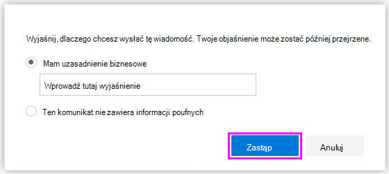

# Wyślij powiadomienia e-mail i pokaż porady dotyczące zasad dla zasad DLP

Zasady ochrony przed utratą danych (DLP) umożliwiają identyfikowanie, monitorowanie i ochronę poufnych informacji w Office 365. Chcesz, aby osoby w organizacji, które pracują z danymi poufnymi, pozostały zgodne z zasadami DLP, ale nie chcesz niepotrzebnie blokować im wykonywania pracy. W tym miejscu mogą pomóc powiadomienia e-mail i porady dotyczące zasad.

W Centrum zgodności podczas tworzenia zasad DLP można skonfigurować powiadomienia użytkownika do następujących elementów:

- Wyślij powiadomienie e-mail do wybranych osób, które opisują problem.

- Wyświetl poradę dotyczącą zasad dla zawartości, która powoduje konflikt z zasadami DLP:

  - W przypadku wiadomości e-mail w Outlook w sieci Web i Outlook 2013 r. lub nowszym porada dotycząca zasad jest wyświetlana w górnej części wiadomości powyżej adresatów podczas tworzenia wiadomości.

  - W przypadku dokumentów na koncie OneDrive dla Firm lub w witrynie SharePoint Online porada dotycząca zasad jest wskazywana przez ikonę ostrzeżenia wyświetlaną w elemencie. Aby wyświetlić więcej informacji, możesz wybrać element, a następnie wybrać ikonę okienka **Informacje o informacjach** w prawym górnym rogu strony, aby otworzyć okienko szczegółów.

  - W przypadku dokumentów Excel, PowerPoint i Word przechowywanych w witrynie OneDrive dla Firm lub witrynie SharePoint Online, które są uwzględnione w zasadach DLP, porada dotycząca zasad jest wyświetlana na pasku komunikatów i w widoku Backstage (**Informacje menu**\> **Plik**).

## Dodawanie powiadomień użytkowników do zasad DLP

Podczas tworzenia zasad DLP można włączyć **powiadomienia użytkownika**. Gdy powiadomienia użytkowników są włączone, Microsoft 365 wysyła powiadomienia e-mail i wskazówki dotyczące zasad. Możesz dostosować, do kogo wysyłane są wiadomości e-mail z powiadomieniami, tekst wiadomości e-mail i tekst porad zasad.

1. Przejdź do pozycji [https://(https://compliance.microsoft.com/permissions](https://(https://compliance.microsoft.com/permissions).

2. Zaloguj się przy użyciu konta służbowego. Jesteś teraz w Centrum zgodności zabezpieczeń &amp; .

3. W lewym obszarze nawigacyjnym \> Centrum \> zgodności zabezpieczeń &amp; **zasady** \> **ochrony przed** \> **utratą danych i tworzenie zasad**.

    

4. Wybierz szablon zasad DLP, który chroni typy poufnych informacji, których potrzebujesz \> **Dalej**.

    Aby rozpocząć od pustego szablonu, wybierz pozycję **Niestandardowe zasady** \> **niestandardowe** \> **Dalej**.

5. Nadaj zasadom \> nazwę **Dalej**.

6. Aby wybrać lokalizacje, które mają być chronione przez zasady DLP, wykonaj jedną z następujących czynności:

   - Wybierz pozycję **Wszystkie lokalizacje w Office 365** \> **Dalej**.

   - Wybierz **pozycję Pozwól mi wybrać określone lokalizacje** \> **Dalej**.

   Aby uwzględnić lub wykluczyć całą lokalizację, taką jak wszystkie Exchange wiadomości e-mail lub wszystkie konta OneDrive, włącz lub wyłącz **stan** tej lokalizacji.

   Aby uwzględnić tylko określone witryny SharePoint lub konta OneDrive, przełącz pozycję **Stan** na włączone, a następnie kliknij linki w obszarze **Dołącz**, aby wybrać określone witryny lub konta.

7. Wybierz pozycję **Użyj ustawień** \> zaawansowanych **Dalej**.

8. Wybierz **pozycję + Nowa reguła**.

9. W edytorze reguł w obszarze **Powiadomienia użytkownika** włącz stan.

    

> [!NOTE]
> Wiadomości e-mail z powiadomieniami są wysyłane bez ochrony.

## Opcje konfigurowania powiadomień e-mail

Dla każdej reguły w zasadach DLP można:

- Wyślij powiadomienie do wybranych osób. Te osoby mogą obejmować właściciela zawartości, osobę, która ostatnio zmodyfikowała zawartość, właściciela witryny, w której przechowywana jest zawartość, lub określonego użytkownika.

- Dostosuj tekst uwzględniony w powiadomieniu przy użyciu kodu HTML lub tokenów. Aby uzyskać więcej informacji, zobacz poniższą sekcję.

> [!NOTE]
> Powiadomienia e-mail mogą być wysyłane tylko do poszczególnych adresatów, a nie do grup ani list dystrybucyjnych. Tylko nowa zawartość spowoduje wyzwolenie powiadomienia e-mail. Edytowanie istniejącej zawartości spowoduje wyzwolenie wskazówek dotyczących zasad, ale nie powiadomienia e-mail.

### Domyślne powiadomienie e-mail

Powiadomienia mają wiersz tematu, który rozpoczyna się od podjętej akcji, takiej jak "Powiadomienie", "Wiadomość zablokowana" dla wiadomości e-mail lub "Dostęp zablokowany" dla dokumentów. Jeśli powiadomienie dotyczy dokumentu, treść komunikatu powiadomienia zawiera link, który prowadzi do witryny, w której dokument jest przechowywany, i otwiera poradę dotyczącą zasad dla dokumentu, w której można rozwiązać wszelkie problemy (zobacz poniższą sekcję dotyczącą porad dotyczących zasad). Jeśli powiadomienie dotyczy komunikatu, powiadomienie zawiera jako załącznik komunikat zgodny z zasadami DLP.

Domyślnie powiadomienia wyświetlają tekst podobny do poniższego dla elementu w witrynie. Tekst powiadomienia jest konfigurowany oddzielnie dla każdej reguły, więc wyświetlany tekst różni się w zależności od tego, która reguła jest dopasowana.

|Jeśli reguła zasad DLP to robi...|Następnie domyślne powiadomienie dla dokumentów SharePoint lub OneDrive dla Firm informuje o tym...|Następnie domyślne powiadomienie dla komunikatów Outlook informuje o tym...|
|---|---|---|
|Wysyła powiadomienie, ale nie zezwala na zastąpienie|Ten element powoduje konflikt z zasadami w organizacji.|Wiadomość e-mail powoduje konflikt z zasadami w organizacji.|
|Blokuje dostęp, wysyła powiadomienie i zezwala na zastępowanie|Ten element powoduje konflikt z zasadami w organizacji. Jeśli ten konflikt nie zostanie rozwiązany, dostęp do tego pliku może zostać zablokowany.|Wiadomość e-mail powoduje konflikt z zasadami w organizacji. Wiadomość nie została dostarczona do wszystkich adresatów.|
|Blokuje dostęp i wysyła powiadomienie|Ten element powoduje konflikt z zasadami w organizacji. Dostęp do tego elementu jest blokowany dla wszystkich z wyjątkiem właściciela, ostatniego modyfikatora i administratora podstawowego zbioru witryn.|Wiadomość e-mail powoduje konflikt z zasadami w organizacji. Wiadomość nie została dostarczona do wszystkich adresatów.|

### Niestandardowe powiadomienie e-mail

Możesz utworzyć niestandardowe powiadomienie e-mail zamiast wysyłać domyślne powiadomienie e-mail do użytkowników końcowych lub administratorów. Niestandardowe powiadomienie e-mail obsługuje kod HTML i ma limit 5000 znaków. Kod HTML umożliwia dołączanie obrazów, formatowania i innych znakowania w powiadomieniu.

Możesz również użyć następujących tokenów, aby dostosować powiadomienie e-mail. Te tokeny to zmienne, które są zastępowane określonymi informacjami w wysyłanym powiadomieniu.

|Tokenu|Opis|
|---|---|
|%%AppliedActions%%|Akcje zastosowane do zawartości.|
|%%ContentURL%%|Adres URL dokumentu w witrynie SharePoint Online lub witrynie OneDrive dla Firm.|
|%%MatchedConditions%%|Warunki, które zostały dopasowane przez zawartość. Użyj tego tokenu, aby poinformować użytkowników o możliwych problemach z zawartością.|

## Opcje konfigurowania porad dotyczących zasad

Dla każdej reguły w zasadach DLP można skonfigurować porady dotyczące zasad w następujących celach:

- Po prostu powiadom osobę, że zawartość jest w konflikcie z zasadami DLP, aby mogła podjąć działania w celu rozwiązania konfliktu. Możesz użyć tekstu domyślnego (zobacz poniższe tabele) lub wprowadzić tekst niestandardowy dotyczący zasad określonej organizacji.

- Zezwalaj osobie na zastąpienie zasad DLP. Opcjonalnie możesz:

  - Wymagaj od danej osoby wprowadzenia uzasadnienia biznesowego dla zastąpienia zasad. Te informacje są rejestrowane i można je wyświetlić w raportach DLP w sekcji **Raporty** Centrum zgodności zabezpieczeń &amp; .

  - Zezwalaj osobie na zgłaszanie wyników fałszywie dodatnich i zastępowanie zasad DLP. Te informacje są również rejestrowane do raportowania, dzięki czemu można używać wyników fałszywie dodatnich do dostosowywania reguł.

Na przykład zasady DLP mogą być stosowane do witryn OneDrive dla Firm, które wykrywają dane osobowe, a te zasady mają trzy reguły:

1. Pierwsza reguła: jeśli w dokumencie wykryto mniej niż pięć wystąpień tych poufnych informacji, a dokument jest udostępniany osobom w organizacji, w akcji **Wyślij powiadomienie** zostanie wyświetlona porada dotycząca zasad. W przypadku porad dotyczących zasad nie są wymagane żadne opcje zastąpienia, ponieważ ta reguła po prostu powiadamia osoby i nie blokuje dostępu.

2. Druga reguła: jeśli w dokumencie wykryto więcej niż pięć wystąpień tych poufnych informacji, a dokument jest udostępniany osobom w organizacji, akcja **Blokuj dostęp do zawartości** ogranicza uprawnienia do pliku, a akcja **Wyślij powiadomienie** umożliwia użytkownikom zastąpienie akcji w tej regule przez podanie uzasadnienia biznesowego. Firma w organizacji czasami wymaga od osób wewnętrznych udostępniania danych osobowych i nie chcesz, aby zasady DLP blokowały tę pracę.

3. Trzecia reguła: jeśli w dokumencie wykryto więcej niż pięć wystąpień tych poufnych informacji, a dokument jest udostępniany osobom spoza organizacji, akcja **Blokuj dostęp do zawartości** ogranicza uprawnienia do pliku, a akcja **Wyślij powiadomienie** nie zezwala użytkownikom na zastępowanie akcji w tej regule, ponieważ informacje są udostępniane zewnętrznie. W żadnym wypadku osoby w organizacji nie powinny mieć prawa do udostępniania danych osobowych spoza organizacji.

### Obsługa zastępowania użytkowników

Poniżej przedstawiono kilka szczegółowych informacji na temat używania porady dotyczącej zasad w celu zastąpienia reguły:

- Opcja zastąpienia jest dla reguły i zastępuje wszystkie akcje w regule (z wyjątkiem wysyłania powiadomienia, którego nie można zastąpić).

- Zawartość może być zgodna z kilkoma regułami w zasadach DLP, ale zostanie wyświetlona tylko porada dotycząca zasad z najbardziej restrykcyjnej reguły o najwyższym priorytecie. Na przykład porada dotycząca zasad z reguły, która blokuje dostęp do zawartości, będzie wyświetlana za pośrednictwem wskazówki dotyczącej zasad z reguły, która po prostu wysyła powiadomienie. Uniemożliwia to użytkownikom wyświetlanie kaskady porad dotyczących zasad.

- Jeśli wskazówki dotyczące zasad w najbardziej restrykcyjnej regule zezwalają użytkownikom na zastąpienie reguły, zastąpienie tej reguły zastępuje również wszelkie inne reguły dopasowane do zawartości.

- Jeśli akcja NotifyAllowOverride jest ustawiona z wartością WithoutJustification, WithJustification lub FlasePositives, upewnij się, że wartość BlockAccess jest ustawiona na wartość true, a funkcja BlockAccessScope ma odpowiednią wartość. W przeciwnym razie pojawi się porada dotycząca zasad, ale użytkownik nie znajdzie opcji zastąpienia wiadomości e-mail uzasadnieniem.

#### Dostępność zastąpienia

|Reguła powiadomień |Akcja Powiadom/Blokuj  |Dostępne przesłonięcia  |Wymagaj uzasadnienia  |
|---------|---------|---------|---------|
|Tylko powiadom     |Powiadomić         |Nie         |Nie         |
|Powiadom i AllowOverride     |Powiadomić         |Nie         |Nie         |
|Notify + AllowOverride + False positive     |Powiadomić         |Nie         |Nie         |
|Powiadom + AllowOverride + Z uzasadnieniem     |Powiadomić         |Nie         |Nie         |
|Notify + AllowOverride + False positive + Without justification    |Powiadomić         |Nie         |Nie         |
|Notify + AllowOverride + False positive + With justification     |Powiadomić         |Nie         |Nie         |
|Powiadom i blokuj     |Blokuj         |Nie         |Nie         |
|Powiadom + Blokuj + AllowOverride     |Blokuj         |Tak         |Nie         |
|Powiadom + Blokuj + AllowOverride + Wynik fałszywie dodatni     |Blokuj         |Tak         |Nie         |
|Powiadom + Blokuj + AllowOverride + Z uzasadnieniem     |Blokuj         |Tak         |Tak         |
|Powiadom + Blokuj + AllowOverride + Fałszywie dodatni + Bez uzasadnienia     |Blokuj         |Tak         |Nie         |
|Powiadom + Blokuj + AllowOverride + Fałszywie dodatni + Z uzasadnieniem     |Blokuj         |Tak         |Tak         |

## Porady dotyczące zasad dotyczących witryn OneDrive dla Firm i witryn SharePoint Online

Gdy dokument w witrynie OneDrive dla Firm lub witrynie SharePoint Online jest zgodny z regułą w zasadach DLP, a ta reguła używa wskazówek dotyczących zasad, wskazówki dotyczące zasad zawierają specjalne ikony w dokumencie:

1. Jeśli reguła wysyła powiadomienie o pliku, zostanie wyświetlona ikona ostrzeżenia.

2. Jeśli reguła zablokuje dostęp do dokumentu, zostanie wyświetlona zablokowana ikona.

   

Aby wykonać akcję w dokumencie, możesz wybrać element\>, wybierając ikonę okienka **Informacje o informacjach** w prawym górnym rogu strony, aby otworzyć okienko \> szczegółów **Wyświetl poradę zasad**.

Porada dotycząca zasad zawiera listę problemów z zawartością, a jeśli wskazówki dotyczące zasad są skonfigurowane przy użyciu tych opcji, możesz wybrać pozycję **Rozwiąż**, a następnie **zastąpić** poradę dotyczącą zasad lub **Zgłoś** wynik fałszywie dodatni.

Zasady DLP są synchronizowane z witrynami, a zawartość jest oceniana względem nich okresowo i asynchronicznie, więc może wystąpić krótkie opóźnienie między utworzeniem zasad DLP a czasem rozpoczęcia przeglądania wskazówek dotyczących zasad. Może wystąpić podobne opóźnienie od momentu rozpoznania lub zastąpienia porady dotyczącej zasad, gdy ikona dokumentu w witrynie zniknie.

### Tekst domyślny dla porad dotyczących zasad w witrynach

Domyślnie porady dotyczące zasad wyświetlają tekst podobny do poniższego dla elementu w witrynie. Tekst powiadomienia jest konfigurowany oddzielnie dla każdej reguły, więc wyświetlany tekst różni się w zależności od tego, która reguła jest dopasowana.

|Jeśli reguła zasad DLP to robi...|Następnie domyślna porada dotycząca zasad informuje o tym...|
|---|---|
|Wysyła powiadomienie, ale nie zezwala na zastąpienie|Ten element powoduje konflikt z zasadami w organizacji.|
|Blokuje dostęp, wysyła powiadomienie i zezwala na zastępowanie|Ten element powoduje konflikt z zasadami w organizacji. Jeśli ten konflikt nie zostanie rozwiązany, dostęp do tego pliku może zostać zablokowany.|
|Blokuje dostęp i wysyła powiadomienie|Ten element powoduje konflikt z zasadami w organizacji. Dostęp do tego elementu jest blokowany dla wszystkich z wyjątkiem właściciela, ostatniego modyfikatora i administratora podstawowego zbioru witryn.|

### Tekst niestandardowy dla porad dotyczących zasad w witrynach

Tekst porad dotyczących zasad można dostosować niezależnie od powiadomienia e-mail. W przeciwieństwie do tekstu niestandardowego dla powiadomień e-mail (zobacz powyższą sekcję), tekst niestandardowy porad dotyczących zasad nie akceptuje kodu HTML ani tokenów. Zamiast tego tekst niestandardowy dla porad dotyczących zasad to zwykły tekst tylko z limitem 256 znaków.

## Porady dotyczące zasad w Outlook w sieci Web i Outlook 2013 r. i nowszych

Podczas tworzenia nowej wiadomości e-mail w Outlook w sieci Web i Outlook 2013 r. i nowszych zobaczysz poradę dotyczącą zasad, jeśli dodasz zawartość zgodną z regułą w zasadach DLP, a ta reguła będzie używać wskazówek dotyczących zasad. Porada dotycząca zasad jest wyświetlana w górnej części wiadomości nad adresatami podczas tworzenia wiadomości.

Porady dotyczące zasad sprawdzają, czy poufne informacje są wyświetlane w treści wiadomości, w wierszu tematu, a nawet w załączniku wiadomości, jak pokazano tutaj.

Jeśli wskazówki dotyczące zasad są skonfigurowane \> tak, aby zezwalały na zastępowanie, możesz wybrać opcję Pokaż **przesłonięcia** **szczegółów** \> wprowadź uzasadnienie biznesowe lub zgłoś **przesłonienie fałszywie dodatnie**\>.

Należy pamiętać, że po dodaniu poufnych informacji do wiadomości e-mail może wystąpić opóźnienie między dodaniem informacji poufnych a wyświetlenia poradą dotyczącą zasad. Gdy wiadomości e-mail są szyfrowane za pomocą Office szyfrowania komunikatów (OME), a zasady używane do ich wykrywania używają wskazówek dotyczących zasad wykrywania warunków szyfrowania, nie będą wyświetlane.

### Outlook 2013 r. i nowsze obsługują wyświetlanie wskazówek dotyczących zasad tylko dla niektórych warunków

Obecnie Outlook 2013 r. i nowsze obsługuje wyświetlanie wskazówek dotyczących zasad tylko dla następujących warunków:

- Zawartość zawiera
- Zawartość jest udostępniana

Należy pamiętać, że wyjątki są uznawane za warunki, a wszystkie te warunki działają w Outlook, gdzie będą one zgodne z zawartością i wymuszają akcje ochronne dotyczące zawartości. Jednak wyświetlanie porad dotyczących zasad użytkownikom nie jest jeszcze obsługiwane. Ponadto Outlook nie obsługuje wyświetlania wskazówek dotyczących zasad dla zasad DLP stosowanych do dynamicznej grupy dystrybucyjnej.

### Porady dotyczące zasad w centrum administracyjnym Exchange a Centrum zgodności zabezpieczeń &amp;

Porady dotyczące zasad mogą współpracować z zasadami DLP i regułami przepływu poczty utworzonymi w <a href="https://go.microsoft.com/fwlink/p/?linkid=2059104" target="_blank">centrum administracyjnym Exchange</a> lub z zasadami DLP utworzonymi w Centrum zgodności zabezpieczeń&amp;, ale nie z obydwoma. Dzieje się tak, ponieważ te zasady są przechowywane w różnych lokalizacjach, ale wskazówki dotyczące zasad mogą być rysowane tylko z jednej lokalizacji.

Jeśli w centrum administracyjnym Exchange skonfigurowano wskazówki dotyczące zasad, żadne wskazówki dotyczące zasad skonfigurowane w Centrum zgodności zabezpieczeń &amp; nie będą wyświetlane użytkownikom w Outlook w sieci Web i Outlook 2013 r. i nowszych, dopóki nie wyłączysz porad w centrum administracyjnym Exchange. Dzięki temu bieżące reguły przepływu poczty Exchange (nazywane również regułami transportu) będą nadal działać do momentu przełączenia się do Centrum zgodności zabezpieczeń&amp;.

Pamiętaj, że porady dotyczące zasad mogą być rysowane tylko z jednej lokalizacji, ale powiadomienia e-mail są zawsze wysyłane, nawet jeśli używasz zasad DLP zarówno w Centrum zgodności zabezpieczeń&amp;, jak i w centrum administracyjnym Exchange.

### Tekst domyślny wskazówek dotyczących zasad w wiadomości e-mail

Domyślnie porady dotyczące zasad wyświetlają tekst podobny do poniższego w przypadku wiadomości e-mail.

|Jeśli reguła zasad DLP to robi...|Następnie domyślna porada dotycząca zasad informuje o tym...|
|---|---|
|Wysyła powiadomienie, ale nie zezwala na zastąpienie|Wiadomość e-mail powoduje konflikt z zasadami w organizacji.|
|Blokuje dostęp, wysyła powiadomienie i zezwala na zastępowanie|Wiadomość e-mail powoduje konflikt z zasadami w organizacji.|
|Blokuje dostęp i wysyła powiadomienie|Wiadomość e-mail powoduje konflikt z zasadami w organizacji.|

## Porady dotyczące zasad w Excel, PowerPoint i programie Word

Gdy użytkownicy pracują z poufną zawartością w klasycznych wersjach Excel, PowerPoint i Word, porady dotyczące zasad mogą powiadamiać ich w czasie rzeczywistym, że zawartość powoduje konflikt z zasadami DLP. Wymaga to następujących czynności:

- Dokument Office jest przechowywany w witrynie OneDrive dla Firm lub witrynie SharePoint Online.

- Witryna jest uwzględniona w zasadach DLP skonfigurowanych do korzystania z porad dotyczących zasad.

Office programy klasyczne automatycznie synchronizują zasady DLP bezpośrednio z Office 365, a następnie skanują dokumenty, aby upewnić się, że nie powodują konfliktu z zasadami DLP i wyświetlają wskazówki dotyczące zasad w czasie rzeczywistym.

> [!NOTE]
> Office aplikacje klasyczne samodzielnie skanują dokumenty, aby ustalić, czy powinny być wyświetlane wskazówki dotyczące zasad DLP; nie zawierają wskazówek dotyczących zasad, które SharePoint witryny online lub witryny OneDrive dla Firm, które zostały już określone, powinny być wyświetlane w pliku. W związku z tym w aplikacjach klasycznych, które są widoczne w witrynach SharePoint Online lub witrynach OneDrive dla Firm, nie zawsze jest wyświetlana porada dotycząca zasad DLP. Natomiast aplikacje Office w internecie zawierają tylko wskazówki dotyczące zasad DLP, które SharePoint witryny online lub witryny OneDrive dla Firm, powinny być wyświetlane.

W zależności od sposobu konfigurowania wskazówek dotyczących zasad w zasadach DLP użytkownicy mogą po prostu zignorować poradę dotyczącą zasad, zastąpić zasady uzasadnieniem biznesowym lub bez niej albo zgłosić wynik fałszywie dodatni.

Wskazówki dotyczące zasad są wyświetlane na pasku komunikatów.

Wskazówki dotyczące zasad są również wyświetlane w widoku Backstage (na karcie **Plik** ).

Jeśli porady dotyczące zasad w zasadach DLP są skonfigurowane przy użyciu tych opcji, możesz wybrać pozycję **Rozwiąż** , aby **zastąpić** poradę dotyczącą zasad lub **Zgłoś** wynik fałszywie dodatni.

W każdym z tych Office programów klasycznych użytkownicy mogą wyłączyć porady dotyczące zasad. Jeśli ta opcja jest wyłączona, wskazówki dotyczące zasad, które są prostymi powiadomieniami, nie będą wyświetlane na pasku komunikatów ani w widoku Backstage (na karcie **Plik** ). Jednak wskazówki dotyczące zasad dotyczące blokowania i zastępowania nadal będą wyświetlane i nadal będą otrzymywać powiadomienie e-mail. Ponadto wyłączenie porad dotyczących zasad nie zwalnia dokumentu z żadnych zasad DLP, które zostały do niego zastosowane.

### Tekst domyślny porad dotyczących zasad w Excel 2016, PowerPoint 2016 i Word 2016

Domyślnie porady dotyczące zasad wyświetlają tekst podobny do poniższego na pasku komunikatów i w widoku Backstage otwartego dokumentu. Tekst powiadomienia jest konfigurowany oddzielnie dla każdej reguły, więc wyświetlany tekst różni się w zależności od tego, która reguła jest dopasowana.

|Jeśli reguła zasad DLP to robi...|Następnie domyślna porada dotycząca zasad informuje o tym...|
|---|---|
|Wysyła powiadomienie, ale nie zezwala na zastąpienie|Ten plik powoduje konflikt z zasadami w organizacji. Aby uzyskać więcej informacji, przejdź do menu **Plik** .|
|Blokuje dostęp, wysyła powiadomienie i zezwala na zastępowanie|Ten plik powoduje konflikt z zasadami w organizacji. Jeśli ten konflikt nie zostanie rozwiązany, dostęp do tego pliku może zostać zablokowany. Aby uzyskać więcej informacji, przejdź do menu **Plik** .|
|Blokuje dostęp i wysyła powiadomienie|Ten plik powoduje konflikt z zasadami w organizacji. Jeśli ten konflikt nie zostanie rozwiązany, dostęp do tego pliku może zostać zablokowany. Aby uzyskać więcej informacji, przejdź do menu **Plik** .|

### Tekst niestandardowy dla porad dotyczących zasad w Excel, PowerPoint i programie Word

Tekst porad dotyczących zasad można dostosować niezależnie od powiadomienia e-mail. W przeciwieństwie do tekstu niestandardowego dla powiadomień e-mail (zobacz powyższą sekcję), tekst niestandardowy porad dotyczących zasad nie akceptuje kodu HTML ani tokenów. Zamiast tego tekst niestandardowy dla porad dotyczących zasad to zwykły tekst tylko z limitem 256 znaków.

## Więcej informacji

- [Dowiedz się więcej o ochronie przed utratą danych](dlp-learn-about-dlp.md)
- [Twórz zasady DLP na podstawie szablonu](create-a-dlp-policy-from-a-template.md)
- [Warunki zasad DLP, wyjątki i akcje (wersja zapoznawcza)](./dlp-microsoft-teams.md)
- [Twórz zasady DLP w celu ochrony dokumentów z właściwościami FCI lub innymi](protect-documents-that-have-fci-or-other-properties.md)
- [Co obejmują szablony zasad DLP](what-the-dlp-policy-templates-include.md)
- [Definicje jednostek typu informacji poufnych](sensitive-information-type-entity-definitions.md)
