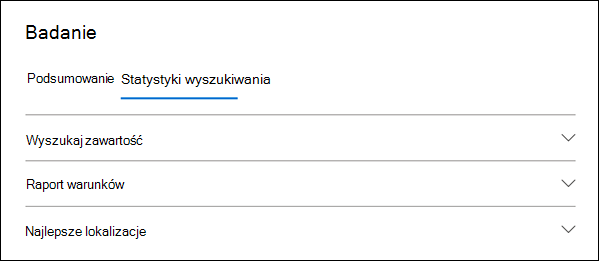
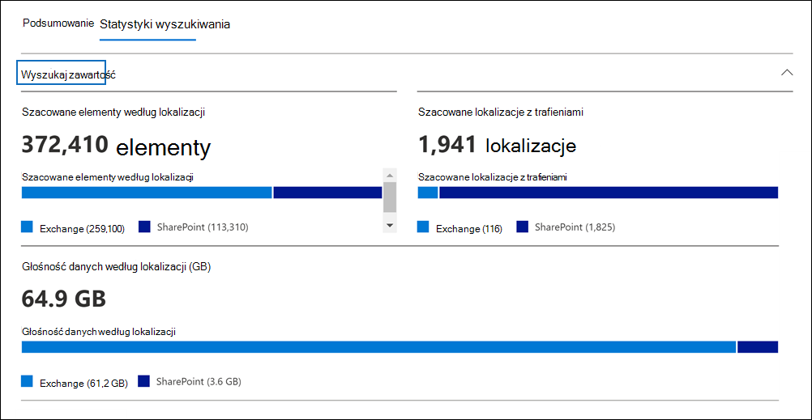
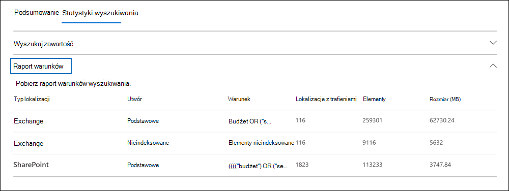

# Wyświetlanie statystyk wyników wyszukiwania zbierania elektronicznych materiałów dowodowych

[!include[Purview banner](../includes/purview-rebrand-banner.md)]

Po utworzeniu i uruchomieniu wyszukiwania zawartości lub wyszukiwania skojarzonego z przypadkiem zbierania elektronicznych materiałów dowodowych (Standard) Microsoft Purview można wyświetlić statystyki dotyczące szacowanych wyników wyszukiwania. Obejmuje to podsumowanie wyników wyszukiwania (podobne do podsumowania szacowanych wyników wyszukiwania wyświetlanych na stronie wysuwanego wyszukiwania), statystyki zapytań, takie jak liczba lokalizacji zawartości z elementami pasującymi do zapytania wyszukiwania oraz tożsamość lokalizacji zawartości, które mają najbardziej pasujące elementy.
  
Ponadto można użyć listy słów kluczowych, aby skonfigurować wyszukiwanie w celu zwrócenia statystyk dla każdego słowa kluczowego w zapytaniu wyszukiwania. Dzięki temu można porównać liczbę wyników zwracanych przez każde słowo kluczowe w zapytaniu.
  
Możesz również pobrać statystyki wyszukiwania do pliku CSV. Umożliwia to używanie funkcji filtrowania i sortowania w Excel do porównywania wyników i przygotowywania raportów do wyników wyszukiwania.
  
## Pobieranie statystyk dla wyszukiwań

Aby wyświetlić statystyki dotyczące wyszukiwania zawartości lub wyszukiwania skojarzonego z przypadkiem zbierania elektronicznych materiałów dowodowych (Standardowa):
  
1. W portal zgodności Microsoft Purview kliknij pozycję **Pokaż wszystko**, a następnie wykonaj jedną z następujących czynności:

   - Kliknij pozycję **Wyszukiwanie zawartości** , a następnie wybierz wyszukiwanie, aby wyświetlić stronę wysuwaną.

     LUB

   - Kliknij **pozycję eDiscoveryeDiscovery** >  **(Standardowa),** wybierz przypadek, a następnie wybierz wyszukiwanie na karcie **Wyszukiwania**, aby wyświetlić stronę wysuwaną.

2. Na wysuwanej stronie wybranego wyszukiwania kliknij kartę **Statystyki wyszukiwania** .
  
   

Karta **Statystyki wyszukiwania** zawiera następujące sekcje zawierające różne typy statystyk dotyczących wyszukiwania.

### Wyszukaj zawartość

W tej sekcji przedstawiono graficzne podsumowanie szacowanych elementów zwróconych przez wyszukiwanie. Wskazuje to liczbę elementów zgodnych z kryteriami wyszukiwania. Te informacje zawierają informacje o szacowanej liczbie elementów zwracanych przez wyszukiwanie.

- **Szacowane elementy według lokalizacji**: całkowita liczba szacowanych elementów zwróconych przez wyszukiwanie. Wyświetlana jest również określona liczba elementów znajdujących się w skrzynkach pocztowych i znajdujących się w witrynach.

- **Szacowane lokalizacje z trafieniami**: całkowita liczba lokalizacji zawartości zawierających elementy zwrócone przez wyszukiwanie. Zostanie również wyświetlona określona liczba lokalizacji skrzynki pocztowej i lokacji.

- **Wolumin danych według lokalizacji (w MB)**: całkowity rozmiar wszystkich szacowanych elementów zwróconych przez wyszukiwanie. Zostanie również wyświetlony określony rozmiar elementów skrzynki pocztowej i elementów witryny.

### Raport warunku

W tej sekcji przedstawiono statystyki dotyczące zapytania wyszukiwania oraz liczbę szacowanych elementów, które pasowały do różnych części zapytania wyszukiwania. Te statystyki umożliwiają analizowanie liczby elementów odpowiadających poszczególnym składnikom zapytania wyszukiwania. Może to pomóc uściślić kryteria wyszukiwania i w razie potrzeby zawęzić zakres zakresu. Możesz również pobrać kopię tego raportu w formacie CSV.

- **Typ lokalizacji**: typ lokalizacji zawartości, do których mają zastosowanie statystyki zapytania. Wartość **Exchange** wskazuje lokalizację skrzynki pocztowej; wartość **SharePoint** wskazuje lokalizację witryny.

- **Część**: część zapytania wyszukiwania, do których mają zastosowanie statystyki. **Podstawowa** wskazuje całe zapytanie wyszukiwania. **Słowo kluczowe** wskazuje, że statystyki w wierszu dotyczą określonego słowa kluczowego. Jeśli używasz listy słów kluczowych dla zapytania wyszukiwania, statystyki dla każdego składnika zapytania są uwzględniane w tej tabeli. Aby uzyskać więcej informacji, zobacz [Pobieranie statystyk słów kluczowych dla wyszukiwań](#get-keyword-statistics-for-searches).

- **Warunek**: rzeczywisty składnik (słowo kluczowe lub warunek) zapytania wyszukiwania, które zwróciło statystyki wyświetlane w odpowiednim wierszu.

- **Lokalizacje z trafieniami**: liczba lokalizacji zawartości (określonych w kolumnie **Typ lokalizacji** ), które zawierają elementy zgodne z zapytaniem podstawowym lub kluczowym wymienionym w kolumnie **Warunek** .

- **Elementy**: liczba elementów (z określonej lokalizacji zawartości), które są zgodne z zapytaniem wymienionym w kolumnie **Warunek** . Jak wyjaśniono wcześniej, jeśli element zawiera wiele wystąpień słowa kluczowego, które jest wyszukiwane, jest on liczony tylko raz w tej kolumnie.

- **Rozmiar (MB)**: całkowity rozmiar wszystkich znalezionych elementów (w określonej lokalizacji zawartości), które są zgodne z zapytaniem wyszukiwania w kolumnie **Warunek** .

### Najważniejsze lokalizacje

W tej sekcji przedstawiono statystyki dotyczące określonych lokalizacji zawartości z największą większością elementów zwróconych przez wyszukiwanie. Zostanie wyświetlonych 1000 pierwszych lokalizacji. Możesz również pobrać kopię tego raportu w formacie CSV.

- Nazwa lokalizacji (adres e-mail skrzynek pocztowych i adres URL witryn).

- Typ lokalizacji (skrzynka pocztowa lub witryna).

- Szacowana liczba elementów w lokalizacji zawartości zwracanych przez wyszukiwanie.

- Całkowity rozmiar szacowanych elementów w każdej lokalizacji zawartości.

## Pobieranie statystyk słów kluczowych dla wyszukiwań

Jak wyjaśniono wcześniej, w sekcji **Raport warunku** przedstawiono zapytanie wyszukiwania oraz liczbę (i rozmiar) elementów zgodnych z zapytaniem. Jeśli podczas tworzenia lub edytowania zapytania wyszukiwania używasz listy słów kluczowych, możesz uzyskać ulepszone statystyki pokazujące, ile elementów pasuje do każdego słowa kluczowego lub frazy kluczowej. Może to pomóc w szybkim określeniu, które części zapytania są najbardziej (i najmniej) skuteczne. Jeśli na przykład słowo kluczowe zwraca dużą liczbę elementów, możesz zdecydować się na uściślanie zapytania słowa kluczowego w celu zawężenia wyników wyszukiwania.

Aby utworzyć listę słów kluczowych i wyświetlić statystyki słów kluczowych dla wyszukiwania:
  
1. W portalu zgodności utwórz nowe wyszukiwanie zawartości lub wyszukiwanie skojarzone ze sprawą zbierania elektronicznych materiałów dowodowych (Standardowa).

2. Na stronie **Warunki** kreatora wyszukiwania. zaznacz pole wyboru **Pokaż listę słów kluczowych** .

   

3. Wpisz fazę słowa kluczowego lub słowa kluczowego w wierszu w tabeli słów kluczowych. Na przykład wpisz **budżet** w pierwszym wierszu, wpisz **zabezpieczenia** w drugim wierszu i wpisz **FY2021** w trzecim wierszu.

   

   > [!NOTE]
   > Aby zmniejszyć problemy spowodowane przez duże listy słów kluczowych, możesz ograniczyć do maksymalnie 20 wierszy na liście słów kluczowych zapytania wyszukiwania.

4. Po dodaniu słów kluczowych do listy, dla których chcesz wyszukiwać i pobierać statystyki, uruchom wyszukiwanie.

5. Po zakończeniu wyszukiwania wybierz ją, aby wyświetlić stronę wysuwaną.

6. Na **karcie Statystyki wyszukiwania** kliknij **raport Warunek** , aby wyświetlić statystyki słów kluczowych dla wyszukiwania.

    
  
    Jak pokazano na poprzednim zrzucie ekranu, wyświetlane są statystyki dla każdego słowa kluczowego; Obejmuje to:

    - Statystyki słów kluczowych dla każdego typu lokalizacji zawartości uwzględnionej w wyszukiwaniu.

    - Liczba niezaimportowanych elementów skrzynki pocztowej.

    - Rzeczywiste zapytanie wyszukiwania i wyniki dla każdego słowa kluczowego (zidentyfikowanego jako **słowo kluczowe** w kolumnie **Part** ), które zawiera wszelkie warunki z zapytania wyszukiwania.

    - Kompletne zapytanie wyszukiwania (zidentyfikowane jako **podstawowe** w kolumnie **Część** ) i statystyki dla pełnego zapytania dla każdego typu lokalizacji. Pamiętaj, że są to te same statystyki wyświetlane na karcie **Podsumowanie** .
