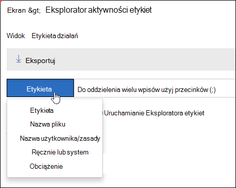

# Wyświetlanie aktywności dotyczącej etykiet dla dokumentów

Po utworzeniu etykiet należy sprawdzić, czy są one stosowane do zawartości zgodnie z zamierzeniu. Za pomocą Eksploratora aktywności etykiet &amp; w Centrum zgodności zabezpieczeń możesz szybko wyszukiwać i wyświetlać aktywność etykiet dla całej zawartości w SharePoint i OneDrive dla Firm w ciągu ostatnich 30 dni. Są to dane czasu rzeczywistego, które dają ci jasny obraz tego, co dzieje się w Twojej dzierżawie.
  
Na przykład za pomocą Eksploratora działań etykiet możesz:
  
- Wyświetl, ile razy każda etykieta została zastosowana każdego dnia (maksymalnie 30 dni).
    
- Sprawdź, kto dokładnie oznaczył ten plik etykietą, w którym dniu oraz link do witryny, w której się znajduje.
    
- Wyświetlanie plików, w których etykiety zostały zmienione lub usunięte, co to są stare i nowe etykiety, oraz kto je zmienił.
    
- Odfiltruj dane, aby wyświetlić wszystkie działania dotyczące etykiet dla określonej etykiety, pliku lub użytkownika. Możesz również filtrować aktywność etykiet według lokalizacji (SharePoint lub OneDrive dla Firm) i tego, czy etykieta została zastosowana ręcznie, czy automatycznie.
    
- Wyświetlanie aktywności dotyczącej etykiet dla folderów, a także poszczególnych dokumentów. W najbliższym czasie będzie można wyświetlić, ile plików w tym folderze oznaczono etykietą w wyniku naniesienia etykiety do folderu.
    
Eksploratora działań etykiet można znaleźć w Centrum &amp; zgodności zabezpieczeń, w > **działaniami zarządzania informacjami** > .
  
Pamiętaj, że Eksplorator aktywności etykiet wymaga subskrypcji Office 365 Enterprise E5.
  

  
## Wyświetlanie działań etykiet dla plików lub folderów

W górnej części Eksploratora działań etykiet możesz wybrać, czy chcesz wyświetlać działania związane z plikami lub folderami. Pamiętaj, że działanie folderu obejmuje tylko sam folder, a nie pliki wewnątrz folderu.
  
Możesz chcieć zobaczyć aktywność etykiet dla folderów, ponieważ jeśli oznaczysz etykietą folder, wszystkie pliki w tym folderze również otrzymają etykietę (z wyjątkiem plików, do których została bezpośrednio zastosowana etykieta). Dlatego foldery etykiet mogą mieć wpływ na znaczną liczbę plików. Aby uzyskać więcej informacji, zobacz [Stosowanie domyślnej etykiety przechowywania do całej zawartości SharePoint, folderu lub zestawu dokumentów](create-apply-retention-labels.md#applying-a-default-retention-label-to-all-content-in-a-sharepoint-library-folder-or-document-set).
  

  
### Etykieta działań

 **Działania związane z** etykietami obejmują wszystkie akcje związane z **etykietami:** **dodawanie**, usuwanie **i zmienianie** etykiety. Widok ten umożliwia pełne spojrzenie na to, do ilu plików każdego dnia zastosowano poszczególne etykiety. 
  
### Zmiany etykiet

 **Zmiany etykiet** zawierają potencjalnie ryzykowne działania **związane z usuwaniem lub** **zmienianiem** etykiety. Za pomocą tego widoku możesz szybko zobaczyć takie ryzykowne działania i użytkownika, który je wykonał. Na liście aktywności poniżej wykresu możesz wybrać plik, a następnie kliknąć link do tego pliku w okienku szczegółów po prawej stronie. 
  

  
## Filtrowanie aktywności etykiet

Możesz szybko filtrować dane, aby zobaczyć wszystkie działania dotyczące etykiet dla określonej etykiety, pliku lub użytkownika. Możesz również filtrować aktywność etykiet według lokalizacji (SharePoint lub OneDrive dla Firm) i tego, czy etykieta została zastosowana ręcznie, czy automatycznie.
  

  

