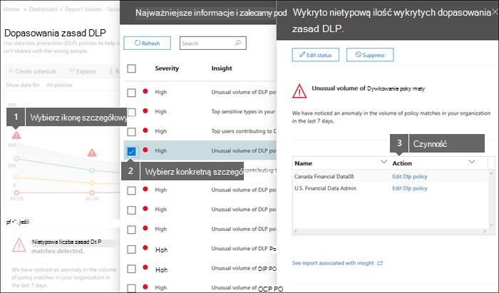

# Wyświetlanie raportów dotyczących zapobiegania utracie danych

[!include[Purview banner](../includes/purview-rebrand-banner.md)]

Po utworzeniu zasad Microsoft Purview ochrony przed utratą danych (DLP) należy sprawdzić, czy działają one zgodnie z oczekiwaniami i pomagają zachować zgodność. Dzięki raportom DLP w portal zgodności Microsoft Purview możesz szybko wyświetlić następujące elementy:
  
- **Dopasowania zasad DLP** Ten raport przedstawia liczbę dopasowań zasad DLP w czasie. Raport można filtrować według daty, lokalizacji, zasad lub akcji. Ten raport umożliwia: 
    
  - Dostosuj lub uściślij zasady DLP podczas uruchamiania ich w trybie testowym. Możesz wyświetlić określoną regułę zgodną z zawartością.
    
  - Skoncentruj się na określonych okresach i poznaj przyczyny wzrostów i trendów.
    
  - Odnajdywanie procesów biznesowych naruszających zasady DLP organizacji.
    
  - Zapoznaj się z wpływem zasad DLP na działalność biznesową, widząc, jakie akcje są stosowane do zawartości.
    
  - Sprawdź zgodność z określonymi zasadami DLP, wyświetlając wszystkie dopasowania dla tych zasad.
    
  - Wyświetl listę najlepszych użytkowników i powtarzających się użytkowników, którzy przyczyniają się do zdarzeń w organizacji.
    
  - Wyświetl listę najważniejszych typów informacji poufnych w organizacji.
    
- **Zdarzenia DLP** Ten raport pokazuje również dopasowania zasad w czasie, takie jak raport dopasowania zasad. Jednak raport dopasowania zasad pokazuje dopasowania na poziomie reguły; Jeśli na przykład wiadomość e-mail jest zgodna z trzema różnymi regułami, w raporcie zasad są wyświetlane trzy różne elementy wiersza. Natomiast raport zdarzeń pokazuje dopasowania na poziomie elementu; Jeśli na przykład wiadomość e-mail jest zgodna z trzema różnymi regułami, raport zdarzeń pokazuje pojedynczy element wiersza dla tego elementu zawartości. 
    
  Ponieważ liczby raportów są agregowane inaczej, raport dopasowania zasad jest lepszy do identyfikowania dopasowań z określonymi regułami i dostrajania zasad DLP. Raport zdarzeń jest lepszy do identyfikowania określonych elementów zawartości, które są problematyczne dla zasad DLP.
    
- **Wyniki fałszywie dodatnie i przesłonięcia DLP** Jeśli zasady DLP umożliwiają użytkownikom ich zastępowanie lub zgłaszanie wyników fałszywie dodatnich, ten raport pokazuje liczbę takich wystąpień w czasie. Raport można filtrować według daty, lokalizacji lub zasad. Ten raport umożliwia: 
    
  - Dostosuj lub uściślij zasady DLP, widząc, które zasady mają dużą liczbę wyników fałszywie dodatnich.
    
  - Wyświetl uzasadnienia przesłane przez użytkowników, gdy rozwiążą poradę dotyczącą zasad, przesłaniając zasady.
    
  - Dowiedz się, gdzie zasady DLP powodują konflikt z prawidłowymi procesami biznesowymi, powodując dużą liczbę przesłonięcia użytkowników.
    
Wszystkie raporty DLP mogą wyświetlać dane z ostatniego czteromiesięcznego okresu. Wyświetlenie najnowszych danych w raportach może potrwać do 24 godzin.
  
Te raporty można znaleźć na **pulpicie** **nawigacyjnym raportów** \> portal zgodności Microsoft Purview\>.
  

  
## Wyświetlanie uzasadnienia przesłanego przez użytkownika w celu zastąpienia

Jeśli zasady DLP zezwalają użytkownikom na ich zastąpienie, możesz użyć raportu fałszywie dodatniego i zastąpić go, aby wyświetlić tekst przesłany przez użytkowników w poradę dotyczącą zasad.
  

  
## Podjęcie akcji na podstawie szczegółowych informacji i zaleceń

Raporty mogą wyświetlać szczegółowe informacje i zalecenia, w których można kliknąć czerwoną ikonę ostrzeżenia, aby wyświetlić szczegółowe informacje o potencjalnych problemach i podjąć możliwe działania naprawcze.
  

  
## Uprawnienia do raportów DLP

Aby wyświetlić raporty DLP w Centrum zgodności & zabezpieczeń, musisz mieć przypisane następujące elementy:

- Rola **Czytelnik zabezpieczeń** w <a href="https://go.microsoft.com/fwlink/p/?linkid=2059104" target="_blank">centrum administracyjnym Exchange</a>. Domyślnie ta rola jest przypisywana do grup ról Zarządzanie organizacjami i Czytelnik zabezpieczeń w centrum administracyjnym Exchange.

- **Wyświetl tylko rolę DLP Compliance Management** w Centrum zgodności & zabezpieczeń. Domyślnie ta rola jest przypisywana do grup ról Administrator zgodności, Zarządzanie organizacją, Administrator zabezpieczeń i Czytelnik zabezpieczeń w Centrum zgodności & zabezpieczeń.

- **Rola Adresaci tylko do wyświetlania** w <a href="https://go.microsoft.com/fwlink/p/?linkid=2059104" target="_blank">centrum administracyjnym Exchange</a>. Domyślnie ta rola jest przypisywana do grup ról Zarządzanie zgodnością, Zarządzanie organizacją i View-Only Zarządzanie organizacją w centrum administracyjnym Exchange.

## Znajdowanie poleceń cmdlet dla raportów DLP

Aby użyć większości poleceń cmdlet dla portal zgodności Microsoft Purview, musisz:
  
1. [Połączenie do portal zgodności Microsoft Purview przy użyciu zdalnego programu PowerShell](/powershell/exchange/connect-to-scc-powershell)
    
2. Użyj dowolnego z tych [poleceń cmdlet Usługi Security &amp; Compliance Center](/powershell/exchange/exchange-online-powershell)
    
Jednak raporty DLP wymagają ściągania danych z różnych Office 365, w tym Exchange Online. Z tego powodu polecenia cmdlet raportów DLP są dostępne w Exchange Online programie PowerShell — nie w programie portal zgodności Microsoft Purview programu PowerShell. W związku z tym, aby używać poleceń cmdlet dla raportów DLP, należy:
  
1. [Łączenie się z usługą Exchange Online przy użyciu zdalnej obsługi programu PowerShell](/powershell/exchange/connect-to-exchange-online-powershell)
    
2. Użyj dowolnego z tych poleceń cmdlet dla raportów DLP:
    
      - [Get-DlpDetectionsRaport](/powershell/module/exchange/get-dlpdetectionsreport)
    
      - [Get-DlpDetailReport](/powershell/module/exchange/get-dlpdetailreport)
