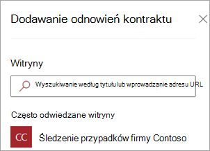
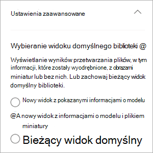

# Stosowanie modelu zrozumienia dokumentu w usłudze Microsoft SharePoint Syntex

 

> [!VIDEO https://www.microsoft.com/videoplayer/embed/RE4CSoL]

 

Po opublikowaniu modelu zrozumienia dokumentu można zastosować go do co najmniej jednej biblioteki dokumentów SharePoint w dzierżawie Microsoft 365.

> [!NOTE]
> Model można zastosować tylko do bibliotek dokumentów, do których masz dostęp.

## Stosowanie modelu do biblioteki dokumentów

Aby zastosować model do biblioteki dokumentów SharePoint:

1. Na stronie głównej modelu na kafelku **Zastosuj model do bibliotek** wybierz pozycję **Zastosuj model**. Lub w sekcji **Where the model is applied (Gdzie jest stosowany model** ) wybierz pozycję **+Dodaj bibliotekę**.

    

2. Następnie możesz wybrać witrynę SharePoint zawierającą bibliotekę dokumentów, do których chcesz zastosować model. Jeśli witryna nie jest wyświetlana na liście, użyj pola wyszukiwania, aby ją znaleźć.

    

    > [!NOTE]
    > Musisz mieć uprawnienia *Do zarządzania listą* lub *Uprawnienia do edycji* do biblioteki dokumentów, do których stosujesz model.

3. Po wybraniu witryny wybierz bibliotekę dokumentów, do której chcesz zastosować model. W przykładzie wybierz bibliotekę dokumentów *Dokumenty* w witrynie *Contoso Case Tracking* .

    

4. Ponieważ model jest skojarzony z typem zawartości, po zastosowaniu go do biblioteki doda typ zawartości i zaktualizuje widok domyślny przy użyciu wyodrębnionych etykiet wyświetlanych jako kolumny. Można jednak wybrać pozycję **Ustawienia zaawansowane** , aby opcjonalnie wybrać zachowanie bieżącego widoku biblioteki lub użyć nowego widoku z informacjami o modelu i miniaturami plików. Jeśli zdecydujesz się zachować bieżący widok biblioteki, nowe widoki z informacjami o modelu będą nadal dostępne w menu widoku biblioteki.

    

    Aby uzyskać więcej informacji, zobacz [Zmienianie widoku w bibliotece dokumentów w dalszej](#change-the-view-in-a-document-library) części tego artykułu.

5. Wybierz pozycję **Dodaj** , aby zastosować model do biblioteki.

6. Na stronie głównej modelu w sekcji **Where the model is applied (Gdzie jest stosowany model**) powinna zostać wyświetlona nazwa witryny SharePoint.

7. Przejdź do biblioteki dokumentów i upewnij się, że jesteś w widoku biblioteki dokumentów modelu. Wybierz pozycję AutomateView document understanding models (**AutomateView** >  **document understanding models).**

8. Na stronie **Przeglądanie modeli i stosowanie nowych** wybierz kartę **Zastosowane** , aby wyświetlić modele zastosowane do biblioteki dokumentów.

     

9. Wybierz pozycję **Wyświetl szczegóły modelu** , aby wyświetlić informacje o modelu, takie jak opis modelu, który opublikował model i czy model stosuje etykiety przechowywania lub poufności do plików, które klasyfikuje.

Po zastosowaniu modelu do biblioteki dokumentów możesz rozpocząć przekazywanie dokumentów do witryny i wyświetlić wyniki.

Model identyfikuje wszystkie pliki i foldery ze skojarzonym typem zawartości modelu i wyświetla je w widoku. Jeśli model ma jakiekolwiek elementy wyodrębniające, w widoku są wyświetlane kolumny dla danych wyodrębnianych z każdego pliku lub folderu.

> [!NOTE]
> Jeśli co najmniej dwa modele interpretacji dokumentów zostaną zastosowane do tej samej biblioteki, przekazany plik zostanie sklasyfikowany przy użyciu modelu, który ma najwyższy średni wynik ufności. Wyodrębnione jednostki będą pochodzić tylko z zastosowanego modelu.   Jeśli niestandardowy model przetwarzania formularzy i model zrozumienia dokumentów zostaną zastosowane do tej samej biblioteki, plik zostanie sklasyfikowany przy użyciu modelu zrozumienia dokumentu i wszystkich wytrenowanych wyodrębniaczy dla tego modelu. Jeśli istnieją puste kolumny zgodne z modelem przetwarzania formularzy, kolumny zostaną wypełnione przy użyciu wyodrębnionych wartości.

## Synchronizowanie zmian z co najmniej jedną biblioteką

Po opublikowaniu modelu w wielu bibliotekach dokumentów, a następnie zaktualizowaniu modelu, na przykład dodaniu lub usunięciu ekstraktora, należy wypchnąć aktualizację do wszystkich bibliotek, które zostały zastosowane do modelu.

Aby zsynchronizować zmiany ze wszystkimi zastosowanymi bibliotekami:

1. Na stronie głównej modelu w sekcji **Where the model is applied (Gdzie jest stosowany model)** wybierz pozycję **Synchronizuj wszystko**.

     

Aby zsynchronizować zmiany z jedną lub tylko wybranymi bibliotekami:

1. Na stronie głównej modelu w sekcji **Where the model is applied (Gdzie jest stosowany model** ) wybierz bibliotekę lub biblioteki, do których chcesz zastosować zmiany.

2. Wybierz pozycję **Synchronizuj**.

     

## Stosowanie modelu do plików i zawartości folderów znajdujących się już w bibliotece dokumentów

Podczas gdy zastosowany model przetwarza wszystkie pliki i zawartość folderów przekazanych do biblioteki dokumentów po jej zastosowaniu, możesz również wykonać następujące czynności, aby uruchomić model w plikach i zawartości folderów, które już istnieją w bibliotece dokumentów przed zastosowaniem modelu:

1. W bibliotece dokumentów wybierz pliki i foldery, które mają być przetwarzane przez model.

2. Po wybraniu plików i folderów **klasyfikuj i wyodrębnij** pojawi się na wstążce biblioteki dokumentów. Wybierz pozycję **Klasyfikowanie i wyodrębnianie**.

       

3. Wybrane pliki i foldery zostaną dodane do kolejki do przetworzenia.

    > [!NOTE]
    > Zostanie wyświetlony komunikat wskazujący, jak długo może potrwać klasyfikacja. Jeśli wybrano tylko pliki, klasyfikacja może potrwać do 30 minut. Jeśli wybrano co najmniej jeden folder, klasyfikacja może potrwać do 24 godzin.

### Pole Data klasyfikacji

Gdy SharePoint Syntex model zrozumienia dokumentu (lub model przetwarzania formularzy) jest stosowany do biblioteki dokumentów, pole **Data klasyfikacji** jest uwzględniane w schemacie biblioteki. Domyślnie to pole jest puste. Jednak gdy dokumenty są przetwarzane i klasyfikowane przez model, to pole jest aktualizowane za pomocą sygnatury daty i godziny ukończenia. 

    

Pole **Data klasyfikacji** jest używane przez wyzwalacz [**Gdy plik jest klasyfikowany przez wyzwalacz modelu interpretacji zawartości**](/connectors/sharepointonline/#when-a-file-is-classified-by-a-content-understanding-model) w celu uruchomienia przepływu Power Automate po zakończeniu przetwarzania zawartości pliku lub folderu przez model i zaktualizowaniu pola **Data klasyfikacji**.

   

Wyzwalacz **Gdy plik jest klasyfikowany przez wyzwalacz modelu interpretacji zawartości** może zostać użyty do uruchomienia przepływu przy użyciu wszelkich wyodrębnionych informacji z pliku lub folderu.

Na przykład, gdy model jest ostemplowany **datą klasyfikacji**, możesz użyć opcji **Wyślij wiadomość e-mail po SharePoint Syntex przetwarza przepływ plików**, aby powiadomić użytkowników, że nowy plik został przetworzony i sklasyfikowany przez model w bibliotece dokumentów SharePoint.

Aby uruchomić przepływ:

1. Wybierz plik, a następnie wybierz pozycję **Integruj** >  **Power Automate** >  **Utwórz przepływ**.

2. W panelu **Tworzenie przepływu** wybierz pozycję **Wyślij wiadomość e-mail po SharePoint Syntex przetwarza plik**.

     

## Zmienianie widoku w bibliotece dokumentów

[!INCLUDE [Change the view in a document library](../includes/change-library-view.md)]

## Zobacz też

[Tworzenie klasyfikatora](create-a-classifier.md)

[Tworzenie wyodrębniacza](create-an-extractor.md)

[Omówienie usługi Document Understanding](document-understanding-overview.md)
