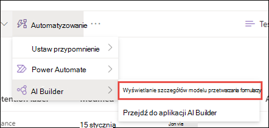

# Stosowanie etykiety przechowywania do modelu w SharePoint Syntex

 

> [!VIDEO https://www.microsoft.com/videoplayer/embed/RE4GydO]  

 

Etykietę [przechowywania](../compliance/retention.md) można łatwo zastosować do modelu w usłudze Microsoft SharePoint Syntex. Można to zrobić zarówno w przypadku modeli interpretacji dokumentów, jak i przetwarzania formularzy.

Etykiety przechowywania umożliwiają stosowanie ustawień przechowywania do dokumentów, które identyfikują modele.  Na przykład chcesz, aby model nie tylko identyfikował wszelkie dokumenty *z powiadomieniem o ubezpieczeniach* , które zostały przekazane do biblioteki dokumentów, ale także zastosował do nich tag przechowywania *firmy* , aby nie można było usunąć tych dokumentów z biblioteki dokumentów w określonym okresie (na przykład w ciągu najbliższych pięciu miesięcy).

Istniejącą etykietę przechowywania można zastosować do modelu za pomocą ustawień modelu na stronie głównej modelu. 

> [!Important]
> Aby etykiety przechowywania były dostępne do zastosowania w modelach interpretacji dokumentów, należy [je utworzyć](../compliance/file-plan-manager.md#create-retention-labels) i [opublikować](../compliance/create-apply-retention-labels.md#how-to-publish-retention-labels) w Centrum zgodności platformy Microsoft 365.

## Aby dodać etykietę przechowywania do modelu zrozumienia dokumentu

1. Na stronie głównej modelu wybierz pozycję **Ustawienia modelu**. 
2. W **obszarze Ustawienia modelu** w sekcji **Zabezpieczenia i zgodność** wybierz menu **Etykieta przechowywania** , aby wyświetlić listę etykiet przechowywania dostępnych do zastosowania do modelu. 
   
3. Wybierz etykietę przechowywania, którą chcesz zastosować do modelu, a następnie wybierz pozycję **Zapisz**. 

Po zastosowaniu etykiety przechowywania do modelu można zastosować ją do:
- Nowa biblioteka dokumentów
- Biblioteka dokumentów, do której model jest już zastosowany
 
## Stosowanie etykiety przechowywania do biblioteki dokumentów, do której model jest już zastosowany

Jeśli model interpretacji dokumentów został już zastosowany do biblioteki dokumentów, możesz wykonać następujące czynności, aby zsynchronizować aktualizację etykiety przechowywania, aby zastosować ją do biblioteki dokumentów: 

1. Na stronie głównej modelu w sekcji **Biblioteki z tym modelem** wybierz bibliotekę dokumentów, do której chcesz zastosować aktualizację etykiety przechowywania.   
2. Wybierz pozycję **Synchronizuj**.  
   

Po zastosowaniu aktualizacji i zsynchronizowaniu jej z modelem możesz potwierdzić, że została ona zastosowana, wykonując następujące czynności:

1. W centrum zawartości w sekcji **Biblioteki z tym modelem** kliknij bibliotekę, do której został zastosowany zaktualizowany model.  
2. W widoku biblioteki dokumentów wybierz ikonę informacji, aby sprawdzić właściwości modelu.   
3. Na liście **Aktywne modele** wybierz zaktualizowany model. 
4. W sekcji **Etykieta przechowywania** zostanie wyświetlona nazwa zastosowanej etykiety przechowywania. 

Na stronie widoku modelu w bibliotece dokumentów zostanie wyświetlona nowa kolumna **Etykieta przechowywania** .  Ponieważ model klasyfikuje pliki, które identyfikuje jako należące do typu zawartości, i wyświetla je w widoku biblioteki, kolumna Etykieta przechowywania będzie również wyświetlać nazwę etykiety przechowywania, która została do niej zastosowana za pośrednictwem modelu.

Na przykład wszystkie dokumenty *z powiadomieniem o ubezpieczeniach* , które identyfikuje model, będą miały również zastosowany etykietę Przechowywania *firmy* , co uniemożliwi ich usunięcie z biblioteki dokumentów na pięć miesięcy. Jeśli zostanie podjęta próba usunięcia pliku z biblioteki dokumentów, zostanie wyświetlony błąd informujący, że jest on niedozwolony ze względu na zastosowaną etykietę przechowywania.

## Aby dodać etykietę przechowywania do modelu przetwarzania formularzy

> [!Important]
> Aby etykiety przechowywania były dostępne do zastosowania do modelu przetwarzania formularzy, należy [je utworzyć](../compliance/file-plan-manager.md#create-retention-labels) i [opublikować](../compliance/create-apply-retention-labels.md#how-to-publish-retention-labels) w Centrum zgodności platformy Microsoft 365.

Podczas tworzenia modelu można zastosować etykietę przechowywania do modelu przetwarzania formularzy lub zastosować ją do istniejącego modelu.

### Aby dodać etykietę przechowywania podczas tworzenia modelu przetwarzania formularzy

1. Podczas [tworzenia nowego modelu przetwarzania formularzy](./create-a-form-processing-model.md) wybierz pozycję <b>Ustawienia zaawansowane.</b>
2. W <b>obszarze Ustawienia zaawansowane</b> w sekcji <b>Etykieta przechowywania</b> wybierz menu, a następnie wybierz etykietę przechowywania, którą chcesz zastosować do modelu.</b>

 
      

3.  Po zakończeniu pozostałych ustawień modelu wybierz pozycję <b>Utwórz</b> , aby skompilować model.

### Aby dodać etykietę przechowywania do istniejącego modelu przetwarzania formularzy

Etykietę przechowywania można dodać do istniejącego modelu przetwarzania formularzy na różne sposoby:
- Za pomocą menu Automate w bibliotece dokumentów
- Za pośrednictwem ustawień modelu aktywnego w bibliotece dokumentów 

#### Aby dodać etykietę przechowywania do istniejącego modelu przetwarzania formularzy za pomocą menu Automate

Etykietę przechowywania można dodać do istniejącego modelu przetwarzania formularzy, którego jesteś właścicielem, za pośrednictwem menu Automate w bibliotece dokumentów, w której jest stosowany model.

1. W bibliotece dokumentów, do której jest stosowany model przetwarzania formularzy, wybierz menu <b>Automate</b> , wybierz pozycję <b>AI Builder</b>, a następnie wybierz pozycję <b>Wyświetl szczegóły modelu przetwarzania formularzy</b>.

    

2. W szczegółach modelu w sekcji <b>Etykieta przechowywania</b> wybierz etykietę przechowywania, którą chcesz zastosować.  Następnie wybierz pozycję <b>Zapisz</b>.

       

#### Aby dodać etykietę przechowywania do istniejącego modelu przetwarzania formularzy w ustawieniach aktywnego modelu

Etykietę przechowywania można dodać do istniejącego modelu przetwarzania formularzy, którego jesteś właścicielem, za pośrednictwem ustawień modelu aktywnego w bibliotece dokumentów, w której jest stosowany model.

1. W bibliotece dokumentów SharePoint, w której jest stosowany model, wybierz ikonę <b>Wyświetl aktywne modele</b>, a następnie wybierz pozycję <b>Wyświetl aktywne modele</b>.</b>

     

2. W <b>obszarze Modele aktywne</b> wybierz model przetwarzania formularzy, do którego chcesz zastosować etykietę przechowywania.

       

3. W szczegółach modelu w sekcji <b>Etykieta przechowywania</b> wybierz etykietę przechowywania, którą chcesz zastosować.  Następnie wybierz pozycję <b>Zapisz</b>.

> [!NOTE]
> Aby można było edytować okienko ustawień modelu, musisz być właścicielem modelu. 

## Zobacz też

[Tworzenie klasyfikatora](create-a-classifier.md)

[Tworzenie wyodrębniacza](create-an-extractor.md)

[Omówienie usługi Document Understanding](document-understanding-overview.md)
