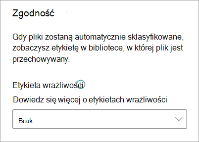

# Stosowanie etykiety poufności do modelu w usłudze Microsoft SharePoint Syntex

Etykietę [poufności](../compliance/sensitivity-labels.md) można łatwo zastosować do dokumentów zawierających informacje o modelach w usłudze Microsoft SharePoint Syntex. Ta funkcja nie jest jeszcze dostępna dla modeli przetwarzania formularzy.

Etykiety poufności umożliwiają stosowanie szyfrowania do dokumentów, które identyfikują modele. Na przykład chcesz, aby model nie tylko identyfikował wszelkie dokumenty finansowe zawierające numery kont bankowych lub numery kart kredytowych przekazywane do biblioteki dokumentów, ale także stosował etykietę poufności skonfigurowaną przy użyciu ustawień szyfrowania, aby ograniczyć, kto może uzyskiwać dostęp do tej zawartości i jak można jej używać. SharePoint Syntex modele przestrzegają reguł [kolejności etykiet](../compliance/apply-sensitivity-label-automatically.md#how-multiple-conditions-are-evaluated-when-they-apply-to-more-than-one-label), a także nie zastępują istniejącej etykiety, która została ręcznie zastosowana przez użytkownika do pliku. 

Istniejącą etykietę poufności można zastosować do modelu za pomocą ustawień modelu na stronie głównej modelu. Etykieta musi być już opublikowana, aby była dostępna do wyboru z ustawień modelu. Etykiety dotyczą plików Office programu Word (.docx), PowerPoint (.pptx) i Excel (.xlsx). 

> [!Important]
> Aby etykiety poufności były dostępne do zastosowania do modeli interpretacji dokumentów, należy [je utworzyć i opublikować w portalu zgodności usługi Microsoft Purview](../admin/security-and-compliance/set-up-compliance.md).

## Dodawanie etykiety poufności do modelu zrozumienia dokumentu

1. Na stronie głównej modelu wybierz pozycję **Ustawienia modelu**.

   

2. W okienku **Ustawienia modelu** w sekcji **Zgodność** wybierz menu **Etykieta poufności** , aby wyświetlić listę etykiet poufności, które są dostępne do zastosowania do modelu.

    

3. Wybierz etykietę poufności, którą chcesz zastosować do modelu, a następnie wybierz pozycję **Zapisz**.

Po zastosowaniu etykiety poufności do modelu można zastosować ją do:

- Nowa biblioteka dokumentów
- Biblioteka dokumentów, do której model jest już zastosowany
 
### Stosowanie etykiety poufności do biblioteki dokumentów, do której model jest już zastosowany

Jeśli model interpretacji dokumentów został już zastosowany do biblioteki dokumentów, możesz wykonać następujące czynności, aby zsynchronizować aktualizację etykiety poufności, aby zastosować ją do biblioteki dokumentów:

1. Na stronie głównej modelu w sekcji **Biblioteki z tym modelem** wybierz bibliotekę dokumentów, do której chcesz zastosować aktualizację etykiet poufności.

2. Wybierz pozycję **Synchronizuj**.

   

Po zastosowaniu aktualizacji i zsynchronizowania jej z modelem możesz potwierdzić, że została ona zastosowana, wykonując następujące kroki:

1. W centrum zawartości w sekcji **Biblioteki z tym modelem** wybierz bibliotekę, do której został zastosowany zaktualizowany model. 

2. W widoku biblioteki dokumentów wybierz ikonę informacji, aby sprawdzić właściwości modelu.

3. Na liście **Aktywne modele** wybierz zaktualizowany model.

4. W sekcji **Etykieta poufności** zobaczysz nazwę zastosowanej etykiety poufności.

Na stronie widoku modelu w bibliotece dokumentów zostanie wyświetlona nowa kolumna **etykiety poufności** . Ponieważ model klasyfikuje pliki, które identyfikuje jako należące do jego typu zawartości, i wyświetla je w widoku biblioteki, kolumna **Etykieta poufności** będzie również wyświetlać nazwę etykiety poufności, która została do niej zastosowana za pośrednictwem modelu.

Na przykład wszystkie dokumenty finansowe, które identyfikuje model, również będą miały zastosowaną etykietę poufności *szyfrowania* , co uniemożliwi dostęp do nich osobom nieupoważnionym. Jeśli zostanie podjęta próba uzyskania dostępu do pliku z biblioteki dokumentów przez nieautoryzowaną osobę, zostanie wyświetlony błąd informujący, że jest on niedozwolony ze względu na zastosowaną etykietę poufności.

<!---
## Add a sensitivity label to a form processing model

> [!Important]
> For sensitivity labels to be available to apply to your form processing model, they need to be [created and published in the Microsoft Purview compliance portal](../admin/security-and-compliance/set-up-compliance.md).

You can either apply a sensitivity label to a form processing model when you are creating a model, or apply it to an existing model.

### Add a sensitivity label when you create a form processing model

1. When you [create a new form processing model](create-a-form-processing-model.md), select **Advanced settings**.

2. In **Advanced settings**, in the **Sensitivity label** section, select the menu and then select the sensitivity label you want to apply to the model.

3.  After you've completed your remaining model settings, select **Create** to build your model.

### Add a sensitivity label to an existing form processing model

You can add a sensitivity label to an existing form processing model in different ways:

- Through the **Automate** menu in the document library
- Through the **Active model** settings in the document library 

#### Add a sensitivity label to an existing form processing model through the Automate menu

You can add a sensitivity label to an existing form processing model that you own through the **Automate** menu in the document library in which the model is applied.

1. In your document library to which the form processing model is applied, select the **Automate** menu, select **AI Builder**, and then select **View form processing model details**.

2. On the **Model details** pane, in the **Sensitivity label** section, select the sensitivity label you want to apply. Then select **Save**.

#### Add a sensitivity label to an existing form processing model in the active model settings

You can add a sensitivity label to an existing form processing model that you own through the **Active model** settings in the document library in which the model is applied.

1. In the SharePoint document library in which the model is applied, select the **View active models** icon, and then select **View active models**.

2. In **Active models**, select the form processing model to which you want to apply the sensitivity label.

3. On the **Model details** pane, in the **Sensitivity label** section, select the sensitivity label you want to apply. Then select **Save**.

   > [!NOTE]
   > You must be the model owner for the **Model settings** pane to be editable. 
--->

## Zobacz też

[Stosowanie etykiety przechowywania](apply-a-retention-label-to-a-model.md)

[Tworzenie klasyfikatora](create-a-classifier.md)

[Tworzenie wyodrębniacza](create-an-extractor.md)

[Omówienie usługi Document Understanding](document-understanding-overview.md)
