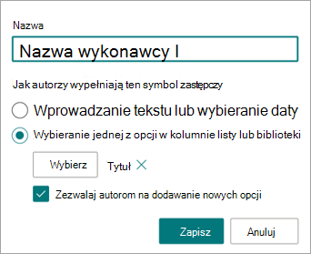
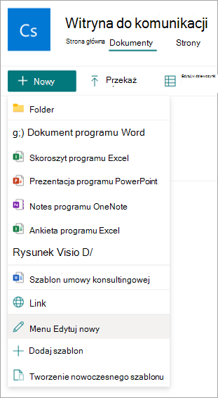
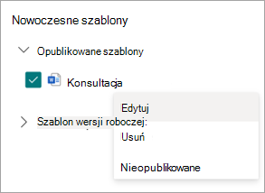
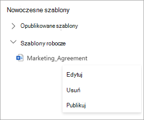
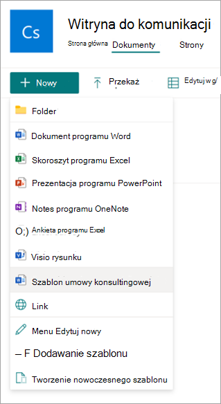

# Tworzenie dokumentów przy użyciu zestawu zawartości w usłudze Microsoft SharePoint Syntex

Możesz użyć SharePoint Syntex, aby ułatwić automatyczne generowanie standardowych powtarzających się dokumentów biznesowych, takich jak umowy, oświadczenia o pracy, umowy serwisowe, listy zgody, stanowiska sprzedaży i korespondencja. Możesz to zrobić szybciej, bardziej spójnie i mniej podatnie na błędy, używając zestawu zawartości w SharePoint Syntex.

W przypadku zestawu zawartości można użyć istniejącego dokumentu do utworzenia *nowoczesnego szablonu*, a następnie użyć tego szablonu do automatycznego generowania nowej zawartości przy użyciu list SharePoint lub danych wejściowych użytkownika jako źródła danych.

> [!NOTE]
> Musisz być licencjonowanym użytkownikiem SharePoint Syntex, aby uzyskiwać dostęp do możliwości zestawu zawartości i korzystać z nich. Musisz również mieć uprawnienia do zarządzania listami SharePoint.

## Tworzenie nowoczesnego szablonu

Wykonaj następujące kroki, aby utworzyć nowoczesny szablon.

1. W bibliotece dokumentów programu Sharepoint wybierz pozycję **NowyUtwórz** >  nowoczesny szablon.

   

2. Wybierz istniejący dokument programu Word, którego chcesz użyć jako podstawy do utworzenia nowoczesnego szablonu, a następnie wybierz pozycję **Otwórz**.

   

   > [!NOTE]
   > Obecnie można przekazywać tylko dokumenty programu Word (rozszerzenie .docx), aby tworzyć szablony. Upload dokumenty programu Word z lokalnego magazynu lub pulpitu.

3. Po przekazaniu dokumentu dokument zostanie wyświetlony w studio szablonów, w którym można przekonwertować dokument na szablon.

   

4. W lewym górnym rogu szablonu studio wybierz nazwę szablonu. Nazwa domyślna to nazwa dokumentu użytego do utworzenia szablonu. Jeśli chcesz zmienić nazwę szablonu, wybierz nazwę domyślną lub ikonę ołówka obok nazwy, wpisz nową nazwę, a następnie wybierz pozycję **Enter**.

   

5. Utwórz symbole zastępcze dla całego tekstu dynamicznego w dokumencie, który użytkownicy mogą chcieć zmienić z jednego dokumentu na inny. Możesz na przykład utworzyć symbol zastępczy dla danych wejściowych, takich jak nazwa firmy, nazwa klienta, adres, numer telefonu lub data.

    Aby utworzyć symbol zastępczy, wybierz tekst (na przykład datę). Zostanie otwarty panel **Wszystkie symbole zastępcze** , w którym nadasz symbolowi zastępczemu odpowiednią nazwę i wybierzesz typ danych wejściowych, które chcesz skojarzyć z symbolem zastępczym.

   

   Obecnie istnieją dwa sposoby wypełniania symbolu zastępczego przez użytkowników:

   - [Wprowadź tekst lub wybierz datę](#associate-a-placeholder-by-entering-text-or-selecting-a-date)
   - [Wybieranie spośród opcji w kolumnie listy lub biblioteki](#associate-a-placeholder-by-selecting-from-choices-in-a-column-of-a-list-or-library)

   > [!NOTE]
   > Można tworzyć symbole zastępcze tylko dla tekstu. Obecnie obrazy, grafiki inteligentne, tabele i listy punktowane nie są obsługiwane.

### Skojarz symbol zastępczy, wprowadzając tekst lub wybierając datę

Na panelu **Wszystkie symbole zastępcze** :

1. W polu **Nazwa** wprowadź odpowiednią nazwę symbolu zastępczego.

   

2. W sekcji **How authors fill in this placeholder (Jak autorzy wypełnić ten symbol zastępczy** ) wybierz pozycję **Wprowadź tekst lub wybierz datę**.

3. W polu **Typ informacji** wybierz typ danych, który chcesz skojarzyć z symbolem zastępczym. Obecnie dostępnych jest sześć opcji: **pojedynczy wiersz tekstu**, **wiele wierszy tekstu**, **liczba**, **data i godzina**, **adres e-mail** i **hiperłącze**.

4. Wybierz opcję **Dodaj**.

### Skojarz symbol zastępczy, wybierając z opcji w kolumnie listy lub biblioteki

Na panelu **Wszystkie symbole zastępcze** :

1. W polu **Nazwa** wprowadź odpowiednią nazwę symbolu zastępczego.

   

2. W sekcji **How authors fill in this placeholder (Jak autorzy wypełnić ten symbol zastępczy** ) wybierz pozycję **Wybierz z opcji w kolumnie listy lub biblioteki**, a następnie wybierz **pozycję Wybierz**.

3. Na stronie **Wybierz listę do dodania kolumny źródłowej** wybierz listę, która ma być używana, a następnie wybierz pozycję **Dalej**.

   

4. Na stronie **Wybierz kolumnę źródłową z istniejącej listy** wybierz nazwę kolumny, którą chcesz skojarzyć z symbolem zastępczym, a następnie wybierz pozycję **Zapisz**.

   

    Jeśli chcesz ponownie wyświetlić oryginalną stronę list, wybierz pozycję **Przejdź do linku (nazwa listy)** u dołu listy.

5. Po zakończeniu zobaczysz, że pole listy zostało skojarzone z symbolem zastępczym.

   

6. Jeśli chcesz, aby użytkownicy mogli ręcznie dodawać dane wejściowe, oprócz wybierania z listy wybierz pozycję **Zezwalaj autorom na dodawanie nowych opcji**. W tym przypadku domyślnym typem danych wejściowych ręcznych jest *pojedynczy wiersz tekstu*. Również wartości wejściowe przez autorów będą używane tylko do generowania dokumentu. Nie zostaną one dodane do listy SharePoint.

   Możesz utworzyć tyle symboli zastępczych, ile uważasz za konieczne. Po zakończeniu możesz zapisać szablon jako wersję roboczą lub opublikować szablon.

   - **Zapisz wersję roboczą** — zapisuje szablon jako wersję roboczą i można uzyskać do niego dostęp później. Zapisane wersje robocze można wyświetlać, edytować lub publikować w sekcji **Szablony nowoczesne**, wybierając **menu NowyEdytuj**  >  nowy z biblioteki dokumentów.
   - **Publikowanie** — publikuje szablon, który ma być używany przez innych użytkowników w organizacji do tworzenia dokumentów. Możesz wyświetlać, edytować lub cofać publikowanie *opublikowanych* szablonów w sekcji **Nowoczesne szablony**, wybierając **menu NowyEdytuj**  >  nowy z biblioteki dokumentów.

## Edytowanie nowoczesnego szablonu

Jeśli chcesz edytować istniejący szablon lub usunąć lub cofnąć publikowanie szablonu, wykonaj następujące kroki.

1. W bibliotece dokumentów programu Sharepoint wybierz pozycję **NowyEdytuj** >  nowe menu.

   

2. Na panelu **menu Edytuj nowy** w sekcji **Nowoczesne szablony** wybierz opublikowany lub roboczy szablon, który chcesz edytować.

   

3. Aby edytować opublikowany szablon lub projekt szablonu:

   - W obszarze **Opublikowane szablony** wybierz pozycję **Edytuj** , aby otworzyć studio szablonów, w którym można edytować opublikowany szablon. Możesz również usunąć lub cofnąć publikowanie szablonu.

      

   - W obszarze **Szablony robocze** wybierz pozycję **Edytuj** , aby otworzyć studio szablonów, w którym można edytować projekt szablonu. Możesz również usunąć lub opublikować szablon.

      

## Tworzenie dokumentu na podstawie nowoczesnego szablonu

Możesz użyć *opublikowanego* nowoczesnego szablonu, aby szybko tworzyć podobne dokumenty bez konieczności uruchamiania od podstaw. Aby utworzyć dokument przy użyciu opublikowanego szablonu, wykonaj następujące kroki:

1. W bibliotece dokumentów programu Sharepoint wybierz pozycję **Nowy**, a następnie wybierz nowoczesny szablon, którego chcesz użyć.

   

2. Szablon zostanie otwarty w studio szablonów.

3. Na panelu **Tworzenie dokumentu na podstawie szablonu** wprowadź informacje, a następnie wybierz pozycję **Utwórz dokument**.

   

   Aby skrócić czas i nakład pracy związany z wypełnianiem wartości symboli zastępczych, SharePoint Syntex zapewnia:

      - Sugestie ułatwiające łatwe wybieranie wartości podczas wybierania wartości z listy.
      - Automatyczne wypełnianie wartości symboli zastępczych, jeśli jest w stanie jednoznacznie zidentyfikować rekord dla symboli zastępczych skojarzonych z tą samą listą.

> [!NOTE]
>
> - Obecnie tylko dokumenty Microsoft Word (rozszerzenie .docx) są obsługiwane podczas tworzenia szablonu. Przed przekazaniem dokumentu upewnij się, że w dokumencie programu Word nie włączono funkcji **Śledzenie zmian** ani komentarzy. Jeśli dokument zawiera symbole zastępcze tekstu dla obrazów, upewnij się, że nie są one opakowane tekstem. Obecnie nie obsługujemy **kontrolek zawartości** w programie Word. Jeśli chcesz utworzyć szablon na podstawie dokumentu programu Word z kontrolkami zawartości, usuń go przed utworzeniem nowoczesnego szablonu.
> - Szablon i dokument są skojarzone z jedną biblioteką dokumentów. Aby użyć szablonu w innej bibliotece dokumentów, należy ponownie utworzyć szablon w tej bibliotece dokumentów.
> - Przekazany dokument, który jest używany do tworzenia nowoczesnego szablonu, zostanie zapisany jako oddzielna kopia i umieszczony w katalogu /forms biblioteki dokumentów. Oryginalny plik na dysku nie będzie miał wpływu.
> - Można tworzyć symbole zastępcze tylko dla tekstu. Obecnie obrazy, grafiki inteligentne, tabele i listy punktowane nie są obsługiwane.
> - Po utworzeniu dokumentu na podstawie szablonu nie jest on skojarzony z szablonem.
