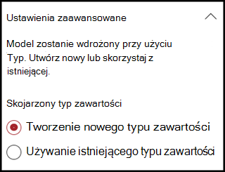
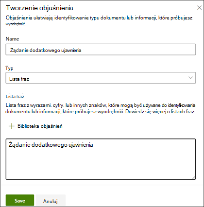
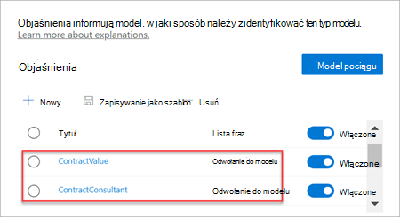

# Tworzenie klasyfikatora w aplikacji Microsoft SharePoint Syntex

 

> [!VIDEO https://www.microsoft.com/videoplayer/embed/RE4CL0R]  

 

Klasyfikator to typ modelu, który umożliwia zautomatyzowanie identyfikacji i klasyfikacji typu dokumentu. Na przykład możesz chcieć zidentyfikować wszystkie dokumenty  dotyczące odnowienia umowy, które są dodawane do Twojej biblioteki dokumentów, jak pokazano na poniższej ilustracji.

Utworzenie klasyfikatora umożliwia utworzenie nowego SharePoint [zawartości](/sharepoint/governance/content-type-and-workflow-planning#content-type-overview), który będzie skojarzony z modelem.

Podczas tworzenia klasyfikatora należy utworzyć *objaśnienia definiujące* model. Dzięki temu można zanotować typowe dane, których można oczekiwać na spójne znalezienie tego typu dokumentu. 

Użyj przykładów typu dokumentu ("pliki przykładowe") w celu "przeszkolinia" modelu w celu zidentyfikowania plików, które mają ten sam typ zawartości.

Aby utworzyć klasyfikatora, musisz:
1. Nadaj nazwę modelowi.
2. Dodaj pliki przykładowe.
3. Oznacz etykietą pliki przykładowe.
4. Utwórz wyjaśnienie.
5. Przetestuj model.

> [!NOTE]
> Podczas gdy model używa klasyfikatora do identyfikowania i klasyfikowania typów dokumentów, możesz również wybrać, czy z każdego pliku zidentyfikowanego przez model mają być wyciągne określone informacje. W tym celu należy utworzyć **wyodrębniator** do dodania do modelu. Zobacz [Tworzenie wyodrębnianego fragmentatora](create-an-extractor.md).

## Nadaj nazwę modelowi

Pierwszym krokiem do utworzenia modelu jest nadanie mu nazwy:

1. W centrum zawartości wybierz pozycję **Nowy**, **a następnie pozycję Utwórz model**.
2. W **okienku Nowy dokument opisowy modelu** w polu **Nazwa** wpisz nazwę modelu. Jeśli na przykład chcesz zidentyfikować dokumenty dotyczące odnowienia umowy, możesz nazwać model *Odnawianie umowy*.
3. Wybierz pozycję **Utwórz**. Powoduje to utworzenie strony głównej modelu. 

    

Podczas tworzenia modelu jest również tworzyć nowy typ zawartości witryny. Typ zawartości reprezentuje kategorię dokumentów o wspólnych cechach i współużytkuje kolekcję kolumn lub właściwości metadanych dla tej konkretnej zawartości. SharePoint zawartości są zarządzane za pomocą [galerii Typy zawartości](https://support.microsoft.com/office/create-or-customize-a-site-content-type-27eb6551-9867-4201-a819-620c5658a60f). W tym przykładzie podczas tworzenia modelu jest tworzyć nowy typ zawartości *Odnawianie* umowy.

Wybierz **pozycję Ustawienia zaawansowane**, jeśli chcesz zamapować ten model na istniejący typ zawartości przedsiębiorstwa w galerii typów SharePoint zawartości, aby użyć jego schematu. Enterprise typów zawartości są przechowywane w Centrum typów zawartości w centrum administracyjnym usługi SharePoint i są zesumowane ze wszystkimi witrynami w dzierżawie. Pamiętaj, że chociaż możesz użyć istniejącego typu zawartości w celu wykorzystania jego schematu w celu pomoc w identyfikacji i klasyfikacji, nadal musisz szkolenie swojego modelu w celu wyodrębniania informacji z identyfikowanych przez niego plików. 

## Dodawanie plików przykładowych

Na stronie głównej modelu dodaj pliki przykładowe, które pomogą przeszkolić model w celu zidentyfikowania typu dokumentu.  
 

> [!VIDEO https://www.microsoft.com/videoplayer/embed/RE4D0iX] 

 

> [!NOTE]
> Tych samych plików należy używać zarówno dla klasyfikatora, jak i do szkolenia [wyodrębniającego](create-an-extractor.md). Zawsze możesz dodać więcej później, ale zwykle dodajesz pełny zestaw plików przykładowych. Oznacz niektóre etykietami, aby wyćwiczyć model, i przetestuj pozostałe bez etykiety, aby ocenić kondycję modelu. 

W zestawie szkoleń należy użyć zarówno przykładów dodatnich, jak i ujemnych:
- Przykład dodatni: Dokumenty reprezentujące typ dokumentu. Zawierają one ciągi i informacje, które zawsze znajdują się w tym typie dokumentu.
- Przykład ujemny: Każdy inny dokument, który nie reprezentuje dokumentu, który chcesz sklasyfikować. 

Pamiętaj, aby w celu przeszkolić swój model przy użyciu co najmniej pięciu przykładów dodatnich i co najmniej jednego przykładu ujemnego.  Chcesz utworzyć dodatkowe modele do przetestowania po zakończeniu procesu szkolenia.

Aby dodać pliki przykładowe:

1. Na stronie głównej modelu na kafelku **Dodaj przykładowe pliki** kliknij pozycję **Dodaj pliki**.
2. Na **stronie Wybierz pliki przykładowe dla modelu** wybierz pliki przykładowe z biblioteki Pliki szkoleniowe w centrum zawartości. Jeśli jeszcze nie zostały one przekazane, wybierz opcję przekazania ich teraz, klikając pozycję Upload **, aby** skopiować je do biblioteki plików szkoleniowych.
3. Po wybraniu plików przykładowych do przeszkolinia modelu kliknij przycisk **Dodaj**.

     

## Oznaczanie etykietą plików przykładowych

Po dodaniu plików przykładowych musisz dodać etykiety jako przykłady dodatnie lub ujemne.

1. Na stronie głównej modelu na kafelku **Klasyfikowanie plików i uruchamiania** szkolenia kliknij pozycję **Klasyfikator pociągu**.
   Zostanie wyświetlona strona etykiety z listą plików przykładowych, a pierwszy plik będzie widoczny w przeglądarce.
2. W przeglądarce u góry pierwszego pliku przykładowego powinien być wyświetlony tekst z pytaniem, czy plik jest przykładem właśnie utworzonego modelu. Jeśli jest to dodatni przykład, wybierz pozycję **Tak**. Jeśli jest to przykład ujemny, wybierz pozycję **Nie**.
3. Z listy **Przykłady oznaczone** etykietami po lewej stronie wybierz dodatkowe pliki, których chcesz użyć jako przykładów, i oznacz je etykietami. 

     

> [!NOTE]
> Oznacz etykietą co najmniej pięć dodatnich przykładów. Należy również o etykiecie podać co najmniej jeden przykład ujemny. 

## Tworzenie objaśnienia

Następnym krokiem jest utworzenie objaśnienia na stronie Pociąg. Objaśnienie pomaga modelowi zrozumieć, jak rozpoznać dokument. Na przykład dokumenty dotyczące odnowienia umowy zawsze zawierają ciąg *tekstowy Wniosek o dodatkowe* ujawnienie.

> [!Note]
> W przypadku korzystania z wyodrębniaczy objaśnienie identyfikuje ciąg, który ma zostać wyodrębniny z dokumentu. 

Aby utworzyć objaśnienie:

1. Na stronie głównej modelu wybierz **kartę Pociąg** , aby przejść do strony Pociąg.
2. Na stronie Szkolenie w sekcji **Przeszkolone** pliki powinna być wyświetlona lista wcześniej oznaczonych plików przykładowych. Wybierz jeden z dodatnich plików z listy — zostanie on wyświetlony w przeglądarce.
3. W sekcji Objaśnienie wybierz pozycję Nowy, **a** następnie pozycję **Puste**.
4. Na **stronie Tworzenie objaśnienia** : 
    a. Wpisz **nazwę (** na przykład "Blok ujawniania"). 
    b. Wybierz pozycję **Typ**. W przypadku przykładu wybierz pozycję **Lista fraz**, ponieważ dodajesz ciąg tekstowy. 
    c. W **polu Wpisz** tutaj wpisz ciąg znaków. W celu dodania próbki dodaj "Wniosek o dodatkowe ujawnienie". Możesz wybrać pozycję Wielkość **liter,** jeśli w ciągu musi być wróżniana wielkość liter. 
    d. Kliknij **Zapisz**.

     
    
5. Centrum zawartości sprawdza teraz, czy utworzone objaśnienie jest na tyle kompletne, aby można było poprawnie zidentyfikować pozostałe pliki przykładowe z etykietami jako przykłady dodatnie i ujemne. W sekcji **Przeszkolone pliki** sprawdź kolumnę **Oceny** po zakończeniu szkolenia, aby wyświetlić wyniki. Jeśli utworzone objaśnienia są **wystarczające, aby** dopasować je do informacji oznaczonych jako dodatnie lub ujemne, pliki będą mieć wartość Dopasuj.

     

    Jeśli otrzymasz **niezgodność plików** oznaczonych etykietą, może być konieczne utworzenie dodatkowego objaśnienia, aby udostępnić modelowi więcej informacji na temat typu dokumentu. W takim przypadku kliknij plik, aby uzyskać więcej informacji o tym, dlaczego wystąpiła niezgodność.

Po przeszkolonym wyodrębniaczu ten przeszkolony wyodrębniator może zostać użyty jako objaśnienie. W **sekcji Objaśnienia** jest to przedstawione jako Informacje **o modelu**.

## Testowanie modelu

Jeśli otrzymano dopasowanie do przykładowych plików oznaczonych etykietą, możesz teraz przetestować model na pozostałych plikach przykładowych bez etykiety, które nie były wcześniej widoczne w modelu. Jest to opcjonalne, ale użyteczny krok w celu oceny "sprawności fizycznej" lub gotowości modelu przed jego użyciem przez przetestowanie go na plikach, których wcześniej nie widział model.

1. Na stronie głównej modelu wybierz **kartę** Test. Model będzie uruchamiany na przykładowych plikach bez etykiety.
2. Na liście **Pliki testowe** pliki przykładowe są wyświetlane i pokazują, czy model przewidział, że są dodatnie, czy ujemne. Skorzystaj z tych informacji, aby pomóc w określeniu skuteczności klasyfikatora w identyfikowaniu Twoich dokumentów.

     

## Zobacz też
[Tworzenie wyodrębnianego](create-an-extractor.md)

[Omówienie opisów dokumentów](document-understanding-overview.md)

[Typy objaśnień](explanation-types-overview.md)

[Stosowanie modelu](apply-a-model.md) 

[SharePoint Syntex tryb ułatwień dostępu](accessibility-mode.md)