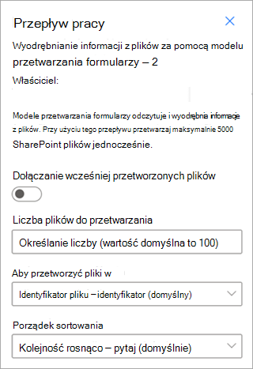

# Tworzenie modelu przetwarzania formularzy w usłudze Microsoft SharePoint Syntex

 

> [!VIDEO https://www.microsoft.com/videoplayer/embed/RE4GnhN]  

 

Korzystając z narzędzia [AI Builder](/ai-builder/overview) — funkcji w usłudze Microsoft Power Apps — użytkownicy SharePoint Syntex mogą tworzyć [model przetwarzania formularzy](form-processing-overview.md) bezpośrednio z biblioteki dokumentów SharePoint. 

Tworzenie modelu przetwarzania formularzy obejmuje następujące kroki:

 - [Krok 1. Tworzenie modelu przetwarzania formularzy](create-a-form-processing-model.md#step-1-create-a-form-processing-model)
 - [Krok 2. Dodawanie i analizowanie dokumentów](create-a-form-processing-model.md#step-2-add-and-analyze-documents)
 - [Krok 3. Oznaczanie pól i tabel](create-a-form-processing-model.md#step-3-tag-fields-and-tables)
 - [Krok 4. Trenowanie i publikowanie modelu](create-a-form-processing-model.md#step-4-train-and-publish-your-model)
 - [Krok 5. Korzystanie z modelu](create-a-form-processing-model.md#step-5-use-your-model)

## Wymagania

Model przetwarzania formularzy można utworzyć tylko w SharePoint bibliotekach dokumentów, dla których jest włączony. Jeśli przetwarzanie formularzy jest włączone, możesz wyświetlić menu **AutomateAI** **BuilderUtwórz** >  **model do przetwarzania formularzy** w bibliotece  >  dokumentów. Jeśli potrzebujesz włączonego przetwarzania w bibliotece dokumentów, musisz skontaktować się z administratorem SharePoint.

 

## Krok 1. Tworzenie modelu przetwarzania formularzy

Pierwszym krokiem tworzenia modelu przetwarzania formularzy jest nazwa modelu, zdefiniowanie nowego typu zawartości i utworzenie dla niego nowego widoku biblioteki dokumentów.

1. W bibliotece dokumentów wybierz menu **Automate** , wybierz pozycję **AI Builder**, a następnie wybierz pozycję **Utwórz model do przetwarzania formularzy**.

    

2. W panelu **Tworzenie modelu do przetwarzania formularzy** w polu **Nazwa** wpisz nazwę modelu (na przykład *Zamówienia zakupu*).

     

3. Teraz możesz automatycznie wyodrębniać i zapisywać informacje z *kolekcji* plików strukturalnych, które współużytkują podobny układ, taki jak faktury lub dokumenty podatkowe, które znajdują się w bibliotece dokumentów SharePoint. Umożliwia to utworzenie kilku modeli w jednym modelu i wyodrębnienie określonych informacji o elemencie tabeli.

   Nazwa kolekcji jest zapisywana w dedykowanej kolumnie w bibliotece dokumentów, w której jest stosowany model, co umożliwia rozróżnianie różnych układów plików przetwarzanych przez ten sam model.

   Ponadto wyodrębnione informacje o tabeli są zapisywane na określonej liście i skojarzone z przekazanym plikiem w celu łatwego wyświetlania lub dodatkowej automatyzacji procesów biznesowych.

   Aby wyodrębnić informacje o tabeli do skojarzonej listy:  

     1. W sekcji **Wyodrębnij informacje z tabel?** wybierz pozycję **Tak**.

       

     2. W sekcji **Gdzie należy zapisać informacje o tabeli?**
 
        - Jeśli wybierzesz **pozycję Nowa lista** (ustawienie domyślne), sugerowana nazwa zostanie automatycznie podana w polu **Nowa nazwa listy** . Możesz zmodyfikować nazwę, jeśli chcesz. Jeśli chcesz wyświetlić listę w nawigacji witryny, zaznacz pole wyboru **Pokaż w nawigacji witryny** .

        - Jeśli wybierzesz **istniejącą listę**, w polu **Wybrana lista** wybierz listę, która ma być używana.

4. Podczas tworzenia modelu przetwarzania formularzy tworzysz nowy typ zawartości SharePoint. Typ zawartości SharePoint reprezentuje kategorię dokumentów, które mają wspólne cechy i udostępniają kolekcję kolumn lub właściwości metadanych dla danej zawartości. SharePoint typy zawartości są zarządzane za pośrednictwem <a href="https://go.microsoft.com/fwlink/?linkid=2185219" target="_blank">centrum administracyjnego SharePoint</a>.

   Aby zamapować ten model na istniejący typ zawartości w galerii SharePoint typów zawartości, wybierz pozycję **Ustawienia zaawansowane**.

     

   1. W <a href="https://go.microsoft.com/fwlink/?linkid=2185074" target="_blank">galerii Typ zawartości</a> wybierz, czy chcesz utworzyć nowy typ zawartości, czy użyć istniejącego. 

   2. Aby użyć istniejącego typu zawartości, wybierz pozycję **Wybierz jeden** i wybierz typ zawartości z listy.

   3. Model tworzy nowy widok w bibliotece dokumentów dla wyodrębnionych danych. Jeśli nie chcesz, aby był to widok domyślny, w **widoku Biblioteka dla tego modelu** wyczyść pole wyboru **Ustaw widok jako domyślny** .

   4. Aby zastosować etykietę przechowywania do plików, w sekcji **Etykieta przechowywania** wybierz etykietę przechowywania, która ma być używana.

5. Wybierz pozycję **Utwórz**.

## Krok 2. Dodawanie i analizowanie dokumentów

Po utworzeniu nowego modelu przetwarzania formularzy przeglądarka otworzy nową stronę modelu przetwarzania formularzy Power Apps AI Builder. Na tej stronie możesz dodawać i analizować przykładowe dokumenty. 

> [!NOTE]
> Jeśli szukasz przykładowych plików do użycia, zobacz [wymagania dotyczące dokumentu wejściowego modelu przetwarzania formularzy i porady dotyczące optymalizacji](/ai-builder/form-processing-model-requirements). 
 
1. Najpierw zdefiniuj pola i tabele, które chcesz nauczyć model wyodrębniać na stronie **Wybieranie informacji do wyodrębnienia** . Aby uzyskać szczegółowe kroki, zobacz [Definiowanie pól i tabel do wyodrębnienia](/ai-builder/create-form-processing-model#define-fields-and-tables-to-extract). 

2.  Możesz utworzyć dowolną liczbę kolekcji układów dokumentów, które chcesz przetworzyć w modelu. Aby uzyskać szczegółowe instrukcje, zobacz [Grupowanie dokumentów według kolekcji](/ai-builder/create-form-processing-model#group-documents-by-collections). 

3. Po utworzeniu kolekcji i dodaniu przykładowych plików dla każdego narzędzia AI Builder przeanalizujesz przekazane dokumenty, aby wykryć pola i tabele. Zwykle trwa to kilka minut. Po zakończeniu analizy możesz kontynuować tagowanie dokumentów.

## Krok 3. Oznaczanie pól i tabel

Musisz otagować dokumenty, aby nauczyć model rozumieć pola i dane tabeli, które chcesz wyodrębnić. Aby uzyskać szczegółowe instrukcje, zobacz [Tagowanie dokumentów](/ai-builder/create-form-processing-model#tag-documents).

## Krok 4. Trenowanie i publikowanie modelu

1. Po utworzeniu i wytrenowania modelu możesz go opublikować i użyć w SharePoint. Aby uzyskać szczegółowe instrukcje, zobacz [Train and publish your form processing model (Trenowanie i publikowanie modelu przetwarzania formularzy](/ai-builder/form-processing-train)). 

2. Po opublikowaniu modelu wybierz pozycję **Użyj modelu**, a następnie wybierz pozycję **Utwórz przepływ**. Spowoduje to utworzenie przepływu Power Automate, który może być uruchamiany w bibliotece dokumentów SharePoint i wyodrębnia pola, które zostały zidentyfikowane w modelu.

    
 
3. Po zakończeniu zostanie wyświetlony komunikat: *Przepływ został pomyślnie utworzony*.

    

4. Wybierz przycisk **Przejdź do SharePoint**, aby wyświetlić bibliotekę dokumentów zaktualizowaną przy użyciu modelu.

## Krok 5. Korzystanie z modelu

1. W widoku modelu biblioteki dokumentów zwróć uwagę, że wybrane pola są teraz wyświetlane jako kolumny.

    

2. Zwróć uwagę, że link **informacyjny** obok pozycji Dokumenty zauważa, że model przetwarzania formularzy jest stosowany do tej biblioteki dokumentów.

      

3. Upload pliki do biblioteki dokumentów. Wszystkie pliki, które model identyfikuje jako typ zawartości, wyświetlają pliki w widoku i wyświetlają wyodrębnione dane w kolumnach.

     

> [!NOTE]
> Jeśli niestandardowy model przetwarzania formularzy i model zrozumienia dokumentów zostaną zastosowane do tej samej biblioteki, plik zostanie sklasyfikowany przy użyciu modelu zrozumienia dokumentu i wszystkich wytrenowanych wyodrębniaczy dla tego modelu. Jeśli istnieją puste kolumny zgodne z modelem przetwarzania formularzy, kolumny zostaną wypełnione przy użyciu wyodrębnionych wartości.

### Wyodrębnianie informacji przy użyciu przepływów

Dostępne są dwa przepływy do przetwarzania wybranego pliku lub partii plików w bibliotece, w której zastosowano model przetwarzania formularzy.

- **Wyodrębnianie informacji z obrazu lub pliku PDF przy użyciu modelu przetwarzania formularzy** — umożliwia wyodrębnienie tekstu z wybranego obrazu lub pliku PDF przez uruchomienie modelu przetwarzania formularzy. Obsługuje pojedynczy wybrany plik jednocześnie i obsługuje tylko pliki PDF i pliki obrazów (PNG, JPG i JPEG). Aby uruchomić przepływ, wybierz plik, a następnie wybierz pozycję **AutomateExtract** >  info.

      

- **Wyodrębnij informacje z plików za pomocą modelu przetwarzania formularzy** — użyj z modelami przetwarzania formularzy, aby odczytywać i wyodrębniać informacje z partii plików. Przetwarza do 5000 SharePoint plików jednocześnie. Po uruchomieniu tego przepływu można ustawić pewne parametry. Można:

    - Określ, czy mają zostać uwzględnione wcześniej przetworzone pliki (ustawieniem domyślnym jest nie uwzględnianie wcześniej przetworzonych plików).
    - Wybierz liczbę plików do przetworzenia (wartość domyślna to 100 plików).
    - Określ kolejność przetwarzania plików (opcje są określane według identyfikatora pliku, nazwy pliku, czasu utworzenia pliku lub czasu ostatniej modyfikacji).
    - Określ, jak ma być sortowane zamówienie (kolejność rosnąca lub malejąca).

      

### Pole Data klasyfikacji

Gdy model przetwarzania formularzy SharePoint Syntex (lub model interpretacji dokumentów) jest stosowany do biblioteki dokumentów, pole **Data klasyfikacji** jest uwzględniane w schemacie biblioteki. Domyślnie to pole jest puste. Jednak gdy dokumenty są przetwarzane i klasyfikowane przez model, to pole jest aktualizowane za pomocą sygnatury daty i godziny ukończenia. 

Gdy model jest ostemplowany **datą klasyfikacji**, możesz użyć opcji **Wyślij wiadomość e-mail po SharePoint Syntex przetwarza przepływ plików**, aby powiadomić użytkowników, że nowy plik został przetworzony i sklasyfikowany przez model w bibliotece dokumentów SharePoint.

Aby uruchomić przepływ:

1. Wybierz plik, a następnie wybierz pozycję **Integruj** >  **Power Automate** >  **Utwórz przepływ**.

2. W panelu **Tworzenie przepływu** wybierz pozycję **Wyślij wiadomość e-mail po SharePoint Syntex przetwarza plik**.

     

## Zobacz też
  
[dokumentacja Power Automate](/power-automate/)

[Szkolenie: Zwiększanie wydajności biznesowej za pomocą narzędzia AI Builder](/learn/paths/improve-business-performance-ai-builder/?source=learn)