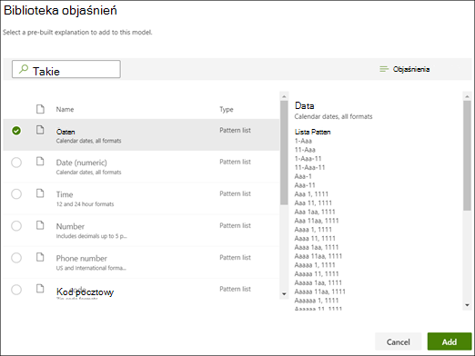
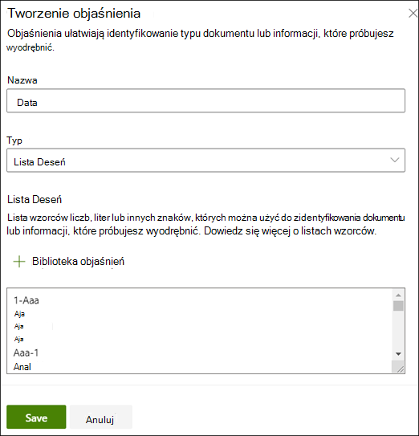
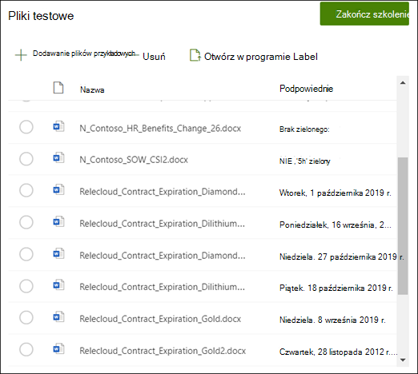

# Tworzenie ekstraktora w usłudze Microsoft SharePoint Syntex

 

> [!VIDEO https://www.microsoft.com/videoplayer/embed/RE4CL2G]

 

Przed utworzeniem modelu klasyfikatora lub po jego utworzeniu w celu zautomatyzowania identyfikacji i klasyfikacji określonych typów dokumentów można opcjonalnie dodać wyodrębniacze do modelu w celu wyciągnięcia określonych informacji z tych dokumentów. Możesz na przykład chcieć, aby model nie tylko identyfikował wszystkie dokumenty *odnawiania kontraktu* dodane do biblioteki dokumentów, ale także wyświetlał *datę rozpoczęcia usługi* dla każdego dokumentu jako wartość kolumny w bibliotece dokumentów.

Musisz utworzyć wyodrębniacz dla każdej jednostki w dokumencie, który chcesz wyodrębnić. W naszym przykładzie chcemy wyodrębnić **datę rozpoczęcia usługi** dla każdego dokumentu **odnawiania kontraktu** identyfikowanego przez model. Chcemy mieć możliwość wyświetlenia widoku w bibliotece dokumentów wszystkich dokumentów **odnawiania kontraktu** z kolumną zawierającą wartość daty **rozpoczęcia usługi** dla każdego dokumentu.

> [!NOTE]
> Aby utworzyć wyodrębniacz, użyj tych samych plików, które zostały wcześniej przekazane, aby wytrenować klasyfikator.

## Nadaj wyodrębniaczowi nazwę

1. Na stronie głównej modelu na kafelku **Tworzenie i trenowanie wyodrębniaczy** wybierz pozycję **Train extractor (Wytrenuj wyodrębniacz**).

2. Na ekranie **Wyodrębnianie nowej jednostki** wpisz nazwę ekstraktora w polu **Nowa nazwa wyodrębniacza** . Na przykład nadaj jej **nazwę Data rozpoczęcia usługi** , jeśli chcesz wyodrębnić datę rozpoczęcia usługi z każdego dokumentu odnawiania kontraktu. Możesz również ponownie użyć wcześniej utworzonej kolumny (na przykład kolumny zarządzanych metadanych).

    Domyślnie typ kolumny to **Pojedynczy wiersz tekstu**. Jeśli chcesz zmienić typ kolumny, wybierz pozycję **Ustawienia** >  **zaawansowaneTyp kolumny**, a następnie wybierz typ, którego chcesz użyć.

    

    > [!NOTE]
    > W przypadku wyodrębniaczy o typie kolumny **Pojedynczy wiersz tekstu** maksymalny limit znaków wynosi 255. Wszystkie wpisane znaki przekraczające limit są obcinane.

3. Po zakończeniu wybierz pozycję **Utwórz**.

## Dodawanie etykiety

Następnym krokiem jest oznaczenie jednostki, którą chcesz wyodrębnić w przykładowych plikach szkoleniowych.

Utworzenie wyodrębniacza spowoduje otwarcie strony wyodrębniacza. W tym miejscu zostanie wyświetlona lista przykładowych plików z pierwszym plikiem na liście wyświetlonej w przeglądarce.

1. W przeglądarce wybierz dane, które chcesz wyodrębnić z plików. Jeśli na przykład chcesz wyodrębnić *datę rozpoczęcia usługi*, wyróżnisz wartość daty w pierwszym pliku (*poniedziałek, 14 października 2019* r.). a następnie wybierz pozycję **Zapisz**. Wartość wyświetlana z pliku powinna zostać wyświetlona na liście Przykłady oznaczone w kolumnie **Etykieta** .
2. Wybierz pozycję **Następny plik** , aby automatycznie zapisać i otworzyć następny plik na liście w przeglądarce. Możesz też wybrać pozycję **Zapisz** , a następnie wybrać inny plik z listy **Przykłady oznaczone etykietami** .
3. W przeglądarce powtórz kroki 1 i 2, a następnie powtarzaj do momentu zapisania etykiety we wszystkich pięciu plikach.

    

Po oznaczeniu pięciu plików zostanie wyświetlony baner powiadomień informujący o przejściu do szkolenia. Możesz wybrać więcej etykiet więcej dokumentów lub przejść do szkolenia.

### Przeszukiwanie pliku przy użyciu funkcji Znajdź

Funkcja **Znajdź** umożliwia wyszukiwanie jednostki w dokumencie, którą chcesz oznaczyć etykietą.

   

Funkcja Znajdź jest przydatna w przypadku wyszukiwania dużego dokumentu lub wielu wystąpień jednostki w dokumencie. Jeśli znajdziesz wiele wystąpień, możesz wybrać tę, która jest potrzebna w wynikach wyszukiwania, aby przejść do tej lokalizacji w przeglądarce, aby ją oznaczyć etykietą.

## Dodawanie objaśnienia

W naszym przykładzie utworzymy wyjaśnienie, które zawiera wskazówkę dotyczącą samego formatu jednostki i jego odmian w przykładowych dokumentach. Na przykład wartość daty może mieć różne formaty, takie jak:

- 10/14/2019
- 14 października 2019 r.
- Poniedziałek, 14 października 2019 r.

Aby ułatwić identyfikację *daty rozpoczęcia usługi* , możesz utworzyć wyjaśnienie wzorca.

1. W sekcji Wyjaśnienie wybierz pozycję **Nowy** i wpisz nazwę (na przykład *Data*).
2. W polu Typ wybierz pozycję **Lista wzorców**.
3. W polu Wartość podaj zmianę daty w postaci, w jakiej są wyświetlane w przykładowych plikach. Jeśli na przykład masz formaty dat, które są wyświetlane jako 0/00/0000, wprowadź wszelkie odmiany wyświetlane w dokumentach, takie jak:
    - 0/0/0000
    - 0/00/0000
    - 00/0/0000
    - 00/00/0000
4. Wybierz **Zapisz**.

> [!NOTE]
> Aby uzyskać więcej informacji na temat typów wyjaśnień, zobacz [Typy wyjaśnień](./explanation-types-overview.md).

### Korzystanie z biblioteki wyjaśnień

W przypadku tworzenia objaśnień dla elementów, takich jak daty, łatwiej jest [użyć biblioteki wyjaśnień](./explanation-types-overview.md) niż ręcznie wprowadzić wszystkie odmiany. Biblioteka wyjaśnień to zestaw wstępnie utworzonych wyrażeń i objaśnień wzorców. Biblioteka próbuje podać wszystkie formaty typowych list fraz lub wzorców, takie jak daty, numery telefonów, kody pocztowe i wiele innych.

W przykładzie *Data rozpoczęcia usługi* bardziej wydajne jest użycie wstępnie utworzonego wyjaśnienia *daty* w bibliotece wyjaśnień:

1. W **sekcji Wyjaśnienie** wybierz pozycję **Nowy**, a następnie wybierz pozycję **Z biblioteki wyjaśnień**.
2. W bibliotece wyjaśnień wybierz pozycję **Data**. Możesz wyświetlić wszystkie rozpoznane odmiany daty.
3. Wybierz opcję **Dodaj**.

    

4. Na stronie **Tworzenie wyjaśnienia** informacje o *dacie* z biblioteki wyjaśnień automatycznie wypełniają pola. Wybierz **Zapisz**.

    

## Trenowanie modelu

Zapisywanie wyjaśnień rozpoczyna trenowanie. Jeśli model ma wystarczająco dużo informacji, aby wyodrębnić dane z oznaczonych etykietą plików przykładowych, zobaczysz każdy plik oznaczony etykietą **Dopasowanie**.

Jeśli wyjaśnienie nie zawiera wystarczającej ilości informacji, aby znaleźć dane, które chcesz wyodrębnić, każdy plik będzie oznaczony etykietą **Niezgodność**. Możesz wybrać **pozycję Niedopasowane** pliki, aby wyświetlić więcej informacji o tym, dlaczego wystąpiła niezgodność.

## Dodaj kolejne wyjaśnienie

Często niezgodność wskazuje, że podane wyjaśnienie nie dostarczyło wystarczających informacji, aby wyodrębnić wartość daty rozpoczęcia usługi w celu dopasowania ich do naszych plików oznaczonych etykietą. Może być konieczne jego edytowanie lub dodanie innego wyjaśnienia.

W naszym przykładzie zwróć uwagę, że *ciąg tekstowy Data rozpoczęcia usługi* zawsze poprzedza rzeczywistą wartość. Aby ułatwić identyfikację daty rozpoczęcia usługi, należy utworzyć wyjaśnienie frazy.

1. W sekcji Wyjaśnienie wybierz pozycję **Nowy**, a następnie wpisz nazwę (na przykład *Ciąg prefiksu*).
2. W polu Typ wybierz **pozycję Lista fraz**.
3. Użyj *wartości Service Start Date of (Data rozpoczęcia usługi* ).
4. Wybierz **Zapisz**.

    

## Ponownie wytrenuj model

Zapisanie objaśnienia ponownie rozpoczyna trenowanie, tym razem korzystając z obu wyjaśnień w przykładzie. Jeśli model ma wystarczająco dużo informacji, aby wyodrębnić dane z plików przykładowych z etykietą, zobaczysz każdy plik oznaczony etykietą **Dopasowanie**.

Jeśli ponownie pojawi się **niezgodność** plików z etykietami, prawdopodobnie konieczne będzie utworzenie innego wyjaśnienia, aby udostępnić modelowi więcej informacji w celu zidentyfikowania typu dokumentu lub rozważyć wprowadzenie zmian w istniejących plikach.

## Testowanie modelu

Jeśli otrzymasz dopasowanie do oznaczonych plików przykładowych, możesz teraz przetestować model na pozostałych nieoznaczonych plikach przykładowych. Jest to opcjonalne, ale przydatny krok do oceny "kondycji" lub gotowości modelu przed jego użyciem przez przetestowanie go na plikach, których model nie widział wcześniej.

1. Na stronie głównej modelu wybierz kartę **Test** .  Spowoduje to uruchamianie modelu w nieoznakowanych plikach przykładowych.

2. Na liście **Pliki testowe** wyświetlane są przykładowe pliki, aby pokazać, czy model może wyodrębnić potrzebne informacje. Te informacje ułatwiają określenie skuteczności klasyfikatora w identyfikowaniu dokumentów.

    

### Dalsze uściślanie ekstraktora

Jeśli masz zduplikowane jednostki i chcesz wyodrębnić tylko jedną wartość lub określoną liczbę wartości, możesz ustawić regułę określającą sposób jej przetwarzania. Aby dodać regułę w celu uściślenia wyodrębnionych informacji, wykonaj następujące kroki:

1. Na stronie głównej modelu w sekcji **Wyodrębniacze jednostek** wybierz wyodrębniacz, który chcesz uściślić, a następnie wybierz pozycję **Uściślij wyodrębnione informacje**.

    

2. Na stronie **Uściślij wyodrębnione informacje** wybierz jedną z następujących reguł:

    - Zachowaj co najmniej jedną z pierwszych wartości
    - Zachowaj co najmniej jedną z ostatnich wartości
    - Usuwanie zduplikowanych wartości
    - Zachowaj co najmniej jeden z pierwszych wierszy
    - Zachowaj co najmniej jeden z ostatnich wierszy

    

3. Wprowadź liczbę wierszy lub wartości, których chcesz użyć, a następnie wybierz pozycję **Uściślij**.

4. Jeśli chcesz edytować regułę, zmieniając liczbę wierszy lub wartości, wybierz wyodrębniacz, który chcesz edytować, wybierz pozycję **Uściślij wyodrębnione informacje**, zmień liczbę, a następnie wybierz pozycję **Zapisz**.

5. Podczas testowania ekstraktora będzie można zobaczyć uściślanie w kolumnie **Wynik uściślania** na liście **Pliki testowe** .

    

6. Jeśli chcesz usunąć regułę uściślania na wyodrębniaczu, wybierz wyodrębniacz, z którego chcesz usunąć regułę, wybierz pozycję **Uściślij wyodrębnione informacje**, a następnie wybierz pozycję **Usuń**.

## Zobacz też

[Tworzenie klasyfikatora](create-a-classifier.md)

[Typy wyjaśnień](explanation-types-overview.md)

[Korzystanie z taksonomii magazynu terminów podczas tworzenia ekstraktora](leverage-term-store-taxonomy.md)

[Omówienie usługi Document Understanding](document-understanding-overview.md)

[Stosowanie modelu](apply-a-model.md)

[tryb ułatwień dostępu SharePoint Syntex](accessibility-mode.md)
