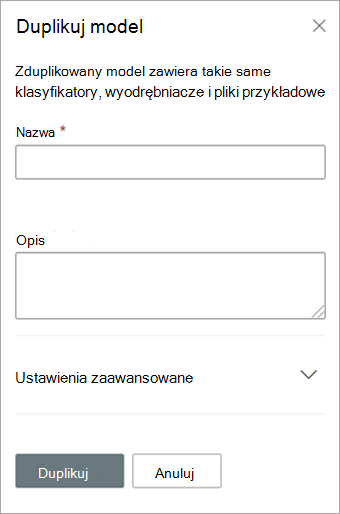

# Duplikowanie modelu w aplikacji Microsoft SharePoint Syntex

Duplikowanie modelu rozumienia dokumentu może zaoszczędzić czas i wysiłku, jeśli musisz utworzyć nowy model, i wiedzieć, że istniejący model jest bardzo podobny do tego, czego potrzebujesz.

Na przykład istniejący model o nazwie "Umowy" klasyfikuje te same pliki, z których należy pracować. Nowy model wyodrębni część istniejących danych, ale będzie trzeba zaktualizować go, aby wyodrębnić dodatkowe dane. Zamiast tworzyć i szkolenie nowego modelu od podstaw, można użyć funkcji zduplikowanego modelu w celu utworzenia kopii modelu Kontrakty, co spowoduje również skopiowanie wszystkich skojarzonych elementów szkoleniowych, takich jak pliki przykładowe i wyodrębniacze encji.

Jeśli zduplikowano model, po zmianie jego nazwy (na przykład na "Odnowienie kontraktu"), możesz dokonać jego aktualizacji. Na przykład możesz usunąć niektóre z istniejących wyodrębnianych pól, które nie są już potrzebne, a następnie przeszkolić model w celu wyodrębnienia nowego (na przykład "Data odnowienia").

## Duplikowanie modelu

Wykonaj poniższe czynności, aby zduplikować model zrozumienia dokumentu.

1. W centrum zawartości wybierz pozycję **Modele** , aby wyświetlić listę modeli.

2. Na **stronie Modele** wybierz model, który chcesz zduplikować.

3. Używając wstążki lub przycisku Pokaż **akcje** (obok nazwy modelu), wybierz pozycję **Duplikuj**. 

      

4. W **panelu Duplikuj** model:

   a. W **obszarze** Nazwa wprowadź nową nazwę modelu, który chcesz zduplikować. 

      

   b. W **obszarze** Opis dodaj opis nowego modelu.

   c. (Opcjonalnie) W **obszarze Ustawienia zaawansowane** określ, czy chcesz skojarzyć istniejący [typ zawartości](/sharepoint/governance/content-type-and-workflow-planning#content-type-overview).

5. Wybierz pozycję **Duplikuj**.

## Zobacz też
[Tworzenie klasyfikatora](create-a-classifier.md)

[Zmienianie nazwy modelu](rename-a-model.md)

[Tworzenie wyodrębnianego](create-an-extractor.md)

[Omówienie opisów dokumentów](document-understanding-overview.md)

[Typy objaśnień](explanation-types-overview.md)

[Stosowanie modelu](apply-a-model.md) 

[SharePoint Syntex tryb ułatwień dostępu](accessibility-mode.md)