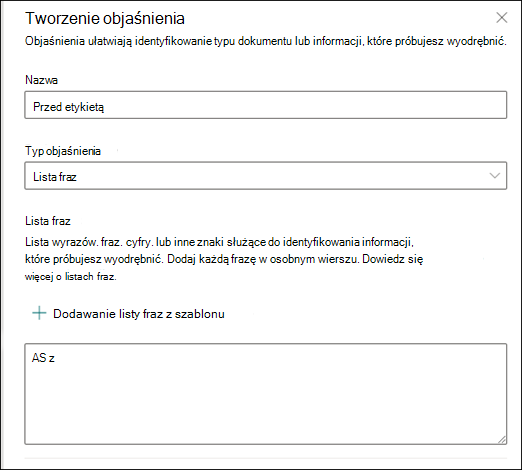
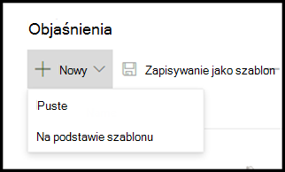
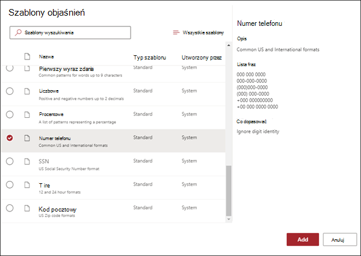
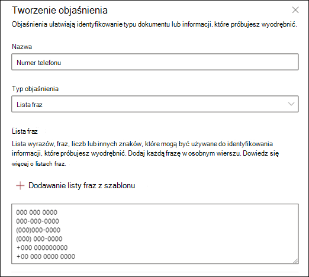

# Korzystanie z szablonów objaśnień w aplikacji Microsoft SharePoint Syntex

Choć możesz ręcznie dodać różne wartości listy fraz do objaśnienia, łatwiejsze może być korzystanie z szablonów podanych w bibliotece objaśnień.

Na przykład zamiast ręcznie dodawać wszystkie odmiany *daty, możesz* użyć szablonu listy fraz dla daty, ponieważ zawiera on już wiele  fraz z listą wartości:

Biblioteka objaśnień zawiera często używane *objaśnienia listy* fraz, między innymi:

- Data: daty kalendarza, wszystkie formaty. Uwzględnia tekst i liczby (na przykład "9 grudnia 2020").
- Data (liczbowa): daty kalendarza, wszystkie formaty. Uwzględnia liczby (na przykład 1-11-2020).
- Czas: formaty 12-godzinne i 24-godzinne.
- Liczba: Liczby dodatnie i ujemne do dwóch miejsc dziesiętnych.
- Wartość procentowa: lista wzorców reprezentujących wartość procentową. Na przykład 1%, 11%, 100% lub 11,11%.
- Telefon numer telefonu: popularne amerykańskie i międzynarodowe formaty. Na przykład: 000 000 0000, 000-000-0000, (000)000-0000 lub (000) 000-0000.
- Kod pocztowy: amerykański kod pocztowy. Na przykład 11111, 11111-1111.
- Pierwszy wyraz zdania: Typowe wzorce dla wyrazów o maksymalnie dziewięciu znakach.
- Koniec zdania: typowe znaki interpunktowe dla końca zdania.
- Karta kredytowa: typowe formaty liczb kart kredytowych. Na przykład: 1111-1111-1111-1111.
- Numer PE PEŁ: amerykański numer PEŁ. Na przykład: 111-11-1111.
- Pole wyboru: Lista fraz reprezentująca odmiany wypełnionego pola wyboru. Na przykład _X_, _ _X_.
- Waluta: Główne symbole międzynarodowe. Na przykład $.
- E-mail DW: Lista fraz z terminem "DW:", często znaleziona w pobliżu imion i nazwisk lub adresów e-mail innych osób albo grup, do których wysłano wiadomość.
- Data wiadomości e-mail: Lista fraz z terminem "Wysłano:", często znaleziona w pobliżu daty wysłania wiadomości e-mail.
- Powitanie wiadomości e-mail: Typowe otwierające wiersze wiadomości e-mail.
- Adresat wiadomości e-mail: Lista fraz z terminem "Do:", często znajduje się w pobliżu nazwisk lub adresów e-mail osób albo grup, do których wysłano wiadomość.
- Nadawca wiadomości e-mail: Lista fraz z terminem "Od:", często znaleziona w pobliżu nazwy lub adresu e-mail nadawcy.
- Temat wiadomości e-mail: lista fraz z terminem "Temat", często znaleziona w pobliżu tematu wiadomości e-mail.

Biblioteka objaśnień zawiera również *często używane* objaśnienia wyrażeń regularnych, takie jak:

- Liczby od 6-cyfrowych do 17-cyfrowych. Dopasowuje dowolną liczbę z długości od 6 do 17 cyfr. Numery kont bankowych w Usa pasują do tego wzorca.
- Adres e-mail: Odpowiada typowi adresu e-mail, na przykład meganb@contoso.com.
- Numer identyfikacyjny w USA: Odpowiada numerowi trzycyfrowemu, zaczynającemu się od cyfry 9 i 6-cyfrowego numeru zaczynającego się od 7 lub 8.
- Adres internetowy (URL): odpowiada formatowi adresu internetowego, zaczynając od tekstu http:// lub https://.

Ponadto biblioteka objaśnień zawiera trzy automatyczne typy szablonów, które działają z danymi oznaczonymi w plikach przykładowych:

- Po etykiecie: wyrazy lub znaki występujące po etykietach w plikach przykładowych.
- Przed etykietą: wyrazy lub znaki występujące przed etykietami w plikach przykładowych.
- Etykiety: do 10 pierwszych etykiet z plików przykładowych.

Aby uzyskać przykład działania szablonów automatycznych, w poniższym pliku przykładowym użyjemy szablonu Wyjaśnienie przed etykietą, aby uzyskać więcej informacji o modelu w celu uzyskania dokładniejszego dopasowania.

Po wybraniu szablonu Przed objaśnieniem etykiet będzie on szukać pierwszego zestawu wyrazów widocznych przed etykietą w plikach przykładowych. W tym przykładzie zestaw wyrazów zidentyfikowanych w pierwszym pliku przykładowym to "Na".

Możesz wybrać pozycję **Dodaj,** aby utworzyć objaśnienie na podstawie szablonu. Podczas dodawania kolejnych plików przykładowych zostaną zidentyfikowane i dodane dodatkowe wyrazy do listy fraz.

## Używanie szablonu z biblioteki objaśnień

1. W sekcji **Objaśnienia** na stronie Pociąg modelu wybierz pozycję  **Nowy**, **a następnie wybierz pozycję Z szablonu**.

   

2.  Na stronie **Szablony objaśnień** wybierz wyjaśnienie, którego chcesz użyć, a następnie wybierz pozycję **Dodaj**.

    

3. Informacje dotyczące wybranego szablonu zostaną wyświetlone na **stronie Tworzenie objaśnienia** . W razie potrzeby edytuj nazwę objaśnienia i dodaj lub usuń elementy z listy fraz.

    

4. Po zakończeniu wybierz pozycję **Zapisz**.

## Zapisywanie szablonu w bibliotece objaśnień

Objaśnienie można zapisać jako szablon, aby udostępnić go w bibliotece objaśnień centrum zawartości do użyciu z innymi modelami. Szablon będzie zawierał podstawowe i zaawansowane ustawienia objaśnienia, z wyjątkiem opcji określenia, gdzie frazy są wyświetlane w dokumencie.

> [!NOTE]
> Jako szablon można zapisać tylko listę fraz i objaśnienia wyrażeń regularnych.

1. W **sekcji Objaśnienia** na stronie Pociąg **twojego** modelu:

   a. Z listy objaśnień wybierz ten, który chcesz zapisać jako szablon.

   b. Wybierz **pozycję Zapisz jako szablon**.

    

2. Na **stronie Zapisywanie szablonu objaśnienia** :

   a. W razie **potrzeby** zmień nazwę objaśnienia w sekcji Nazwa.

   b. W sekcji **Opis** dodaj opis, aby inne osoby wiedziały, jak skorzystać z objaśnienia.

   c. Wybierz **Zapisz**.

    

### Zobacz też

[Typy objaśnień w SharePoint Syntex](explanation-types-overview.md)