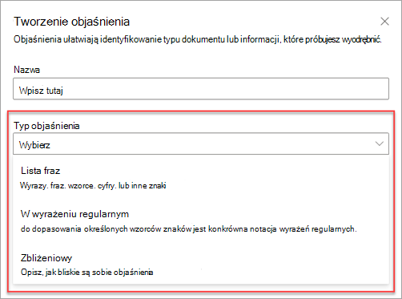
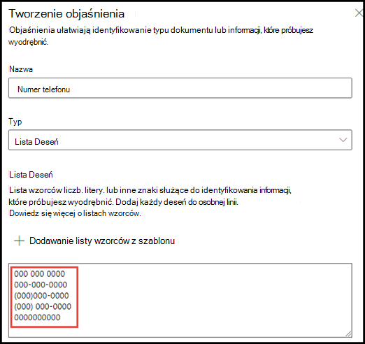
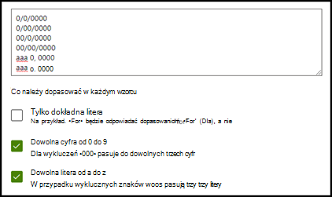
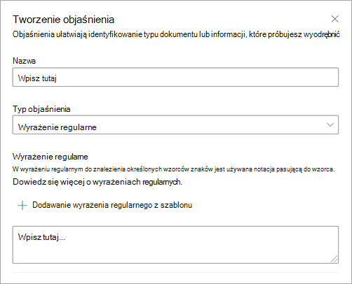
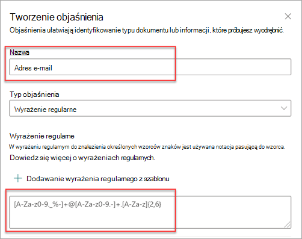
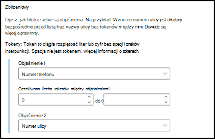
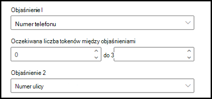
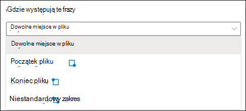
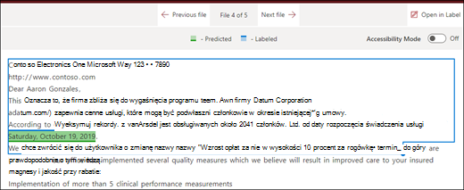
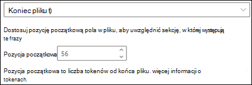

# Typy wyjaśnień w usłudze Microsoft SharePoint Syntex

Wyjaśnienia służą do definiowania informacji, które chcesz oznaczyć etykietą i wyodrębnić w modelach interpretacji dokumentów w usłudze Microsoft SharePoint Syntex. Podczas tworzenia wyjaśnienia należy wybrać typ wyjaśnienia. Ten artykuł ułatwia zrozumienie różnych typów wyjaśnień i sposobu ich użycia.

Dostępne są następujące typy wyjaśnień:

- [**Lista fraz**](#phrase-list): lista wyrazów, fraz, liczb lub innych znaków, których można użyć w wyodrębniającym dokumencie lub informacjach. Na przykład ciąg tekstowy *odwołujący się do lekarza znajduje się* we wszystkich dokumentach skierowania medycznego, które identyfikujesz. Lub *numer telefonu* lekarza odsyłającego ze wszystkich dokumentów skierowania medycznego, które identyfikujesz.

- [**Wyrażenie regularne**](#regular-expression): używa notacji pasującej do wzorca, aby znaleźć określone wzorce znaków. Możesz na przykład użyć wyrażenia regularnego, aby znaleźć wszystkie wystąpienia wzorca *adresu e-mail* w zestawie dokumentów.

- [**Bliskość**](#proximity): opisuje, jak bliskie są sobie nawzajem wyjaśnienia. Na przykład lista fraz *numerów ulic* znajduje się tuż przed listą fraz *nazwy ulicy* bez tokenów między nimi (informacje o tokenach poznasz w dalszej części tego artykułu). Użycie typu zbliżeniowego wymaga co najmniej dwóch wyjaśnień w modelu lub opcja zostanie wyłączona.

## Lista fraz

Typ wyjaśnienia listy fraz jest zwykle używany do identyfikowania i klasyfikowania dokumentu za pośrednictwem modelu. Jak opisano w przykładzie *etykiety lekarza odsyłającego* , jest to ciąg wyrazów, fraz, liczb lub znaków, który jest spójnie w identyfikowanych dokumentach.

Chociaż nie jest to wymagane, możesz osiągnąć lepszy sukces dzięki wyjaśnieniu, jeśli przechwycona fraza znajduje się w spójnej lokalizacji w dokumencie. Na przykład etykieta *lekarza odsyłającego* może być stale umieszczona w pierwszym akapicie dokumentu. Możesz również użyć ustawienia **[Konfiguruj, gdzie frazy występują w](explanation-types-overview.md#configure-where-phrases-occur-in-the-document)** ustawieniu zaawansowanym dokumentu, aby wybrać określone obszary, w których znajduje się fraza, zwłaszcza jeśli istnieje prawdopodobieństwo, że fraza może wystąpić w wielu lokalizacjach w dokumencie.

Jeśli wielkość liter jest wymaganiem w identyfikowaniu etykiety, użycie typu listy fraz pozwala określić ją w objaśnieniu, wybierając pole wyboru **Tylko dokładna wielkość liter** .

Typ frazy jest szczególnie przydatny podczas tworzenia wyjaśnienia, które identyfikuje i wyodrębnia informacje w różnych formatach, takich jak daty, numery telefonów i numery kart kredytowych. Na przykład data może być wyświetlana w wielu różnych formatach (1/1/2020, 1-1-2020, 01/01/20, 01/01/2020 lub 1 stycznia 2020 r.). Zdefiniowanie listy fraz sprawia, że wyjaśnienie jest bardziej wydajne, przechwytując wszelkie możliwe odmiany danych, które próbujesz zidentyfikować i wyodrębnić.

W przykładzie *numeru telefonu* wyodrębniasz numer telefonu dla każdego lekarza odsyłającego ze wszystkich dokumentów poleceń medycznych zidentyfikowanych przez model. Podczas tworzenia objaśnienia wpisz różne formaty, które numer telefonu może wyświetlać w dokumencie, aby móc przechwytywać możliwe odmiany.

W tym przykładzie w **obszarze Zaawansowane Ustawienia** zaznacz pole wyboru **Dowolna cyfra z zakresu od 0 do 9**, aby rozpoznać każdą wartość "0" używaną na liście fraz jako dowolną cyfrę z zakresu od 0 do 9.

Podobnie, jeśli utworzysz listę fraz zawierającą znaki tekstowe, zaznacz pole wyboru **Dowolna litera z litery a-z** , aby rozpoznać każdy znak "a" używany na liście fraz jako dowolny znak od "a" do "z".

Jeśli na przykład utworzysz listę fraz **Daty** i chcesz się upewnić, że format daty, taki jak *1 stycznia 2020 r.,* zostanie rozpoznany, musisz:

- Dodaj *aaa 0, 0000* i *aaa 00, 0000* do listy fraz.
- Upewnij się, że wybrano również **dowolną literę z litery a-z** .

Jeśli na liście fraz znajdują się wymagania dotyczące wielkich liter, możesz zaznaczyć pole wyboru **Tylko dokładna litera** . W przykładzie daty, jeśli wymagasz wielkiej litery pierwszej litery miesiąca, musisz wykonać następujące czynności:

- Dodaj do listy fraz *Aaa 0, 0000* i *Aaa 00, 0000* .
- Upewnij się, że wybrano również opcję **Tylko dokładna litera** .

> [!NOTE]
> Zamiast ręcznie tworzyć objaśnienie listy fraz, użyj [biblioteki wyjaśnień](explanation-templates.md) , aby użyć szablonów listy fraz dla wspólnej listy fraz, takich jak *data*, *numer telefonu* lub *numer karty kredytowej*.

## Wyrażenie regularne

Typ wyjaśnienia wyrażenia regularnego umożliwia tworzenie wzorców, które ułatwiają znajdowanie i identyfikowanie określonych ciągów tekstowych w dokumentach. Za pomocą wyrażeń regularnych można szybko przeanalizować duże ilości tekstu:

- Znajdź określone wzorce znaków.
- Zweryfikuj tekst, aby upewnić się, że jest zgodny ze wstępnie zdefiniowanym wzorcem (takim jak adres e-mail).
- Wyodrębnianie, edytowanie, zastępowanie lub usuwanie podciągów tekstu.

Typ wyrażenia regularnego jest szczególnie przydatny podczas tworzenia wyjaśnienia, które identyfikuje i wyodrębnia informacje w podobnych formatach, takich jak adresy e-mail, numery kont bankowych lub adresy URL. Na przykład adres e-mail, taki jak megan@contoso.com, jest wyświetlany w określonym wzorcu ("megan" jest pierwszą częścią, a "com" to ostatnia część).

Wyrażenie regularne dla adresu e-mail to: **[A-Za-z0-9._%-]+@[A-Za-z0-9.-]+.[ A-Za-z]{2,6}**.

To wyrażenie składa się z pięciu części w następującej kolejności:

1. Dowolna liczba następujących znaków:

   a. Litery od a do z

   b. Liczby od 0 do 9

   c. Kropka, podkreślenie, procent lub kreska

2. Symbol @

3. Dowolna ilość tych samych znaków co pierwsza część adresu e-mail

4. Okres

5. Od dwóch do sześciu liter

Aby dodać typ wyjaśnienia wyrażenia regularnego:

1. W panelu **Tworzenie wyjaśnienia** w obszarze **Typ wyjaśnienia** wybierz pozycję **Wyrażenie regularne**.

   

2. Możesz wpisać wyrażenie w polu tekstowym **Wyrażenie regularne** lub wybrać **pozycję Dodaj wyrażenie regularne z szablonu**.

   Dodanie wyrażenia regularnego przy użyciu szablonu powoduje automatyczne dodanie nazwy i wyrażenia regularnego do pola tekstowego. Jeśli na przykład **wybierzesz szablon Adres e-mail** , zostanie wypełniony panel **Tworzenie wyjaśnienia** .

   

### Ograniczenia

W poniższej tabeli przedstawiono opcje znaków wbudowanych, które obecnie nie są dostępne do użycia we wzorcach wyrażeń regularnych.

|Opcja|Stan|Bieżąca funkcjonalność|
|---|---|---|
|Wielkość liter|Obecnie nie jest obsługiwane.|Wszystkie wykonywane dopasowania nie uwzględniają wielkości liter.|
|Kotwice linii|Obecnie nie jest obsługiwane.| Nie można określić określonej pozycji w ciągu, w którym musi wystąpić dopasowanie.|

## Bliskość

Typ wyjaśnienia zbliżeniowego pomaga modelowi zidentyfikować dane, definiując, jak blisko znajduje się inny fragment danych. Na przykład w modelu załóżmy, że zdefiniowano dwa wyjaśnienia, które etykietują zarówno *numer ulicy* klienta, jak i *numer telefonu*.

Zwróć uwagę, że numery telefonów klientów zawsze pojawiają się przed numerem adresu ulicy.

Alex Wilburn 
555-555-5555 
One Microsoft Way 
Redmond, WA 98034 

Skorzystaj z objaśnień zbliżeniowych, aby określić, jak daleko znajduje się wyjaśnienie numeru telefonu, aby lepiej zidentyfikować numer adresu ulicy w dokumentach.

> [!NOTE]
> Obecnie nie można używać wyrażeń regularnych z typem wyjaśnienia zbliżeniowego.

#### Co to są tokeny?

Aby użyć typu wyjaśnienia zbliżeniowego, musisz zrozumieć, czym jest token. Liczba tokenów to sposób, w jaki objaśnienie zbliżeniowe mierzy odległość od jednego wyjaśnienia do drugiego. Token jest ciągłym rozpiętości (bez spacji lub interpunkcji) liter i cyfr.

W poniższej tabeli przedstawiono przykłady określania liczby tokenów w frazie.

|Wyrażenie|Liczba tokenów|Objaśnienie|
|---|---|---|
|`Dog`|1|Pojedyncze słowo bez znaków interpunkcyjnych ani spacji.|
|`RMT33W`|1|Numer lokalizatora rekordów. Może zawierać cyfry i litery, ale nie ma znaków interpunkcyjnych.|
|`425-555-5555`|5|Numer telefonu. Każdy znak interpunkcyjny jest pojedynczym tokenem, więc `425-555-5555` jest to 5 tokenów: `425` `-` `555` `-` `5555`|
|`https://luis.ai`|7|`https` `:` `/` `/` `luis` `.` `ai`|

#### Konfigurowanie typu wyjaśnienia zbliżeniowego

Na przykład skonfiguruj ustawienie zbliżeniowe, aby zdefiniować zakres liczby tokenów w objaśnieniu *numeru telefonu* z objaśnienia *numeru ulicy* . Zwróć uwagę, że minimalny zakres to "0", ponieważ nie ma tokenów między numerem telefonu a numerem ulicy.

Ale niektóre numery telefonów w przykładowych dokumentach są dołączane do *(mobile)*.

Nestor Wilke 
111-111-1111 (telefon komórkowy) 
One Microsoft Way 
Redmond, WA 98034 

Istnieją trzy tokeny w *systemie (mobilnym):*

|Wyrażenie|Liczba tokenów|
|--|--|
|(|1|
|Mobile|2|
|)|3|

Skonfiguruj ustawienie zbliżeniowe tak, aby miało zakres od 0 do 3.

## Konfigurowanie miejsca występowania fraz w dokumencie

Podczas tworzenia wyjaśnienia domyślnie cały dokument jest wyszukiwany pod kątem frazy, którą próbujesz wyodrębnić. Można jednak użyć ustawienia **Zaawansowana lokalizacja tych fraz** , aby ułatwić izolowanie określonej lokalizacji w dokumencie, w której występuje fraza. To ustawienie jest przydatne w sytuacjach, gdy podobne wystąpienia frazy mogą pojawić się w innym miejscu dokumentu i chcesz upewnić się, że wybrano poprawne.

Odwołując się do naszego przykładu dokumentacji medycznej, *lekarz odsyłający* jest zawsze wymieniony w pierwszym akapicie dokumentu. W przypadku ustawienia **Gdzie te frazy występują** , w tym przykładzie można skonfigurować wyjaśnienie, aby wyszukać tę etykietę tylko w początkowej sekcji dokumentu lub w dowolnej innej lokalizacji, w której może wystąpić.

Dla tego ustawienia możesz wybrać następujące opcje:

- Dowolne miejsce w pliku: cały dokument jest wyszukiwany pod kątem frazy.

- Początek pliku: dokument jest przeszukiwany od początku do lokalizacji frazy.

   

    W przeglądarce można ręcznie dostosować pole wyboru, aby uwzględnić lokalizację, w której występuje faza. Wartość **Położenie końcowe** zostanie zaktualizowana, aby wyświetlić liczbę tokenów, które zawiera wybrany obszar. Możesz również zaktualizować wartość **Położenie końcowe** , aby dostosować wybrany obszar.

   

- Koniec pliku: dokument jest przeszukiwany od końca do lokalizacji frazy.

   

    W przeglądarce można ręcznie dostosować pole wyboru, aby uwzględnić lokalizację, w której występuje faza. Wartość **Pozycja początkowa** zostanie zaktualizowana, aby wyświetlić liczbę tokenów, w tym wybrany obszar. Możesz również zaktualizować wartość Pozycji początkowej, aby dostosować wybrany obszar.

   

- Zakres niestandardowy: dokument jest wyszukiwany w określonym zakresie pod kątem lokalizacji frazy.

   

    W przeglądarce można ręcznie dostosować pole wyboru, aby uwzględnić lokalizację, w której występuje faza. W tym ustawieniu należy wybrać pozycję **Rozpocznij** i **Koniec** . Te wartości reprezentują liczbę tokenów od początku dokumentu. Chociaż możesz ręcznie wprowadzić te wartości, łatwiej jest ręcznie dostosować pole wyboru w przeglądarce.

## Zagadnienia dotyczące konfigurowania wyjaśnień

Podczas trenowania klasyfikatora należy pamiętać o kilku kwestiach, które zapewnią bardziej przewidywalne wyniki:

- Tym więcej dokumentów trenujesz, tym dokładniejszy będzie klasyfikator.  Jeśli to możliwe, użyj więcej niż 5 dobrych dokumentów i użyj więcej niż 1 nieprawidłowego dokumentu.  Jeśli biblioteki, z którymi pracujesz, mają kilka różnych typów dokumentów, kilka typów prowadzi do bardziej przewidywalnych wyników.
- Etykietowanie dokumentu odgrywa ważną rolę w procesie trenowania.  Są one używane razem z wyjaśnieniami do trenowania modelu.  Podczas trenowania klasyfikatora z dokumentami, które nie mają w nich dużej zawartości, mogą wystąpić pewne anomalie.  Wyjaśnienie może nie być zgodne z niczym w dokumencie, ale ponieważ zostało oznaczone jako "dobry" dokument, podczas trenowania może być widoczne dopasowanie.
- Podczas tworzenia wyjaśnień używa logiki OR w połączeniu z etykietą, aby określić, czy jest zgodna.  Wyrażenie regularne używające logiki AND może być bardziej przewidywalne.  Oto przykładowe wyrażenie regularne do użycia w rzeczywistych dokumentach podczas trenowania.  Zwróć uwagę, że tekst wyróżniony na czerwono to frazy, które będą wyszukiwane.

    <pre>(?=.*network provider)(?=.*participating providers).*</pre>

- Etykiety i wyjaśnienia współpracują ze sobą i są używane podczas trenowania modelu.  Nie jest to seria reguł, które mogą być odłączane i dokładne wagi lub przewidywania stosowane do każdej zmiennej, która została skonfigurowana.  Im większa jest zmienność dokumentów używanych w trenowaniu, zapewni większą dokładność w modelu.

### Zobacz też

[Używanie szablonów objaśnień w SharePoint Syntex](explanation-templates.md)
