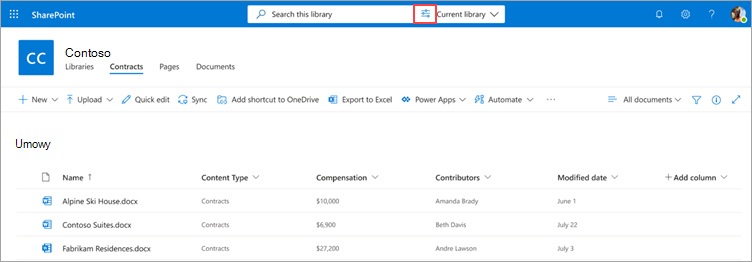

# Wyszukiwanie metadanych w bibliotekach dokumentów w aplikacji Microsoft SharePoint Syntex

Funkcja zaawansowanego wyszukiwania metadanych w aplikacji SharePoint Syntex umożliwia wykonywanie określonych zapytań opartych na metadanych na SharePoint bibliotekach dokumentów. Zapytania można wykonać szybciej i precyzyjniej na podstawie określonych wartości kolumn metadanych zamiast wyszukiwania słów kluczowych.

Zaawansowane wyszukiwanie metadanych umożliwia użycie metadanych skojarzonych z dokumentem w celu zlokalizowania pliku SharePoint bibliotece dokumentów. Ta funkcja jest szczególnie przydatna w sytuacji, gdy chcesz znaleźć określoną część informacji, na przykład czas ostatniej modyfikacji dokumentu, konkretną osobę skojarzoną z plikiem lub określony typ pliku.

> [!NOTE]
> Ta funkcja jest dostępna tylko dla użytkowników z licencją na SharePoint Syntex. 

## Aby użyć zaawansowanego wyszukiwania metadanych

1. Z SharePoint dokumentów w polu Wyszukaj w tej bibliotece wybierz  ikonę wyszukiwania metadanych (

    

2. W okienku wyszukiwania metadanych wpisz tekst lub wybierz parametr, który chcesz znaleźć w jednym lub wielu polach wyszukiwania.

    

   W tej chwili dostępne są następujące pola wyszukiwania metadanych. W przyszłości zostanie dodanych więcej pól.

   |Pole    |Użyj tego pola do  |
   |---------|---------|
   |Słowa kluczowe |Wyszukaj dopasowanie ciągu w metadanych lub w pełnym tekście dokumentu. |
   |Nazwa pliku     |Wyszukaj w **kolumnie Nazwa** w bibliotece.          |
   |Osoby   |Wyszukaj dopasowanie dla osób w dowolnej kolumnie w bibliotece.   |
   |Data modyfikacji |Wyszukiwanie według wybranego zakresu **dat w kolumnie** Zmodyfikowano w bibliotece.         |
   |Typ pliku     |Wyszukiwanie według wybranego typu pliku (na przykład dokument programu Word lub plik PDF).        |
   |Typ zawartości  |Wyszukiwanie według wybranego typu zawartości. Ta opcja będzie wyświetlana tylko wtedy, gdy do biblioteki został zastosowany nie domyślny typ zawartości. Domyślnym typem zawartości *jest dokument* i *folder*.        |

3. Można również wyszukiwać niestandardowe kolumny witryny, które znajdują się w bieżącym widoku biblioteki. Jest to szczególnie przydatne, jeśli w bibliotece jest uruchomiony model, ponieważ wyodrębniacze metadanych automatycznie wypełniają informacje w kolumnach witryny.  

    Aby dodać do wyszukiwania niestandardową kolumnę witryny, wybierz pozycję Dodaj **więcej** opcji, a następnie wybierz nazwę kolumny witryny.

    

    > [!NOTE]
    > Obecnie możliwość dodawania pól zarządzanych metadanych lub wieloliniowych pól tekstowych nie jest dostępna. 

4. Wybierz **pozycję Wyszukaj**. Dokumenty zgodne z wyszukiwaniem metadanych są wyświetlane na stronie wyników. 
