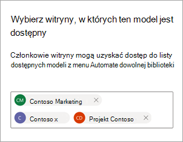
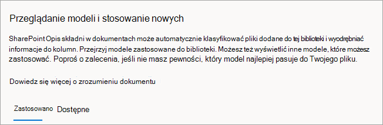
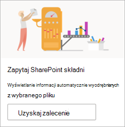

# Publikowanie i odnajdywanie modeli w usłudze Microsoft SharePoint Syntex

Możesz udostępnić wytrenowane modele zrozumienia dokumentów innym osobom do wyświetlania i używania bezpośrednio z biblioteki dokumentów SharePoint. 

Możesz również znaleźć i ocenić wytrenowane modele w innych centrach zawartości, które zostały utworzone przez inne osoby w organizacji. Wybierz model, który jest najbardziej przydatny do klasyfikowania plików lub wyodrębniania z nich określonych informacji. 

> [!NOTE]
> Ta funkcja nie jest jeszcze dostępna dla modeli przetwarzania formularzy.

## Umożliwianie odnajdywania modelu innym osobom

Aby udostępnić wytrenowany model innym osobom do użycia:

1. Na stronie **Modele** dla modelu wybierz pozycję **Ustawienia modelu**.

2. Na panelu **Ustawienia modelu** w sekcji Witryny, w **których ten model jest dostępny** , wybierz pozycję **Edytuj**.

3. W tym momencie panel **Wybierz witryny, w których jest dostępny ten model** , będzie się różnić w zależności od tego, czy jesteś administratorem. 

    Jeśli jesteś administratorem SharePoint, zobaczysz ten widok.

    

    - **Niedostępne w żadnych witrynach** — model nie będzie dostępny dla innych użytkowników.
    - **Wszystkie witryny** — model będzie dostępny w galerii typów zawartości dla innych użytkowników.
    - **Tylko wybrane witryny** — możesz wybrać witrynę lub witryny, w których model będzie dostępny. Kliknij w polu tekstowym, aby wyszukać i wybrać witryny, do których ma zostać zastosowany model. Zobaczysz tylko witryny, do których masz dostęp.

    Jeśli *nie* jesteś administratorem SharePoint, zobaczysz ten widok.

    

    Dostępność można dodawać lub usuwać tylko do określonych witryn, do których masz już dostęp.

4. Wybierz witryny, w których model ma być dostępny dla innych użytkowników, a następnie wybierz pozycję **Zapisz**.

## Odnajdywanie innych wytrenowanych modeli

Aby znaleźć wytrenowane modele, które mogą być odpowiednie dla twojej zawartości:

1. W bibliotece dokumentów dla modelu wybierz pozycję **AutomateView** document understanding models (AutomateView  > **document understanding models).**

2. Na stronie **Przeglądanie modeli i stosowanie nowych** można przejrzeć zastosowane modele i modele, które są dostępne do zastosowania w bibliotece dokumentów.

    

   - Na karcie **Zastosowane** zobacz modele, które zostały zastosowane do biblioteki. Wybierz pozycję **Wyświetl szczegóły modelu** , aby wyświetlić informacje o modelu, takie jak opis, wyodrębniacze i inne ustawienia.
   
   - Na karcie **Dostępne** zobacz wytrenowane modele, które są dostępne do zastosowania w bibliotece.

### Stosowanie wytrenowanego modelu do biblioteki

Możesz ocenić wytrenowane modele pod kątem zawartości, aby ułatwić znalezienie najbardziej odpowiedniego modelu. Aby wybrać model, który chcesz zastosować do biblioteki:

1. Na stronie **Przeglądanie modeli i stosowanie nowych** wybierz kartę **Dostępne** , aby przejrzeć modele z listy.

    

2. Wybierz model, który według Ciebie uzyska najlepsze wyniki, wybierz pozycję **Wyświetl szczegóły modelu**, a następnie wybierz pozycję **Zastosuj do biblioteki**.

### Uzyskiwanie rekomendacji dla wytrenowanego modelu

Jeśli nie masz pewności, który model najlepiej pasuje do twoich plików, możesz poprosić o zalecenie. Rekomendacja może zawierać maksymalnie 10 modeli.

1. Na stronie **Przeglądanie modeli i stosowanie nowych** wybierz kartę **Dostępne** .

2. Na pierwszym kafelku wybierz pozycję **Pobierz zalecenie**.

    

3. Na stronie **Wybieranie co najmniej jednego modelu do analizy** wybierz modele, które według Ciebie mogą być najlepiej dopasowane, a następnie wybierz pozycję **Dalej**.

    

4. Na stronie **Wybierz plik do analizy** wybierz plik tego samego lub podobnego typu, który będzie przechowywany w bibliotece. Następnie wybierz **pozycję Wybierz**.

    

5. Na stronie **Przeglądanie wyników i wybieranie modelu** w obszarze **Nasze zalecenie** zobaczysz zalecany plik. Nie musisz stosować zalecanego modelu. Możesz zastosować inny model, jeśli uważasz, że jest on lepiej dopasowany.

    

6. W przypadku modelu, który według Ciebie uzyska najlepsze wyniki, wybierz pozycję **Wyświetl szczegóły modelu**, a następnie wybierz pozycję **Zastosuj do biblioteki**.

7. Jeśli na podstawie wybranego pliku nie ma zalecanych modeli, możesz wrócić i wybrać inny plik lub wybrać różne modele.

### Usuwanie zastosowanego modelu

Aby usunąć zastosowany model z biblioteki dokumentów:

1. Na stronie **Przeglądanie modeli i stosowanie nowych** na karcie **Zastosowane** zobacz modele, które zostały zastosowane do biblioteki.

2. W modelu, który chcesz usunąć, wybierz pozycję **Wyświetl szczegóły modelu**, a następnie wybierz pozycję **Usuń z biblioteki**.

## Zobacz też

[Stosowanie modelu zrozumienia dokumentu](apply-a-model.md)

[Omówienie opisu dokumentu](document-understanding-overview.md)
