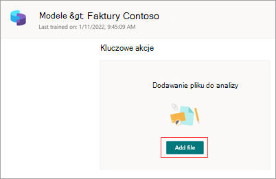

# Wyodrębnij informacje z faktur lub pokwitowania za pomocą modelu wbudowanego w aplikacji Microsoft SharePoint Syntex

Wbudowane modele są wstępnie przeszkolone w zakresie rozpoznawania dokumentów i strukturalnych informacji w dokumentach. Zamiast tworzyć nowy model niestandardowy od podstaw, możesz dodać do istniejącego wstępnie przeszkolonego modelu określone pola, które będą dopasowane do potrzeb Twojej organizacji. 

Obecnie dostępne są dwa wbudowane modele: faktura i potwierdzenie.

- Model *wstępnego zakupu faktury analizuje* i wyodrębnia kluczowe informacje z faktur sprzedaży. Interfejs API analizuje faktury w różnych formatach i [wyodrębnia](/azure/applied-ai-services/form-recognizer/concept-invoice#field-extraction) kluczowe informacje o fakturze, takie jak nazwa klienta, adres na fakturze, termin i należna kwota.

- Wbudowany *model pokwitowania analizuje* i wyodrębnia kluczowe informacje z pokwitowania sprzedaży. Interfejs API analizuje drukowane i napisane odręcznie potwierdzenia oraz [wyodrębnia](/azure/applied-ai-services/form-recognizer/concept-receipt#field-extraction) informacje dotyczące kluczy pokwitowania, takie jak nazwa dostawcy, numer telefonu handlowego, data transakcji, podatek i suma transakcji.

Dodatkowe wbudowane modele będą dostępne w przyszłych wersjach.

## Tworzenie modelu wstępnego

Wykonaj poniższe czynności, aby utworzyć wstępny model klasyfikowania dokumentów w SharePoint Syntex.

1. Na stronie **Modele** wybierz pozycję **Utwórz model**.

     

2. W **panelu Tworzenie** modelu w polu **Nazwa** wpisz nazwę modelu.

     

3. W **sekcji Typ modelu** wybierz jeden ze wstępnie utworzonych modeli:
   - **Wstępne przetwarzanie faktury**
   - **Wstępne przetwarzanie pokwitowania**

   Jeśli chcesz utworzyć tradycyjny, niewyszkolony model rozumienia dokumentu zamiast wstępnie utworzonego modelu, wybierz pozycję Opis **dokumentu niestandardowego**.

4. Jeśli chcesz zmienić typ zawartości lub dodać etykietę przechowywania, wybierz pozycję **Ustawienia zaawansowane**.

    > [!NOTE]
    > Obecnie etykiety wrażliwości nie są dostępne dla wstępnie utworzonych modeli.

5. Wybierz pozycję **Utwórz**. Model zostanie zapisany w **bibliotece Modele** .

## Dodawanie pliku do analizy

1. Na stronie **Modele** w sekcji **Dodawanie** pliku do przeanalizowania wybierz pozycję **Dodaj plik**.

     

2. Na **stronie Pliki do przeanalizowania modelu** wybierz pozycję **Dodaj** , aby znaleźć plik, którego chcesz użyć.

     

3. Na **stronie Dodaj plik ze strony biblioteki plików szkoleniowych** wybierz plik, a następnie wybierz pozycję **Dodaj**.

     

6. Na **stronie Pliki do przeanalizowania modelu** wybierz pozycję **Dalej**.

## Wybieranie wyodrębniaczy do modelu

Na stronie szczegółów wyodrębniającego zobaczysz obszar dokumentu po prawej stronie, a po lewej stronie panel **Wyodrębniacze** . Panel **Wyodrębniacze** zawiera listę wyodrębniaczy zidentyfikowanych w dokumencie.

    

Pola encji wyróżnione kolorem zielonym w obszarze dokumentu to elementy wykryte przez model podczas analizowania pliku. Gdy wybierzesz encję do wyodrębnienia, wyróżnione pole zmieni kolor na niebieski. Jeśli później zdecydujesz się nie uwzględniać encji, wyróżnione pole zmieni kolor na szary. Najważniejsze informacje ułatwiają wyświetlanie bieżącego stanu zaznaczonych wyodrębniaczy.

> [!TIP]
> Możesz użyć kółka przewijania myszy lub kontrolek w dolnej części obszaru dokumentu, aby powiększyć lub pomniejszyć widok zgodnie z potrzebami, aby odczytać pola encji.

### Wybieranie jednostki wyodrębniacej

Możesz wybrać wyodrębnianie z obszaru dokumentu lub z panelu **Extractors** , w zależności od preferencji.
 
- Aby wybrać wyodrębnianie z obszaru dokumentu, wybierz pole encji.

     

- Aby wybrać wyodrębnianie z **panelu Wyodrębniacze** , zaznacz pole wyboru po prawej stronie nazwy jednostki.

     

Po wybraniu wyodrębniatora w obszarze dokumentu jest wyświetlane pole **Select extractor? (Wybierz wyodrębniator** ?). Pole zawiera nazwę wyodrębnianego, oryginalną wartość i opcję wybrania jej jako wyodrębniaka. W przypadku niektórych typów danych, takich jak liczby lub daty, będzie również pokazywana wyodrębniona wartość.

    

Oryginalna wartość jest faktycznie dosyć w dokumencie. Wyodrębniona wartość zostanie wpisana w kolumnie w programie SharePoint. Po zastosowaniu modelu do biblioteki możesz użyć formatowania kolumn, aby określić, jak ma wyglądać w dokumencie.

Kontynuuj wybieranie dodatkowych wyodrębniaczy, których chcesz użyć. Możesz również dodać inne pliki do przeanalizowania w przypadku tej konfiguracji modelu.

## Zmienianie nazwy wyodrębnianego

Możesz zmienić nazwę wyodrębniaczy z strony głównej modelu lub z **panelu Extractors** . Możesz rozważyć zmianę nazw wybranych wyodrębniaczy, ponieważ te nazwy będą używane jako nazwy kolumn po zastosowaniu modelu do biblioteki.

Aby zmienić nazwę wyodrębniaka ze strony głównej modelu:

1. W sekcji **Wyodrębniacze** wybierz wyodrębniator, którego nazwę chcesz zmienić, a następnie wybierz pozycję Zmień **nazwę**.

     

2. W **panelu Zmień nazwę wyodrębniającego** jednostki wprowadź nową nazwę wyodrębniającego, a następnie wybierz pozycję Zmień **nazwę**.

Aby zmienić nazwę wyodrębniaczy z **panelu Extractors** :

1. Wybierz wyodrębnianie, którego nazwę chcesz zmienić, a następnie wybierz pozycję Zmień **nazwę**.

     

2. W polu **Zmień nazwę wyodrębnianego** wprowadź nową nazwę wyodrębnianego, a następnie wybierz pozycję Zmień **nazwę**.

## Stosowanie modelu

- Aby zapisać zmiany i powrócić do strony głównej modelu, na panelu **Extractors** wybierz pozycję **Zapisz i zamknij**.

- Jeśli chcesz zastosować model do biblioteki, w obszarze dokumentu wybierz pozycję **Dalej**. W **panelu Dodaj** do biblioteki wybierz bibliotekę, do której chcesz dodać model, a następnie wybierz pozycję **Dodaj**.

## Zobacz też

[Stosowanie modelu rozumienia dokumentu](apply-a-model.md)