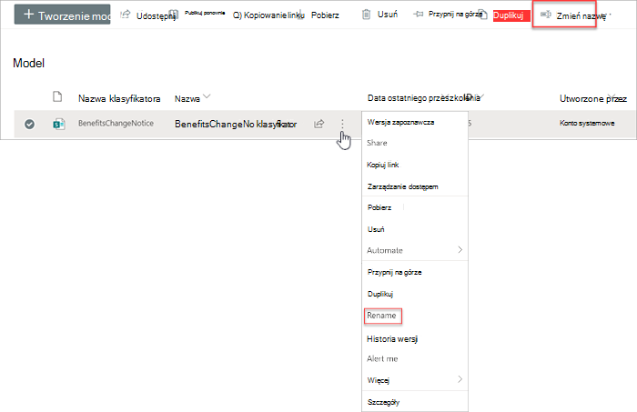

# Zmienianie nazwy modelu w aplikacji Microsoft SharePoint Syntex

W pewnym momencie możesz zechcieć zmienić nazwę modelu rozumienia dokumentu. Przykładem typowego przykładu jest utworzenie początkowej wersji roboczej modelu, która może nie przemyślać ostatecznej nazwy (na przykład można ją nazwać "AlexWilburModel1"). Gdy zbliżysz się do sfinalizowania modelu i wprowadzenia go do użycia, uświadomisz sobie, że bardziej odpowiednia nazwa to "Odnowienie umowy", i chcesz zmienić jego nazwę.  

Innym przykładem jest decyzja organizacji, aby odwołać się do procesu lub typu dokumentu pod inną nazwą. Na przykład po utworzeniu modelu i przygotowaniu się do jego zastosowania organizacja może złożyć na użytkownika upoważnienie do formalnego wykluczeniu wszystkich "umów". W razie potrzeby możesz zmienić nazwę modelu z "Odnowienie kontraktu" na "Odnowienie umowy".

> [!IMPORTANT]
> Nazwę modelu rozumienia dokumentu można zmienić tylko wtedy, gdy nie został on zastosowany do biblioteki dokumentów. 

Zmiana nazwy modelu również [zmienia nazwę typu](/sharepoint/governance/content-type-and-workflow-planning#content-type-overview) zawartości skojarzonego z modelem.

## Zmienianie nazwy modelu

Wykonaj poniższe czynności, aby zmienić nazwę modelu rozumienia dokumentu.

1. W centrum zawartości wybierz pozycję **Modele** , aby wyświetlić listę modeli.

2. Na stronie **Modele** wybierz model, którego nazwę chcesz zmienić.

3. Używając wstążki lub przycisku **Pokaż akcje** (obok nazwy modelu), wybierz pozycję **Zmień nazwę**.  

      

4. W **panelu Zmień nazwę** modelu:

   a. W **obszarze Nowa** nazwa wprowadź nową nazwę modelu, którego nazwę chcesz zmienić. 

      

   b. (Opcjonalnie) W **obszarze Ustawienia zaawansowane** określ, czy chcesz skojarzyć istniejący [typ zawartości](/sharepoint/governance/content-type-and-workflow-planning#content-type-overview). Jeśli wybierzesz **pozycję Użyj istniejącego typu zawartości**, nazwa modelu zostanie zmieniona, aby dopasować go do wybranego typu zawartości.

5. Wybierz **pozycję Zmień nazwę**.

## Zobacz też
[Tworzenie klasyfikatora](create-a-classifier.md)

[Tworzenie wyodrębnianego](create-an-extractor.md)

[Zmienianie nazwy wyodrębnianego](rename-an-extractor.md)

[Omówienie opisów dokumentów](document-understanding-overview.md)

[Typy objaśnień](explanation-types-overview.md)

[Stosowanie modelu](apply-a-model.md) 
