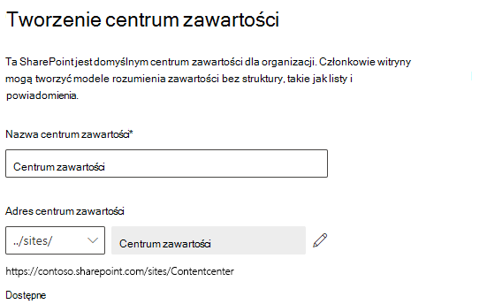

# Konfigurowanie SharePoint Syntex

Administratorzy mogą <a href="https://go.microsoft.com/fwlink/p/?linkid=2024339" target="_blank">skonfigurować centrum administracyjne platformy Microsoft 365</a> [Microsoft SharePoint Syntex](index.md). 

Przed rozpoczęciem należy wziąć pod uwagę następujące kwestie:

- W których SharePoint formularzach zostanie włączyć przetwarzanie formularzy? Wszystkie, niektóre lub wybrane witryny?
- Jak zostanie nazwane domyślne centrum zawartości?

Ustawienia można zmienić po początkowej konfiguracji w <a href="https://go.microsoft.com/fwlink/p/?linkid=2024339" target="_blank">centrum administracyjne platformy Microsoft 365</a>.

Przed rozpoczęciem konfiguracji należy zaplanować najlepszy sposób konfiguracji rozumienia zawartości w środowisku. Na przykład należy podjąć następujące decyzje:

- Witryny SharePoint, w których chcesz włączyć przetwarzanie formularzy — wszystkie, niektóre lub wybrane witryny
- Nazwa i administratorzy Centrum zawartości

## Wymagania 

> [!NOTE]
> Musisz mieć uprawnienia administratora globalnego SharePoint administratora globalnego, aby móc uzyskać dostęp do centrum administracyjne platformy Microsoft 365 i skonfigurować SharePoint Syntex.

Jako administrator możesz również wprowadzać zmiany do wybranych ustawień w dowolnym momencie po zakończeniu konfiguracji oraz w całej zawartości opisowej ustawienia zarządzania w centrum <a href="https://go.microsoft.com/fwlink/p/?linkid=2024339" target="_blank">centrum administracyjne platformy Microsoft 365</a>.

Jeśli planujesz korzystać z niestandardowego środowiska platformy Power Platform, musisz zainstalować w tym środowisku aplikację [*AI Builder*](/power-platform/admin/manage-apps#install-an-app-in-the-environment-view) dla programu Projekt Cortex i przydzielić jej środki na korzystanie z aplikacji [AI Builder](/power-platform/admin/capacity-add-on), aby można było tworzyć modele przetwarzania formularzy.

### Licencjonowanie

Aby można było SharePoint Syntex, organizacja musi mieć subskrypcję usługi SharePoint Syntex, a do każdego użytkownika muszą być przypisane następujące licencje:

- SharePoint Syntex
- SharePoint Syntex — typ spo
- Common Data Service for SharePoint Syntex

Aby korzystać z przetwarzania formularzy, potrzebne są również środki na korzystanie z aplikacji AI Builder. Jeśli masz co najmniej 300 licencjonowanych użytkowników, każdego miesiąca będzie zapewniana alokacja środków w aplikacji AI Builder.

Aby uzyskać szczegółowe informacje SharePoint Syntex licencji, zobacz SharePoint Syntex [licencji](syntex-licensing.md)

## Aby skonfigurować SharePoint Syntex

1. W centrum administracyjne platformy Microsoft 365 wybierz pozycję <a href="https://go.microsoft.com/fwlink/p/?linkid=2171997" target="_blank">**Konfiguracja**</a>, a następnie wyświetl **sekcję Pliki i** zawartość.

2. W sekcji **Pliki i zawartość** wybierz pozycję **Zautomatyzuj zrozumienie zawartości**. Należy pamiętać, że bieżąca dostępność środków na koncie aplikacji AI Builder jest wyświetlana w sekcji **Rzut** oka. 

3. Na stronie **Automatyzowanie zrozumienia zawartości** kliknij pozycję **Wprowadzenie** , aby przejść przez proces konfiguracji.  

    > [!div class="mx-imgBorder"]
    >  

4. Na stronie **Konfigurowanie przetwarzania formularza** możesz wybrać, czy użytkownicy mają mieć możliwość tworzenia modeli przetwarzania formularzy w określonych SharePoint bibliotekach dokumentów. Na wstążce biblioteki dokumentów pojawi się opcja menu Utwórz **model** przetwarzania formularza w SharePoint dokumentów, w których jest włączony.
 
     Dla **opcji SharePoint biblioteki mają być wyświetlane opcje utworzenia modelu przetwarzania** formularzy, możesz wybrać: 
      - **Biblioteki we wszystkich SharePoint w celu** ich udostępnień SharePoint bibliotek w organizacji. 
      - **Biblioteki w wybranych SharePoint**, a następnie wybierz witryny, w których chcesz je udostępnić, lub przekaż listę maksymalnie 50 witryn. 
      - **Nie SharePoint biblioteki** sieci Web, jeśli nie chcesz ich używać w żadnych witrynach (możesz to zmienić po zakończeniu instalacji).

   > [!div class="mx-imgBorder"]
   > 

   > [!Note]
   > Usunięcie witryny po jej dojęniu nie wpływa na istniejące modele zastosowane do bibliotek w tej witrynie ani na możliwość stosowania modeli zrozumienia dokumentów do biblioteki. 
    
    Jeśli skonfigurowano wiele środowisk platformy Power Platform, możesz wybrać środowisko, którego chcesz użyć w przetwarzaniu formularza. (Ta opcja nie będzie wyświetlana, jeśli masz tylko jedno środowisko).

    

    W **przypadku środowiska platformy Power Platform** możesz wybrać:
    - **Użyj środowiska domyślnego,** aby użyć domyślnego środowiska platformy Power.
    - **Używanie środowiska niestandardowego** . Wybierz z listy środowisko, którego chcesz użyć. ([Zobacz wymagania środowiska niestandardowego](/microsoft-365/contentunderstanding/set-up-content-understanding#requirements)).

    Kliknij **Dalej**.

5. Na stronie **Tworzenie centrum zawartości** możesz utworzyć witrynę centrum SharePoint, w której użytkownicy mogą tworzyć modele opisowe dokumentów i zarządzać nimi. Jeśli wcześniej utworzono centrum zawartości w centrum administracyjnym programu SharePoint, informacje te będą wyświetlane w tym miejscu i możesz po prostu wybrać pozycję **Dalej**.

    1. W **witrynie Nazwa** wpisz nazwę, którą chcesz nadać witrynie centrum zawartości.
    
    1. W **polu Adres** witryny będzie pokazywany adres URL witryny w zależności od tego, co wybrano dla nazwy witryny. Jeśli chcesz go zmienić, kliknij pozycję **Edytuj**.

       > [!div class="mx-imgBorder"]
       >  

       Wybierz pozycję **Dalej**.

6. Na stronie **Recenzja i zakończenie** możesz sprawdzić wybrane ustawienie i wybrać opcję zmiany. Jeśli wybrane ustawienia są odpowiednie, wybierz pozycję **Aktywuj**.

7. Na stronie potwierdzenia kliknij pozycję **Gotowe**.

8. Powrócisz do strony opisowej **zawartości w aplikacji Automate** . Na tej stronie możesz wybrać pozycję **Zarządzaj** , aby wprowadzić zmiany w ustawieniach konfiguracji. 

## Przypisywanie licencji

Po skonfigurowaniu SharePoint Syntex musisz przypisać licencje użytkownikom, którzy będą korzystać z SharePoint Syntex funkcji.

Aby przypisać licencje:

1. W centrum administracyjne platformy Microsoft 365 w obszarze **Użytkownicy** wybierz pozycję <a href="https://go.microsoft.com/fwlink/p/?linkid=834822" target="_blank">**Aktywni użytkownicy**</a>.

2. Wybierz użytkowników, do których chcesz uzyskać licencję, a następnie wybierz pozycję **Zarządzaj licencjami produktów**.

3. **Z menu** rozwijanego wybierz pozycję Aplikacje.

4. Wybierz **pozycję Pokaż aplikacje dla SharePoint Syntex**. W **obszarze** Aplikacje upewnij się, że zaznaczono opcję Common **Data Service for SharePoint Syntex**, **SharePoint Syntex** i **SharePoint Syntex — Spo.**

    > [!div class="mx-imgBorder"]
    > 

5. Kliknij przycisk **Zapisz zmiany**.

## Zobacz też

[Omówienie modelu przetwarzania formularzy](/ai-builder/form-processing-model-overview)

[Krok po kroku: jak utworzyć model zrozumienia dokumentu (klip wideo)](https://www.youtube.com/watch?v=DymSHObD-bg)

[Tworzenie środowisk i zarządzanie nimi w centrum administracyjnym platformy Power Platform](/power-platform/admin/create-environment)
