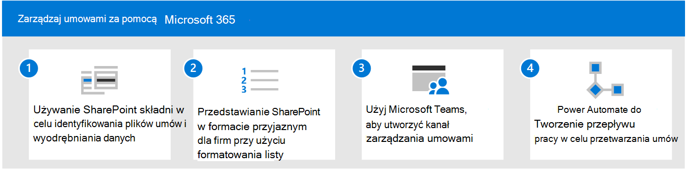
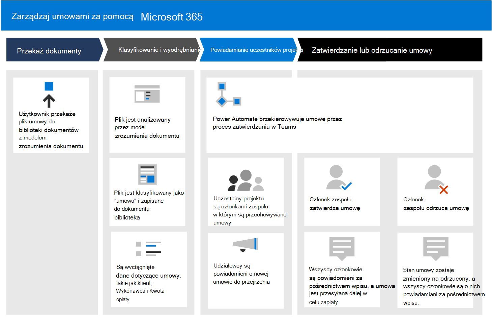
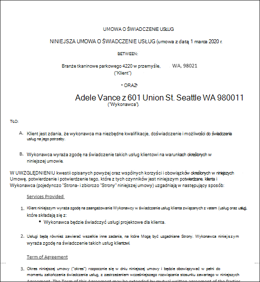

# Zarządzanie umowami przy użyciu Microsoft 365 rozwiązania

W tym artykule opisano, jak utworzyć rozwiązanie do zarządzania umowami dla organizacji przy użyciu SharePoint Syntex składników Microsoft 365. Udostępnia on struktury, które ułatwiają planowanie i tworzenie rozwiązania dopasowanego do Twoich unikatowych potrzeb biznesowych. Mimo że to rozwiązanie zawiera informacje dotyczące zarządzania umowami, można je dostosować w celu utworzenia innych rozwiązań do zarządzania dokumentami, na przykład w przypadku deklaracji pracy lub faktur.

 

> [!VIDEO https://www.microsoft.com/videoplayer/embed/RWJUR0]

 

## Identyfikowanie problemu biznesowego

Pierwszym krokiem podczas planowania systemu zarządzania umowami jest zrozumienie problemu, który próbujesz rozwiązać. W przypadku tego rozwiązania należy rozwiązać cztery kluczowe problemy:

- **Identyfikowanie umów**. Twoja organizacja pracuje nad wieloma dokumentami, takimi jak faktury, umowy, oświadczenia o pracy itp.  Niektóre z nich są zasobami cyfrowymi wysyłanymi pocztą e-mail, a inne są papierami wysyłanymi za pośrednictwem tradycyjnej poczty. Potrzebujesz sposobu identyfikowania wszystkich kontraktów klientów ze wszystkich innych dokumentów, a następnie klasyfikowania ich jako takich.

- **Śledzenie historii zatwierdzeń kontraktu**. Twoja organizacja potrzebuje niezawodnego sposobu na znalezienie, czy umowy zostały zatwierdzone lub odrzucone, oraz czy płatność została przetworzone. 

- **Witryna do zarządzania zatwierdzeniami kontraktu**. Twoja organizacja musi skonfigurować witrynę współpracy, w której wszyscy wymagani uczestnicy projektu mogą łatwo przeglądać umowy. W razie potrzeby udziałowcy powinni mieć możliwość przejrzenia całej umowy, ale przede wszystkim powinni mieć możliwość zobaczenia kilku kluczowych pól z każdej umowy (na przykład nazwy klienta, numeru zamówienia zakupu i kosztu całkowitego). Udziałowcy powinni mieć możliwość łatwego zatwierdzania lub odrzucania przychodzących umów.

- **Trasa przejechanych umów**. Zatwierdzone i odrzucone umowy muszą być kierowane za pośrednictwem określonego przepływu pracy. Zatwierdzone umowy muszą być kierowane do aplikacji innej firmy w celu przetworzenia płatności. Odrzucone umowy należy rozsyłać w celu ich dodatkowego przejrzenia.

## Omówienie rozwiązania

  

Wskazówki dotyczące rozwiązania do zarządzania umowami obejmują cztery składniki Microsoft 365:

- **Microsoft SharePoint Syntex**: Twórz modele w celu identyfikowania i klasyfikowania plików kontraktu, a następnie wyodrębniaj z nich odpowiednie dane.

- **Listy SharePoint firmy Microsoft**: Użyj formatowania dostępnego na SharePoint listach kontaktów, aby przedstawić umowy w formacie przyjaznym dla firmy.

- **Microsoft Teams**: Korzystanie z funkcji kanału Teams skojarzonych kart, aby umożliwić uczestnikom projektu przeglądanie umów i zarządzanie nimi.

- **Power Automate**: Przepływy mogą być w trakcie procesu zatwierdzania umów, a następnie do składania wniosków o płatność przez osoby trzecie.

### Jak to wszystko działa

  

1. Dokumenty są przekazywane do SharePoint dokumentów. Do biblioteki SharePoint Syntex zastosowano nowy model rozumienia dokumentu. Sprawdza on każdy plik w celu sprawdzenia, czy zawartość jest w nim dosyć dopasowana do typu zawartości "umowa", który jest przeszkolony w zakresie wyszukiwania. Jeśli znajdzie dopasowanie, klasyfikuje plik jako "umowę" i aktualizuje typ zawartości dokumentu.

2. W modelu są też pobierane określone dane z każdego pliku umowy, które interesują uczestników projektu, takie jak *klient, wykonawca* i *kwota opłaty*. 

    Na poniższej stronie przedstawiono przykład umowy, która jest przeszkolona w zakresie identyfikowania modelu.

      

3. W Microsoft Teams projektu wszyscy uczestnicy projektu są członkami bezpiecznego kanału Teams, w którym wszystkie umowy zawarte w bibliotece dokumentów są widoczne w przypadku zatwierdzenia lub odrzucenia. Dzięki Teams funkcji wszyscy uczestnicy projektu są powiadamiani, gdy trzeba sprawdzić nowe umowy.

4. Przy użyciu Power Automate umowy są przenoszone w ramach procesu zatwierdzania w Teams kanale. Gdy członek zatwierdzi umowę, stan umowy zmienia się w celu zatwierdzenia, wszyscy członkowie są powiadomieni za pomocą wpisu w układzie Teams i jest tworzona pozycja, aby pokazać, że umowa jest gotowa do wypłaty. Ten proces można rozszerzyć, aby można było pisać bezpośrednio do innej aplikacji finansowej dla płatności.

5. Gdy członek odrzuci umowę, status zostaje zmieniony na odrzucony, a wszyscy członkowie są o tym powiadamiani za pośrednictwem Teams wpisu.

6. Wynikiem tego rozwiązania jest zautomatyzowany proces biznesowy dla Twojej organizacji. Pracownicy mogą łatwo używać niestandardowego widoku kafelków w Teams inicjować i monitorować przepływ pracy zatwierdzania dokumentów. 

     

### Wymagania dotyczące licencjonowania

To rozwiązanie korzysta z następujących funkcji, dostępnych w ramach licencji Microsoft 365 Enterprise (E1, E3, E5, F3) lub Business (Podstawowa, Standardowa Premium):

- Microsoft SharePoint Syntex
- Microsoft Teams
- Power Automate

### Dowiedz się, jak używać SharePoint Syntex

Nie chcesz SharePoint Syntex? Dowiedz się, jak za SharePoint Syntex zarządzać zawartością przy użyciu sieci AI.

Ścieżka ["Wprowadzenie do SharePoint Syntex](/learn/paths/syntex-get-started)" zawiera wiedzę na temat korzystania z modeli przetwarzania i zrozumienia dokumentów w celu klasyfikowania dokumentów, wyodrębniania tekstu i oznaczania dokumentów w celu szybkiego i łatwego zarządzania wiedzą.

## Tworzenie rozwiązania

W następnych sekcjach opisano szczegółowo sposób konfigurowania rozwiązania do zarządzania umowami. Jest on podzielony na trzy kroki:

- [Krok 1. Identyfikowanie plików SharePoint Syntex wyodrębnianie danych przy użyciu funkcji podpisów](solution-manage-contracts-step1.md)
- [Krok 2. Użyj Microsoft Teams, aby utworzyć kanał zarządzania umowami](solution-manage-contracts-step2.md)
- [Krok 3. Przy Power Automate tworzenia przepływu pracy w celu przetwarzania umów](solution-manage-contracts-step3.md)
