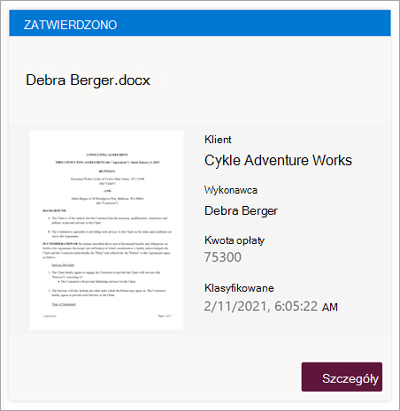

# <a name="step-2-use-microsoft-teams-to-create-your-contract-management-channel"></a>Krok nr 2. Tworzenie kanału zarządzania kontraktami przy użyciu Microsoft Teams

Podczas konfigurowania rozwiązania do zarządzania kontraktami w organizacji potrzebna jest centralna lokalizacja, w której osoby biorące udział w projekcie mogą przeglądać kontrakty i zarządzać nimi. W tym celu możesz użyć [Microsoft Teams](/microsoftteams/), aby skonfigurować kanał Teams i użyć funkcji w Teams:

- **Utwórz lokalizację dla osób biorących udział w projekcie, aby łatwo wyświetlić wszystkie kontrakty wymagające akcji.** Na przykład w Teams można utworzyć kartę **Kontrakty** w kanale Zarządzanie kontraktami, w której członkowie mogą zobaczyć przydatny widok kafelka dla wszystkich kontraktów, które wymagają zatwierdzenia. Można również skonfigurować widok tak, aby każda "karta" wyświetlała ważne dane, na przykład *Klient*, *Wykonawca* i *Kwota opłaty*.

     

- **Mieć lokalizację, w przypadku których członkowie mogą wchodzić ze sobą w interakcje i wyświetlać ważne zdarzenia.** Na przykład w Teams karta **Wpisy** może służyć do konwersacji, pobierania aktualizacji i przeglądania akcji (takich jak członek odrzucający kontrakt). Gdy coś się stało (na przykład nowa umowa przesłana do zatwierdzenia), karta **Wpisy** może służyć nie tylko do jej ogłaszania, ale także do prowadzenia rejestru. A jeśli członkowie subskrybują powiadomienia, będą otrzymywać powiadomienia za każdym razem, gdy nastąpi aktualizacja.

     

- **Mieć lokalizację dla członków, aby zobaczyć zatwierdzone umowy, aby wiedzieć, kiedy mogą być przesyłane do płatności.** W SharePoint musisz utworzyć listę **For Payout** i uwzględnić kolumny **Dla klienta**, **wykonawcy** i **kwoty opłaty**, wybierając pozycję **Pojedynczy wiersz tekstu** jako typ kolumny. Musisz dodać listę **For Payout (Dla wypłat**) jako kartę Teams w kanale Zarządzanie kontraktami, podobnie jak w przypadku [karty **Kontrakty**](solution-manage-contracts-step2.md#attach-your-sharepoint-document-library-to-the-contracts-tab). Na karcie **Wypłaty** zostaną wyświetlone wszystkie umowy, które będą musiały zostać przesłane do płatności. To rozwiązanie można łatwo rozszerzyć, aby zamiast tego zapisywać te informacje bezpośrednio w aplikacji finansowej innej firmy (na przykład Dynamics CRM). 


## <a name="attach-your-sharepoint-document-library-to-the-contracts-tab"></a>Dołącz bibliotekę dokumentów SharePoint do karty Kontrakty

Po utworzeniu karty **Kontrakty** w kanale Zarządzanie kontraktami należy [do niego dołączyć bibliotekę dokumentów SharePoint](https://support.microsoft.com/office/add-a-sharepoint-page-list-or-document-library-as-a-tab-in-teams-131edef1-455f-4c67-a8ce-efa2ebf25f0b). Biblioteka dokumentów SharePoint, do której chcesz dołączyć, jest biblioteką, do której zastosowaliśmy model zrozumienia dokumentów SharePoint Syntex w poprzedniej sekcji.

Po dołączeniu biblioteki dokumentów SharePoint będzie można wyświetlić wszystkie niejawne kontrakty za pośrednictwem domyślnego widoku listy.

   

## <a name="customize-your-contracts-tab-tile-view"></a>Dostosowywanie widoku kafelka karty Kontrakty

> [!NOTE]
> W tej sekcji odwołują się do przykładów kodu zawartych w pliku [ContractTileFormatting.json](https://github.com/pnp/syntex-samples/blob/main/scenario%20samples/Contracts%20Management/View%20Formatter/ContractTileFormatting.json) , który znajduje się w [repozytorium Zasobów rozwiązania do zarządzania kontraktami](https://github.com/pnp/syntex-samples/tree/main/scenario%20samples/Contracts%20Management).

Chociaż Teams umożliwia wyświetlanie kontraktów w widoku kafelka, warto je dostosować, aby wyświetlić dane kontraktu, które mają być widoczne na karcie kontraktu. Na przykład na **karcie Kontrakty** ważne jest, aby członkowie widzieli klienta, wykonawcę i kwotę opłaty na karcie umowy. Wszystkie te pola zostały wyodrębnione z każdego kontraktu za pośrednictwem modelu SharePoint Syntex, który został zastosowany do biblioteki dokumentów. Chcesz również mieć możliwość zmiany paska nagłówka kafelka na różne kolory dla każdego stanu, aby członkowie mogli łatwo zobaczyć, gdzie kontrakt znajduje się w procesie zatwierdzania. Na przykład wszystkie zatwierdzone kontrakty będą miały niebieski pasek nagłówka.

   

Niestandardowy widok kafelka, którego używasz, wymaga wprowadzenia zmian w pliku JSON używanym do formatowania bieżącego widoku kafelka. Możesz odwołać się do pliku JSON użytego do utworzenia widoku karty, przeglądając plik [ContractTileFormatting.json](https://github.com/pnp/syntex-samples/blob/main/scenario%20samples/Contracts%20Management/View%20Formatter/ContractTileFormatting.json) . W poniższych sekcjach zostaną wyświetlone konkretne sekcje kodu dla funkcji znajdujących się na kartach kontraktów.

Jeśli chcesz wyświetlić lub wprowadzić zmiany w kodzie JSON widoku w kanale Teams, w kanale Teams wybierz menu rozwijane widok, a następnie wybierz pozycję **Formatuj bieżący widok**.

   

## <a name="card-size-and-shape"></a>Rozmiar i kształt karty

W pliku [ContractTileFormatting.json](https://github.com/pnp/syntex-samples/blob/main/scenario%20samples/Contracts%20Management/View%20Formatter/ContractTileFormatting.json) zapoznaj się z następującą sekcją, aby zobaczyć kod formatowania rozmiaru i kształtu karty.

```JSON
                  {
                    "elmType": "div",
                    "style": {
                      "background-color": "#f5f5f5",
                      "padding": "5px",
                      "width": "180px"
                    },
                    "children": [
                      {
                        "elmType": "img",
                        "attributes": {
                          "src": "@thumbnail.large"
                        },
                        "style": {
                          "width": "185px",
                          "height": "248px"
                        }
                      }
```

## <a name="contract-status"></a>Stan kontraktu

Poniższy kod umożliwia zdefiniowanie stanu każdej karty tytułu. Należy pamiętać, że każda wartość stanu (*New*, *In review*, *Approved*, and *Rejected*) będzie wyświetlać inny kod koloru dla każdego z nich. W pliku [ContractTileFormatting.json](https://github.com/pnp/syntex-samples/blob/main/scenario%20samples/Contracts%20Management/View%20Formatter/ContractTileFormatting.json) zapoznaj się z sekcją definiującą stan.

```JSON
          {
            "elmType": "div",
            "children": [
              {
                "elmType": "div",
                "style": {
                  "color": "white",
                  "background-color": "=if([$Status] == 'New', '#00b7c3', if([$Status] == 'In review', '#ffaa44', if([$Status] == 'Approved', '#0078d4', if([$Status] == 'Rejected', '#d13438', '#8378de'))))",
                  "padding": "5px 15px",
                  "height": "auto",
                  "text-transform": "uppercase",
                  "font-size": "12.5px"
                },
                "txtContent": "[$Status]"
              }
```

## <a name="extracted-fields"></a>Wyodrębnione pola

Na każdej karcie kontraktu zostaną wyświetlone trzy pola wyodrębnione dla każdej umowy (*Klient*, *Wykonawca* i *Kwota opłaty*). Ponadto chcesz również wyświetlić godzinę/datę sklasyfikowania pliku przez model SharePoint Syntex używany do jego identyfikacji.

W pliku [ContractTileFormatting.json](https://github.com/pnp/syntex-samples/blob/main/scenario%20samples/Contracts%20Management/View%20Formatter/ContractTileFormatting.json) poniższe sekcje definiują każdą z nich.

### <a name="client"></a>Klient

W tej sekcji zdefiniowano sposób wyświetlania elementu "Klient" na karcie i użyto wartości dla określonego kontraktu.

```JSON
                      {
                        "elmType": "div",
                        "style": {
                          "color": "#767676",
                          "font-size": "12px"
                        },
                        "txtContent": "Client"
                      },
                      {
                        "elmType": "div",
                        "style": {
                          "margin-bottom": "12px",
                          "font-size": "16px",
                          "font-weight": "600"
                        },
                        "txtContent": "[$Client]"
                      },
```

### <a name="contractor"></a>Wykonawca

W tej sekcji zdefiniowano sposób wyświetlania elementu "Wykonawca" na karcie i użyto wartości dla określonej umowy.

```JSON
                        {
                          "elmType": "div",
                          "txtContent": "Contractor",
                          "style": {
                            "color": "#767676",
                            "font-size": "12px",
                            "margin-bottom": "2px"
                          }
                        },
                        {
                          "elmType": "div",
                          "style": {
                            "margin-bottom": "12px",
                            "font-size": "14px"
                          },
                          "txtContent": "[$Contractor]"
                        },
```

### <a name="fee-amount"></a>Kwota opłaty

W tej sekcji zdefiniowano sposób wyświetlania "Kwoty opłaty" na karcie i użyto wartości dla określonej umowy.

```JSON
                      {
                        "elmType": "div",
                        "txtContent": "Fee amount",
                        "style": {
                          "color": "#767676",
                          "font-size": "12px",
                          "margin-bottom": "2px"
                        }
                      },
                      {
                        "elmType": "div",
                        "style": {
                          "margin-bottom": "12px",
                          "font-size": "14px"
                        },
                        "txtContent": "[$FeeAmount]"
                      },
```

### <a name="classification-date"></a>Data klasyfikacji

W tej sekcji zdefiniowano sposób wyświetlania "Klasyfikacja" na karcie i użyto wartości dla konkretnego kontraktu.

```JSON
                      {
                        "elmType": "div",
                        "txtContent": "Classified",
                        "style": {
                          "color": "#767676",
                          "font-size": "12px",
                          "margin-bottom": "2px"
                        }
                      },
                      {
                        "elmType": "div",
                        "style": {
                          "margin-bottom": "12px",
                          "font-size": "14px"
                        },
                        "txtContent": "[$PrimeLastClassified]"
                      }
```

## <a name="next-step"></a>Następny krok

[Krok 3. Tworzenie przepływu do przetwarzania kontraktów przy użyciu Power Automate](solution-manage-contracts-step3.md)
