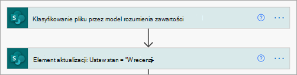
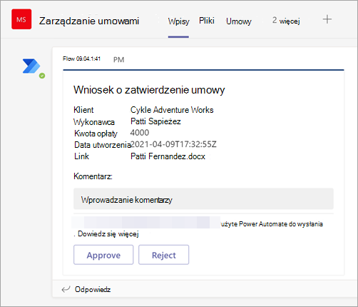
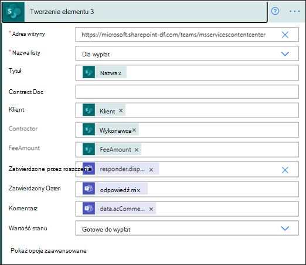

# <a name="step-3-use-power-automate-to-create-the-flow-to-process-your-contracts"></a>Krok nr 3. Przy Power Automate tworzenia przepływu pracy w celu przetwarzania umów

Utworzono kanał zarządzania umowami i dołączono SharePoint dokumentów. Następnym krokiem jest utworzenie przepływu Power Automate przetwarzania umów, które twój SharePoint Syntex identyfikowany i klasyfikuje. Ten krok można wykonać, [tworząc przepływ Power Automate dokumentów w SharePoint dokumentów](https://support.microsoft.com/office/create-a-flow-for-a-list-or-library-in-sharepoint-or-onedrive-a9c3e03b-0654-46af-a254-20252e580d01).

W przypadku rozwiązania do zarządzania umowami chcesz utworzyć przepływ Power Automate w celu:

-  Po klasyfikowaniu umowy przez Twój SharePoint Syntex zmień stan umowy na **W przeglądzie**.
- Umowa jest sprawdzana i zostaje zatwierdzona lub odrzucona.
- W przypadku zatwierdzonych umów informacje o umowie są publikowane na karcie przetwarzania płatności.
- W przypadku odrzuconych umów zespół jest powiadamiany o dalszej analizie. 

Na poniższym diagramie przedstawiono przepływ Power Automate rozwiązania do zarządzania umowami.


## <a name="prepare-your-contract-for-review"></a>Przygotowywanie umowy do przeglądu

Gdy umowa zostanie zidentyfikowana i sklasyfikowana przez SharePoint Syntex zrozumienia dokumentu, przepływ Power Automate najpierw zmieni stan na **W przeglądzie**.



Po wyencjonowyniu pliku zmień wartość stanu na **W trakcie sprawdzania**.


Następnym krokiem jest utworzenie adaptacyjnej karty informujący, że umowa oczekuje na sprawdzenie i opublikowanie jej w kanale Zarządzanie umowami.




Poniższy kod to JSON użyty w tym kroku w przepływie Power Automate danych.

```JSON
{
"$schema": "http://adaptivecards.io/schemas/adaptive-card.json",
"type": "AdaptiveCard",
"version": "1.0",
"body": [
    {
    "type": "TextBlock",
    "text": "Contract approval request",
    "size": "large",
    "weight": "bolder",
     "wrap": true
    },
        {
            "type": "Container",
            "items": [
                {
                    "type": "FactSet",
                    "spacing": "Large",
                    "facts": [
                        {
                            "title": "Client",
                            "value": "@{triggerOutputs()?['body/Client']}"
                        },
                        {
                            "title": "Contractor",
                            "value": "@{triggerOutputs()?['body/Contractor']}"
                        },
                        {
                            "title": "Fee amount",
                            "value": "@{triggerOutputs()?['body/FeeAmount']}"
                        },
                        {
                            "title": "Date created",
                            "value": "@{triggerOutputs()?['body/Modified']} "
                        },
                        {
                            "title": "Link",
                            "value": "[@{triggerOutputs()?['body/{FilenameWithExtension}']}](@{triggerOutputs()?['body/{Link}']})"
                        }
                    ]
                }
            ]
         },
    {
    "type": "TextBlock",
    "text": "Comment:"
    },
        {
            "type": "Input.Text",
            "placeholder": "Enter comments",
            "id": "acComments"
        }
],
"actions": [
    {
    "type": "Action.Submit",
    "title": "Approve",
    "data": {
        "x": "Approve"
    }
    },
    {
    "type": "Action.Submit",
    "title": "Reject",
    "data": {
        "x": "Reject"
    }
    }
]
}
```


## <a name="conditional-context"></a>Kontekst warunkowy

Następnie w przepływie musisz utworzyć warunek, w którym Twoja umowa zostanie zatwierdzona lub [odrzucona](#if-the-contract-is-rejected).[](#if-the-contract-is-approved)


## <a name="if-the-contract-is-approved"></a>Jeśli umowa została zatwierdzona

Po zatwierdzeniu umowy występują następujące zdarzenia:

- Na karcie **Umowy** stan na karcie umowa zmieni się **na Zatwierdzony.**

   

- W twoim przepływie stan zmienia się na **Zatwierdzony**.

   

- W przypadku tego rozwiązania dane dotyczące umowy zostaną dodane do karty **Wypłaty** , aby można było zarządzać wypłatami. Ten proces można rozszerzyć, aby umożliwić przepływowi przesyłanie kontraktów na płatności przez aplikację finansową innej firmy (na przykład Dynamics CRM).

   

- W przepływie możesz utworzyć następujący element, aby przenieść zatwierdzone umowy na **kartę Wypłaty** .

   

    Aby uzyskać wyrażenia dla potrzebnych informacji z Teams danych, użyj wartości pokazanych w poniższej tabeli.
 
    |Name (Nazwa)     |Expression |
    |---------|-----------|
    | Stan zatwierdzenia  | body('Post_an_Adaptive_Card_to_a_Teams_channel_and_wait_for_a_response')? ['submitActionId']         |
    | Zatwierdzone przez     | body('Post_an_Adaptive_Card_to_a_Teams_channel_and_wait_for_a_response')? ['odpowiadanie'] ['nazwa_wyświetlana']        |
    | Data zatwierdzenia     | body('Post_an_Adaptive_Card_to_a_Teams_channel_and_wait_for_a_response')? ['czas odpowiedzi']         |
    | Komentowanie     | body('Post_an_Adaptive_Card_to_a_Teams_channel_and_wait_for_a_response')? ['dane']? ['acComments']         |
    
    W poniższym przykładzie pokazano, jak za pomocą pola formuły Power Automate napisać wyrażenie.

       

- Adaptacyjna karta z informacją, że zatwierdzono umowę, jest tworzona i publikowana w kanale zarządzania umowami.

   

   


   Poniższy kod to JSON użyty w tym kroku w przepływie Power Automate danych.

```JSON
{ 
    "type": "AdaptiveCard",
    "body": [
        {
            "type": "Container",
            "style": "emphasis",
            "items": [
                {
                    "type": "ColumnSet",
                    "columns": [
                        {
                            "type": "Column",
                            "items": [
                                {
                                    "type": "TextBlock",
                                    "size": "Large",
                                    "weight": "Bolder",
                                    "text": "CONTRACT APPROVED"
                                }
                            ],
                            "width": "stretch"
                        }
                    ]
                }
            ],
            "bleed": true
        },
        {
            "type": "Container",
            "items": [
                {
                    "type": "FactSet",
                    "spacing": "Large",
                    "facts": [
                        {
                            "title": "Client",
                            "value": "@{triggerOutputs()?['body/Client']}"
                        },
                        {
                            "title": "Contractor",
                            "value": "@{triggerOutputs()?['body/Contractor']}"
                        },
                        {
                            "title": "Fee amount",
                            "value": "@{triggerOutputs()?['body/FeeAmount']}"
                        },
                        {
                            "title": "Approval by",
                            "value": "@{body('Post_an_Adaptive_Card_to_a_Teams_channel_and_wait_for_a_response')?['responder']['displayName']}"
                        },
                        {
                            "title": "Approved date",
                            "value": "@{body('Post_an_Adaptive_Card_to_a_Teams_channel_and_wait_for_a_response')?['responseTime']}"
                        },
                        {
                            "title": "Approval comment",
                            "value": "@{body('Post_an_Adaptive_Card_to_a_Teams_channel_and_wait_for_a_response')?['data']?['acComments']}"
                        },
                        {
                            "title": " ",
                            "value": " "
                        },
                        {
                            "title": "Status",
                            "value": "Ready for payout"
                        }
                    ]
                }
            ]
        }
    ],
    "$schema": "http://adaptivecards.io/schemas/adaptive-card.json",
    "version": "1.2",
    "fallbackText": "This card requires Adaptive Cards v1.2 support to be rendered properly."
}
```

## <a name="if-the-contract-is-rejected"></a>Jeśli umowa zostanie odrzucona

Po odrzuceniu umowy występują następujące zdarzenia:

- Na karcie **Umowy** stan na karcie umowa zmieni się na **Odrzucone**.

   

- W przepływie możesz wyewidencjonać plik umowy, zmienić stan na **Odrzucony**, a następnie zaewidencjonać plik z powrotem.

   

- W przepływie tworzysz kartę adaptacyjną z informacją, że umowa została odrzucona.

   

Poniższy kod to JSON użyty w tym kroku w przepływie Power Automate danych.

```JSON
{ 
    "type": "AdaptiveCard",
    "body": [
        {
            "type": "Container",
            "style": "attention",
            "items": [
                {
                    "type": "ColumnSet",
                    "columns": [
                        {
                            "type": "Column",
                            "items": [
                                {
                                    "type": "TextBlock",
                                    "size": "Large",
                                    "weight": "Bolder",
                                    "text": "CONTRACT REJECTED"
                                }
                            ],
                            "width": "stretch"
                        }
                    ]
                }
            ],
            "bleed": true
        },
        {
            "type": "Container",
            "items": [
                {
                    "type": "FactSet",
                    "spacing": "Large",
                    "facts": [
                        {
                            "title": "Client",
                            "value": "@{triggerOutputs()?['body/Client']}"
                        },
                        {
                            "title": "Contractor",
                            "value": "@{triggerOutputs()?['body/Contractor']}"
                        },
                        {
                            "title": "Fee amount",
                            "value": "@{triggerOutputs()?['body/FeeAmount']}"
                        },
                        {
                            "title": "Rejected by",
                            "value": "@{body('Post_an_Adaptive_Card_to_a_Teams_channel_and_wait_for_a_response')?['responder']['displayName']}"
                        },
                        {
                            "title": "Rejected date",
                            "value": "@{body('Post_an_Adaptive_Card_to_a_Teams_channel_and_wait_for_a_response')?['responseTime']}"
                        },
                        {
                            "title": "Comment",
                            "value": "@{body('Post_an_Adaptive_Card_to_a_Teams_channel_and_wait_for_a_response')?['data']?['acComments']}"
                        },
                        {
                            "title": " ",
                            "value": " "
                        },
                        {
                            "title": "Status",
                            "value": "Needs review"
                        }
                    ]
                }
            ]
        }
    ],
    "$schema": "http://adaptivecards.io/schemas/adaptive-card.json",
    "version": "1.2",
    "fallbackText": "This card requires Adaptive Cards v1.2 support to be rendered properly."
}
```

- Karta zostanie opublikowana w kanale Zarządzanie umowami.

   
