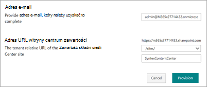

# Używanie szablonu witryny Centrum zawartości dla aplikacji Microsoft SharePoint Syntex

Witryna SharePoint Syntex zawartości jest gotowym do wdrożenia szablonem witryny SharePoint instruktażowym, który pomaga lepiej zrozumieć SharePoint Syntex możliwości.

Zostaną wprowadzone narzędzia i informacje potrzebne do utworzenia i przeszkolinia własnych modeli. Następnie będzie można używać tej witryny jako centralnego repozytorium zawartości lub jako centrum sterowania do zarządzania własnymi SharePoint Syntex modelami.

W tej witrynie modele można przeszkolić i ocenić przy użyciu własnej zawartości. Jednak aby zastosować modele do bibliotek, wymagana SharePoint Syntex licencji.  

## Inicjowanie obsługi administracyjnej witryny

Witrynę Centrum zawartości można zapewniać za pomocą [SharePoint książki adresowej](https://lookbook.microsoft.com/).

> [!NOTE]
> Aby aprowizować witrynę, SharePoint administrator globalny Microsoft 365 administratorem globalnym.

1. Na stronie głównej książki [SharePoint w](https://lookbook.microsoft.com/) **menu**  >  Wyświetl projekty wybierz pozycję SharePoint Syntex **SharePoint Syntex Zawartości**.

2. Na stronie **Centrum zawartości** wybierz pozycję **Dodaj do dzierżawy**.

    

3. Wprowadź swój adres e-mail (w celu powiadomienia o tym, kiedy witryna będzie gotowa do użycia), adres URL witryny, którego chcesz użyć, oraz tytuł, którego chcesz użyć dla witryny. 

    

4. Wybierz **pozycję Inicjowanie** obsługi administracyjnej i w krótkim czasie Twoja witryna będzie gotowa do użycia. Otrzymasz wiadomość e-mail (wysłaną na podany przez Ciebie adres e-mail) z informacją o ukończeniu żądania obsługi szablonu witryny Centrum zawartości.

5. Wybierz **pozycję Otwórz** witrynę, aby wyświetlić witrynę Centrum zawartości. Tutaj możesz eksplorować witrynę i dowiedzieć się więcej o jej SharePoint Syntex. 

Aby uzyskać więcej informacji na temat inicjowania obsługi z SharePoint książki adresowej, zobacz [Zapewnianie nowych ścieżek edukacyjnych](/office365/customlearning/custom_provision).

## Poznawanie witryny

Witryna Centrum zawartości zawiera wstępnie wypełnione strony, które zawierają instrukcje rozpoczynania korzystania SharePoint Syntex w organizacji. 

### Wprowadzenie do SharePoint Syntex

Uzyskaj wprowadzenie do programu SharePoint Syntex i dowiedz się, jak używać go w swojej organizacji. Obejrzyj klip wideo, który zawiera omówienie SharePoint Syntex i znajdź szkolenia, które pomogą Ci rozpocząć pracę.

### Informacje o typach modeli

Poznaj trzy typy modeli i dowiedz się, jak za ich pomocą rozwiązywać problemy biznesowe związane z wyszukiwaniem, procesami biznesowymi, zgodnością i nie tylko.

### Skorzystaj z interakcyjnego przewodnika, aby utworzyć model

Zobacz, jak utworzyć model dokumentu opisowy w bibliotece modeli, a następnie włączyć wstępnie przeszkolony model przykładowy.

### SharePoint Syntex w sześciu prostych krokach

Rozpocznij od centrum zawartości, a następnie dowiedz się, jak tworzyć modele do identyfikowania, klasyfikowania i wyodrębniania potrzebnych informacji.

### Usprawnianie codziennych procesów i zadań

Dowiedz się, jak używać SharePoint Syntex ręcznego i jak przekształcić je w coś zautomatyzowanego i usprawnionego dla organizacji.

### Zarządzanie zgodnością

Wdrożenie kroków w celu zmniejszenia ryzyka i zapewnienia, że przechwycone dane i informacje w Twojej organizacji będą używane w bezpieczny i przemyślany sposób.

### Wyświetl aktywność modelu

Zobacz, jak zawartość jest używana do ilustrować aktywność modelu i dostarczać więcej informacji na temat sposobu, w jaki są używane Twoje modele.

### Znajdowanie dodatkowych zasobów

Poznaj dodatkowe zasoby i scenariusze, które pomogą Ci dowiedzieć się więcej o SharePoint Syntex.

