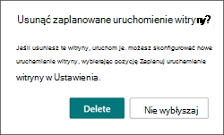

# <a name="launch-your-portal-using-the-sharepoint-portal-launch-scheduler"></a>Uruchamianie portalu przy użyciu narzędzia do SharePoint uruchamiania portalu sieciOwego

Portal to witryna do komunikacji programu SharePoint w intranecie o dużym ruchu — witryna, która w ciągu kilku tygodni ma od 10 000 do ponad 100 000 osób. Uruchom portal za pomocą harmonogramu uruchamiania portalu, aby zapewnić użytkownikom dostęp do nowego portalu w SharePoint przeglądania.
<br>
<br>
Harmonogram uruchamiania portalu ma na celu pomoc w realizacji etapowego etapu realizacji przez grupowanie osób przeglądjących w etapach i zarządzanie przekierowywaniem adresu URL do nowego portalu. Podczas rozpoczynania każdej z tych czynności możesz zebrać opinie użytkowników, monitorować wydajność portalu i wstrzymać uruchamianie w celu rozwiązania problemów przed kolejnym krokiem. Dowiedz się więcej na [temat planowania uruchomienia portalu w SharePoint](/microsoft-365/Enterprise/Planportallaunchroll-out).

**Istnieją dwa typy przekierowywania:**

- **Dwukierunkowe**: uruchom nowy nowoczesny portal SharePoint, aby zastąpić istniejący SharePoint klasyczny lub nowoczesny portal
- **Przekierowywanie do strony tymczasowej**: uruchom nowy nowoczesny SharePoint portalu bez istniejącego SharePoint sieci web

Uprawnienia witryny należy skonfigurować osobno od fal w ramach uruchamiania. Jeśli na przykład publikujesz portal dla całej organizacji, możesz ustawić uprawnienia na "Wszyscy oprócz użytkowników zewnętrznych", a następnie rozdzielić użytkowników na grupy zabezpieczeń. Dodanie grupy zabezpieczeń do grupy zabezpieczeń nie daje tej grupie zabezpieczeń dostępu do witryny.

> [!NOTE]
>
> - Ta funkcja będzie dostępna z panelu  Ustawienia na stronie głównej witryny SharePoint do komunikacji.
> - Ta funkcja może być używana tylko w nowoczesnych SharePoint witrynach do komunikacji przy użyciu stron witryny, ponieważ jest to domyślny i zalecany typ używany w portalach.
> - Aby dostosować i zaplanować uruchomienie portalu, trzeba mieć uprawnienia właściciela witryny dla tej witryny.
> - Premiery muszą być zaplanowane co najmniej siedem dni wcześniej, a każdy z nich może trwać od jednego do siedmiu dni.
> - Liczba wymaganych fal jest automatycznie określana przez oczekiwaną liczbę użytkowników.
> - Przed zaplanowanym uruchomieniem portalu należy uruchomić [](https://aka.ms/perftool) narzędzie Diagnostyka SharePoint strony w celu sprawdzenia, czy strona główna witryny jest w dobrej kondycji.
> - Po zakończeniu uruchomienia wszyscy użytkownicy z uprawnieniami do witryny będą mogli uzyskać dostęp do nowej witryny.
> - Jeśli Twoja organizacja używa [aplikacji Viva Connections](/SharePoint/viva-connections), użytkownicy mogą zobaczyć ikonę Twojej organizacji na pasku aplikacji usługi Microsoft Teams, ale po jej wybraniu użytkownicy nie będą mogli uzyskać dostępu do portalu, dopóki ich fala nie zostanie uruchomiona.
> - Ta funkcja nie jest dostępna w przypadku usług Office 365 Germany, Office 365 obsługiwanej przez firmę 21Vianet (Chiny) ani w przypadku planów dla Microsoft 365 Rząd Stanów Zjednoczonych.

## <a name="understand-the-differences-between-portal-launch-scheduler-options"></a>Opis różnic między opcjami harmonogramu uruchamiania portalu:

Wcześniej uruchamianie portalu można było zaplanować tylko za pośrednictwem programu SharePoint PowerShell. Teraz masz dwie opcje, które ułatwiają planowanie uruchomienia portalu i zarządzanie jego uruchamianiem. Zapoznaj się z kluczowymi różnicami między tymi narzędziami:

**SharePoint wersji programu PowerShell:**

- Poświadczenia administratora są wymagane do używania programu [SharePoint PowerShell](/powershell/sharepoint/sharepoint-online/introduction-sharepoint-online-management-shell)
- Minimalne wymaganie jednego przebiegu
- Planowanie uruchomienia na podstawie strefy czasowej uniwersalnego czasu koordynowaowego (UTC)

**Wersja produktu:**

- Wymagane są poświadczenia właściciela witryny
- Minimalne wymaganie dwóch fal
- Zaplanuj uruchomienie na podstawie lokalnej strefy czasowej portalu zgodnie z ustawieniami regionalnymi

## <a name="get-started-using-the-portal-launch-scheduler"></a>Wprowadzenie do korzystania z harmonogramu uruchamiania portalu

1. Przed użyciem narzędzia Harmonogram uruchamiania portalu dodaj wszystkich [użytkowników, którzy](https://support.microsoft.com/office/share-a-site-958771a8-d041-4eb8-b51c-afea2eae3658) będą musieli mieć dostęp do tej witryny za pośrednictwem uprawnień witryny jako właściciela witryny, członka witryny lub gościa.

2. Następnie rozpocznij planowanie uruchomienia portalu, korzystając z harmonogramu uruchamiania portalu na jeden z dwóch sposobów:

   **Opcja 1**. Pierwsze kilka razy edytujesz i ponownie publikowane zmiany na stronie głównej — lub aż do strony głównej w wersji 3.0 — zostanie wyświetlony monit o użycie narzędzia Harmonogram uruchamiania portalu. Wybierz **pozycję Zaplanuj uruchamianie** , aby przejść do przodu wraz z planowaniem. Możesz też **wybrać pozycję Ponownie opublikować,** aby ponownie opublikować zmiany strony bez planowania uruchomienia.

   

   **Opcja 2**. W dowolnym momencie możesz przejść do strony głównej witryny do komunikacji SharePoint, wybrać pozycję **Ustawienia** a następnie zaplanować uruchomienie witryny w celu zaplanowania uruchomienia portalu.

   

3. Następnie potwierdź wynik kondycji portalu i w razie potrzeby ulepsz go za pomocą narzędzia Diagnostyka stron dla programu [SharePoint](https://aka.ms/perftool), aż portal otrzyma wynik **w dobrej** kondycji. Następnie wybierz pozycję **Dalej**.

   

   > [!NOTE]
   > Nie można edytować nazwy i opisu witryny za pomocą harmonogramu uruchamiania portalu, **a** zamiast tego można je zmienić, wybierając pozycję Ustawienia a następnie pozycję Informacje o witrynie na  stronie głównej.

4. Z listy **rozwijanej wybierz** pozycję Liczba oczekiwanych użytkowników. Ta liczba przedstawia liczbę użytkowników, którzy najprawdopodobniej będą potrzebli dostępu do witryny. Harmonogram uruchamiania portalu automatycznie określi idealną liczbę fal w zależności od spodziewanych użytkowników:

   - Mniej niż 10 000 użytkowników: dwie fali
   - Użytkownicy od 10 tys. do 30 tys.: trzy fali
   - Od 30 tys. do 100 tys. użytkowników: Pięć fal
   - Ponad 100 tys. użytkowników: Pięć fal i kontaktowanie się z pomocą techniczną firmy Microsoft za pomocą czynności wymienionych w sekcji Uruchamianie portalu z ponad 100 tys. użytkowników.

5. Następnie określ **wymagany typ przekierowania** :

   **Opcja 1.** Wysyłanie użytkowników do istniejącej strony SharePoint (dwukierunkowej) — ta opcja służy do uruchamiania nowego nowoczesnego portalu SharePoint w celu zastąpienia istniejącego SharePoint portalu. Użytkownicy w aktywnych falach będą przekierowywani do nowej witryny niezależnie od tego, czy przejdą do starej, czy do nowej. Użytkownicy, którzy próbują uzyskać dostęp do nowej witryny po niepowodzy, będą przekierowywani z powrotem do starej witryny do momentu jego zainicjowania.

   > [!NOTE]
   > W przypadku korzystania z opcji dwukierunkowej osoba planująca uruchamianie musi również mieć uprawnienia właściciela witryny do innego portalu SharePoint sieci Web.

   **Opcja 2.** Wysyłanie użytkowników do automatycznie wygenerowanej strony tymczasowej (tymczasowe przekierowywanie strony) — należy użyć tymczasowego przekierowywania stron, gdy nie istnieje SharePoint portalu. Użytkownicy są przekierowywani do nowego nowoczesnego portalu SharePoint, a jeśli użytkownik znajduje się na fali, który nie został uruchomiony, zostanie przekierowany do strony tymczasowej.

   **Opcja 3. Wysyłanie** użytkowników do strony zewnętrznej — zapewnianie zewnętrznego adresu URL do tymczasowego miejsca docelowego strony do momentu uruchomiono falę użytkownika.

6. Rozbij odbiorców na fali. Dodawanie maksymalnie 20 grup zabezpieczeń na falę. Szczegóły fali można edytować do momentu uruchomienia każdego z nich. Każdy okres może trwać co najmniej jeden dzień (24 godziny) i najwyżej siedem dni. Dzięki SharePoint i środowisku technicznemu można się do niej przykuć i skalować do dużej liczby użytkowników witryny. Podczas planowania uruchomienia za pośrednictwem interfejsu użytkownika strefa czasowa jest oparta na ustawieniach regionalnych witryny.

   > [!NOTE]
   >
   > - Harmonogram uruchamiania portalu będzie automatycznie ustawiany domyślnie na co najmniej 2 fali. Jednak wersja tego narzędzia w programie PowerShell umożliwia 1 falę.
   > - Microsoft 365 nie są obsługiwane przez tę wersję harmonogramu uruchamiania portalu.

7. Określ, kto ma od razu wyświetlać witrynę, i wprowadź ich informacje w polu Użytkownicy **zwolnieni z fal** . Ci użytkownicy są wykluczani z fal i nie będą przekierowywani przed premierą, w jej trakcie ani po jej zakończeniu.


    >[!NOTE]
    > Można dodać maksymalnie 50 różnych użytkowników lub grup zabezpieczeń. Grupy zabezpieczeń należy używać, gdy potrzeba więcej niż 50 osób, aby uzyskać dostęp do portalu przed rozpoczęciem uruchamiania fal. 

8.  Potwierdź szczegóły uruchomienia portalu i wybierz pozycję **Zaplanuj**. Po zaplanowaniu uruchomienia wszelkie zmiany na stronie głównej portalu SharePoint będą wymagały odbierania prawidłowego wyniku diagnostycznego, zanim zostanie wznowione uruchamianie portalu.


### <a name="launch-a-portal-with-over-100k-users"></a>Uruchamianie portalu z ponad 100 000 użytkowników

Jeśli planujesz uruchomienie portalu z ponad 100 000 użytkowników, prześlij wniosek o pomoc techniczną, wykonać czynności wymienione poniżej. Pamiętaj, aby uwzględnić wszystkie wymagane informacje.

> [!NOTE]
>
> - Ten proces powinien być obserwowany tylko wtedy, gdy są spełnione następujące wymagania:
> - Strona uruchamiania została ukończona.
> - [Zostały obserwowane wskazówki dotyczące](https://aka.ms/portalhealth) kondycji portalu.
> - Data uruchomienia jest w ciągu 14 dni.

**Wykonaj następujące czynności:**

1. Jako administrator kliknij poniższy link, który spowoduje wypełnienie zapytania pomocy w centrum administracyjnym. 

[Uruchamianie SharePoint sieciowego z 100 000 użytkowników](https://admin.microsoft.com/AdminPortal/?searchSolutions=Launch%20SharePoint%20Portal%20with%20100k%20users)

2. U dołu okienka wybierz pozycję Kontakt z pomocą **techniczną**, a następnie wybierz pozycję **Nowe żądanie usługi**. 

3. W **obszarze Opis** wprowadź tekst "Uruchom SharePoint Portalu z 100 000 użytkowników". 

4. Wpisz pozostałe informacje i wybierz pozycję **Skontaktuj się ze mną**.

5. Po utworzeniu biletu upewnij się, że podano do przedstawiciela pomocy technicznej następujące informacje:
   - Adres URL portalu
   - Oczekiwana liczba użytkowników
   - Szacowany harmonogram uruchomienia (z wyszczególniając rozmiary fal)
   - Użyj narzędzia Diagnostyka stron, aby "Wyeksportować plik HAR" na stronie uruchamiania i udostępnić go pomocy technicznej

## <a name="make-changes-to-a-scheduled-portal-launch"></a>Wprowadzenie zmian w zaplanowanym uruchomieniu portalu

Szczegóły dotyczące uruchamiania można edytować dla każdego fali aż do daty jego uruchomienia.

1. Aby edytować szczegóły uruchamiania portalu, **przejdź do Ustawienia** i wybierz pozycję **Zaplanuj uruchomienie witryny**.
2. Następnie wybierz pozycję **Edytuj**.
3. Po zakończeniu edytowania wybierz pozycję **Aktualizuj**.

## <a name="delete-a-scheduled-portal-launch"></a>Usuwanie zaplanowanego uruchomienia portalu

Uruchomienia zaplanowane za pomocą narzędzia Harmonogram uruchamiania portalu można w dowolnym momencie anulować lub usunąć, nawet jeśli zostały już uruchomione niektóre fali.

1. Aby anulować uruchamianie portalu, przejdź do **Ustawienia i** **Zaplanuj uruchomienie witryny**.

2. Następnie wybierz pozycję **Usuń** , a następnie po wyświetleniu poniższej wiadomości wybierz **ponownie pozycję** Usuń.

   

## <a name="use-the-powershell-portal-launch-scheduler"></a>Używanie harmonogramu uruchamiania portalu programu PowerShell

Narzędzie SharePoint Launch Scheduler portalu było pierwotnie dostępne tylko za pośrednictwem programu [SharePoint PowerShell](/powershell/sharepoint/sharepoint-online/introduction-sharepoint-online-management-shell) i będzie nadal obsługiwane za pośrednictwem programu PowerShell dla klientów, którzy wolą korzystać z tej metody. Te same uwagi na początku tego artykułu dotyczą obu wersji harmonogramu uruchamiania portalu.

> [!NOTE]
> Do korzystania z programu PowerShell są SharePoint uprawnienia administratora.
> Szczegóły uruchamiania portalu dotyczące uruchamiania utworzonego w programie PowerShell zostaną wyświetlone i będzie można nimi zarządzać w nowym narzędziu Harmonogram uruchamiania portalu w SharePoint.

### <a name="app-setup-and-connecting-to-sharepoint-online"></a>Konfigurowanie aplikacji i nawiązywanie połączenia z usługą SharePoint Online

1. [Pobierz najnowszą wersję SharePoint Zarządzania Online](https://go.microsoft.com/fwlink/p/?LinkId=255251).

    > [!NOTE]
    > Jeśli zainstalowano poprzednią wersję powłoki zarządzania usługi SharePoint Online, przejdź do części Dodawanie lub usuwanie programów i odinstalowywanie "SharePoint powłoki zarządzania online".
    > 
    > Na stronie Centrum pobierania wybierz język, a następnie kliknij przycisk Pobierz. Zostaniesz poproszony(-a) o wybranie między pobraniem pliku z rozszerzeniem x64 a x86 .msi pliku. Pobierz plik x64, jeśli używasz 64-bitowej wersji programu Windows lub x86, jeśli używasz wersji 32-bitowej. Jeśli nie wiesz, której wersji systemu operacyjnego [Windows system operacyjny?](https://support.microsoft.com/help/13443/windows-which-operating-system). Po pobraniu pliku uruchom go i postępuj zgodnie z instrukcjami Kreatora konfiguracji.

2. Połączenie chcesz SharePoint [administratorem globalnym lub administratorem SharePoint w](/sharepoint/sharepoint-admin-role) Microsoft 365. Aby dowiedzieć się, jak to zrobić, zobacz [Wprowadzenie do SharePoint zarządzania online](/powershell/sharepoint/sharepoint-online/connect-sharepoint-online).

### <a name="view-any-existing-portal-launch-setups"></a>Wyświetlanie wszystkich istniejących konfiguracji uruchamiania portalu

Aby sprawdzić, czy istnieją konfiguracje uruchamiania portalu:

   ```PowerShell
   Get-SPOPortalLaunchWaves -LaunchSiteUrl <object> -DisplayFormat <object>
   ```

### <a name="schedule-a-portal-launch-on-the-site"></a>Planowanie uruchomienia portalu w witrynie

Liczba wymaganych fal zależy od oczekiwanego rozmiaru uruchomienia.

- Mniej niż 10 tys. użytkowników: jeden fala
- Użytkownicy od 10 tys. do 30 tys.: trzy fali 
- Od 30 tys. do 100 tys. użytkowników: Pięć fal
- Ponad 100 tys. użytkowników: Pięć fal i kontaktowanie się z zespołem konta Microsoft

#### <a name="steps-for-bidirectional-redirection"></a>Procedura przekierowywania dwukierunkowego

Przekierowanie dwukierunkowe obejmuje uruchomienie nowego nowoczesnego portalu usługi SharePoint Online w celu zastąpienia istniejącego SharePoint klasycznego lub nowoczesnego portalu. Użytkownicy w aktywnych falach będą przekierowywani do nowej witryny niezależnie od tego, czy przejdą do starej, czy do nowej. Użytkownicy, którzy próbują uzyskać dostęp do nowej witryny po niepowodzy, będą przekierowywani z powrotem do starej witryny do momentu jego zainicjowania.

Przekierowywanie obsługujemy tylko między domyślną stroną główną w starej witrynie a domyślną stroną główną w nowej witrynie. Jeśli masz administratorów lub właścicieli, którzy potrzebują dostępu do starych i nowych witryn bez przekierowania, upewnij się, że są oni wymienione na liście przy użyciu parametru `WaveOverrideUsers` .

Aby przeprowadzić migrację użytkowników z istniejącej SharePoint do nowej SharePoint sieci Web etapowo:

1. Uruchom następujące polecenie, aby wyznaczyć fal uruchamiania portalu.

   ```PowerShell
   New-SPOPortalLaunchWaves -LaunchSiteUrl <object> -RedirectionType Bidirectional -RedirectUrl <string> -ExpectedNumberOfUsers <object> -WaveOverrideUsers <object> -Waves <object>
   ```

   Przykład:

   ```PowerShell
   New-SPOPortalLaunchWaves -LaunchSiteUrl "https://contoso.sharepoint.com/teams/newsite" -RedirectionType Bidirectional -RedirectUrl "https://contoso.sharepoint.com/teams/oldsite" -ExpectedNumberOfUsers 10kTo30kUsers -WaveOverrideUsers "admin@contoso.com" -Waves ' 
   [{Name:"Wave 1", Groups:["Viewers 1"], LaunchDateUtc:"2020/10/14"}, 
   {Name:"Wave 2", Groups:["Viewers 2"], LaunchDateUtc:"2020/10/15"},
   {Name:"Wave 3", Groups:["Viewers 3"], LaunchDateUtc:"2020/10/16"}]'
   ```

2. Ukończ sprawdzanie poprawności. Ukończenie konfiguracji przekierowywania w całej usłudze może potrwać 5–10 minut.

#### <a name="steps-for-redirection-to-temporary-page"></a>Procedura przekierowywania do strony tymczasowej

Tymczasowego przekierowywania stron należy używać, gdy nie istnieje SharePoint portalu. Użytkownicy są kierowani do nowego nowoczesnego portalu SharePoint Online etapowo. Jeśli użytkownik znajduje się na fali, który nie został uruchomiony, zostanie przekierowany do strony tymczasowej (dowolnego adresu URL).

1. Uruchom następujące polecenie, aby wyznaczyć fal uruchamiania portalu.

   ```PowerShell
   New-SPOPortalLaunchWaves -LaunchSiteUrl <object> -RedirectionType ToTemporaryPage -RedirectUrl <string> -ExpectedNumberOfUsers <object> -WaveOverrideUsers <object> -Waves <object>
   ```

   Przykład:

   ```PowerShell
   New-SPOPortalLaunchWaves -LaunchSiteUrl "https://contoso.sharepoint.com/teams/newsite" -RedirectionType ToTemporaryPage -RedirectUrl "https://portal.contoso.com/UnderConstruction.aspx" -ExpectedNumberOfUsers 10kTo30kUsers -WaveOverrideUsers "admin@contoso.com" -Waves ' 
   [{Name:"Wave 1", Groups:["Viewers 1"], LaunchDateUtc:"2020/10/14"}, 
   {Name:"Wave 2", Groups:["Viewers 2"], LaunchDateUtc:"2020/10/15"},
   {Name:"Wave 3", Groups:["Viewers 3"], LaunchDateUtc:"2020/10/16"}]'
   ```

2. Ukończ sprawdzanie poprawności. Ukończenie konfiguracji przekierowywania w całej usłudze może potrwać 5–10 minut.

### <a name="pause-or-restart-a-portal-launch-on-the-site"></a>Wstrzymywanie lub ponowne uruchamianie portalu w witrynie

1. Aby wstrzymać uruchamianie portalu w toku i tymczasowo zapobiec występowaniu nadchodzących postępów fal, uruchom następujące polecenie:

   ```PowerShell
   Set-SPOPortalLaunchWaves -Status Pause - LaunchSiteUrl <object>
   ```

2. Sprawdź, czy wszyscy użytkownicy są przekierowani do starej witryny.

3. Aby ponownie uruchomić wstrzymane uruchamianie portalu, uruchom następujące polecenie:

   ```PowerShell
   Set-SPOPortalLaunchWaves -Status Restart - LaunchSiteUrl <object>
   ```

4. Sprawdź, czy przekierowanie zostanie przywrócone.

### <a name="delete-a-portal-launch-on-the-site"></a>Usuwanie uruchomienia portalu z witryny

1. Uruchom następujące polecenie, aby usunąć zaplanowane lub w toku uruchamianie portalu dla witryny.

   ```PowerShell
   Remove-SPOPortalLaunchWaves -LaunchSiteUrl <object>
   ```

2. Sprawdź, czy u wszystkich użytkowników nie nastąpi żadne przekierowanie.

## <a name="learn-more"></a>Dowiedz się więcej

[Planowanie planu uruchomienia portalu w witrynie SharePoint Online](./planportallaunchroll-out.md)

[Planowanie witryny do komunikacji](https://support.microsoft.com/office/plan-your-sharepoint-communication-site-35d9adfe-d5cc-462f-a63a-bae7f2529182)
