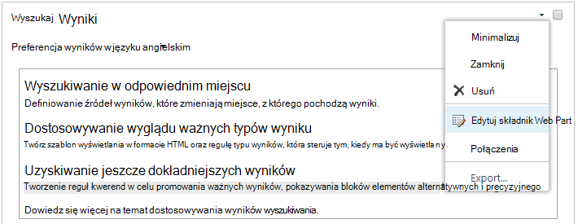

# <a name="configure-search-for-microsoft-365-multi-geo"></a>Konfigurowanie wyszukiwania Microsoft 365 wielu obszarach geograficznych

W środowisku z wieloma lokalizacjami geograficznymi każda lokalizacja geograficzna ma własny indeks wyszukiwania i Centrum wyszukiwania. Gdy użytkownik wyszukuje, zapytanie jest rozsyłane do wszystkich indeksów, a zwrócone wyniki są scalane.

Na przykład użytkownik w jednej lokalizacji geograficznej może wyszukiwać zawartość przechowywaną w innej lokalizacji geograficznej lub zawartość w witrynie SharePoint, która jest ograniczona do innej lokalizacji geograficznej. Jeśli użytkownik ma dostęp do tej zawartości, wyszukiwanie będzie wyświetlać wynik.

## <a name="which-search-clients-work-in-a-multi-geo-environment"></a>Którzy klienci wyszukiwania pracują w środowisku z wieloma lokalizacjami geograficznymi?

Ci klienci mogą zwracać wyniki ze wszystkich lokalizacji geograficznych:

- OneDrive
- Delve
- Strona główna SharePoint
- Centrum wyszukiwania
- Niestandardowe aplikacje wyszukiwania korzystające z interfejsu API wyszukiwania SharePoint

### <a name="onedrive"></a>OneDrive

Po skonfigurowaniu środowiska z wieloma lokalizacjami geograficznymi użytkownicy, którzy szukają w OneDrive, uzyskują wyniki ze wszystkich lokalizacji geograficznych.

### <a name="delve"></a>Delve

Po skonfigurowaniu środowiska z wieloma lokalizacjami geograficznymi użytkownicy, którzy szukają w Delve, uzyskują wyniki ze wszystkich lokalizacji geograficznych.

Kanał informacyjny Delve i karta profilu wyświetlają tylko podglądy plików przechowywanych w centralnej lokalizacji. W przypadku plików przechowywanych w lokalizacjach satelitarnych zamiast tego jest wyświetlana ikona typu pliku.

### <a name="the-sharepoint-home-page"></a>Strona główna SharePoint

Po skonfigurowaniu środowiska z wieloma lokalizacjami geograficznymi użytkownicy będą widzieć wiadomości, najnowsze i obserwowane witryny z wielu lokalizacji geograficznych na swojej stronie głównej SharePoint. Jeśli użyją pola wyszukiwania na stronie głównej SharePoint, uzyskają scalone wyniki z wielu lokalizacji geograficznych.

### <a name="the-search-center"></a>Centrum wyszukiwania

Po skonfigurowaniu środowiska z wieloma lokalizacjami geograficznymi każde Centrum wyszukiwania nadal wyświetla wyniki tylko z własnej lokalizacji geograficznej. Administratorzy muszą [zmienić ustawienia każdego centrum wyszukiwania](#_Set_up_a_1) , aby uzyskać wyniki ze wszystkich lokalizacji geograficznych. Następnie użytkownicy wyszukiwania w Centrum wyszukiwania uzyskują wyniki ze wszystkich lokalizacji geograficznych.

### <a name="custom-search-applications"></a>Niestandardowe aplikacje wyszukiwania

Jak zwykle niestandardowe aplikacje wyszukiwania wchodzą w interakcje z indeksami wyszukiwania przy użyciu istniejących interfejsów API REST wyszukiwania SharePoint. Aby uzyskać wyniki ze wszystkich lub niektórych lokalizacji geograficznych, aplikacja musi [wywołać interfejs API i uwzględnić nowe parametry zapytania multi-Geo](#_Get_custom_search) w żądaniu. Spowoduje to wyzwolenie wentylatora z zapytania do wszystkich lokalizacji geograficznych.

## <a name="whats-different-about-search-in-a-multi-geo-environment"></a>Czym różni się wyszukiwanie w środowisku z wieloma lokalizacjami geograficznymi?

Niektóre funkcje wyszukiwania, które mogą być znane, działają inaczej w środowisku z wieloma obszarami geograficznymi.

<table>
<thead>
<tr class="header">
<th align="left">Funkcja</th>
<th align="left">Jak to działa</th>
<th align="left">Obejście problemu</th>
</tr>
</thead>
<tbody>
<tr class="odd">
<td align="left">Promowane wyniki</td>
<td align="left">Reguły zapytań można tworzyć z promowanymi wynikami na różnych poziomach: dla całej dzierżawy, zbioru witryn lub witryny. W środowisku z wieloma lokalizacjami geograficznymi zdefiniuj promowane wyniki na poziomie dzierżawy, aby podwyższyć poziom wyników do centrów wyszukiwania we wszystkich lokalizacjach geograficznych. Jeśli chcesz promować tylko wyniki w Centrum wyszukiwania, które znajduje się w lokalizacji geograficznej zbioru witryn lub witryny, zdefiniuj promowane wyniki na poziomie zbioru witryn lub witryny. Te wyniki nie są promowane w innych lokalizacjach geograficznych.</td>
<td align="left">Jeśli nie potrzebujesz różnych promowane wyniki na lokalizację geograficzną, na przykład różne reguły dla podróży, zalecamy definiowanie promowane wyniki na poziomie dzierżawy.</td>
</tr>
<tr class="even">
<td align="left">Wyszukiwanie elementów uściślania</td>
<td align="left">Wyszukiwanie zwraca elementy uściślacze ze wszystkich lokalizacji geograficznych dzierżawy, a następnie agreguje je. Agregacja to najlepszy wysiłek, co oznacza, że liczba elementów uściślających może nie być w 100% dokładna. W przypadku większości scenariuszy opartych na wyszukiwaniu ta dokładność jest wystarczająca.
</td>
<td align="left">W przypadku aplikacji opartych na wyszukiwaniu, które zależą od kompletności elementu uściślającego, należy niezależnie wykonywać zapytania względem każdej lokalizacji geograficznej.</td>
</tr>
<tr class="odd">
<td align="left"></td>
<td align="left">Wyszukiwanie wielu obszarów geograficznych nie obsługuje dynamicznego zasobnika dla elementów uściślających numeryczne.</td>
<td align="left">Użyj <a href="/sharepoint/dev/general-development/query-refinement-in-sharepoint">parametru "Discretize"</a> dla elementów uściślania liczbowego.</td>
</tr>
<tr class="even">
<td align="left">Identyfikatory dokumentów</td>
<td align="left">Jeśli tworzysz aplikację opartą na wyszukiwaniu, która zależy od identyfikatorów dokumentów, należy pamiętać, że identyfikatory dokumentów w środowisku z wieloma lokalizacjami geograficznymi nie są unikatowe w lokalizacjach geograficznych, są unikatowe dla lokalizacji geograficznej.</td>
<td align="left">Dodaliśmy kolumnę identyfikującą lokalizację geograficzną. Użyj tej kolumny, aby osiągnąć unikatowość. Ta kolumna nosi nazwę "GeoLocationSource".</td>
</tr>
<tr class="odd">
<td align="left">Liczba wyników</td>
<td align="left">Na stronie wyników wyszukiwania są wyświetlane połączone wyniki z lokalizacji geograficznych, ale nie można stronicować więcej niż 500 wyników.</td>
<td align="left"></td>
</tr>
<tr class="even">
<td align="left">Wyszukiwanie hybrydowe</td>
<td align="left">W środowisku SharePoint hybrydowej z <a href="/sharepoint/hybrid/learn-about-cloud-hybrid-search-for-sharepoint">wyszukiwaniem hybrydowym w chmurze</a> zawartość lokalna jest dodawana do indeksu Microsoft 365 centralnej lokalizacji.</td>
<td align="left"></td>
</tr>
</tbody>
</table>

## <a name="whats-not-supported-for-search-in-a-multi-geo-environment"></a>Co nie jest obsługiwane w przypadku wyszukiwania w środowisku z wieloma lokalizacjami geograficznymi?

Niektóre funkcje wyszukiwania, które mogą być znane, nie są obsługiwane w środowisku obejmującym wiele obszarów geograficznych.

<table>
<thead>
<tr class="header">
<th align="left">Funkcja wyszukiwania</th>
<th align="left">Uwaga</th>
</tr>
</thead>
<tbody>
<tr class="odd">
<td align="left">Uwierzytelnianie tylko dla aplikacji</td>
<td align="left">Uwierzytelnianie tylko dla aplikacji (dostęp uprzywilejowany z usług) nie jest obsługiwane w wyszukiwanie w wielu lokalizacjach geograficznych.</td>
</tr>
<tr class="even">
<td align="left">Zatrzymali</td>
<td align="left">Goście otrzymują tylko wyniki z lokalizacji geograficznej, z której szukają.</td>
</tr>
</tbody>
</table>

## <a name="how-does-search-work-in-a-multi-geo-environment"></a>Jak działa wyszukiwanie w środowisku z wieloma lokalizacjami geograficznymi?

Wszyscy klienci wyszukiwania używają istniejących interfejsów API REST wyszukiwania SharePoint do interakcji z indeksami wyszukiwania.


1. Klient wyszukiwania wywołuje punkt końcowy REST wyszukiwania z właściwością zapytania EnableMultiGeoSearch= true.
2. Zapytanie jest wysyłane do wszystkich lokalizacji geograficznych w dzierżawie.
3. Wyniki wyszukiwania z każdej lokalizacji geograficznej są scalane i klasyfikowane.
4. Klient uzyskuje ujednolicone wyniki wyszukiwania.

<span id="_Set_up_a" class="anchor"><span id="_Ref501388384" class="anchor"></span></span>Zwróć uwagę, że wyniki wyszukiwania nie są scalane, dopóki nie otrzymamy wyników ze wszystkich lokalizacji geograficznych. Oznacza to, że wyszukiwanie w wielu obszarach geograficznych ma dodatkowe opóźnienie w porównaniu z wyszukiwaniami w środowisku z tylko jedną lokalizacją geograficzną.

<span id="_Set_up_a_1" class="anchor"><span id="_Ref505252370" class="anchor"></span></span>
## <a name="get-a-search-center-to-show-results-from-all-geo-locations"></a>Uzyskiwanie Centrum wyszukiwania w celu wyświetlenia wyników ze wszystkich lokalizacji geograficznych

Każde centrum wyszukiwania ma kilka pionów i należy skonfigurować poszczególne pionowe osobno.

1. Upewnij się, że wykonasz te kroki przy użyciu konta, które ma uprawnienia do edytowania strony wyników wyszukiwania i składnika Web Part wyników wyszukiwania.

2. Przejdź do strony wyników wyszukiwania (zobacz [listę](https://support.office.com/article/174d36e0-2f85-461a-ad9a-8b3f434a4213) stron wyników wyszukiwania)

3. Wybierz pionową do skonfigurowania, kliknij **ikonę koła** zębatego Ustawienia w prawym górnym rogu, a następnie kliknij pozycję **Edytuj stronę**. Strona wyników wyszukiwania zostanie otwarta w trybie edycji.

   

4. W składniku Web Part Wyniki wyszukiwania przenieś wskaźnik do górnego, prawego rogu składnika Web Part, kliknij strzałkę, a następnie kliknij pozycję **Edytuj składnik Web Part** w menu. Okienko narzędzia Składnik Web Part wyników wyszukiwania zostanie otwarte pod wstążką w prawym górnym rogu strony.

   

5. W okienku narzędzi składnika Web Part w sekcji **Ustawienia** w obszarze **Ustawienia kontroli wyników** wybierz pozycję **Pokaż wyniki z wieloma lokalizacjami geograficznymi**, aby pobrać składnik Web Part Wyników wyszukiwania, aby wyświetlić wyniki ze wszystkich lokalizacji geograficznych.

6. Kliknij **przycisk OK** , aby zapisać zmianę i zamknąć okienko narzędzi składnika Web Part.

7. Sprawdź zmiany w składniku Web Part Wyniki wyszukiwania, klikając pozycję **Zaewidencjonuj** na karcie Strona menu głównego.

8. Opublikuj zmiany, korzystając z linku dostarczonego w notatce w górnej części strony.

<span id="_Get_custom_search" class="anchor"><span id="_Ref501388387" class="anchor"></span></span>
## <a name="get-custom-search-applications-to-show-results-from-all-or-some-geo-locations"></a>Pobieranie niestandardowych aplikacji wyszukiwania w celu wyświetlenia wyników ze wszystkich lub niektórych lokalizacji geograficznych

Niestandardowe aplikacje wyszukiwania pobierają wyniki ze wszystkich lub niektórych lokalizacji geograficznych, określając parametry zapytania z żądaniem do interfejsu API REST wyszukiwania SharePoint. W zależności od parametrów zapytania zapytanie jest rozsyłane do wszystkich lokalizacji geograficznych lub do niektórych lokalizacji geograficznych. Jeśli na przykład wystarczy wykonać zapytanie dotyczące podzestawu lokalizacji geograficznych w celu znalezienia odpowiednich informacji, możesz kontrolować wentylator tylko do tych. Jeśli żądanie zakończy się pomyślnie, interfejs API REST wyszukiwania SharePoint zwraca dane odpowiedzi.

### <a name="requirement"></a>Wymóg

Dla każdej lokalizacji geograficznej należy upewnić się, że wszystkim użytkownikom w organizacji przyznano poziom uprawnień **odczytu** dla głównej witryny internetowej (na przykład **contosoAPAC.sharepoint.com/** i contosoEU.sharepoint.com/). [Dowiedz się więcej o uprawnieniach](https://support.office.com/article/understanding-permission-levels-in-sharepoint-87ecbb0e-6550-491a-8826-c075e4859848).

### <a name="query-parameters"></a>Parametry zapytania

EnableMultiGeoSearch — jest to wartość logiczna określająca, czy zapytanie ma zostać przesuwne na indeksy innych lokalizacji geograficznych dzierżawy z wieloma lokalizacjami geograficznymi. Ustaw ją na **wartość true** , aby wyświetlić zapytanie; **false** , aby nie wyszukiwać zapytania. Jeśli nie uwzględnisz tego parametru, wartość domyślna to **false**, z wyjątkiem wywołania interfejsu API REST względem witryny korzystającej z szablonu centrum wyszukiwania Enterprise, w tym przypadku wartość domyślna ma **wartość true**. Jeśli używasz parametru w środowisku, które nie jest multi-geo, parametr jest ignorowany.

ClientType — jest to ciąg. Wprowadź unikatową nazwę klienta dla każdej aplikacji wyszukiwania. Jeśli ten parametr nie zostanie dołączony, zapytanie nie zostanie przełączony do innych lokalizacji geograficznych.

MultiGeoSearchConfiguration — jest to opcjonalna lista lokalizacji geograficznych w dzierżawie z wieloma obszarami geograficznymi, do których ma zostać wyświetlone zapytanie, gdy właściwość **EnableMultiGeoSearch** ma **wartość true**. Jeśli nie uwzględnisz tego parametru lub pozostawisz go pustym, zapytanie zostanie przesuwzone do wszystkich lokalizacji geograficznych. Dla każdej lokalizacji geograficznej wprowadź następujące elementy w formacie JSON:

<table>
<thead>
<tr class="header">
<th align="left">Element</th>
<th align="left">Opis</th>
</tr>
</thead>
<tbody>
<tr class="odd">
<td align="left">DataLocation</td>
<td align="left">Lokalizacja geograficzna, na przykład NAM.</td>
</tr>
<tr class="even">
<td align="left">Punktu końcowego</td>
<td align="left">Punkt końcowy do nawiązania połączenia, na przykład https://contoso.sharepoint.com</td>
</tr>
<tr class="odd">
<td align="left">Identyfikator źródła</td>
<td align="left">Identyfikator GUID źródła wyników, na przykład B81EAB55-3140-4312-B0F4-9459D1B4FFEE.</td>
</tr>
</tbody>
</table>

Jeśli pominięto pozycję DataLocation lub EndPoint lub jeśli datalocation zostanie zduplikowana, żądanie zakończy się niepowodzeniem. [Informacje o punkcie końcowym lokalizacji geograficznych dzierżawy można uzyskać za pomocą usługi Microsoft Graph](/sharepoint/dev/solution-guidance/multigeo-discovery).

### <a name="response-data"></a>Dane odpowiedzi

MultiGeoSearchStatus — jest to właściwość zwracana przez interfejs API wyszukiwania SharePoint w odpowiedzi na żądanie. Wartość właściwości jest ciągiem i zawiera następujące informacje o wynikach zwracanych przez interfejs API wyszukiwania SharePoint:

<table>
<thead>
<tr class="header">
<th align="left">Value</th>
<th align="left">Opis</th>
</tr>
</thead>
<tbody>
<tr class="odd">
<td align="left">Pełne</td>
<td align="left">Pełne wyniki ze <strong>wszystkich</strong> lokalizacji geograficznych.</td>
</tr>
<tr class="even">
<td align="left">Częściowe</td>
<td align="left">Częściowe wyniki z co najmniej jednej lokalizacji geograficznej. Wyniki są niekompletne z powodu błędu przejściowego.</td>
</tr>
</tbody>
</table>

### <a name="query-using-the-rest-service"></a>Wykonywanie zapytań przy użyciu usługi REST

W żądaniu GET należy określić parametry zapytania w adresie URL. Za pomocą żądania POST przekazujesz parametry zapytania w treści w formacie JavaScript Object Notation (JSON).

#### <a name="request-headers"></a>Nagłówki żądań

<table>
<thead>
<tr class="header">
<th align="left">Name (Nazwa)</th>
<th align="left">Value (Wartość)</th>
</tr>
</thead>
<tbody>
<tr class="odd">
<td align="left">Typ zawartości</td>
<td align="left">application/json;odata=verbose</td>
</tr>
</tbody>
</table>

#### <a name="sample-get-request-thats-fanned-out-to-all-geo-locations"></a>Przykładowe żądanie GET wysyłane do **wszystkich** lokalizacji geograficznych

```http
https:// \<tenant\>/\_api/search/query?querytext='sharepoint'&Properties='EnableMultiGeoSearch:true'&ClientType='my\_client\_id'
```

#### <a name="sample-get-request-to-fan-out-to-some-geo-locations"></a>Przykładowe żądanie GET do wyszukiwania do **niektórych** lokalizacji geograficznych

```http
https:// \<tenant\>/\_api/search/query?querytext='site'&ClientType='my_client_id'&Properties='EnableMultiGeoSearch:true, MultiGeoSearchConfiguration:[{DataLocation\\:"NAM"\\,Endpoint\\:"https\\://contosoNAM.sharepoint.com"\\,SourceId\\:"B81EAB55-3140-4312-B0F4-9459D1B4FFEE"}\\,{DataLocation\\:"CAN"\\,Endpoint\\:"https\\://contosoCAN.sharepoint-df.com"}]'
```

> [!NOTE]
> Przecinki i dwukropki na liście lokalizacji geograficznych właściwości MultiGeoSearchConfiguration są poprzedzone **znakiem ukośnika odwrotnego** . Dzieje się tak, ponieważ żądania GET używają dwukropków do oddzielania właściwości i przecinków w celu oddzielenia argumentów właściwości. Bez ukośnika odwrotnego jako znaku ucieczki właściwość MultiGeoSearchConfiguration jest interpretowana nieprawidłowo.

#### <a name="sample-post-request-thats-fanned-out-to-all-geo-locations"></a>Przykładowe żądanie POST, które jest rozsyłane do **wszystkich** lokalizacji geograficznych

```http
    {
    "request": {
            "__metadata": {
            "type": "Microsoft.Office.Server.Search.REST.SearchRequest"
        },
        "Querytext": "sharepoint",
        "Properties": {
            "results": [
                {
                    "Name": "EnableMultiGeoSearch",
                    "Value": {
                        "QueryPropertyValueTypeIndex": 3,
                        "BoolVal": true
                    }
                }
            ]
        },
        "ClientType": "my_client_id"
        }
    }
```

#### <a name="sample-post-request-thats-fanned-out-to-some-geo-locations"></a>Przykładowe żądanie POST, które jest rozsyłane do **niektórych** lokalizacji geograficznych

```http
    {
        "request": {
            "Querytext": "SharePoint",
            "ClientType": "my_client_id",
            "Properties": {
                "results": [
                    {
                        "Name": "EnableMultiGeoSearch",
                        "Value": {
                            "QueryPropertyValueTypeIndex": 3,
                            "BoolVal": true
                        }
                    },
                    {
                        "Name": "MultiGeoSearchConfiguration",
                        "Value": {
                        "StrVal": "[{\"DataLocation\":\"NAM\",\"Endpoint\":\"https://contoso.sharepoint.com\",\"SourceId\":\"B81EAB55-3140-4312-B0F4-9459D1B4FFEE\"},{\"DataLocation\":\"CAN\",\"Endpoint\":\"https://contosoCAN.sharepoint.com\"}]",
                            "QueryPropertyValueTypeIndex": 1
                        }
                    }
                ]
            }
        }
    }
```

### <a name="query-using-csom"></a>Wykonywanie zapytań przy użyciu modelu CSOM

Oto przykładowe zapytanie CSOM, które jest przeznaczone dla **wszystkich** lokalizacji geograficznych:

```CSOM
var keywordQuery = new KeywordQuery(ctx);
keywordQuery.QueryText = query.SearchQueryText;
keywordQuery.ClientType = <enter a string here>;
keywordQuery.Properties["EnableMultiGeoSearch"] = true;
```
