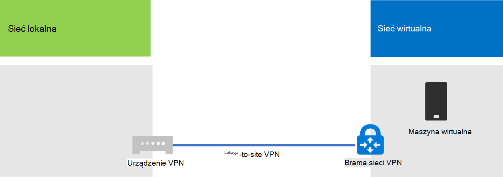
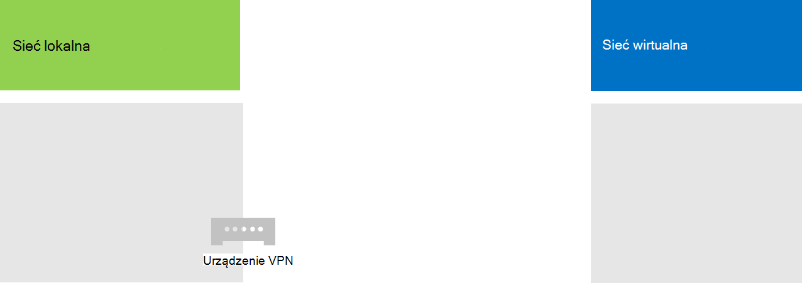
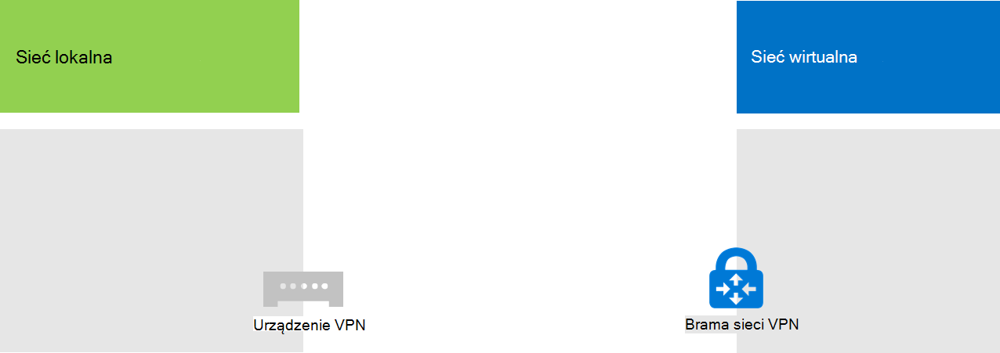
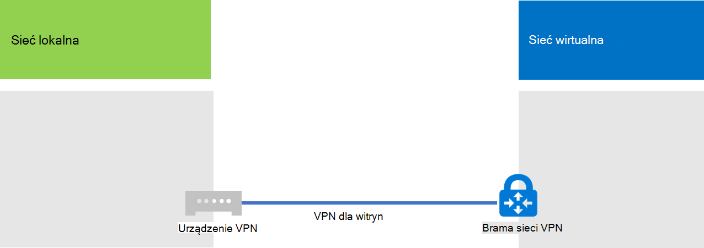

# <a name="connect-an-on-premises-network-to-a-microsoft-azure-virtual-network"></a>Połączenie sieci lokalnej do sieci Microsoft Azure wirtualnej

Do Twojej sieci lokalnej jest połączona między siedzibą sieci wirtualnej platformy Azure, rozszerzając sieć o podsieci i maszyny wirtualne hostowane w usługach infrastruktury platformy Azure. To połączenie umożliwia komputerom w Twojej sieci lokalnej bezpośredni dostęp do maszyn wirtualnych na platformie Azure i odwrotnie. 

Na przykład serwer synchronizacji katalogów uruchomiony na maszynie wirtualnej platformy Azure musi zwracać się do lokalnych kontrolerów domeny w celu zmiany kont i synchronizować te zmiany z Twoją subskrypcją usługi Microsoft 365. W tym artykule pokazano, jak skonfigurować między lokalną siecią wirtualną Azure przy użyciu połączenia VPN (Site-to-site Virtual Network), które jest gotowe do hostowania maszyn wirtualnych platformy Azure.

## <a name="configure-a-cross-premises-azure-virtual-network"></a>Konfigurowanie sieci wirtualnej platformy Azure

Twoje maszyny wirtualne na platformie Azure nie muszą być izolowane od środowiska lokalnego. Aby połączyć maszyny wirtualne platformy Azure z lokalnymi zasobami sieciowym, musisz skonfigurować między lokalną sieć wirtualną platformy Azure. Na poniższym diagramie przedstawiono składniki wymagane do wdrożenia międzylokacyjną sieci wirtualnej platformy Azure z maszyną wirtualną na platformie Azure.
  

 
Na diagramie istnieją dwie sieci połączone połączeniem VPN między witrynami: sieć lokalna i wirtualna sieć Azure. Połączenie vpn między witrynami jest:

- Między dwoma punktami końcowymi, których adres można rozwiązać i które znajdują się w publicznym Internecie.
- Zakończony przez urządzenie VPN w sieci lokalnej i bramę azure VPN w sieci wirtualnej Azure.

Sieć wirtualna Azure hostuje maszyny wirtualne. Ruch sieciowy pochodzący z maszyn wirtualnych w sieci wirtualnej Azure jest przesyłany dalej do bramy VPN, która następnie przesyła ruch przez połączenie VPN między witrynami do urządzenia w sieci lokalnej. Infrastruktura routingu sieci lokalnej przesyła następnie ruch do miejsca docelowego.

>[!Note]
>Możesz również użyć usługi [ExpressRoute](https://azure.microsoft.com/services/expressroute/), która jest bezpośrednim połączeniem między Twoją organizacją a siecią firmy Microsoft. Ruch przez usługę ExpressRoute nie jest przekierowywowyny przez publiczny Internet. W tym artykule nie opisano korzystania z funkcji ExpressRoute.
>
  
Aby skonfigurować połączenie VPN między Twoją siecią wirtualną Azure a Twoją siecią lokalną, wykonaj następujące czynności: 
  
1. **Lokalnie:** Zdefiniuj i utwórz lokalną trasę sieciową dla przestrzeni adresowej sieci wirtualnej platformy Azure, która wskazuje Twoje lokalne urządzenie VPN.
    
2. **Microsoft Azure: Utwórz** wirtualną sieć Azure za pomocą połączenia VPN między witrynami. 
    
3. **Lokalnie:** Skonfiguruj lokalne urządzenie lub oprogramowanie vpn, aby zakończyć połączenie VPN, które używa połączenia sieci zabezpieczenia protokołu internetowego (IPsec).
    
Po nawiązaniu połączenia VPN między witrynami możesz dodać maszyny wirtualne platformy Azure do podsieci sieci wirtualnej.
  
## <a name="plan-your-azure-virtual-network"></a>Planowanie sieci wirtualnej platformy Azure
<a name="PlanningVirtual"></a>

### <a name="prerequisites"></a>Wymagania wstępne
<a name="Prerequisites"></a>

- Subskrypcja platformy Azure. Aby uzyskać informacje o subskrypcjach platformy Azure, przejdź do strony [Jak kupić platformę Azure](https://azure.microsoft.com/pricing/purchase-options/).
    
- Dostępna prywatna przestrzeń adresów IPv4, która zostanie przypisana do sieci wirtualnej i jej podsieci, mając wystarczająco dużo miejsca na wzrost, aby uwzględnić liczbę maszyn wirtualnych potrzebnych teraz i w przyszłości.
    
- Dostępne urządzenie VPN w Twojej sieci lokalnej w celu zakończenia połączenia VPN między witrynami, które obsługuje wymagania dotyczące protokołu IPsec. Aby uzyskać więcej informacji, zobacz [Informacje o urządzeniach VPN dla połączeń sieci wirtualnej między witrynami](/azure/vpn-gateway/vpn-gateway-about-vpn-devices).
    
- Zmiany w infrastrukturze routingu tak, aby ruch przekierowany do przestrzeni adresowej sieci wirtualnej Azure był przesyłany dalej do urządzenia VPN hostjącego połączenie VPN między witrynami.
    
- Serwer proxy sieci Web udostępnia komputery połączone z siecią lokalną i wirtualny dostęp do Internetu przez sieć wirtualną platformy Azure.
    
### <a name="solution-architecture-design-assumptions"></a>Założenia projektowe architektury rozwiązań

Na poniższej liście przedstawiono opcje projektu, które zostały wprowadzone dla tej architektury rozwiązania. 
  
- To rozwiązanie korzysta z pojedynczej sieci wirtualnej platformy Azure z połączeniem VPN między witrynami. Sieć wirtualna Azure hostuje pojedynczą podsieci, która może zawierać wiele maszyn wirtualnych. 
    
- Za pomocą usługi routingu i dostępu zdalnego (RRAS) w programie Windows Server 2016 lub Windows Server 2012 możesz nawiązać połączenie VPN typu IPsec między siecią lokalną a siecią wirtualną Azure. Możesz także użyć innych opcji, takich jak urządzenia VPN Cisco lub Juniper Networks.
    
- W sieci lokalnej nadal mogą być usługi sieciowe, takie Usługi domenowe w usłudze Active Directory (AD DS), Domain Name System (DNS) i serwery proxy. W zależności od twoich wymagań korzystne może być umieścić niektóre z tych zasobów sieciowych w sieci wirtualnej platformy Azure.
    
W przypadku istniejącej sieci wirtualnej Platformy Azure z jedną lub większą liczby podsieci określ, czy jest pozostała ilość miejsca na adres dodatkowej podsieci do hostowania potrzebnych maszyn wirtualnych, w zależności od twoich wymagań. Jeśli nie masz pozostałej przestrzeni adresowej dla dodatkowej podsieci, utwórz dodatkową sieć wirtualną, która ma własne połączenie VPN między witrynami.
  
### <a name="plan-the-routing-infrastructure-changes-for-the-azure-virtual-network"></a>Planowanie zmian infrastruktury routingu dla sieci wirtualnej platformy Azure

Musisz skonfigurować lokalną infrastrukturę routingu, aby przesyłać ruch do miejsca adresów sieci wirtualnej Platformy Azure do lokalnego urządzenia VPN hostjącego połączenie VPN między witrynami.
  
Dokładna metoda aktualizowania infrastruktury routingu zależy od sposobu zarządzania informacjami o routingu, które mogą być:
  
- Aktualizacje tabeli routingu na podstawie konfiguracji ręcznej.
    
- Aktualizacje tabeli routingu są oparte na protokołach routingu, takich jak ROUTING Information Protocol (PF) lub Open Shortest Path First (OSPF).
    
Skonsultuj się ze specjalistą ds. routingu, aby upewnić się, że ruch przeznaczony dla sieci wirtualnej platformy Azure jest przesyłany dalej do lokalnego urządzenia VPN.
  
### <a name="plan-for-firewall-rules-for-traffic-to-and-from-the-on-premises-vpn-device"></a>Planowanie reguł zapory dla ruchu do i z lokalnego urządzenia VPN

Jeśli Twoje urządzenie VPN znajduje się w sieci obwodowej, która ma zaporę między siecią obwodową a Internetem, może być konieczne skonfigurowanie zapory pod następującymi regułami w celu umożliwienia połączenia VPN między witrynami.
  
- Ruch do urządzenia VPN (przychodzącego z Internetu):
    
  - Docelowy adres IP urządzenia VPN i protokołu IP 50
    
  - Docelowy adres IP urządzenia VPN i portu docelowego UDP 500
    
  - Docelowy adres IP urządzenia VPN i portu docelowego UDP 4500
    
- Ruch z urządzenia VPN (wychodzącego do Internetu):
    
  - Źródłowy adres IP urządzenia SIECI VPN i protokołu IP 50
    
  - Źródłowy adres IP urządzenia SIECI VPN i portu źródłowego UDP 500
    
  - Źródłowy adres IP urządzenia SIECI VPN i portu źródłowego UDP 4500
    
### <a name="plan-for-the-private-ip-address-space-of-the-azure-virtual-network"></a>Planowanie prywatnego obszaru adresów IP sieci wirtualnej platformy Azure

Prywatna przestrzeń adresów IP sieci wirtualnej Platformy Azure musi być w stanie zmieścić adresy używane przez platformę Azure do hostowania sieci wirtualnej oraz z co najmniej jedną podsieci, która ma wystarczającą ilość adresów dla Twoich maszyn wirtualnych platformy Azure.
  
Aby ustalić liczbę adresów potrzebnych dla podsieci, zlicz liczbę maszyn wirtualnych, których potrzebujesz teraz, szacuj na przyszłość wzrost, a następnie użyj poniższej tabeli, aby określić rozmiar podsieci.
  
|**Liczba potrzebnych maszyn wirtualnych**|**Liczba potrzebnych bitów hosta**|**Rozmiar podsieci**|
|:-----|:-----|:-----|
|1-3  <br/> |3  <br/> |/29  <br/> |
|4-11  <br/> |4  <br/> |/28  <br/> |
|12-27  <br/> |5  <br/> |/27  <br/> |
|28-59  <br/> |6  <br/> |/26  <br/> |
|60-123  <br/> |7  <br/> |/25  <br/> |
   
### <a name="planning-worksheet-for-configuring-your-azure-virtual-network"></a>Arkusz planowania na temat konfigurowania sieci wirtualnej platformy Azure
<a name="worksheet"> </a>

Przed utworzeniem sieci wirtualnej platformy Azure do hostowania maszyn wirtualnych należy określić ustawienia wymagane w poniższych tabelach.
  
W przypadku ustawień sieci wirtualnej wpisz tabela V.
  
 **Tabela V: Konfiguracja między lokalną siecią wirtualną**
  
|**Element**|**Element konfiguracji**|**Opis**|**Wartość**|
|:-----|:-----|:-----|:-----|
|1.  <br/> |Nazwa sieci wirtualnej  <br/> |Nazwa do przypisania do sieci wirtualnej platformy Azure (przykład DirSyncNet).  <br/> | |
|2.  <br/> |Wirtualna lokalizacja sieciowa  <br/> |Centrum danych platformy Azure, które będzie zawierać sieć wirtualną (na przykład Zachód).  <br/> |  <br/> |
|3.  <br/> |Adres IP urządzenia SIECI VPN  <br/> |Publiczny adres IPv4 interfejsu urządzenia VPN w Internecie. We współpracy z działem IT ustal ten adres.  <br/> |  <br/> |
|4.  <br/> |Wirtualna przestrzeń adresów sieciowych  <br/> |Przestrzeń adresów (zdefiniowana w jednym prefiksie adresu prywatnego) dla sieci wirtualnej. We współpracy z działem IT ustal tę przestrzeń adresową. Przestrzeń adresów powinna być w formacie Routingu międzydomenami (CIDR, Classless Interdomain Routing), nazywanym także formatem prefiksu sieciowego. Przykład: 10.24.64.0/20.  <br/> | <br/> |
|5.  <br/> |Klucz udostępniony IPsec  <br/> |32-znakowy losowy ciąg alfanumeryczny używany do uwierzytelniania obu stron połączenia VPN między witrynami. We współpracy z działem IT lub działem zabezpieczeń określ tę wartość klucza, a następnie przechowuj ją w bezpiecznym miejscu. Ewentualnie zobacz [Tworzenie ciągu losowego dla wstępnie](https://social.technet.microsoft.com/wiki/contents/articles/32330.create-a-random-string-for-an-ipsec-preshared-key.aspx) współużytego klucza IPsec.  <br/> | <br/> |
   
Wypełnij tabelę S, aby uzyskać podsieci tego rozwiązania.
  
- Dla pierwszej podsieci określ 28-bitową przestrzeń adresów (o długości prefiksu /28) dla podsieci bramy Azure. Aby [uzyskać informacje na temat określania tej przestrzeni adresów](/archive/blogs/solutions_advisory_board/calculating-the-gateway-subnet-address-space-for-azure-virtual-networks) , zobacz Obliczanie przestrzeni adresów podsieci bramy dla sieci wirtualnych platformy Azure.
    
- Dla drugiej podsieci określ przyjazną nazwę, pojedynczą przestrzeń adresów IP opartą na wirtualnej przestrzeni adresów sieciowych oraz opisowy cel.
    
We współpracy z działem IT ustal te odstępy między adresami od wirtualnej przestrzeni adresów sieciowych. Obie spacje adresu powinny być w formacie CIDR.
  
 **Tabela S: podsieci w sieci wirtualnej**
  
|**Element**|**Nazwa podsieci**|**Obszar adresu podsieci**|**Cel**|
|:-----|:-----|:-----|:-----|
|1.  <br/> |GatewaySubnet  <br/> |  <br/> |Podsieci używaną przez bramę platformy Azure.  <br/> |
|2.  <br/> |  <br/> |  <br/> |  <br/> |
   
W przypadku lokalnych serwerów DNS, z których mają korzystać maszyny wirtualne w sieci wirtualnej, wypełnij tabelę D. Nadaj każdemu serwerowi DNS przyjazną nazwę i jeden adres IP. Ta przyjazna nazwa nie musi być taka sama jak nazwa hosta ani nazwa komputera serwera DNS. Na liście znajdują się dwa puste wpisy, ale możesz dodać kolejne. We współpracy z działem IT ustal tę listę.
  
 **Tabela D: Lokalne serwery DNS**
  
|**Element**|**Przyjazna nazwa serwera DNS**|**Adres IP serwera DNS**|
|:-----|:-----|:-----|
|1.  <br/> |  <br/> |  <br/> |
|2.  <br/> |  <br/> |  <br/> |
   
Aby rozsyłać pakiety z sieci wirtualnej platformy Azure do sieci Twojej organizacji przez połączenie VPN między witrynami, musisz skonfigurować sieć wirtualną z siecią lokalną. Ta sieć lokalna zawiera listę spacji adresowych (w formacie CIDR) dla wszystkich lokalizacji w sieci lokalnej organizacji, do których muszą dotrzeć maszyny wirtualne w sieci wirtualnej. Może to być wszystkie lokalizacje w sieci lokalnej lub podzestaw. Lista spacji adresowych definiująca sieć lokalną musi być unikatowa i nie może zasłaniać się odstępami adresowymi używanymi dla tej sieci wirtualnej lub innych między lokalnymi sieciami wirtualnymi.
  
W przypadku zestawu lokalnych spacji adresów sieciowych wypełnij pole Tabela L. Pamiętaj, że na liście znajdują się trzy puste wpisy, ale zazwyczaj potrzebujesz więcej. We współpracy z działem IT ustal tę listę.
  
 **Tabela L: Prefiksy adresów dla sieci lokalnej**
  
|**Element**|**Lokalna przestrzeń adresów sieciowych**|
|:-----|:-----|
|1.  <br/> |  <br/> |
|2.  <br/> |  <br/> |
|3.  <br/> |  <br/> |
   
## <a name="deployment-roadmap"></a>Plan wdrażania
<a name="DeploymentRoadmap"> </a>

Tworzenie sieci wirtualnej między siedzibą firmy i dodawanie maszyn wirtualnych na platformie Azure składa się z trzech etapów:
  
- Etap 1. Przygotowanie sieci lokalnej.
    
- Etap 2. Tworzenie między siedzibą sieci wirtualnej na platformie Azure.
    
- Etap 3 (opcjonalnie): Dodawanie maszyn wirtualnych.
    
### <a name="phase-1-prepare-your-on-premises-network"></a>Etap 1. Przygotowanie sieci lokalnej
<a name="Phase1"></a>

Musisz skonfigurować sieć lokalną za pomocą trasy, która wskazuje i ostatecznie dostarcza ruch do miejsca adresu sieci wirtualnej do routera na krawędzi sieci lokalnej. Skontaktuj się z administratorem sieci, aby ustalić, jak dodać trasę do infrastruktury routingu Twojej sieci lokalnej.
  
Oto wynikowa konfiguracja.
  

  
### <a name="phase-2-create-the-cross-premises-virtual-network-in-azure"></a>Etap 2. Tworzenie między siedzibą sieci wirtualnej na platformie Azure
<a name="Phase2"></a>

Najpierw otwórz monit Azure PowerShell monitu. Jeśli nie masz zainstalowanego Azure PowerShell, zobacz [Wprowadzenie do Azure PowerShell](/powershell/azure/get-started-azureps).

 
Następnie zaloguj się do swojego konta Azure za pomocą tego polecenia.
  
```powershell
Connect-AzAccount
```

Uzyskaj nazwę subskrypcji za pomocą następującego polecenia.
  
```powershell
Get-AzSubscription | Sort SubscriptionName | Select SubscriptionName
```

Skonfiguruj subskrypcję platformy Azure za pomocą tych poleceń. Zamień wszystkie cudzysłowy, łącznie < i >, na poprawną nazwę subskrypcji.
  
```powershell
$subscrName="<subscription name>"
Select-AzSubscription -SubscriptionName $subscrName
```

Następnie utwórz nową grupę zasobów dla swojej sieci wirtualnej. Aby określić unikatową nazwę grupy zasobów, użyj tego polecenia, aby wyświetlić listę istniejących grup zasobów.
  
```powershell
Get-AzResourceGroup | Sort ResourceGroupName | Select ResourceGroupName
```

Za pomocą tych poleceń utwórz nową grupę zasobów.
  
```powershell
$rgName="<resource group name>"
$locName="<Table V - Item 2 - Value column>"
New-AzResourceGroup -Name $rgName -Location $locName
```

Następnie utworzysz sieć wirtualną Azure.
  
```powershell
# Fill in the variables from previous values and from Tables V, S, and D
$rgName="<name of your new resource group>"
$locName="<Azure location of your new resource group>"
$vnetName="<Table V - Item 1 - Value column>"
$vnetAddrPrefix="<Table V - Item 4 - Value column>"
$gwSubnetPrefix="<Table S - Item 1 - Subnet address space column>"
$SubnetName="<Table S - Item 2 - Subnet name column>"
$SubnetPrefix="<Table S - Item 2 - Subnet address space column>"
$dnsServers=@( "<Table D - Item 1 - DNS server IP address column>", "<Table D - Item 2 - DNS server IP address column>" )
$locShortName=(Get-AzResourceGroup -Name $rgName).Location

# Create the Azure virtual network and a network security group that allows incoming remote desktop connections to the subnet that is hosting virtual machines
$gatewaySubnet=New-AzVirtualNetworkSubnetConfig -Name "GatewaySubnet" -AddressPrefix $gwSubnetPrefix
$vmSubnet=New-AzVirtualNetworkSubnetConfig -Name $SubnetName -AddressPrefix $SubnetPrefix
New-AzVirtualNetwork -Name $vnetName -ResourceGroupName $rgName -Location $locName -AddressPrefix $vnetAddrPrefix -Subnet $gatewaySubnet,$vmSubnet -DNSServer $dnsServers
$rule1=New-AzNetworkSecurityRuleConfig -Name "RDPTraffic" -Description "Allow RDP to all VMs on the subnet" -Access Allow -Protocol Tcp -Direction Inbound -Priority 100 -SourceAddressPrefix Internet -SourcePortRange * -DestinationAddressPrefix * -DestinationPortRange 3389
New-AzNetworkSecurityGroup -Name $SubnetName -ResourceGroupName $rgName -Location $locShortName -SecurityRules $rule1
$vnet=Get-AzVirtualNetwork -ResourceGroupName $rgName -Name $vnetName
$nsg=Get-AzNetworkSecurityGroup -Name $SubnetName -ResourceGroupName $rgName
Set-AzVirtualNetworkSubnetConfig -VirtualNetwork $vnet -Name $SubnetName -AddressPrefix $SubnetPrefix -NetworkSecurityGroup $nsg
$vnet | Set-AzVirtualNetwork
```

Oto wynikowa konfiguracja.
  

  
Następnie użyj tych poleceń, aby utworzyć bramy dla połączenia VPN między witrynami.
  
```powershell
# Fill in the variables from previous values and from Tables V and L
$vnetName="<Table V - Item 1 - Value column>"
$localGatewayIP="<Table V - Item 3 - Value column>"
$localNetworkPrefix=@( <comma-separated, double-quote enclosed list of the local network address prefixes from Table L, example: "10.1.0.0/24", "10.2.0.0/24"> )
$vnetConnectionKey="<Table V - Item 5 - Value column>"
$vnet=Get-AzVirtualNetwork -Name $vnetName -ResourceGroupName $rgName
# Attach a virtual network gateway to a public IP address and the gateway subnet
$publicGatewayVipName="PublicIPAddress"
$vnetGatewayIpConfigName="PublicIPConfig"
New-AzPublicIpAddress -Name $vnetGatewayIpConfigName -ResourceGroupName $rgName -Location $locName -AllocationMethod Dynamic
$publicGatewayVip=Get-AzPublicIpAddress -Name $vnetGatewayIpConfigName -ResourceGroupName $rgName
$vnetGatewayIpConfig=New-AzVirtualNetworkGatewayIpConfig -Name $vnetGatewayIpConfigName -PublicIpAddressId $publicGatewayVip.Id -SubnetId $vnet.Subnets[0].Id
# Create the Azure gateway
$vnetGatewayName="AzureGateway"
$vnetGateway=New-AzVirtualNetworkGateway -Name $vnetGatewayName -ResourceGroupName $rgName -Location $locName -GatewayType Vpn -VpnType RouteBased -IpConfigurations $vnetGatewayIpConfig
# Create the gateway for the local network
$localGatewayName="LocalNetGateway"
$localGateway=New-AzLocalNetworkGateway -Name $localGatewayName -ResourceGroupName $rgName -Location $locName -GatewayIpAddress $localGatewayIP -AddressPrefix $localNetworkPrefix
# Create the Azure virtual network VPN connection
$vnetConnectionName="S2SConnection"
$vnetConnection=New-AzVirtualNetworkGatewayConnection -Name $vnetConnectionName -ResourceGroupName $rgName -Location $locName -ConnectionType IPsec -SharedKey $vnetConnectionKey -VirtualNetworkGateway1 $vnetGateway -LocalNetworkGateway2 $localGateway
```

Oto wynikowa konfiguracja.
  

  
Następnie skonfiguruj lokalne urządzenie VPN, aby łączyło się z bramą azure VPN. Aby uzyskać więcej informacji, zobacz Informacje o urządzeniach [VPN dla połączeń między witrynami usługi Azure Virtual Network](/azure/vpn-gateway/vpn-gateway-about-vpn-devices).
  
Do skonfigurowania urządzenia VPN są potrzebne następujące elementy:
  
- Publiczny adres IPv4 bramy Azure VPN dla Twojej sieci wirtualnej. Aby wyświetlić ten adres, użyj $vnetGatewayIpConfigName **Get-AzPublicIpAddress -Name $rgName -ResourceGroupName** .
    
- Wstępnie udostępniony klucz IPsec dla połączenia VPN między witrynami (tabela V — element 5 — kolumna Wartość).
    
Oto wynikowa konfiguracja.
  

  
### <a name="phase-3-optional-add-virtual-machines"></a>Etap 3 (opcjonalnie): Dodawanie maszyn wirtualnych

Utwórz maszyny wirtualne, których potrzebujesz na platformie Azure. Aby uzyskać więcej informacji, zobacz [Tworzenie Windows wirtualnej za pomocą portalu Azure Portal](https://go.microsoft.com/fwlink/p/?LinkId=393098).
  
Użyj następujących ustawień:
  
- Na karcie **Podstawy wybierz** tę samą grupę subskrypcji i zasobów, co Twoja sieć wirtualna. Będą one potrzebne później do zalogowania się do maszyny wirtualnej. W sekcji **Szczegóły wystąpienia** wybierz odpowiedni rozmiar maszyny wirtualnej. Zanotuj nazwę użytkownika i hasło konta administratora w bezpiecznym miejscu. 
    
- Na karcie **Sieci** zaznacz nazwę sieci wirtualnej i podsieci hostowania maszyn wirtualnych (nie nazwę GatewaySubnet). Pozostaw wszystkie inne ustawienia na ich wartości domyślne.
    
Sprawdź, czy Twoja maszyna wirtualna prawidłowo używa systemu DNS, sprawdzając wewnętrzną usługę DNS, aby upewnić się, że do nowej maszyny wirtualnej zostały dodane rekordy adresu (A). Aby uzyskać dostęp do Internetu, Twoje maszyny wirtualne platformy Azure muszą być skonfigurowane do korzystania z serwera proxy sieci lokalnej. Aby uzyskać dodatkowe kroki konfiguracji na serwerze, skontaktuj się z administratorem sieci.
  
Oto wynikowa konfiguracja.
  

  
## <a name="next-step"></a>Następny krok
  
[Wdrażanie Microsoft 365 katalogów w programie Microsoft Azure](deploy-microsoft-365-directory-synchronization-dirsync-in-microsoft-azure.md)