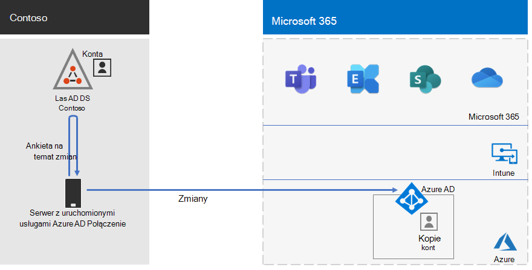

# Tożsamość firmy Contoso Corporation

Firma Microsoft udostępnia usługę Identity as a Service (IDaaS) w swoich ofertach w chmurze za pośrednictwem usługi Azure Active Directory (Azure AD). Aby wdrożyć Microsoft 365 dla przedsiębiorstw, rozwiązanie Contoso IDaaS musiało używać lokalnego dostawcy tożsamości i uwzględniać uwierzytelnianie federacyjne z istniejącymi zaufanymi dostawcami tożsamości innych firm.

## Las Active Directory Domain Services firmy Contoso

Firma Contoso używa jednego lasu Active Directory Domain Services (AD DS) dla contosocom\. z siedmioma poddomenami, po jednym dla każdego regionu świata. Siedziba, regionalne biura centrów i biura satelitarne zawierają kontrolery domeny do uwierzytelniania lokalnego i autoryzacji.

Oto las firmy Contoso z domenami regionalnymi dla różnych części świata, które zawierają centra regionalne.

:::image type="content" alt-text="Las i domeny firmy Contoso na całym świecie." source="../media/contoso-identity/contoso-identity-fig1.png" lightbox="../media/contoso-identity/contoso-identity-fig1.png":::
 
Firma Contoso zdecydowała się używać kont i grup w lesie contosocom\. do uwierzytelniania i autoryzacji dla swoich Microsoft 365 obciążeń i usług.

## Infrastruktura uwierzytelniania federacyjnego firmy Contoso

Firma Contoso zezwala na:

- Klienci mogą logować się do publicznej witryny internetowej firmy przy użyciu kont Microsoft, Facebook lub Google Mail.
- Dostawcy i partnerzy mogą używać swoich kont LinkedIn, Salesforce lub Google Mail do logowania się do ekstranetu partnera firmy.

Oto moduł DMZ firmy Contoso zawierający publiczną witrynę internetową, ekstranet partnera i zestaw serwerów Active Directory Federation Services (AD FS). Moduł DMZ jest połączony z Internetem, który zawiera klientów, partnerów i usługi internetowe.

 
Serwery usług AD FS w DMZ ułatwiają uwierzytelnianie poświadczeń klienta przez dostawców tożsamości w celu uzyskania dostępu do publicznej witryny internetowej i poświadczeń partnera w celu uzyskania dostępu do ekstranetu partnera.

Firma Contoso zdecydowała się zachować tę infrastrukturę i przeznaczyć ją na uwierzytelnianie klientów i partnerów. Architekci tożsamości firmy Contoso badają konwersję tej infrastruktury na rozwiązania Usługi Azure AD [B2B](/azure/active-directory/b2b/hybrid-organizations) i [B2C](/azure/active-directory-b2c/solution-articles) .

## Tożsamość hybrydowa z synchronizacją skrótów haseł na potrzeby uwierzytelniania opartego na chmurze

Firma Contoso chciała użyć lokalnego lasu usług AD DS do uwierzytelniania w celu Microsoft 365 zasobów w chmurze. Podjęto decyzję o użyciu synchronizacji skrótów haseł (PHS).

Język PHS synchronizuje lokalny las usług AD DS z dzierżawą usługi Azure AD ich Microsoft 365 dla subskrypcji przedsiębiorstwa, kopiując konta użytkowników i grup oraz skrótową wersję haseł kont użytkowników.

Aby tworzyć synchronizację katalogów, firma Contoso wdrożyła narzędzie Połączenie usługi Azure AD na serwerze w centrum danych w Paryżu.

Oto serwer z uruchomioną usługą Azure AD Połączenie sondowanie lasu usług AD DS firmy Contoso pod kątem zmian, a następnie synchronizowanie tych zmian z dzierżawą usługi Azure AD.

 
## Zasady dostępu warunkowego dla tożsamości Zero Trust i dostępu do urządzeń

Firma Contoso utworzyła zestaw [zasad dostępu warunkowego](../security/office-365-security/identity-access-policies.md) usługi Azure AD i Intune dla trzech poziomów ochrony:

- Zabezpieczenia *punktu początkowego* mają zastosowanie do wszystkich kont użytkowników.
- *Enterprise* ochrony mają zastosowanie do kadry kierowniczej wyższego szczebla i kadry kierowniczej.
- *Wyspecjalizowane* zabezpieczenia mają zastosowanie do określonych użytkowników z działów finansów, prawnych i badawczych, którzy mają dostęp do wysoce regulowanych danych.

Oto wynikowy zestaw zasad tożsamości i dostępu warunkowego urządzenia firmy Contoso.

:::image type="content" alt-text="Zasady dostępu warunkowego dla tożsamości i urządzeń firmy Contoso." source="../media/contoso-identity/contoso-identity-fig5.png" lightbox="../media/contoso-identity/contoso-identity-fig5.png":::
 
## Następny krok

Dowiedz się, jak firma Contoso używa swojej infrastruktury Microsoft Endpoint Configuration Manager do [wdrażania i utrzymywania bieżących Windows 10 Enterprise](contoso-win10.md) w całej organizacji.

## Zobacz też

[Wdrażanie tożsamości dla Microsoft 365](deploy-identity-solution-overview.md)

[Microsoft 365 dla przedsiębiorstw — omówienie](microsoft-365-overview.md)

[Przewodniki po laboratorium testowym](m365-enterprise-test-lab-guides.md)