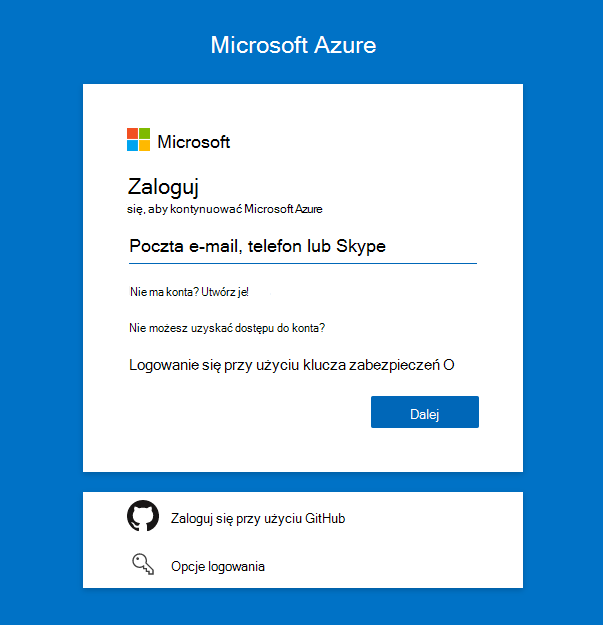
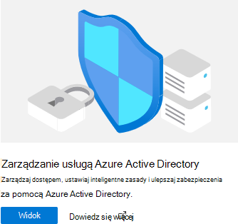
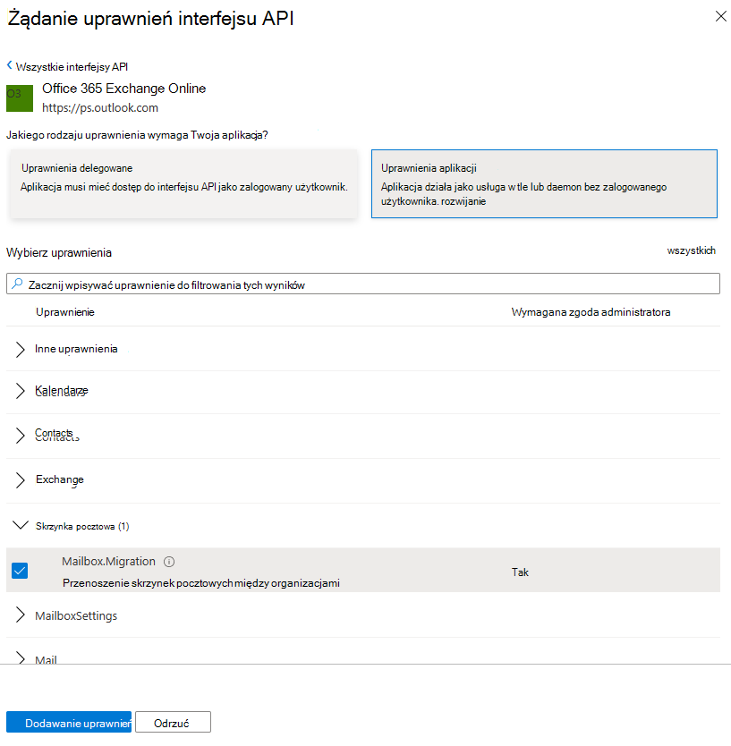

# <a name="cross-tenant-mailbox-migration-preview"></a>Migracja skrzynki pocztowej między dzierżawami (wersja zapoznawcza)

Często podczas fuzji lub zbycia potrzebna jest możliwość przeniesienia skrzynki pocztowej Exchange Online użytkownika do nowej dzierżawy. Migracja skrzynek pocztowych między dzierżawami umożliwia administratorom dzierżawy korzystanie z dobrze znanych interfejsów, takich jak zdalny program PowerShell i usługa MRS, w celu przeniesienia użytkowników do nowej organizacji.

Administratorzy mogą używać polecenia cmdlet New-MigrationBatch dostępnego za pośrednictwem roli zarządzania Przenoszenie skrzynek pocztowych do wykonywania ruchów między dzierżawami.

Użytkownicy migrujący muszą być obecni w systemie Exchange Online dzierżawy docelowej jako użytkownicy poczty oznaczone określonymi atrybutami, aby umożliwić przenoszenie między dzierżawami. Przenoszenie systemu zakończy się niepowodzeniem dla użytkowników, którzy nie są prawidłowo skonfigurowani w dzierżawie docelowej.

Po zakończeniu przenoszenia źródłowa skrzynka pocztowa użytkownika jest konwertowana na użytkownika poczty, a element targetAddress (wyświetlany jako ExternalEmailAddress w Exchange) jest ostemplowany adresem routingu do dzierżawy docelowej. Ten proces pozostawia starszą jednostkę MailUser w dzierżawie źródłowej i umożliwia współistnienie i routing poczty. Gdy procesy biznesowe zezwalają, dzierżawa źródłowa może usunąć źródłową usługę MailUser lub przekonwertować ją na kontakt poczty.

Migracje skrzynek pocztowych między dzierżawami Exchange są obsługiwane tylko w przypadku dzierżaw w środowisku hybrydowym lub w chmurze lub w dowolnej kombinacji tych dwóch.

W tym artykule opisano proces przenoszenia skrzynki pocztowej między dzierżawami i przedstawiono wskazówki dotyczące przygotowywania dzierżaw źródłowych i docelowych do przenoszenia zawartości Exchange Online skrzynki pocztowej.

   > [!NOTE]
   > Niedawno zaktualizowaliśmy kroki konfiguracji, aby umożliwić migrację skrzynek pocztowych między dzierżawami, aby nie wymagać już usługi Azure Key Vault! Jeśli jest to pierwszy raz, gdy dołączasz do tej wersji zapoznawczej, nie jest wymagana żadna akcja i możesz wykonać kroki opisane w tym dokumencie. Jeśli rozpoczęto konfigurowanie dzierżaw przy użyciu poprzedniej metody AKV, zdecydowanie zalecamy zatrzymanie lub usunięcie tej konfiguracji, aby rozpocząć korzystanie z tej nowej metody. Jeśli migracja skrzynki pocztowej jest w toku z poprzednią metodą AKV, poczekaj na ukończenie istniejących migracji i wykonaj poniższe kroki, aby włączyć nową uproszczoną metodę. Kroki wymaganej konfiguracji Key Vault platformy Azure są archiwizowane, ale można je znaleźć **[tutaj](https://github.com/microsoft/cross-tenant/wiki/V1-Content#cross-tenant-mailbox-migration-preview)**, aby uzyskać informacje.

## <a name="preparing-source-and-target-tenants"></a>Przygotowywanie dzierżaw źródłowych i docelowych

### <a name="prerequisites-for-source-and-target-tenants"></a>Wymagania wstępne dotyczące dzierżaw źródłowych i docelowych

Przed rozpoczęciem upewnij się, że masz uprawnienia niezbędne do skonfigurowania aplikacji Przenieś skrzynkę pocztową na platformie Azure, punktu końcowego migracji exo i relacji organizacji EXO.

Ponadto wymagana jest co najmniej jedna grupa zabezpieczeń z obsługą poczty w dzierżawie źródłowej. Te grupy służą do określania zakresu listy skrzynek pocztowych, które mogą zostać przeniesione z dzierżawy źródłowej (lub czasami nazywanej zasobem) do dzierżawy docelowej. Dzięki temu administrator dzierżawy źródłowej może ograniczyć lub określić zakres określonego zestawu skrzynek pocztowych, które należy przenieść, uniemożliwiając migrację niezamierzonych użytkowników. Grupy zagnieżdżone nie są obsługiwane.

Musisz również komunikować się z zaufaną firmą partnerską (z którą będziesz przenosić skrzynki pocztowe), aby uzyskać ich identyfikator dzierżawy Microsoft 365. Ten identyfikator dzierżawy jest używany w polu Nazwa domeny relacji organizacji.

Aby uzyskać identyfikator dzierżawy subskrypcji, zaloguj się do [Centrum administracyjne platformy Microsoft 365](https://go.microsoft.com/fwlink/p/?linkid=2024339) i przejdź do [https://aad.portal.azure.com/\#blade/Microsoft_AAD_IAM/ActiveDirectoryMenuBlade/Properties](https://aad.portal.azure.com/#blade/Microsoft_AAD_IAM/ActiveDirectoryMenuBlade/Properties)strony . Kliknij ikonę kopiowania właściwości Identyfikator dzierżawy, aby skopiować ją do schowka.

### <a name="configuration-steps-to-enable-your-tenants-for-cross-tenant-mailbox-migrations"></a>Kroki konfiguracji umożliwiające włączenie dzierżaw na potrzeby migracji skrzynek pocztowych między dzierżawami

   > [!NOTE]
   > Najpierw należy skonfigurować obiekt docelowy (miejsce docelowe). Aby wykonać te kroki, nie musisz mieć ani znać poświadczeń administratora dzierżawy zarówno dla dzierżawy źródłowej, jak i docelowej. Kroki mogą być wykonywane indywidualnie dla każdej dzierżawy przez różnych administratorów.

### <a name="prepare-the-target-destination-tenant-by-creating-the-migration-application-and-secret"></a>Przygotowanie dzierżawy docelowej (docelowej) przez utworzenie aplikacji migracji i wpisu tajnego

1. Zaloguj się do portalu Azure AD (<https://portal.azure.com>) przy użyciu poświadczeń administratora dzierżawy docelowej

   

2. Kliknij pozycję Widok w obszarze Zarządzanie Azure Active Directory.

   

3. Na lewym pasku nawigacyjnym wybierz pozycję Rejestracje aplikacji.

4. Wybierz pozycję Nowa rejestracja

   

5. Na stronie Rejestrowanie aplikacji w obszarze Obsługiwane typy kont wybierz pozycję Konta w dowolnym katalogu organizacyjnym (Dowolny katalog Azure AD — wielodostępny). Następnie w obszarze Identyfikator URI przekierowania (opcjonalnie) wybierz pozycję Sieć Web i wprowadź wartość <https://office.com>. Na koniec wybierz pozycję Zarejestruj.

   

6. W prawym górnym rogu strony zostanie wyświetlone wyskakujące powiadomienie z informacją, że aplikacja została pomyślnie utworzona.

7. Wstecz do strony głównej, Azure Active Directory i kliknij pozycję Rejestracje aplikacji.

8. W obszarze Aplikacje należące znajdź utworzoną aplikację i kliknij ją.

9. W obszarze ^Essentials musisz skopiować identyfikator aplikacji (klienta), ponieważ będzie on potrzebny później, aby utworzyć adres URL dzierżawy docelowej.

10. Teraz na lewym pasku nawigacyjnym kliknij pozycję Uprawnienia interfejsu API, aby wyświetlić uprawnienia przypisane do aplikacji.

11. Domyślnie użytkownik. Uprawnienia do odczytu są przypisywane do utworzonej aplikacji, ale nie są one wymagane do migracji skrzynki pocztowej. Możesz usunąć to uprawnienie.

    

12. Teraz musimy dodać uprawnienie do migracji skrzynki pocztowej, wybierz pozycję Dodaj uprawnienie

13. W oknach Żądania uprawnień interfejsu API wybierz pozycję Interfejsy API używane przez moją organizację, wyszukaj Office 365 Exchange Online i wybierz ją.

    

14. Następnie wybierz pozycję Uprawnienia aplikacji

15. Następnie w obszarze Wybierz uprawnienia rozwiń węzeł Skrzynka pocztowa i zaznacz pole wyboru Skrzynka pocztowa.Migracja i Dodaj uprawnienia u dołu ekranu.

    

16. Teraz wybierz pozycję Certyfikaty & wpisów tajnych na pasku nawigacyjnym po lewej stronie aplikacji.

17. W obszarze Klucze tajne klienta wybierz nowy klucz tajny klienta.

    

18. W oknie Dodawanie wpisu tajnego klienta wprowadź opis i skonfiguruj żądane ustawienia wygaśnięcia.

      > [!NOTE]
      > Jest to hasło, które będzie używane podczas tworzenia punktu końcowego migracji. Niezwykle ważne jest, aby skopiować to hasło do schowka i skopiować to hasło w celu bezpiecznej lokalizacji bezpiecznego/tajnego hasła. Jest to jedyny raz, kiedy będzie można zobaczyć to hasło! Jeśli w jakiś sposób go utracisz lub musisz go zresetować, możesz zalogować się z powrotem do naszego Azure Portal, przejść do Rejestracje aplikacji, znaleźć aplikację do migracji, wybrać pozycję Wpisy tajne & certyfikaty i utworzyć nowy wpis tajny dla aplikacji.

19. Po pomyślnym utworzeniu aplikacji migracji i wpisu tajnego musisz wyrazić zgodę na aplikację. Aby wyrazić zgodę na aplikację, wróć do strony docelowej Azure Active Directory, kliknij pozycję Enterprise aplikacji w obszarze nawigacji po lewej stronie, znajdź utworzoną aplikację migracji, wybierz ją i wybierz pozycję Uprawnienia na lewym pasku nawigacyjnym.

20. Kliknij przycisk Udziel zgody administratora dla [dzierżawy].

21. Zostanie otwarte nowe okno przeglądarki, a następnie wybierz pozycję Akceptuj.

22. Możesz wrócić do okna portalu i wybrać pozycję Odśwież, aby potwierdzić akceptację.

23. Sformatuj adres URL do wysłania do zaufanego partnera (administratora dzierżawy źródłowej), aby mógł również zaakceptować aplikację w celu włączenia migracji skrzynki pocztowej. Oto przykład adresu URL, który zostanie im podany, potrzebny jest identyfikator aplikacji utworzonej przez Ciebie:

    ```powershell
    https://login.microsoftonline.com/sourcetenant.onmicrosoft.com/adminconsent?client_id=[application_id_of_the_app_you_just_created]&redirect_uri=https://office.com
    ```

    > [!NOTE]
    > Potrzebny będzie właśnie identyfikator aplikacji migracji skrzynki pocztowej.
    >
    > W powyższym przykładzie należy zastąpić sourcetenant.onmicrosoft.com dzierżawami źródłowymi poprawną nazwą onmicrosoft.com.
    >
    > Należy również zastąpić element [application_id_of_the_app_you_just_created] identyfikatorem aplikacji utworzonej właśnie przez Ciebie aplikacji do migracji skrzynki pocztowej.

### <a name="prepare-the-target-tenant-by-creating-the-exchange-online-migration-endpoint-and-organization-relationship"></a>Przygotowanie dzierżawy docelowej przez utworzenie punktu końcowego migracji Exchange Online i relacji organizacji

1. Utwórz zdalne połączenie programu PowerShell z docelową dzierżawą Exchange Online.

2. Tworzenie nowego punktu końcowego migracji dla przenoszenia skrzynki pocztowej między dzierżawami

   > [!NOTE]
   > Będziesz potrzebować identyfikatora aplikacji do migracji skrzynki pocztowej, którą właśnie utworzono, oraz hasła (wpisu tajnego) skonfigurowanego podczas tego procesu. Również w zależności od wystąpienia chmury Microsoft 365, którego używasz, punkt końcowy może być inny. Zapoznaj się ze stroną [Microsoft 365 punktów końcowych](/microsoft-365/enterprise/microsoft-365-endpoints) i wybierz odpowiednie wystąpienie dla dzierżawy, a następnie przejrzyj Exchange Online Optymalizuj wymagany adres i zastąp odpowiednio.

   ```powershell

   # Enable customization if tenant is dehydrated
     $dehydrated=Get-OrganizationConfig | fl isdehydrated
     if ($dehydrated -eq $true) {Enable-OrganizationCustomization}

   $AppId = "[guid copied from the migrations app]"

   $Credential = New-Object -TypeName System.Management.Automation.PSCredential -ArgumentList $AppId, (ConvertTo-SecureString -String "[this is your secret password you saved in the previous steps]" -AsPlainText -Force)

   New-MigrationEndpoint -RemoteServer outlook.office.com -RemoteTenant "sourcetenant.onmicrosoft.com" -Credentials $Credential -ExchangeRemoteMove:$true -Name "[the name of your migration endpoint]" -ApplicationId $AppId
   ```

3. Utwórz nowy lub edytuj istniejący obiekt relacji organizacji z dzierżawą źródłową.

   ```powershell
   $sourceTenantId="[tenant id of your trusted partner, where the source mailboxes are]"
   $orgrels=Get-OrganizationRelationship
   $existingOrgRel = $orgrels | ?{$_.DomainNames -like $sourceTenantId}
   If ($null -ne $existingOrgRel)
   {
       Set-OrganizationRelationship $existingOrgRel.Name -Enabled:$true -MailboxMoveEnabled:$true -MailboxMoveCapability Inbound
   }
   If ($null -eq $existingOrgRel)
   {
       New-OrganizationRelationship "[name of the new organization relationship]" -Enabled:$true -MailboxMoveEnabled:$true -MailboxMoveCapability Inbound -DomainNames $sourceTenantId
   }
   ```

### <a name="prepare-the-source-current-mailbox-location-tenant-by-accepting-the-migration-application-and-configuring-the-organization-relationship"></a>Przygotowanie dzierżawy źródłowej (bieżącej lokalizacji skrzynki pocztowej) przez zaakceptowanie aplikacji migracji i skonfigurowanie relacji organizacji

1. W przeglądarce przejdź do linku adresu URL dostarczonego przez zaufanego partnera, aby wyrazić zgodę na aplikację do migracji skrzynki pocztowej. Adres URL będzie wyglądać następująco:

   ```powershell
   https://login.microsoftonline.com/sourcetenant.onmicrosoft.com/adminconsent?client_id=[application_id_of_the_app_you_just_created]&redirect_uri=https://office.com
   ```

   > [!NOTE]
   > Potrzebny będzie właśnie identyfikator aplikacji migracji skrzynki pocztowej.
   > W powyższym przykładzie należy zastąpić sourcetenant.onmicrosoft.com dzierżawami źródłowymi poprawną nazwą onmicrosoft.com.
   > Należy również zastąpić element [application_id_of_the_app_you_just_created] identyfikatorem aplikacji utworzonej właśnie przez Ciebie aplikacji do migracji skrzynki pocztowej.

2. Zaakceptuj aplikację, gdy zostanie wyświetlone okno podręczne. Możesz również zalogować się do portalu Azure Active Directory i znaleźć aplikację w obszarze Enterprise aplikacji.

3. Utwórz nowy lub edytuj istniejący obiekt relacji organizacji do dzierżawy docelowej (docelowej) z Exchange Online zdalnego okna programu PowerShell.

   ```powershell
   $targetTenantId="[tenant id of your trusted partner, where the mailboxes are being moved to]"
   $appId="[application id of the mailbox migration app you consented to]"
   $scope="[name of the mail enabled security group that contains the list of users who are allowed to migrate]"
   $orgrels=Get-OrganizationRelationship
   $existingOrgRel = $orgrels | ?{$_.DomainNames -like $targetTenantId}
   If ($null -ne $existingOrgRel)
   {
       Set-OrganizationRelationship $existingOrgRel.Name -Enabled:$true -MailboxMoveEnabled:$true -MailboxMoveCapability RemoteOutbound -OAuthApplicationId $appId -MailboxMovePublishedScopes $scope
   }
   If ($null -eq $existingOrgRel)
   {
       New-OrganizationRelationship "[name of your organization relationship]" -Enabled:$true -MailboxMoveEnabled:$true -MailboxMoveCapability RemoteOutbound -DomainNames $targetTenantId -OAuthApplicationId $appId -MailboxMovePublishedScopes $scope
   }
   ```

> [!NOTE]
> Identyfikator dzierżawy wprowadzony jako $sourceTenantId i $targetTenantId to identyfikator GUID, a nie nazwa domeny dzierżawy. Aby uzyskać przykład identyfikatora dzierżawy i informacje dotyczące znajdowania identyfikatora dzierżawy, zobacz [Znajdowanie identyfikatora dzierżawy Microsoft 365](/onedrive/find-your-office-365-tenant-id).

### <a name="how-do-i-know-this-worked"></a>Jak mogę wiedzieć, że to zadziałało?

Konfigurację migracji skrzynki pocztowej między dzierżawami można sprawdzić, uruchamiając polecenie cmdlet [Test-MigrationServerAvailability](/powershell/module/exchange/Test-MigrationServerAvailability) względem punktu końcowego migracji między dzierżawami utworzonego w dzierżawie docelowej.

   > [!NOTE]
   >
   > - Dzierżawa docelowa:
   >
   > Test-MigrationServerAvailability -Endpoint "[nazwa punktu końcowego migracji między dzierżawami]"
   >
   > Get-OrganizationRelationship | fl name, DomainNames, MailboxMoveEnabled, MailboxMoveCapability
   >
   > - Dzierżawa źródłowa:
   >
   > Get-OrganizationRelationship | fl name, DomainNames, MailboxMoveEnabled, MailboxMoveCapability

### <a name="move-mailboxes-back-to-the-original-source"></a>Przenoszenie skrzynek pocztowych z powrotem do oryginalnego źródła

Jeśli do powrotu do oryginalnej dzierżawy źródłowej jest wymagana skrzynka pocztowa, należy uruchomić ten sam zestaw kroków i skryptów zarówno w nowej dzierżawie źródłowej, jak i nowej dzierżawie docelowej. Istniejący obiekt relacji organizacji zostanie zaktualizowany lub dołączony, a nie ponownie utworzony

## <a name="prepare-target-user-objects-for-migration"></a>Przygotowywanie docelowych obiektów użytkowników do migracji

Użytkownicy migrujący muszą być obecni w dzierżawie docelowej i systemie Exchange Online (jako użytkownicy poczty) oznaczonymi określonymi atrybutami, aby umożliwić przenoszenie między dzierżawami. Przenoszenie systemu zakończy się niepowodzeniem dla użytkowników, którzy nie są prawidłowo skonfigurowani w dzierżawie docelowej. W poniższej sekcji szczegółowo opisano wymagania obiektu MailUser dla dzierżawy docelowej.

### <a name="prerequisites-for-target-user-objects"></a>Wymagania wstępne dotyczące obiektów użytkownika docelowego

Upewnij się, że w organizacji docelowej ustawiono następujące obiekty i atrybuty.

1. W przypadku każdej skrzynki pocztowej przechodzącej z organizacji źródłowej należy aprowizować obiekt MailUser w organizacji docelowej:

   - Docelowy użytkownik poczty musi mieć następujące atrybuty ze źródłowej skrzynki pocztowej lub przypisane do nowego obiektu Użytkownika:
      - ExchangeGUID (bezpośredni przepływ ze źródła do miejsca docelowego): identyfikator GUID skrzynki pocztowej musi być zgodny. Proces przenoszenia nie będzie kontynuowany, jeśli nie jest on obecny w obiekcie docelowym.
      - ArchiveGUID (bezpośredni przepływ ze źródła do miejsca docelowego): identyfikator GUID archiwum musi być zgodny. Proces przenoszenia nie będzie kontynuowany, jeśli nie jest on obecny w obiekcie docelowym. (Jest to wymagane tylko wtedy, gdy źródłowa skrzynka pocztowa ma włączoną funkcję Archiwum).
      - LegacyExchangeDN (przepływ jako proxyAddress, "x500:\<LegacyExchangeDN>"): Nazwa LegacyExchangeDN musi być obecna w docelowym usłudze MailUser jako x500: proxyAddress. Ponadto należy również skopiować wszystkie adresy x500 ze źródłowej skrzynki pocztowej do docelowego użytkownika poczty. Procesy przenoszenia nie będą kontynuowane, jeśli nie są obecne w obiekcie docelowym.
      - UserPrincipalName: nazwa UPN będzie zgodna z nową tożsamością użytkownika lub firmą docelową (na przykład user@northwindtraders.onmicrosoft.com).
      - Podstawowy adres SMTPAddress: podstawowy adres SMTP zostanie dopasowany do nowej firmy użytkownika (na przykład user@northwind.com).
      - TargetAddress/ExternalEmailAddress: Aplikacja MailUser będzie odwoływać się do bieżącej skrzynki pocztowej użytkownika hostowanej w dzierżawie źródłowej (na przykład user@contoso.onmicrosoft.com). Podczas przypisywania tej wartości sprawdź, czy masz/przypisujesz również primarySMTPAddress lub ta wartość ustawi wartość PrimarySMTPAddress, co spowoduje błędy przenoszenia.
      - Nie można dodać starszych adresów proxy smtp ze źródłowej skrzynki pocztowej do docelowego elementu MailUser. Na przykład nie można obsługiwać contoso.com w jednostce MEU w fabrikam.onmicrosoft.com obiektach dzierżawy). Domeny są skojarzone tylko z jedną dzierżawą Azure AD lub Exchange Online.

     Przykładowy **docelowy** obiekt MailUser:

     | Atrybut            | Value                                                                                                                   |
     | -------------------- | ----------------------------------------------------------------------------------------------------------------------- |
     | Alias                | LaraN                                                                                                                   |
     | Typ adresata        | Mailuser                                                                                                                |
     | AdresatTypeDetails | Mailuser                                                                                                                |
     | Userprincipalname    | LaraN@northwintraders.onmicrosoft.com                                                                                   |
     | PrimarySmtpAddress   | Lara.Newton@northwind.com                                                                                               |
     | Externalemailaddress | SMTP:LaraN@contoso.onmicrosoft.com                                                                                      |
     | ExchangeGuid         | 1ec059c7-8396-4d0b-af4e-d6bd4c12a8d8                                                                                    |
     | Legacyexchangedn     | /o=First Organization/ou=Exchange Administrative Group                                                                  |
     |                      | (FYDIBOHF23SPDLT)/cn=Recipients/cn=74e5385fce4b46d19006876949855035Lara                                                 |
     | EmailAddresses       | x500:/o=First Organization/ou=Exchange Administrative Group (FYDIBOHF23SPDLT)/cn=Recipients/cn=d11ec1a2cacd4f81858c8190 |
     |                      | 7273f1f9-Lara                                                                                                           |
     |                      | smtp:LaraN@northwindtraders.onmicrosoft.com                                                                             |
     |                      | SMTP:Lara.Newton@northwind.com                                                                                          |

     Przykładowy **źródłowy** obiekt skrzynki pocztowej:

     | Atrybut            | Value                                                                   |
     | -------------------- | ----------------------------------------------------------------------- |
     | Alias                | LaraN                                                                   |
     | Typ adresata        | UserMailbox                                                             |
     | AdresatTypeDetails | UserMailbox                                                             |
     | Userprincipalname    | LaraN@contoso.onmicrosoft.com                                           |
     | PrimarySmtpAddress   | Lara.Newton@contoso.com                                                 |
     | ExchangeGuid         | 1ec059c7-8396-4d0b-af4e-d6bd4c12a8d8                                    |
     | Legacyexchangedn     | /o=First Organization/ou=Exchange Administrative Group                  |
     |                      | (FYDIBOHF23SPDLT)/cn=Recipients/cn=d11ec1a2cacd4f81858c81907273f1f9Lara |
     | EmailAddresses       | smtp:LaraN@contoso.onmicrosoft.com                                      |
     |                      | SMTP:Lara.Newton@contoso.com                                            |

   - Dodatkowe atrybuty mogą być dołączone do Exchange hybrydowego zapisywania zwrotnego. Jeśli nie, powinny zostać uwzględnione.
   - msExchBlockedSendersHash — zapisuje w trybie online bezpieczne i zablokowane dane nadawcy z klientów do lokalna usługa Active Directory.
   - msExchSafeRecipientsHash — zapisuje w trybie online bezpieczne i zablokowane dane nadawcy od klientów do lokalna usługa Active Directory.
   - msExchSafeSendersHash — zapisuje w trybie online bezpieczne i zablokowane dane nadawcy z klientów do lokalna usługa Active Directory.

2. Jeśli źródłowa skrzynka pocztowa znajduje się w witrynie LitigationHold, a rozmiar elementów możliwych do odzyskania źródłowej skrzynki pocztowej jest większy niż domyślny rozmiar bazy danych (30 GB), przenoszenie nie będzie kontynuowane, ponieważ docelowy limit przydziału jest mniejszy niż rozmiar źródłowej skrzynki pocztowej. Możesz zaktualizować docelowy obiekt MailUser, aby przenieść flagi skrzynki pocztowej ELC ze środowiska źródłowego do miejsca docelowego, co wyzwala system docelowy w celu zwiększenia limitu przydziału usługi MailUser do 100 GB, co umożliwia przejście do obiektu docelowego. Te instrukcje będą działać tylko w przypadku tożsamości hybrydowej działającej Azure AD Połączenie, ponieważ polecenia do ostemplowania flag ELC nie są widoczne dla administratorów dzierżawy.

    > [!NOTE]
    > PRZYKŁAD — BEZ GWARANCJI
    >
    > Ten skrypt zakłada połączenie ze źródłową skrzynką pocztową (w celu uzyskania wartości źródłowych) i lokalna usługa Active Directory docelową (w celu ostemplowania obiektu ADUser). Jeśli w źródle włączono postępowanie sądowe lub odzyskiwanie pojedynczego elementu, ustaw to na koncie docelowym.  Spowoduje to zwiększenie rozmiaru śmietnika konta docelowego do 100 GB.

    ```powershell
    $ELCValue = 0
    if ($source.LitigationHoldEnabled) {$ELCValue = $ELCValue + 8} if ($source.SingleItemRecoveryEnabled) {$ELCValue = $ELCValue + 16} if ($ELCValue -gt 0) {Set-ADUser -Server $domainController -Identity $destination.SamAccountName -Replace @{msExchELCMailboxFlags=$ELCValue}}
    ```

3. Dzierżawy obiektów docelowych innych niż hybrydowe mogą modyfikować przydział w folderze Elementy możliwe do odzyskania dla użytkowników poczty przed migracją, uruchamiając następujące polecenie, aby włączyć blokadę postępowania sądowego dla obiektu MailUser i zwiększyć limit przydziału do 100 GB:

   ```powershell
   Set-MailUser -Identity <MailUserIdentity> -EnableLitigationHoldForMigration
   ```

   Należy pamiętać, że nie będzie to działać w przypadku dzierżaw w środowisku hybrydowym.

4. Użytkownicy w organizacji docelowej muszą mieć licencję z odpowiednimi Exchange Online subskrypcjami mającymi zastosowanie do organizacji. Licencję można zastosować przed przeniesieniem skrzynki pocztowej, ale tylko wtedy, gdy docelowy użytkownik poczty jest prawidłowo skonfigurowany przy użyciu identyfikatora ExchangeGUID i adresów proxy. Zastosowanie licencji przed zastosowaniem identyfikatora ExchangeGUID spowoduje aprowizowanie nowej skrzynki pocztowej w organizacji docelowej.

    > [!NOTE]
    > Po zastosowaniu licencji do skrzynki pocztowej lub obiektu MailUser wszystkie serwery proxy typu SMTPAddresses są usuwane, aby upewnić się, że tylko zweryfikowane domeny są uwzględnione w tablicy Exchange EmailAddresses.

5. Musisz upewnić się, że docelowy moduł poczty nie ma poprzedniego identyfikatora ExchangeGuid, który nie jest zgodny ze źródłowym identyfikatorem ExchangeGuid. Taka sytuacja może wystąpić, jeśli docelowa usługa MEU była wcześniej licencjonowana na Exchange Online i aprowizacja skrzynki pocztowej. Jeśli docelowy użytkownik poczty był wcześniej licencjonowany lub miał identyfikator ExchangeGuid niezgodny ze źródłowym identyfikatorem ExchangeGuid, musisz przeprowadzić oczyszczanie procesora MEU w chmurze. W przypadku tych jednostek MEU w chmurze można uruchomić polecenie `Set-User <identity> -PermanentlyClearPreviousMailboxInfo`.

    > [!CAUTION]
    > Ten proces jest nieodwracalny. Jeśli obiekt ma nietrwałą skrzynkę pocztową, nie można go przywrócić po tym punkcie. Po wyczyszczeniu można jednak zsynchronizować poprawny identyfikator ExchangeGuid z obiektem docelowym, a usługa MRS połączy źródłową skrzynkę pocztową z nowo utworzoną docelową skrzynką pocztową. (Referencyjny blog EHLO dotyczący nowego parametru).

    Znajdź obiekty, które były wcześniej skrzynkami pocztowymi, używając tego polecenia.

    ```powershell
    Get-User <identity> | select Name, *recipient* | Format-Table -AutoSize
    ```

    Oto przykład.

    ```powershell
    Get-User John@northwindtraders.com |select name, *recipient*| Format-Table -AutoSize

    Name       PreviousRecipientTypeDetails     RecipientType RecipientTypeDetails
    ----       ---------------------------- ------------- --------------------
    John       UserMailbox                  MailUser      MailUser
    ```

    Wyczyść nietrwałą skrzynkę pocztową przy użyciu tego polecenia.

    ```powershell
    Set-User <identity> -PermanentlyClearPreviousMailboxInfo
    ```

    Oto przykład.

    ```powershell
    Set-User John@northwindtraders.com -PermanentlyClearPreviousMailboxInfo -Confirm

    Are you sure you want to perform this action?
    Delete all existing information about user "John@northwindtraders.com"?. This operation will clear existing values from Previous home MDB and Previous Mailbox GUID of the user. After deletion, reconnecting to the previous mailbox that existed in the cloud will not be possible and any content it had will be unrecoverable PERMANENTLY.
    Do you want to continue?
    [Y] Yes  [A] Yes to All  [N] No  [L] No to All  [?] Help (default is "Y"): Y
    ```

### <a name="perform-mailbox-migrations"></a>Przeprowadzanie migracji skrzynek pocztowych

Migracje skrzynek pocztowych między dzierżawami Exchange są inicjowane z dzierżawy docelowej jako partie migracji. Wygląda to tak, jakby partie migracji na pokładzie działały podczas migracji z Exchange lokalnie do Microsoft 365.

### <a name="create-migration-batches"></a>Tworzenie partii migracji

Oto przykład polecenia cmdlet partii migracji na potrzeby rozpoczynania przenoszenia.

```powershell
New-MigrationBatch -Name T2Tbatch -SourceEndpoint target_source_7977 -CSVData ([System.IO.File]::ReadAllBytes('users.csv')) -Autostart -TargetDeliveryDomain target.onmicrosoft.com

Identity                   Status  Type               TotalCount
--------                   ------  ----               ----------
T2Tbatch                   Syncing ExchangeRemoteMove 1
```

> [!NOTE]
> Adres e-mail w pliku CSV musi być adresem określonym w dzierżawie docelowej, a nie dzierżawą źródłową.
>
> [Aby uzyskać więcej informacji na temat polecenia cmdlet kliknij tutaj](/powershell/module/exchange/new-migrationbatch)
>
> [Aby uzyskać przykładowy plik CSV, kliknij tutaj](/exchange/csv-files-for-mailbox-migration-exchange-2013-help)

Przesyłanie wsadowe migracji jest również obsługiwane z nowego <a href="https://go.microsoft.com/fwlink/p/?linkid=2059104" target="_blank">centrum administracyjnego Exchange</a> podczas wybierania opcji między dzierżawami.

### <a name="update-on-premises-mailusers"></a>Aktualizowanie lokalnych użytkowników poczty

Gdy skrzynka pocztowa zostanie przeniesiona ze źródła do miejsca docelowego, należy upewnić się, że lokalni użytkownicy poczty zarówno w źródle, jak i w miejscu docelowym zostaną zaktualizowani o nowy element targetAddress. W przykładach element targetDeliveryDomain używany w przenoszeniu jest **contoso.onmicrosoft.com**. Zaktualizuj użytkowników poczty za pomocą tego elementu docelowegoAddress.

## <a name="frequently-asked-questions"></a>Często zadawane pytania

**Czy musimy zaktualizować zdalne skrzynki pocztowe w środowisku lokalnym źródła po przeniesieniu?**

Tak, należy zaktualizować element targetAddress (RemoteRoutingAddress/ExternalEmailAddress) źródłowych użytkowników lokalnych, gdy źródłowa skrzynka pocztowa dzierżawy zostanie przeniesiona do dzierżawy docelowej.  Routing poczty może być zgodny z poleceniami wielu użytkowników poczty z różnymi elementami docelowymiAddresses, natomiast wyszukiwanie wolnych/zajętych użytkowników poczty musi być przeznaczone dla lokalizacji użytkownika skrzynki pocztowej. Odnośniki Wolny/Zajęty nie będą gonić wielu przekierowań.

**Czy Teams spotkania migrują między dzierżawami?**

Spotkania zostaną przeniesione, jednak adres URL spotkania Teams nie jest aktualizowany podczas migrowania elementów między dzierżawami. Ponieważ adres URL będzie nieprawidłowy w dzierżawie docelowej, należy usunąć i ponownie utworzyć spotkania Teams.

**Czy zawartość folderu czatu Teams migruje między dzierżawami?**

Nie, zawartość folderu czatu Teams nie migruje między dzierżawami.

**Jak mogę zobaczyć tylko ruchy, które są ruchami między dzierżawami, a nie moimi ruchami dołączania i wejścia na pokład?**

Użyj parametru _Flags_ . Oto przykład.

```powershell
Get-MoveRequest -Flags "CrossTenant"
```

**Czy można podać przykładowe skrypty do kopiowania atrybutów używanych podczas testowania?**

> [!NOTE]
> SAMPLE — AS IS, NO WARRANTY Ten skrypt zakłada połączenie zarówno ze źródłową skrzynką pocztową (w celu uzyskania wartości źródłowych), jak i docelową lokalna usługa Active Directory Domain Services (w celu ostemplowania obiektu ADUser). Jeśli w źródle włączono postępowanie sądowe lub odzyskiwanie pojedynczego elementu, ustaw to na koncie docelowym.  Spowoduje to zwiększenie rozmiaru śmietnika konta docelowego do 100 GB.

   ```powershell
   # This will export users from the source tenant with the CustomAttribute1 = "Cross-Tenant-Project"
   # These are the 'target' users to be moved to the Northwind org tenant
   $outFileUsers = "$home\desktop\UsersToMigrate.txt"
   $outFileUsersXML = "$home\desktop\UsersToMigrate.xml"
   Get-Mailbox -Filter "CustomAttribute1 -like 'Cross-Tenant-Project'" -ResultSize Unlimited | Select-Object -ExpandProperty  Alias | Out-File $outFileUsers
   $mailboxes = Get-Content $outFileUsers
   $mailboxes | ForEach-Object {Get-Mailbox $_} | Select-Object PrimarySMTPAddress,Alias,SamAccountName,FirstName,LastName,DisplayName,Name,ExchangeGuid,ArchiveGuid,LegacyExchangeDn,EmailAddresses | Export-Clixml $outFileUsersXML
   ```

   ```powershell
   # Copy the file $outfile to the desktop of the target on-premises then run the below to create MEU in Target
   $mailboxes = Import-Clixml $home\desktop\UsersToMigrate.xml
   add-type -AssemblyName System.Web
   foreach ($m in $mailboxes) {
       $organization = "@contoso.onmicrosoft.com"
       $mosi = $m.Alias+$organization
       $Password = [System.Web.Security.Membership]::GeneratePassword(16,4) | ConvertTo-SecureString -AsPlainText -Force
       $x500 = "x500:" +$m.LegacyExchangeDn
       $tmpUser = New-MailUser -MicrosoftOnlineServicesID $mosi -PrimarySmtpAddress $mosi -ExternalEmailAddress $m.PrimarySmtpAddress -FirstName $m.FirstName -LastName $m.LastName -Name $m.Name -DisplayName $m.DisplayName -Alias $m.Alias -Password $Password
       $tmpUser | Set-MailUser -EmailAddresses @{add=$x500} -ExchangeGuid $m.ExchangeGuid -ArchiveGuid $m.ArchiveGuid -CustomAttribute1 "Cross-Tenant-Project"
       $tmpx500 = $m.EmailAddresses | ?{$_ -match "x500"}
       $tmpx500 | %{Set-MailUser $m.Alias -EmailAddresses @{add="$_"}}
       }
   ```

   ```powershell
   # Now sync the changes from On-Premises to Azure and Exchange Online in the Target tenant
   # This action should create the target mail enabled users (MEUs) in the Target tenant
   Start-ADSyncSyncCycle
   ```

**Jak uzyskać dostęp do Outlook w dniu 1 po przeniesieniu skrzynki pocztowej do użycia?**

Ponieważ tylko jedna dzierżawa może być właścicielem domeny, poprzedni podstawowy adres SMTPAddress nie będzie skojarzony z użytkownikiem w dzierżawie docelowej po zakończeniu przenoszenia skrzynki pocztowej; tylko te domeny skojarzone z nową dzierżawą. Outlook używa nowej nazwy UPN użytkowników do uwierzytelniania w usłudze, a profil Outlook oczekuje znalezienia starszej podstawowej nazwy SMTPAddress w celu dopasowania jej do skrzynki pocztowej w systemie docelowym. Ponieważ starszy adres nie znajduje się w systemie docelowym, profil programu Outlook nie połączy się, aby znaleźć nowo przeniesioną skrzynkę pocztową.

W przypadku tego początkowego wdrożenia użytkownicy będą musieli ponownie skompilować swój profil przy użyciu nowej nazwy UPN, podstawowego adresu SMTP i ponownie zsynchronizować zawartość OST.

> [!NOTE]
> Zaplanuj odpowiednio partię użytkowników do ukończenia. Należy uwzględnić wykorzystanie sieci i pojemność podczas tworzenia Outlook profilów klientów, a kolejne pliki OST i OAB są pobierane do klientów.

**Do jakich Exchange ról RBAC muszę być członkiem, aby skonfigurować lub ukończyć przenoszenie między dzierżawami?**

Istnieje macierz ról oparta na założeniu delegowanych obowiązków podczas wykonywania przenoszenia skrzynki pocztowej. Obecnie wymagane są dwie role:

- Pierwsza rola dotyczy jednorazowego zadania konfiguracji, które ustanawia autoryzację przenoszenia zawartości do lub poza granicę dzierżawy/organizacji. Ponieważ przenoszenie danych poza kontrolę organizacji jest kluczowym problemem dla wszystkich firm, zdecydowaliśmy się na najwyższą przypisaną rolę administratora organizacji (OrgAdmin). Ta rola musi zmienić lub skonfigurować nową organizacjęRelationship, która definiuje -MailboxMoveCapability z organizacją zdalną. Tylko administrator organizacji może zmienić ustawienie MailboxMoveCapability, podczas gdy inne atrybuty w organizacjiRelationship mogą być zarządzane przez administratora udostępniania federacyjnego.

- Rolę wykonywania rzeczywistych poleceń przenoszenia można delegować do funkcji niższego poziomu. Rola Przenoszenie skrzynek pocztowych jest przypisywana do możliwości przenoszenia skrzynek pocztowych do lub z organizacji.

**Jak określić, który adres SMTP jest wybrany dla elementu targetAddress (TargetDeliveryDomain) w przekonwertowanej skrzynce pocztowej (na konwersję usługi MailUser)?**

Exchange przenoszenia skrzynki pocztowej przy użyciu funkcji MRS utwórz element targetAddress w oryginalnej źródłowej skrzynce pocztowej podczas konwertowania na usługę MailUser, dopasowując adres e-mail (proxyAddress) do obiektu docelowego. Proces pobiera wartość -TargetDeliveryDomain przekazaną do polecenia move, a następnie sprawdza, czy po stronie docelowej jest odpowiedni serwer proxy dla tej domeny. Gdy znajdziemy dopasowanie, pasujący serwer proxyAddress jest używany do ustawiania obiektu ExternalEmailAddress (targetAddress) w konwertowanej skrzynce pocztowej (obecnie MailUser).

**Jak można przenieść uprawnienia skrzynki pocztowej?**

Uprawnienia skrzynki pocztowej obejmują wysyłanie w imieniu i dostęp do skrzynki pocztowej:

- Usługa Send On Behalf Of (AD:publicDelegates) przechowuje nazwę DN adresatów z dostępem do skrzynki pocztowej użytkownika jako pełnomocnik. Ta wartość jest przechowywana w usłudze Active Directory i obecnie nie jest przenoszona w ramach przejścia skrzynki pocztowej. Jeśli źródłowa skrzynka pocztowa ma ustawioną wartość publicDelegates, należy ponownie skonfigurować bramy publicDelegate w docelowej skrzynce pocztowej po zakończeniu konwersji meu do skrzynki pocztowej w środowisku docelowym, uruchamiając polecenie `Set-Mailbox <principle> -GrantSendOnBehalfTo <delegate>`.

- Uprawnienia skrzynki pocztowej przechowywane w skrzynce pocztowej zostaną przeniesione ze skrzynką pocztową po przeniesieniu jednostki i delegata do systemu docelowego. Na przykład użytkownik TestUser_7 jest przyznawany funkcji FullAccess do skrzynki pocztowej TestUser_8 w SourceCompany.onmicrosoft.com dzierżawy. Po zakończeniu przenoszenia skrzynki pocztowej do TargetCompany.onmicrosoft.com te same uprawnienia są konfigurowane w katalogu docelowym. Poniżej przedstawiono przykłady użycia polecenia *Get-MailboxPermission* dla TestUser_7 w dzierżawach źródłowych i docelowych. Exchange polecenia cmdlet są odpowiednio poprzedzone elementem źródłowym i docelowym.

Oto przykład danych wyjściowych uprawnień skrzynki pocztowej przed przeniesieniem.

```powershell
Get-SourceMailboxPermission TestUser_7 | Format-Table -AutoSize User, AccessRights, IsInherited, Deny

User                                             AccessRights                         IsInherited Deny
----                                             ------------                         ----------- ----
NT AUTHORITY\SELF                                {FullAccess, ReadPermission}         False       False
TestUser_8@SourceCompany.onmicrosoft.com         {FullAccess}                         False       False
```

Oto przykład danych wyjściowych uprawnień skrzynki pocztowej po przeniesieniu.

```powershell
Get-TargetMailboxPermission TestUser_7 | Format-Table -AutoSize User, AccessRights, IsInherited, Deny

User                                             AccessRights                         IsInherited Deny
----                                             ------------                         ----------- ----
NT AUTHORITY\SELF                                {FullAccess, ReadPermission}         False       False
TestUser_8@TargetCompany.onmicrosoft.com         {FullAccess}                         False       False
```

> [!NOTE]
> Uprawnienia skrzynki pocztowej i kalendarza między dzierżawami NIE są obsługiwane. Musisz zorganizować jednostki i delegatów w skonsolidowane partie przenoszenia, aby te połączone skrzynki pocztowe były przenoszone w tym samym czasie z dzierżawy źródłowej.

**Jaki serwer proxy X500 powinien zostać dodany do docelowych adresów proxy usługi MailUser w celu włączenia migracji?**

Migracja skrzynki pocztowej między dzierżawami wymaga, aby wartość LegacyExchangeDN źródłowego obiektu skrzynki pocztowej była ostemplowana jako adres e-mail x500 w docelowym obiekcie MailUser.

Przykład:

```powershell
LegacyExchangeDN value on source mailbox is:
/o=First Organization/ou=Exchange Administrative Group(FYDIBOHF23SPDLT)/cn=Recipients/cn=d11ec1a2cacd4f81858c81907273f1f9Lara

so, the x500 email address to be added to target MailUser object would be:
x500:/o=First Organization/ou=Exchange Administrative Group (FYDIBOHF23SPDLT)/cn=Recipients/cn=d11ec1a2cacd4f81858c81907273f1f9-Lara
```

> [!NOTE]
> Oprócz tego serwera proxy X500 należy skopiować wszystkie serwery proxy X500 ze skrzynki pocztowej w źródle do skrzynki pocztowej w miejscu docelowym.

**Czy dzierżawa źródłowa i docelowa może używać tej samej nazwy domeny?**

Nie. Nazwy domen dzierżawy źródłowej i docelowej muszą być unikatowe. Na przykład domena źródłowa contoso.com i domena docelowa fourthcoffee.com.

**Czy udostępnione skrzynki pocztowe będą przenoszone i nadal będą działać?**

Tak, jednak zachowujemy tylko uprawnienia sklepu zgodnie z opisem w następujących artykułach:

- [Microsoft Docs | Zarządzanie uprawnieniami adresatów w Exchange Online](/exchange/recipients-in-exchange-online/manage-permissions-for-recipients)

- [pomoc techniczna firmy Microsoft | Jak udzielić Exchange i Outlook uprawnień skrzynki pocztowej w Office 365 dedykowane](https://support.microsoft.com/topic/how-to-grant-exchange-and-outlook-mailbox-permissions-in-office-365-dedicated-bac01b2c-08ff-2eac-e1c8-6dd01cf77287)

**Czy masz jakieś zalecenia dotyczące partii?**

Nie należy przekraczać 2000 skrzynek pocztowych na partię. Zdecydowanie zalecamy przesyłanie partii na dwa tygodnie przed datą przecięcia, ponieważ nie ma to wpływu na użytkowników końcowych podczas synchronizacji. Jeśli potrzebujesz wskazówek dotyczących ilości skrzynek pocztowych powyżej 50 000, możesz skontaktować się z działem dystrybucji opinii inżynierów w crosstenantmigrationpreview@service.microsoft.com.

**Co zrobić, jeśli używam szyfrowania usługi z kluczem klienta?**

Skrzynka pocztowa zostanie odszyfrowana przed przeniesieniem. Upewnij się, że klucz klienta jest skonfigurowany w dzierżawie docelowej, jeśli jest nadal wymagany. Aby uzyskać więcej informacji, zobacz [tutaj](/microsoft-365/compliance/customer-key-overview) .

**Jaki jest szacowany czas migracji?**

Aby ułatwić planowanie migracji, w poniższej [tabeli przedstawiono](/exchange/mailbox-migration/office-365-migration-best-practices#estimated-migration-times) wskazówki dotyczące tego, kiedy należy oczekiwać ukończenia zbiorczych migracji skrzynek pocztowych lub migracji indywidualnych. Te szacunki są oparte na analizie danych z poprzednich migracji klientów. Ponieważ każde środowisko jest unikatowe, dokładna szybkość migracji może się różnić.

Należy pamiętać, że ta funkcja jest obecnie w wersji zapoznawczej i umowa SLA, a wszystkie odpowiednie poziomy usług nie mają zastosowania do żadnych problemów z wydajnością lub dostępnością podczas stanu wersji zapoznawczej tej funkcji.

**Ochrona dokumentów w dzierżawie źródłowej, które mogą być używane przez użytkowników w dzierżawie docelowej.**

Migracja między dzierżawami tylko migruje dane skrzynki pocztowej i nic więcej. Istnieje wiele innych opcji, które zostały udokumentowane w następującym wpisie w blogu, które mogą pomóc: <https://techcommunity.microsoft.com/t5/security-compliance-and-identity/mergers-and-spinoffs/ba-p/910455>

**Czy mogę mieć te same etykiety w dzierżawie docelowej, co w dzierżawie źródłowej, jako jedyny zestaw etykiet lub dodatkowy zestaw etykiet dla migrowanych użytkowników w zależności od wyrównania między organizacjami.**

Ponieważ migracje między dzierżawami nie eksportują etykiet i nie ma możliwości udostępniania etykiet między dzierżawami, można to osiągnąć tylko przez ponowne utworzenie etykiet w dzierżawie docelowej.

**Czy obsługujesz przenoszenie Grupy Microsoft 365?**

Obecnie funkcja migracji skrzynek pocztowych między dzierżawami nie obsługuje migracji Grupy Microsoft 365.

**Czy administrator dzierżawy źródłowej może przeprowadzić wyszukiwanie zbierania elektronicznych materiałów dowodowych w skrzynce pocztowej po migracji skrzynki pocztowej do nowej/docelowej dzierżawy?**

Nie, po migracji skrzynki pocztowej między dzierżawami nie działa funkcja zbierania elektronicznych materiałów dowodowych względem skrzynki pocztowej zmigrowanego użytkownika w źródle. Dzieje się tak, ponieważ w źródle nie ma już skrzynki pocztowej do wyszukania, ponieważ skrzynka pocztowa została zmigrowana do dzierżawy docelowej i teraz należy do dzierżawy docelowej. Zbierania elektronicznych materiałów dowodowych migrację po skrzynce pocztowej można przeprowadzić tylko w dzierżawie docelowej (gdzie obecnie istnieje skrzynka pocztowa). Jeśli kopia źródłowej skrzynki pocztowej musi zostać utrwalona w dzierżawie źródłowej po migracji, administrator w źródle może skopiować zawartość do alternatywnej skrzynki pocztowej przed migracją na potrzeby przyszłych operacji zbierania elektronicznych materiałów dowodowych względem danych.

## <a name="known-issues"></a>Znane problemy

- **Problem: Funkcja Teams po migracji w dzierżawie źródłowej będzie ograniczona.** Po przeprowadzeniu migracji skrzynki pocztowej do dzierżawy docelowej Teams w dzierżawie źródłowej nie będą już mieli dostępu do skrzynki pocztowej użytkownika. Jeśli więc użytkownik zaloguje się do Teams przy użyciu poświadczeń dzierżawy źródłowej, nastąpi utrata funkcji, takich jak niezdolność do zaktualizowania obrazu profilu, brak aplikacji kalendarza oraz niemożność wyszukiwania i dołączania do zespołów publicznych.

- **Problem: Nie można migrować automatycznie rozwiniętych archiwów.** Funkcja migracji między dzierżawami obsługuje migracje podstawowej skrzynki pocztowej i archiwum skrzynki pocztowej dla określonego użytkownika. Jeśli jednak użytkownik w źródle ma automatycznie rozwinięte archiwum , co oznacza więcej niż jedną skrzynkę pocztową archiwum, funkcja nie może migrować dodatkowych archiwów i powinna zakończyć się niepowodzeniem.

- **Problem: Usługa Cloud MailUsers z niewłaściwym serwerem proxy SMTPBlokowanie usługi MRS przenosi tło.** Podczas tworzenia obiektów mailuser dzierżawy docelowej należy upewnić się, że wszystkie adresy proxy SMTP należą do docelowej organizacji dzierżawy. Jeśli serwer proxy SMTP istnieje na docelowym użytkowniku poczty e-mail, który nie należy do dzierżawy lokalnej, konwersja elementu MailUser na skrzynkę pocztową jest zablokowana. Wynika to z naszego zapewnienia, że obiekty skrzynki pocztowej mogą wysyłać wiadomości e-mail tylko z domen, dla których dzierżawa jest autorytatywna (domeny, o które ubiega się dzierżawca):

  - Podczas synchronizowania użytkowników ze środowiska lokalnego przy użyciu Azure AD Połączenie aprowizujesz lokalne obiekty MailUser przy użyciu polecenia ExternalEmailAddress wskazującego dzierżawę źródłową, w której istnieje skrzynka pocztowa (LaraN@contoso.onmicrosoft.com), i ostemplujesz adres PrimarySMTPAddress jako domenę, która znajduje się w dzierżawie docelowej (Lara.Newton@northwind.com). Te wartości są synchronizowane z dzierżawą, a odpowiedni użytkownik poczty jest aprowizowany i gotowy do migracji. Przykładowy obiekt jest pokazany tutaj.

    ```powershell
    Get-MailUser LaraN | select ExternalEmailAddress, EmailAddresses

    ExternalEmailAddress               EmailAddresses
    --------------------               --------------
    SMTP:LaraN@contoso.onmicrosoft.com {SMTP:lara.newton@northwind.com}
    ```

   > [!NOTE]
   > Adres _contoso.onmicrosoft.com_ _nie_ jest obecny w tablicy EmailAddresses/proxyAddresses.

- **Problem: Obiekty MailUser z "zewnętrznymi" podstawowymi adresami SMTP są modyfikowane/resetowane do "wewnętrznych" domen firmy**

  Obiekty MailUser są wskaźnikami do nielokalnych skrzynek pocztowych. W przypadku migracji skrzynek pocztowych między dzierżawami używamy obiektów MailUser do reprezentowania źródłowej skrzynki pocztowej (z perspektywy organizacji docelowej) lub docelowej skrzynki pocztowej (z perspektywy organizacji źródłowej). Elementy MailUsers będą miały adres ExternalEmailAddress (targetAddress), który wskazuje adres smtp rzeczywistej skrzynki pocztowej (ProxyTest@fabrikam.onmicrosoft.com) i adres primarySMTP reprezentujący wyświetlany adres SMTP użytkownika skrzynki pocztowej w katalogu. Niektóre organizacje decydują się na wyświetlenie podstawowego adresu SMTP jako zewnętrznego adresu SMTP, a nie jako adres będący własnością/zweryfikowany przez dzierżawę lokalną (na przykład fabrikam.com, a nie jako contoso.com).  Jednak po zastosowaniu obiektu planu usługi Exchange do usługi MailUser za pośrednictwem operacji licencjonowania podstawowy adres SMTP jest modyfikowany tak, aby był wyświetlany jako domena zweryfikowana przez lokalną organizację (contoso.com). Istnieją dwie potencjalne przyczyny:

  - Gdy dowolny plan usługi Exchange jest stosowany do usługi MailUser, proces Azure AD rozpoczyna wymuszanie szorowania serwera proxy, aby upewnić się, że lokalna organizacja nie może wysyłać wiadomości e-mail, fałszowania ani poczty z innej dzierżawy. Dowolny adres SMTP obiektu adresata z tymi planami usług zostanie usunięty, jeśli adres nie zostanie zweryfikowany przez organizację lokalną. Podobnie jak w przykładzie, domena Fabikam.com NIE jest weryfikowana przez dzierżawę contoso.onmicrosoft.com, więc szorowanie usuwa tę fabrikam.com domenę. Jeśli chcesz utrwalić te domeny zewnętrzne w usłudze MailUser przed migracją lub po migracji, musisz zmienić procesy migracji, aby pozbawić licencje po zakończeniu przenoszenia lub przed przeniesieniem, aby upewnić się, że użytkownicy mają zastosowany oczekiwany znak zewnętrzny. Należy upewnić się, że obiekt skrzynki pocztowej jest prawidłowo licencjonowany, aby nie wpływać na usługę poczty.
  - Przykładowy skrypt służący do usuwania planów usług w usłudze MailUser w dzierżawie contoso.onmicrosoft.com jest wyświetlany tutaj.

    ```powershell
    $LO = New-MsolLicenseOptions -AccountSkuId "contoso:ENTERPRISEPREMIUM" DisabledPlans "LOCKBOX_ENTERPRISE","EXCHANGE_S_ENTERPRISE","INFORMATION_BARRIERS","MIP_S_CLP2","MIP_S_CLP1","MYANALYTICS_P2","EXCHANGE_ANALYTICS","EQUIVIO_ANALYTICS","THREAT_INTELLIGENCE","PAM_ENTERPRISE","PREMIUM_ENCRYPTION"
    Set-MsolUserLicense -UserPrincipalName ProxyTest@contoso.com LicenseOptions $lo
    ```

       Wyniki w zestawie przypisanych planów usługi są wyświetlane tutaj.

    ```powershell
    (Get-MsolUser -UserPrincipalName ProxyTest@contoso.com).licenses | Select-Object -ExpandProperty ServiceStatus |sort ProvisioningStatus -Descending

    ServicePlan           ProvisioningStatus
    -----------           ------------------
    ATP_ENTERPRISE        PendingProvisioning
    MICROSOFT_SEARCH      PendingProvisioning
    INTUNE_O365           PendingActivation
    PAM_ENTERPRISE        Disabled
    EXCHANGE_ANALYTICS    Disabled
    EQUIVIO_ANALYTICS     Disabled
    THREAT_INTELLIGENCE   Disabled
    LOCKBOX_ENTERPRISE    Disabled
    PREMIUM_ENCRYPTION    Disabled
    EXCHANGE_S_ENTERPRISE Disabled
    INFORMATION_BARRIERS  Disabled
    MYANALYTICS_P2        Disabled
    MIP_S_CLP1            Disabled
    MIP_S_CLP2            Disabled
    ADALLOM_S_O365        PendingInput
    RMS_S_ENTERPRISE      Success
    YAMMER_ENTERPRISE     Success
    PROJECTWORKMANAGEMENT Success
    BI_AZURE_P2           Success
    WHITEBOARD_PLAN3      Success
    SHAREPOINTENTERPRISE  Success
    SHAREPOINTWAC         Success
    KAIZALA_STANDALONE    Success
    OFFICESUBSCRIPTION    Success
    MCOSTANDARD           Success
    Deskless              Success
    STREAM_O365_E5        Success
    FLOW_O365_P3          Success
    POWERAPPS_O365_P3     Success
    TEAMS1                Success
    MCOEV                 Success
    MCOMEETADV            Success
    BPOS_S_TODO_3         Success
    FORMS_PLAN_E5         Success
    SWAY                  Success
    ```

    Element PrimarySMTPAddress użytkownika nie jest już usuwany. Domena fabrikam.com nie jest własnością dzierżawy contoso.onmicrosoft.com i będzie zachowywać się jako podstawowy adres SMTP wyświetlany w katalogu.

    Oto przykład.

    ```powershell
    Get-Recipient ProxyTest | Format-Table -AutoSize UserPrincipalName, PrimarySmtpAddress, ExternalEmailAddress, ExternalDirectoryObjectId
    UserPrincipalName               PrimarySmtpAddress              ExternalEmailAddress                 ExternalDirectoryObjectId
    -----------------               ------------------              --------------------                 -------------------------
    ProxyTest@fabrikam.com          ProxyTest@fabrikam.com          SMTP:ProxyTest@fabrikam.com          e2513482-1d5b-4066-936a-cbc7f8f6f817
    ```

    - Gdy właściwość msExchRemoteRecipientType jest ustawiona na 8 (DeprovisionMailbox) dla lokalnych użytkowników poczty migrowanych do dzierżawy docelowej, logika szorowania serwera proxy na platformie Azure usunie domeny niewłaściwe i zresetuje primarySMTP do domeny należącej do użytkownika. Usuwając element msExchRemoteRecipientType w lokalnym programie MailUser, logika zarośla serwera proxy nie ma już zastosowania.

      Poniżej znajduje się pełny zestaw bieżących planów usług, które obejmują Exchange Online.

      | Name (Nazwa)                                             |
      | ------------------------------------------------ |
      | eDiscovery (Premium) Storage (500 GB)             |
      | Skrytka klienta                                 |
      | Zapobieganie utracie danych                             |
      | Exchange Enterprise CAL Services (EOP, DLP)      |
      | podstawy Exchange                              |
      | Exchange Foundation                              |
      | Exchange Online (P1)                             |
      | Exchange Online (plan 1)                         |
      | Exchange Online (plan 2)                         |
      | Exchange Online — archiwum dla usługi Exchange Online    |
      | Exchange Online — archiwum dla serwera Exchange Server    |
      | Exchange Online nieaktywny dodatek użytkownika             |
      | Exchange Online Kiosk                            |
      | Exchange Online Multi-Geo                        |
      | Exchange Online plan 1                           |
      | Exchange Online — POP                              |
      | Exchange Online Protection                       |
      | Bariery informacyjne                             |
      | Information Protection dla Office 365 — Premium  |
      | Information Protection dla Office 365 — Standardowa |
      | Szczegółowe informacje firmy MyAnalytics                          |
      | Microsoft 365 zaawansowane inspekcje                  |
      | Microsoft Bookings                               |
      | Microsoft Business Center                        |
      | Microsoft MyAnalytics (pełna)                     |
      | Office 365 eDiscovery (Premium)                   |
      | Ochrona usługi Office 365 w usłudze Microsoft Defender (plan 1)       |
      | Ochrona usługi Office 365 w usłudze Microsoft Defender (plan 2)       |
      | zarządzanie dostępem uprzywilejowanym Office 365          |
      | szyfrowanie Premium w Office 365                 |
