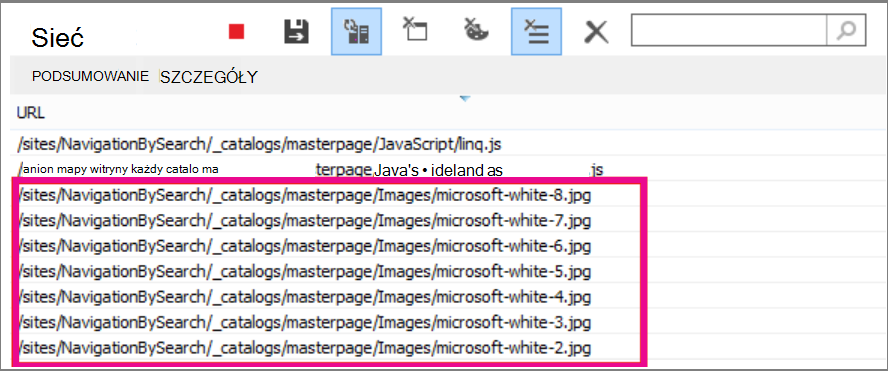

# <a name="delay-loading-images-and-javascript-in-sharepoint-online"></a>Opóźnienie ładowania obrazów i kodu JavaScript w u SharePoint Online

W tym artykule opisano, jak można zmniejszyć czas ładowania stron usługi SharePoint Online, używając języka JavaScript do opóźniania ładowania obrazów, a także czekając na załadowanie nieistniejących skryptów JavaScript do czasu załadowania strony.
  
Obrazy mogą mieć negatywny wpływ na szybkość ładowania stron SharePoint Online. Domyślnie większość nowoczesnych przeglądarek internetowych wstępnie pobiera obrazy podczas ładowania strony HTML. Jeśli obrazy nie są widoczne na ekranie, dopóki użytkownik nie przewinie w dół, może to niepotrzebnie spowolnić ładowanie strony. Obrazy mogą zablokować ładowanie widocznej części strony przez przeglądarkę. Aby rozwiązać ten problem, możesz użyć kodu JavaScript, aby pominąć ładowanie obrazów. Ponadto ładowanie nieistoczywego kodu JavaScript może spowalniać pobieranie plików na SharePoint stron. W tym temacie opisano niektóre metody, za pomocą których można poprawić czasy ładowania stron przy użyciu języka JavaScript w u SharePoint Online.
  
## <a name="improve-page-load-times-by-delaying-image-loading-in-sharepoint-online-pages-by-using-javascript"></a>Czas ładowania stron można ulepszyć, opóźniając ładowanie obrazów na stronach SharePoint Online przy użyciu języka JavaScript

Za pomocą języka JavaScript można uniemożliwić wstępne pobieranie obrazów przez przeglądarkę internetową. Przyspiesza to ogólne renderowanie dokumentów. W tym celu należy usunąć wartość atrybutu src \ z tagu i zamienić go na ścieżkę do pliku w atrybutze danych, takim jak data-src. Przykład:
  
```html

```

Zastosowanie tej metody nie spowoduje natychmiastowego pobrania obrazów przez przeglądarkę. Jeśli obraz znajduje się już w rzutni, kod JavaScript nakazuje przeglądarce pobrać adres URL z atrybutu danych i wstawić go jako wartość atrybutu src. Obraz jest ładowany dopiero wtedy, gdy użytkownik przewija obraz i pojawia się w widoku.
  
Aby to wszystko się stało, musisz użyć języka JavaScript.
  
W pliku tekstowym zdefiniuj funkcję **isElementInViewport(),** aby sprawdzić, czy element znajduje się w tej części przeglądarki, która jest widoczna dla użytkownika.
  
```javascript
function isElementInViewport(el) {
  if (!el)
    return false;
  var rect = el.getBoundingClientRect();
  return (
    rect.top >= 0 &amp;&amp;
    rect.left >= 0 &amp;&amp;
    rect.bottom <= (window.innerHeight || document.documentElement.clientHeight) &amp;&amp;
    rect.right <= (window.innerWidth || document.documentElement.clientWidth)
  );
}
```

Następnie użyj **funkcji isElementInViewport()** w funkcji **loadItemsInView(** ). Funkcja **loadItemsInView()** spowoduje załadowanie wszystkich obrazów, które mają wartość atrybutu data-src, jeśli znajdują się w tej części przeglądarki, która jest widoczna dla użytkownika. Dodaj do pliku tekstowego następującą funkcję:
  
```javascript
function loadItemsInView() {
  //Select elements by the row id.
  $("#row [data-src]").each(function () {
      var isVisible = isElementInViewport(this);
      if (isVisible) {
          if ($(this).attr("src") == undefined) {
              $(this).attr("src", $(this).data("src"));
          }
      }
  });
}
```

Na koniec **wywołaj loadItemsInView()** z poziomu **window.onscroll(),** jak pokazano w poniższym przykładzie. Dzięki temu wszystkie obrazy w rzutni są ładowane tak, jak użytkownik ich potrzebuje, ale nie wcześniej. Dodaj do pliku tekstowego następujące elementy:
  
```javascript
//Example of calling loadItemsInView() from within window.onscroll()
$(window).on("scroll", function () {
    loadItemsInView();
});

```

W SharePoint Online musisz dołączyć następującą funkcję do zdarzenia przewijania na tagu #s4-workspace\<div\>. Jest to spowodowane tym, że zdarzenia okien są zastępowane, aby wstążka nadal była dołączona do górnej części strony.
  
```javascript
//Keep the ribbon at the top of the page
$('#s4-workspace').on("scroll", function () {
    loadItemsInView();
});
```

Zapisz plik tekstowy jako plik JavaScript z rozszerzeniem .js, na przykład delayLoadImages.js.
  
Po zakończeniu pisania delayLoadImages.js możesz dodać zawartość pliku do strony wzorcowej w aplikacji SharePoint Online. W tym celu dodaj link do skryptu do nagłówka na stronie wzorcowej. Gdy znajduje się na stronie wzorcowej, kod JavaScript zostanie zastosowany do wszystkich stron w witrynie SharePoint Online, które używają tego układu strony wzorcowej. Jeśli zamierzasz używać tej funkcji tylko na jednej stronie witryny, osadź kod JavaScript na tej stronie za pomocą składników Web Part edytora skryptów. Aby uzyskać więcej informacji, zobacz poniższe tematy:
  
- [Jak to zrobić: stosowanie strony wzorcowej do witryny w programie SharePoint 2013](/sharepoint/dev/general-development/how-to-apply-a-master-page-to-a-site-in-sharepoint)

- [Jak to zrobić: tworzenie układu strony w programie SharePoint 2013](/sharepoint/dev/general-development/how-to-create-a-page-layout-in-sharepoint)

### <a name="example-referencing-the-javascript-delayloadimagesjs-file-from-a-master-page-in-sharepoint-online"></a>Przykład: Odwoływanie się do pliku delayLoadImages.js JavaScript ze strony wzorcowej w aplikacji SharePoint Online
  
Aby to zadziałało, na stronie wzorcowej należy również odwołać się do zapytania jQuery. W poniższym przykładzie widać, że w ładowania strony początkowej jest ładowany tylko jeden obraz, ale na stronie jest ich o kilka więcej.
  

  
Poniższy zrzut ekranu przedstawia pozostałe obrazy, które są pobierane po przewinięciu do widoku.
  

  
Opóźnienie ładowania obrazów przy użyciu języka JavaScript może być skuteczną techniką zwiększającą wydajność. Jeśli jednak ta technika zostanie zastosowana do publicznej witryny sieci Web, wyszukiwarki nie będą mogły przeszukiwać obrazów w taki sam sposób, jak regularnie kształtowany obraz. Może to mieć wpływ na rankingi w wyszukiwarkach, ponieważ metadane na samym obrazie nie są dostępne do czasu ładowania strony. Przeszukiwacze wyszukiwarki odczytują tylko kod HTML, dlatego nie będą widziały obrazów jako zawartości na stronie. Obrazy to jeden z czynników używanych do klasyfikacji stron w wynikach wyszukiwania. Jednym ze sposobów na jego zastosowanie jest użycie tekstu wprowadzającego do obrazów.
  
## <a name="github-code-sample-injecting-javascript-to-improve-performance"></a>GitHub przykładowy kod: wsadanie kodu JavaScript w celu zwiększenia wydajności

Nie przegap artykułu i przykładu kodu podanego w pliku [JavaScript w](https://go.microsoft.com/fwlink/p/?LinkId=524759) GitHub.
  
## <a name="see-also"></a>Zobacz też

[Przeglądarki obsługiwane w Office 2013 i Aplikacje Microsoft 365 dla przedsiębiorstw](https://support.office.com/article/57342811-0dc4-4316-b773-20082ced8a82)
  
[Jak to zrobić: stosowanie strony wzorcowej do witryny w programie SharePoint 2013](/sharepoint/dev/general-development/how-to-apply-a-master-page-to-a-site-in-sharepoint)
  
[Jak to zrobić: tworzenie układu strony w programie SharePoint 2013](/sharepoint/dev/general-development/how-to-create-a-page-layout-in-sharepoint)