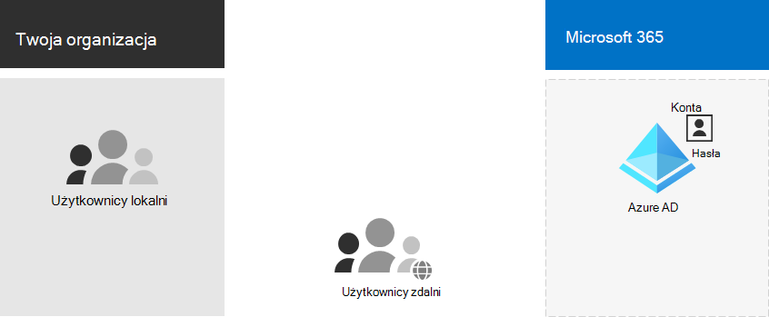
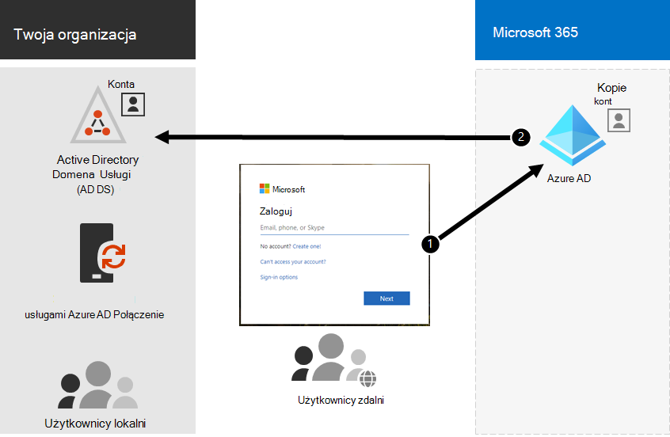

# Krok nr 1. Określanie modelu tożsamości w chmurze

Microsoft 365 używa Azure Active Directory (Azure AD), opartej na chmurze usługi uwierzytelniania i tożsamości użytkownika dołączonej do subskrypcji Microsoft 365, do zarządzania tożsamościami i uwierzytelnianiem na potrzeby Microsoft 365. Prawidłowe skonfigurowanie infrastruktury tożsamości ma kluczowe znaczenie dla zarządzania Microsoft 365 dostępu użytkowników i uprawnień organizacji.

Przed rozpoczęciem obejrzyj ten film wideo, aby zapoznać się z omówieniem modeli tożsamości i uwierzytelniania dla Microsoft 365.

 

> [!VIDEO https://www.microsoft.com/videoplayer/embed/RE2Pjwu]

Pierwszym wyborem planowania jest model tożsamości w chmurze.

## Modele tożsamości w chmurze firmy Microsoft

Aby zaplanować konta użytkowników, musisz najpierw zrozumieć dwa modele tożsamości w Microsoft 365. Tożsamości organizacji można zachować tylko w chmurze lub zachować tożsamości usług lokalna usługa Active Directory Domain Services (AD DS) i używać ich do uwierzytelniania, gdy użytkownicy uzyskują dostęp do Microsoft 365 usług w chmurze.

Oto dwa typy tożsamości oraz ich najlepsze dopasowanie i korzyści.

| Atrybut | Tożsamość tylko w chmurze | Tożsamość hybrydowa |
|:-------|:-----|:-----|
| **Definicja** | Konto użytkownika istnieje tylko w dzierżawie usługi Azure AD dla subskrypcji Microsoft 365. | Konto użytkownika istnieje w usługach AD DS, a kopia znajduje się również w dzierżawie usługi Azure AD dla subskrypcji Microsoft 365. Konto użytkownika w usłudze Azure AD może również zawierać wersję skrótu hasła konta użytkownika usługi AD DS, która już została skrótem. |
| **Jak Microsoft 365 uwierzytelnia poświadczenia użytkownika** | Dzierżawa usługi Azure AD dla subskrypcji Microsoft 365 przeprowadza uwierzytelnianie przy użyciu konta tożsamości w chmurze. | Dzierżawa usługi Azure AD dla subskrypcji Microsoft 365 obsługuje proces uwierzytelniania lub przekierowuje użytkownika do innego dostawcy tożsamości. |
| **Najlepsze dla** | Organizacje, które nie mają lokalnych usług AD DS lub nie potrzebują ich. | Organizacje korzystające z usług AD DS lub innego dostawcy tożsamości. |
| **Największa korzyść** | Proste w użyciu. Nie są wymagane żadne dodatkowe narzędzia katalogowe ani serwery. | Użytkownicy mogą używać tych samych poświadczeń podczas uzyskiwania dostępu do zasobów lokalnych lub chmurowych. |
||||

## Tożsamość tylko w chmurze

Tożsamość tylko w chmurze używa kont użytkowników, które istnieją tylko w usłudze Azure AD. Tożsamość tylko w chmurze jest zwykle używana przez małe organizacje, które nie mają serwerów lokalnych lub nie używają usług AD DS do zarządzania tożsamościami lokalnymi.

Poniżej przedstawiono podstawowe składniki tożsamości tylko w chmurze.

Zarówno użytkownicy lokalni, jak i zdalni (online) używają swoich kont użytkowników usługi Azure AD i haseł do uzyskiwania dostępu do Microsoft 365 usług w chmurze. Usługa Azure AD uwierzytelnia poświadczenia użytkownika na podstawie przechowywanych kont użytkowników i haseł.

### Administracja
Ponieważ konta użytkowników są przechowywane tylko w usłudze Azure AD, tożsamościami w chmurze można zarządzać za pomocą narzędzi, takich jak [Centrum administracyjne platformy Microsoft 365](/admin) i [Windows PowerShell](manage-user-accounts-and-licenses-with-microsoft-365-powershell.md).

## Tożsamość hybrydowa

Tożsamość hybrydowa używa kont pochodzących z lokalnych usług AD DS i mających kopię w dzierżawie usługi Azure AD subskrypcji Microsoft 365. Większość zmian, z wyjątkiem [określonych atrybutów konta](/azure/active-directory/hybrid/reference-connect-sync-attributes-synchronized), przepływa tylko w jedną stronę. Zmiany wprowadzone na kontach użytkowników usług AD DS są synchronizowane z ich kopią w usłudze Azure AD.

Usługa Azure AD Połączenie zapewnia bieżącą synchronizację kont. Działa na serwerze lokalnym, sprawdza zmiany w usługach AD DS i przekazuje te zmiany do usługi Azure AD. Usługa Azure AD Połączenie umożliwia filtrowanie, które konta są synchronizowane i czy synchronizować skrótową wersję haseł użytkownika, znaną jako synchronizacja skrótów haseł (PHS).

Podczas implementowania tożsamości hybrydowej lokalne usługi AD DS są autorytatywnym źródłem informacji o koncie. Oznacza to, że zadania administracyjne są wykonywane głównie lokalnie, które są następnie synchronizowane z usługą Azure AD.

Oto składniki tożsamości hybrydowej.

Dzierżawa usługi Azure AD ma kopię kont usług AD DS. W tej konfiguracji zarówno użytkownicy lokalni, jak i zdalni uzyskujący dostęp do Microsoft 365 usług w chmurze uwierzytelniają się w usłudze Azure AD.

> [!NOTE]
> Zawsze musisz używać usługi Azure AD Połączenie do synchronizowania kont użytkowników pod kątem tożsamości hybrydowej. Do wykonywania przypisywania licencji i zarządzania grupami, konfigurowania uprawnień i innych zadań administracyjnych obejmujących konta użytkowników potrzebne są zsynchronizowane konta użytkowników w usłudze Azure AD.

### Synchronizacja tożsamości hybrydowej i katalogów dla Microsoft 365

W zależności od potrzeb biznesowych i wymagań technicznych model tożsamości hybrydowej i synchronizacja katalogów to najczęstszy wybór dla klientów korporacyjnych, którzy przyjmują Microsoft 365. Synchronizacja katalogów umożliwia zarządzanie tożsamościami w Active Directory Domain Services (AD DS), a wszystkie aktualizacje kont użytkowników, grup i kontaktów są synchronizowane z dzierżawą Azure Active Directory (Azure AD) subskrypcji Microsoft 365.

>[!Note]
>Gdy konta użytkowników usług AD DS są synchronizowane po raz pierwszy, nie są automatycznie przypisywane licencji Microsoft 365 i nie mogą uzyskiwać dostępu do usług Microsoft 365, takich jak poczta e-mail. Najpierw musisz przypisać im lokalizację użycia. Następnie przypisz licencję do tych kont użytkowników indywidualnie lub dynamicznie za pośrednictwem członkostwa w grupie.
>

#### Uwierzytelnianie dla tożsamości hybrydowej

Istnieją dwa typy uwierzytelniania w przypadku korzystania z modelu tożsamości hybrydowej:

- Uwierzytelnianie zarządzane

  Usługa Azure AD obsługuje proces uwierzytelniania przy użyciu lokalnie przechowywanej wersji skrótu hasła lub wysyła poświadczenia do lokalnego agenta oprogramowania w celu uwierzytelnienia przez lokalne usługi AD DS.

- Uwierzytelnianie federacyjne

  Usługa Azure AD przekierowuje komputer kliencki żądający uwierzytelniania do innego dostawcy tożsamości.

#### Uwierzytelnianie zarządzane

Istnieją dwa typy uwierzytelniania zarządzanego:

- Synchronizacja skrótów haseł (PHS)

  Usługa Azure AD wykonuje samo uwierzytelnianie.

- Uwierzytelnianie przekazywane (PTA)

  Usługa Azure AD ma usług AD DS wykonać uwierzytelnianie.

##### Synchronizacja skrótów haseł (PHS)

Za pomocą języka PHS synchronizujesz konta użytkowników usług AD DS z Microsoft 365 i zarządzasz użytkownikami lokalnie. Skróty haseł użytkowników są synchronizowane z usług AD DS do usługi Azure AD, dzięki czemu użytkownicy mają to samo hasło lokalnie i w chmurze. Jest to najprostszy sposób włączania uwierzytelniania dla tożsamości usług AD DS w usłudze Azure AD. 

Gdy hasła są zmieniane lub resetowane lokalnie, nowe skróty haseł są synchronizowane z usługą Azure AD, dzięki czemu użytkownicy mogą zawsze używać tego samego hasła dla zasobów w chmurze i zasobów lokalnych. Hasła użytkowników nigdy nie są wysyłane do usługi Azure AD ani przechowywane w usłudze Azure AD w formie zwykłego tekstu. Niektóre funkcje usługi Azure AD w warstwie Premium, takie jak Identity Protection, wymagają języka PHS niezależnie od wybranej metody uwierzytelniania.
  
Zobacz [wybieranie odpowiedniej metody uwierzytelniania](/azure/active-directory/hybrid/choose-ad-authn) , aby dowiedzieć się więcej.
  
##### Uwierzytelnianie przekazywane (PTA)

Usługa PTA zapewnia prostą weryfikację haseł dla usług uwierzytelniania usługi Azure AD przy użyciu agenta oprogramowania działającego na co najmniej jednym serwerze lokalnym w celu weryfikacji użytkowników bezpośrednio z usługami AD DS. Za pomocą usługi PTA synchronizujesz konta użytkowników usług AD DS z Microsoft 365 i zarządzasz użytkownikami lokalnie. 

Usługa PTA umożliwia użytkownikom logowanie się do lokalnych i Microsoft 365 zasobów i aplikacji przy użyciu konta lokalnego i hasła. Ta konfiguracja weryfikuje hasła użytkowników bezpośrednio względem lokalnych usług AD DS bez przechowywania skrótów haseł w usłudze Azure AD. 

Usługa PTA jest również dla organizacji z wymaganiem zabezpieczeń, aby natychmiast wymusić stany konta użytkownika lokalnego, zasady haseł i godziny logowania. 
  
Zobacz [wybieranie odpowiedniej metody uwierzytelniania](/azure/active-directory/hybrid/choose-ad-authn) , aby dowiedzieć się więcej.
  
##### Uwierzytelnianie federacyjne

Uwierzytelnianie federacyjne jest przeznaczone głównie dla dużych organizacji korporacyjnych z bardziej złożonymi wymaganiami dotyczącymi uwierzytelniania. Tożsamości usług AD DS są synchronizowane z Microsoft 365, a konta użytkowników są zarządzane lokalnie. W przypadku uwierzytelniania federacyjnego użytkownicy mają to samo hasło lokalnie i w chmurze i nie muszą logować się ponownie, aby korzystać z Microsoft 365. 

Uwierzytelnianie federacyjne może obsługiwać dodatkowe wymagania dotyczące uwierzytelniania, takie jak uwierzytelnianie oparte na kartach inteligentnych lub uwierzytelnianie wieloskładnikowe innych firm, i jest zwykle wymagane, gdy organizacje mają wymaganie uwierzytelniania nieobsługiwane natywnie przez usługę Azure AD.
 
Zobacz [wybieranie odpowiedniej metody uwierzytelniania](/azure/active-directory/hybrid/choose-ad-authn) , aby dowiedzieć się więcej.
  
W przypadku dostawców uwierzytelniania i tożsamości innych firm lokalne obiekty katalogowe mogą być synchronizowane z Microsoft 365 i dostępem do zasobów w chmurze, które są zarządzane głównie przez dostawcę tożsamości innych firm (IdP). Jeśli Twoja organizacja korzysta z rozwiązania federacyjnego innej firmy, możesz skonfigurować logowanie za pomocą tego rozwiązania dla Microsoft 365 pod warunkiem, że rozwiązanie federacyjne innej firmy jest zgodne z usługą Azure AD.
  
Aby dowiedzieć się więcej, zobacz [listę zgodności federacji usługi Azure AD](/azure/active-directory/connect/active-directory-aadconnect-federation-compatibility) .
  
### Administracja

Ponieważ oryginalne i autorytatywne konta użytkowników są przechowywane w lokalnych usługach AD DS, możesz zarządzać tożsamościami przy użyciu tych samych narzędzi, co zarządzanie usługami AD DS.

Nie używasz Centrum administracyjne platformy Microsoft 365 ani programu PowerShell do Microsoft 365 do zarządzania synchronizowanymi kontami użytkowników w usłudze Azure AD.

## Następny krok

Przejdź do [kroku 2](protect-your-global-administrator-accounts.md) , aby zabezpieczyć konta administratora globalnego.
