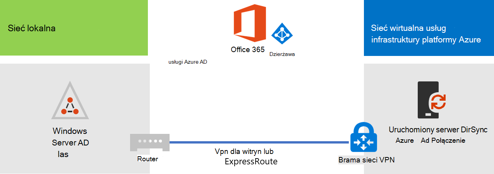

# Wdrażanie synchronizacji katalogów Microsoft 365 w Microsoft Azure

Azure Active Directory (Azure AD) Połączenie (wcześniej nazywane narzędziem do synchronizacji katalogów, narzędziem do synchronizacji katalogów lub narzędziem DirSync.exe) to aplikacja instalowana na serwerze przyłączonym do domeny w celu synchronizowania użytkowników usług lokalna usługa Active Directory Domain Services (AD DS) do dzierżawy Azure AD subskrypcji Microsoft 365. Microsoft 365 używa Azure AD dla swojej usługi katalogowej. Twoja subskrypcja Microsoft 365 obejmuje dzierżawę Azure AD. Ta dzierżawa może być również używana do zarządzania tożsamościami organizacji przy użyciu innych obciążeń w chmurze, w tym innych aplikacji i aplikacji SaaS na platformie Azure.

Możesz zainstalować Azure AD Połączenie na serwerze lokalnym, ale można go również zainstalować na maszynie wirtualnej na platformie Azure z następujących powodów:
  
- Serwery oparte na chmurze można aprowizować i konfigurować szybciej, dzięki czemu usługi będą wcześniej dostępne dla użytkowników.
- Platforma Azure oferuje lepszą dostępność witryny przy mniejszym nakładie pracy.
- Możesz zmniejszyć liczbę serwerów lokalnych w organizacji.

To rozwiązanie wymaga łączności między siecią lokalną a siecią wirtualną platformy Azure. Aby uzyskać więcej informacji, zobacz [Połączenie sieci lokalnej do Microsoft Azure sieci wirtualnej](connect-an-on-premises-network-to-a-microsoft-azure-virtual-network.md). 
  
> [!NOTE]
> W tym artykule opisano synchronizację pojedynczej domeny w jednym lesie. Azure AD Połączenie synchronizuje wszystkie domeny usług AD DS w lesie usługi Active Directory z Microsoft 365. Jeśli masz wiele lasów usługi Active Directory do zsynchronizowania z Microsoft 365, zobacz [Scenariusz synchronizacji katalogów z wieloma lasami z pojedynczym Sign-On](/azure/active-directory/hybrid/whatis-hybrid-identity). 
  
## Omówienie wdrażania synchronizacji katalogów Microsoft 365 na platformie Azure

Na poniższym diagramie przedstawiono Azure AD Połączenie uruchomione na maszynie wirtualnej na platformie Azure (serwerze synchronizacji katalogów), który synchronizuje lokalny las usług AD DS z subskrypcją Microsoft 365.
  

  
Na diagramie istnieją dwie sieci połączone przez połączenie sieci VPN typu lokacja-lokacja lub połączenie usługi ExpressRoute. Istnieje sieć lokalna, w której znajdują się kontrolery domeny usług AD DS, oraz sieć wirtualna platformy Azure z serwerem synchronizacji katalogów, która jest maszyną wirtualną działającą [Azure AD Połączenie](https://www.microsoft.com/download/details.aspx?id=47594). Istnieją dwa główne przepływy ruchu pochodzące z serwera synchronizacji katalogów:
  
-  Azure AD Połączenie wysyła zapytanie do kontrolera domeny w sieci lokalnej w celu wprowadzenia zmian w kontach i hasłach.
-  Azure AD Połączenie wysyła zmiany do kont i haseł do wystąpienia Azure AD subskrypcji Microsoft 365. Ponieważ serwer synchronizacji katalogów znajduje się w rozszerzonej części sieci lokalnej, zmiany te są wysyłane za pośrednictwem serwera proxy sieci lokalnej.
    
> [!NOTE]
> To rozwiązanie opisuje synchronizację pojedynczej domeny usługi Active Directory w jednym lesie usługi Active Directory. Azure AD Połączenie synchronizuje wszystkie domeny usługi Active Directory w lesie usługi Active Directory z Microsoft 365. Jeśli masz wiele lasów usługi Active Directory do zsynchronizowania z Microsoft 365, zobacz [Scenariusz synchronizacji katalogów z wieloma lasami z pojedynczym Sign-On](/azure/active-directory/hybrid/whatis-hybrid-identity). 
  
Podczas wdrażania tego rozwiązania istnieją dwa główne kroki:
  
1. Utwórz sieć wirtualną platformy Azure i nawiąż połączenie sieci VPN typu lokacja-lokacja z siecią lokalną. Aby uzyskać więcej informacji, zobacz [Połączenie sieci lokalnej do Microsoft Azure sieci wirtualnej](connect-an-on-premises-network-to-a-microsoft-azure-virtual-network.md).
    
2. Zainstaluj [Azure AD Połączenie](https://www.microsoft.com/download/details.aspx?id=47594) na maszynie wirtualnej przyłączonych do domeny na platformie Azure, a następnie zsynchronizuj lokalne usługi AD DS z Microsoft 365. Obejmuje to:
    
    Tworzenie maszyny wirtualnej platformy Azure do uruchamiania Azure AD Połączenie.
    
    Instalowanie i konfigurowanie [Azure AD Połączenie](https://www.microsoft.com/download/details.aspx?id=47594).
    
    Konfigurowanie Azure AD Połączenie wymaga poświadczeń (nazwy użytkownika i hasła) konta administratora Azure AD i konta administratora przedsiębiorstwa usług AD DS. Azure AD Połączenie uruchamiana natychmiast i na bieżąco w celu synchronizacji lokalnego lasu usług AD DS z Microsoft 365.
    
Przed wdrożeniem tego rozwiązania w środowisku produkcyjnym można użyć instrukcji w temacie [Symulowana konfiguracja podstawowa przedsiębiorstwa](simulated-ent-base-configuration-microsoft-365-enterprise.md) , aby skonfigurować tę konfigurację jako dowód koncepcji, pokazów lub eksperymentów.
  
> [!IMPORTANT]
> Po zakończeniu Azure AD Połączenie konfiguracji nie są zapisywane poświadczenia konta administratora przedsiębiorstwa usług AD DS. 
  
> [!NOTE]
> W tym rozwiązaniu opisano synchronizowanie pojedynczego lasu usług AD DS z Microsoft 365. Topologia omówiona w tym artykule reprezentuje tylko jeden sposób implementacji tego rozwiązania. Topologia organizacji może się różnić w zależności od unikatowych wymagań sieciowych i zagadnień dotyczących zabezpieczeń. 
  
## Planowanie hostowania serwera synchronizacji katalogów dla Microsoft 365 na platformie Azure

### Wymagania wstępne

Przed rozpoczęciem zapoznaj się z następującymi wymaganiami wstępnymi dotyczącymi tego rozwiązania:
  
- Przejrzyj powiązaną zawartość planowania w [temacie Planowanie sieci wirtualnej platformy Azure](connect-an-on-premises-network-to-a-microsoft-azure-virtual-network.md#plan-your-azure-virtual-network).
    
- Upewnij się, że spełniasz wszystkie [wymagania wstępne](connect-an-on-premises-network-to-a-microsoft-azure-virtual-network.md#prerequisites) dotyczące konfigurowania sieci wirtualnej platformy Azure.
    
- Masz subskrypcję Microsoft 365 obejmującą funkcję integracji z usługą Active Directory. Aby uzyskać informacje o subskrypcjach Microsoft 365, przejdź do [strony subskrypcji Microsoft 365](https://products.office.com/compare-all-microsoft-office-products?tab=2).
    
- Aprowizuj jedną maszynę wirtualną platformy Azure z systemem Azure AD Połączenie, aby zsynchronizować lokalny las usług AD DS z Microsoft 365.
    
    Musisz mieć poświadczenia (nazwy i hasła) dla konta administratora przedsiębiorstwa usług AD DS i konta administratora Azure AD.
    
### Założenia dotyczące projektowania architektury rozwiązania

Poniższa lista zawiera opis wyborów projektowych dokonanych dla tego rozwiązania.
  
- To rozwiązanie używa pojedynczej sieci wirtualnej platformy Azure z połączeniem sieci VPN typu lokacja-lokacja. Sieć wirtualna platformy Azure hostuje jedną podsieć z jednym serwerem, serwerem synchronizacji katalogów, który działa Azure AD Połączenie. 
    
- W sieci lokalnej istnieje kontroler domeny i serwery DNS.
    
- Azure AD Połączenie wykonuje synchronizację skrótów haseł zamiast logowania jednokrotnego. Nie trzeba wdrażać infrastruktury Active Directory Federation Services (AD FS). Aby dowiedzieć się więcej na temat synchronizacji skrótów haseł i opcji logowania jednokrotnego, zobacz [Wybieranie odpowiedniej metody uwierzytelniania dla rozwiązania Azure Active Directory tożsamości hybrydowej](/azure/active-directory/hybrid/choose-ad-authn).
    
Istnieją inne opcje projektowania, które można wziąć pod uwagę podczas wdrażania tego rozwiązania w środowisku. Są to następujące funkcje:
  
- Jeśli istnieją serwery DNS w istniejącej sieci wirtualnej platformy Azure, określ, czy serwer synchronizacji katalogów ma używać ich do rozpoznawania nazw zamiast serwerów DNS w sieci lokalnej.
    
- Jeśli w istniejącej sieci wirtualnej platformy Azure istnieją kontrolery domeny, ustal, czy skonfigurowanie lokacji i usług Active Directory może być lepszym rozwiązaniem. Serwer synchronizacji katalogów może wysyłać zapytania do kontrolerów domeny w sieci wirtualnej platformy Azure o zmiany kont i haseł zamiast kontrolerów domeny w sieci lokalnej.
    
## Plan wdrożenia

Wdrażanie Azure AD Połączenie na maszynie wirtualnej na platformie Azure składa się z trzech faz:
  
- Faza 1. Tworzenie i konfigurowanie sieci wirtualnej platformy Azure
    
- Faza 2. Tworzenie i konfigurowanie maszyny wirtualnej platformy Azure
    
- Faza 3. Instalowanie i konfigurowanie Azure AD Połączenie
    
Po wdrożeniu należy również przypisać lokalizacje i licencje dla nowych kont użytkowników w Microsoft 365.

### Faza 1. Tworzenie i konfigurowanie sieci wirtualnej platformy Azure

Aby utworzyć i skonfigurować sieć wirtualną platformy Azure, [ukończ fazę 1: przygotowanie sieci lokalnej](connect-an-on-premises-network-to-a-microsoft-azure-virtual-network.md#phase-1-prepare-your-on-premises-network) i [fazę 2. Tworzenie sieci wirtualnej między środowiskami na platformie Azure](connect-an-on-premises-network-to-a-microsoft-azure-virtual-network.md#phase-2-create-the-cross-premises-virtual-network-in-azure) w planie wdrożenia [Połączenie sieci lokalnej do sieci Microsoft Azure wirtualnej](connect-an-on-premises-network-to-a-microsoft-azure-virtual-network.md).
  
Jest to konfiguracja wyniku.
  

  
Na tym rysunku przedstawiono sieć lokalną połączoną z siecią wirtualną platformy Azure za pośrednictwem sieci VPN typu lokacja-lokacja lub połączenia usługi ExpressRoute.
  
### Faza 2. Tworzenie i konfigurowanie maszyny wirtualnej platformy Azure

Utwórz maszynę wirtualną na platformie Azure, korzystając z instrukcji [Tworzenie pierwszej maszyny wirtualnej Windows w Azure Portal](https://go.microsoft.com/fwlink/p/?LinkId=393098). Użyj następujących ustawień:
  
- W okienku **Podstawy** wybierz tę samą subskrypcję, lokalizację i grupę zasobów co sieć wirtualna. Zarejestruj nazwę użytkownika i hasło w bezpiecznej lokalizacji. Będą one potrzebne później, aby nawiązać połączenie z maszyną wirtualną.
    
- W okienku **Wybierz rozmiar** wybierz rozmiar **A2 w warstwie Standardowa**.
    
- W okienku **Ustawienia** w sekcji **Storage** wybierz typ magazynu w warstwie **Standardowa**. W sekcji **Sieć** wybierz nazwę sieci wirtualnej i podsieci do hostowania serwera synchronizacji katalogów (a nie podsieci GatewaySubnet). Pozostaw wszystkie inne ustawienia na wartościach domyślnych.
    
Sprawdź, czy serwer synchronizacji katalogów prawidłowo używa systemu DNS, sprawdzając wewnętrzny system DNS, aby upewnić się, że do maszyny wirtualnej został dodany rekord adresu (A) z jej adresem IP. 
  
Użyj instrukcji w [Połączenie do maszyny wirtualnej i zaloguj się](/azure/virtual-machines/windows/connect-logon), aby nawiązać połączenie z serwerem synchronizacji katalogów za pomocą połączenia pulpitu zdalnego. Po zalogowaniu dołącz maszynę wirtualną do lokalnej domeny usług AD DS.
  
Aby Azure AD Połączenie uzyskać dostęp do zasobów internetowych, należy skonfigurować serwer synchronizacji katalogów do korzystania z serwera proxy sieci lokalnej. W celu wykonania dodatkowych czynności konfiguracyjnych należy skontaktować się z administratorem sieci.
  
Jest to konfiguracja wyniku.
  

  
Na tym rysunku przedstawiono maszynę wirtualną serwera synchronizacji katalogów w sieci wirtualnej platformy Azure między środowiskami lokalnymi.
  
### Faza 3. Instalowanie i konfigurowanie Azure AD Połączenie

Wykonaj następującą procedurę:
  
1. Połączenie do serwera synchronizacji katalogów przy użyciu połączenia pulpitu zdalnego z kontem domeny usług AD DS z uprawnieniami administratora lokalnego. Zobacz [Połączenie do maszyny wirtualnej i zaloguj się](/azure/virtual-machines/windows/connect-logon).
    
2. Na serwerze synchronizacji katalogów otwórz artykuł [Konfigurowanie synchronizacji katalogów dla Microsoft 365](set-up-directory-synchronization.md) i postępuj zgodnie z instrukcjami synchronizacji katalogów z synchronizacją skrótów haseł.
    
> [!CAUTION]
> Instalator tworzy konto **AAD_xxxxxxxxxxxx** w jednostce organizacyjnej użytkownicy lokalni . Nie należy przenosić ani usuwać tego konta, a synchronizacja zakończy się niepowodzeniem.
  
Jest to konfiguracja wyniku.
  

  
Na tym rysunku przedstawiono serwer synchronizacji katalogów z Azure AD Połączenie w sieci wirtualnej platformy Azure między środowiskami lokalnymi.
  
### Przypisywanie lokalizacji i licencji użytkownikom w Microsoft 365

Azure AD Połączenie dodaje konta do subskrypcji Microsoft 365 z lokalnych usług AD DS, ale aby użytkownicy mogli zalogować się do Microsoft 365 i korzystać z jej usług, konta muszą być skonfigurowane z lokalizacją i licencjami. Wykonaj następujące kroki, aby dodać lokalizację i aktywować licencje dla odpowiednich kont użytkowników:
  
1. Zaloguj się do [Centrum administracyjne platformy Microsoft 365](https://admin.microsoft.com), a następnie kliknij pozycję **Administracja**.
    
2. W obszarze nawigacji po lewej stronie kliknij pozycję **Użytkownicy** > <a href="https://go.microsoft.com/fwlink/p/?linkid=834822" target="_blank">**aktywni użytkownicy**</a>.
3. Na liście kont użytkowników zaznacz pole wyboru obok użytkownika, który chcesz aktywować.
    
4. Na stronie użytkownika kliknij pozycję **Edytuj** **dla pozycji Licencje produktów**.
    
5. Na stronie **Licencje produktów** wybierz lokalizację dla użytkownika dla pozycji **Lokalizacja**, a następnie włącz odpowiednie licencje dla użytkownika.
    
6. Po zakończeniu kliknij przycisk **Zapisz**, a następnie kliknij dwukrotnie przycisk **Zamknij** .
    
7. Wstecz do kroku 3 dla dodatkowych użytkowników.
    
## Zobacz też

[Centrum rozwiązań i architektury platformy Microsoft 365](../solutions/index.yml)
  
[Połączenie sieci lokalnej do sieci wirtualnej Microsoft Azure](connect-an-on-premises-network-to-a-microsoft-azure-virtual-network.md)

[Pobierz Azure AD Połączenie](https://www.microsoft.com/download/details.aspx?id=47594)
  
[Konfigurowanie synchronizacji katalogów dla Microsoft 365](set-up-directory-synchronization.md)
