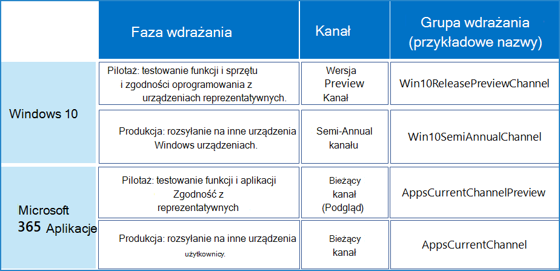

# Przykład szerokiego wdrożenia najnowszych wersji

Ten przykład konfiguracji kanału jest przeznaczony dla organizacji, która korzysta z szybkiego wdrażania najnowszych wersji, aby dopasować je do tych priorytetów biznesowych:

- Zapewnianie ciągłości działania dzięki aplikacjom i usługom firmy Microsoft.
- Zmaksymalizuj bezpieczeństwo urządzeń, usług i danych dzięki najnowszym funkcjom i poprawkom firmy Microsoft.
- Maksymalizuj produktywność użytkowników dzięki najnowszym funkcjom firmy Microsoft.

Te cele przekładają się na zadanie IT, które polega na znalezieniu równowagi między szybkim wdrożeniem produkcyjnym a wczesną weryfikacją z reprezentatywnym podzestawem użytkowników i urządzeń w celu zweryfikowania funkcjonalności przed szerokim wdrożeniem.

Nasza przykładowa organizacja ma 5000 pracowników w budynkach na całym świecie w Europie, Afryce, Azji i obu Amerykach. 70% pracowników korzysta z Microsoft 365 E3, a reszta organizacji używa Microsoft 365 E5.

>[!Note]
>Ten przykład został zaprojektowany tak, aby pokazać, jak można używać etapów wdrażania i grup, które mogą działać w organizacjach o wielu typach i rozmiarach.
>

Infrastruktura IT tej organizacji: 

- Jest w dużej mierze jednorodny, a Windows, Aplikacje Microsoft 365 i usługi w chmurze firmy Microsoft, które stanowią 60% zainstalowanej bazy. Kilka starszych systemów pozostaje po intensywnych, wieloletnich wysiłkach na rzecz uproszczenia i usprawnienia infrastruktury IT.
- Jest utrzymywany przez bardzo doświadczonych pracowników i ma za zadanie zapewnić użytkownikom i ich urządzeniom produktywność i bezpieczeństwo dzięki obserwowaniu potencjalnych klientów firmy Microsoft w ich wersjach.

## Etapy wdrażania i aktualizacji

W oparciu o cele szybkiego wdrażania najnowszej wersji ta przykładowa organizacja korzysta z dwuetapowego procesu wdrażania.

1. **Użyj wersji zapoznawczej lub wdrożenia pilotażowego:** Weryfikuj i iteruj z wczesnymi użytkownikami, pracownikami IT, użytkownikami z reprezentatywnymi konfiguracjami i personelem szkoleniowym. 

   Wcześni użytkownicy, pracownicy IT, użytkownicy z reprezentatywną konfiguracją mogą weryfikować funkcje innych aplikacji i urządzeń przed wdrożeniem nowych funkcji w pozostałej części organizacji.

   Menedżerowie zmian mają wczesny wgląd w nowe funkcje przed powszechnym wdrożeniem i mogą planować obsługę komunikatów i wdrażanie.

   Personel szkoleniowy może zaplanować nowe kursy wewnętrzne lub zaktualizować istniejące kursy dla nowych funkcji przed powszechnym wdrożeniem.

2. **Wdrożenie produkcyjne:** Wdrożenie dla wszystkich pozostałych użytkowników według regionu, działu lub innej metody wdrażania.

## Konfiguracja wdrożenia dla Windows 10

Ogólnym celem jest przeprowadzenie szerokiego wdrożenia najnowszej wersji kanału Semi-Annual po walidacji zmian kanału wersji zapoznawczej wersji przez grupę reprezentatywnych użytkowników i ich urządzeń.

Aby uzyskać więcej informacji na temat metod i strategii wdrażania Windows 10, zobacz [wdrażanie Windows 10](/windows/deployment/).

| Etapie | Kanał | Grupa wdrożeń |
|:-------|:-------|:-----|
| Pilot |  **Kanał wersji zapoznawczej**  <ul><li>Przeznaczenie: Wdrażanie aktualizacji funkcji dla pracowników IT i wczesnych użytkowników w celu weryfikacji na reprezentatywnych urządzeniach i konfiguracjach (językach, aplikacjach innych firm). </li><li> Stan: W pełni zgodne i obsługiwane dla klientów komercyjnych i nie jest ono wliczane do umów pomocy technicznej. </li></ul> | **Win10ReleasePreviewChannel (przykładowa** nazwa)    Członkowie to grupy zawierające: <ul><li> Windows entuzjastów w różnych działach i lokalizacjach </li><li> Personel z konfiguracjami wymagającymi weryfikacji </li><li> Administratorzy IT i pracownicy wdrożeniowi IT </li><li> Menedżerowie zmian </li><li> Wewnętrzny personel szkoleniowy </li></ul> |
| Produkcja |  **Półroczny kanał**  <ul><li>Przeznaczenie: szerokie wdrażanie najnowszych aktualizacji funkcji w pozostałej części organizacji. </li><li> Stan: W pełni zgodne i obsługiwane. </li></ul> | **Win10SemiAnnualChannel** (przykładowa nazwa)    Członkowie to wszyscy użytkownicy, którzy nie należą do grupy Win10ReleasePreviewChannel. |
||||

Ta organizacja korzysta z najlepszych rozwiązań w zakresie wdrażania ładunku kanału wersji zapoznawczej wersji w taki sam sposób, w jaki wdrażają wersje kanału Semi-Annual, takie jak Windows Update lub Windows Server Update Services, i że stosują te same zasady dla obu aktualizacji kanału.

Trwający proces aktualizacji:

1. Zmiany kanału wersji zapoznawczej są wdrażane w grupie wdrożeń Win10ReleasePreviewChannel (przykładowa nazwa).
2. Członkowie grupy Win10ReleasePreviewChannel potwierdzają, że zmiany kanału wersji zapoznawczej wersji zapoznawczej działają dla pracowników wdrożeń IT, którzy mogą przekazać opinię firmie Microsoft i poczekać na kolejne zmiany kanału wersji zapoznawczej wersji zapoznawczej, aby uzyskać dodatkową walidację.
3. Semi-Annual zmiany funkcji kanału są wdrażane w grupie wdrożeń Win10SemiAnnualChannel. 

>[!Note]
>Chociaż kanał Semi-Annual jest zalecanym kanałem, dział IT powinien korzystać z narzędzi do zarządzania i określać, kiedy wdrożyć najnowszą wersję kanału Semi-Annual w organizacji, a następnie wdrażać ją falami.
>

## Konfiguracja wdrożenia dla Aplikacje Microsoft 365

Ogólnym celem jest przeprowadzenie szerokiego wdrożenia najnowszej wersji bieżącego kanału po walidacji zmian bieżącego kanału (wersja zapoznawcza) przez grupę reprezentatywnych użytkowników.

Zobacz [wdrażanie Aplikacje Microsoft 365](/deployoffice/plan-office-365-proplus), aby uzyskać więcej informacji na temat metod i strategii wdrażania Aplikacje Microsoft 365.

| Etapie | Kanał | Grupa wdrożeń |
|:-------|:-------|:-----|
| Pilot |  **Bieżący kanał (wersja zapoznawcza)** <ul><li> Przeznaczenie: {podaj grupie reprezentatywnych użytkowników podgląd nowych funkcji Aplikacje Microsoft 365} Wdrażanie aktualizacji funkcji natychmiast po przetestowaniu ich z użytkownikami bieżącego kanału (wersja zapoznawcza) i są gotowe do produkcji. </li><li> Stan: W pełni zgodne i obsługiwane.</li><li> Jak często: aktualizacje są aktualizowane 2–3 razy w każdym miesiącu. </li></ul> | **AppsCurrentChannelPreview** (przykładowa nazwa)    Członkowie to grupy zawierające: <ul><li> Office entuzjastów aplikacji w różnych działach i lokalizacjach </li><li> Personel z konfiguracjami wymagającymi weryfikacji </li><li> Administratorzy IT i pracownicy wdrożeniowi IT </li><li> Menedżerowie zmian </li><li> Wewnętrzny personel szkoleniowy </li></ul>|
| Produkcja | **Bieżący kanał** <ul><li> Przeznaczenie: szerokie wdrażanie najnowszych aktualizacji funkcji w pozostałej części organizacji. </li><li> Stan: W pełni zgodne i obsługiwane. </li></ul> |  **AppsCurrentChannel** (przykładowa nazwa)    Członkowie to wszyscy użytkownicy, którzy nie należą do grupy AppsCurrentChannelPreview. |
|||

Trwający proces aktualizacji:

1. Bieżące zmiany kanału (wersja zapoznawcza) są wdrażane w grupie wdrożeń AppsCurrentChannelPreview.
2. Członkowie grupy AppsCurrentChannelPreview potwierdzają, że bieżące zmiany kanału (wersja zapoznawcza) działają dla pracowników wdrożeń IT, którzy mogą przekazać opinię firmie Microsoft i poczekać na kolejną wersję bieżącego kanału (wersja zapoznawcza) w celu dodatkowej weryfikacji.
3. Bieżące zmiany kanału są wdrażane w grupie wdrożeń AppsCurrentChannel. 

## Podsumowanie wizualizacji

Oto produkty, ich kanały i grupy wdrożeń używane przez tę przykładową organizację. 

## Zobacz też

[Przykładowe konfiguracje wdrażania i aktualizowania kanałów](deploy-update-channels-examples.md)

[Microsoft 365 dla przedsiębiorstw — omówienie](microsoft-365-overview.md)

[Przewodniki laboratorium testowego](m365-enterprise-test-lab-guides.md)