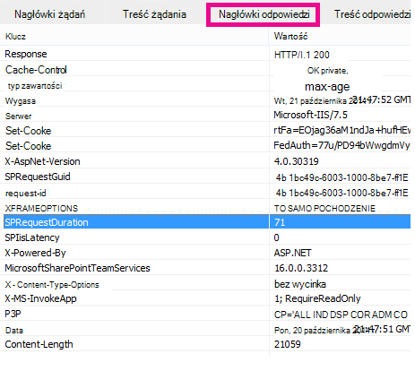

# Diagnozowanie problemów z wydajnością w usłudze SharePoint Online

W tym artykule przedstawiono sposób diagnozowania typowych problemów z witryną SharePoint Online przy użyciu narzędzi programistycznych programu Internet Explorer.
  
Istnieją cztery różne sposoby identyfikowania, że strona w witrynie SharePoint Online ma problem z wydajnością dostosowań.

- Diagnostyka wydajności witryny i strony
  
- Monitor sieci paska narzędzi F12

- Porównanie z nie dostosowanym punktem odniesienia

- metryki nagłówka odpowiedzi usługi SharePoint Online

W tym temacie opisano sposób diagnozowania problemów z wydajnością przy użyciu każdej z tych metod. Po ustaleniu przyczyny problemu możesz pracować nad rozwiązaniem, korzystając z artykułów na temat poprawy wydajności SharePoint, które można znaleźć w programie https://aka.ms/tune.  

## Korzystanie z diagnostyki wydajności witryny i strony z centrum Administracja Microsoft 365

> [!NOTE]
> Jeśli jesteś administratorem i masz problemy z wydajnością w SharePoint, wybierz pozycję **Uruchom testy** poniżej, co spowoduje wypełnienie diagnostyki wydajności witryny i strony w centrum Administracja Microsoft 365. Te testy będą sprawdzać konfigurację i szybko zalecić kolejne kroki, aby zwiększyć wydajność SharePoint dzierżawy.
>> [!div class="nextstepaction"]
>> [Uruchamianie testów: sprawdzanie wydajności SharePoint](https://aka.ms/PillarSiteandPagePerf)

> [!NOTE] 
> Ta funkcja nie jest dostępna dla Microsoft 365 Government, Microsoft 365 obsługiwanych przez firmę 21Vianet lub Microsoft 365 Niemczech.
  
## Diagnozowanie wydajności w usłudze SharePoint Online przy użyciu paska narzędzi F12

W tym artykule używamy programu Internet Explorer 11. Wersje narzędzi deweloperskich F12 w innych przeglądarkach mają podobne funkcje, choć mogą wyglądać nieco inaczej. Aby uzyskać informacje na temat narzędzi deweloperskich F12, zobacz:
  
- [Co nowego w narzędziach F12](/previous-versions/windows/internet-explorer/ie-developer/dev-guides/bg182632(v=vs.85))

- [Korzystanie z narzędzi deweloperskich F12](/previous-versions/windows/internet-explorer/ie-developer/samples/bg182326(v=vs.85))

Aby wyświetlić narzędzia deweloperskie, naciśnij klawisz **F12** , a następnie kliknij ikonę Wi-Fi:
  

  
Na karcie **Sieć** naciśnij zielony przycisk odtwarzania, aby załadować stronę. Narzędzie zwraca wszystkie pliki żądane przez przeglądarkę w celu uzyskania żądanej strony. Na poniższym zrzucie ekranu przedstawiono jedną z takich list.
  

  
Możesz również zobaczyć czas pobierania plików po prawej stronie, jak pokazano na tym zrzucie ekranu.
  

  
Daje to wizualną reprezentację czasu ładowania pliku. Zielona linia reprezentuje, kiedy strona jest gotowa do renderowania przez przeglądarkę. Dzięki temu możesz szybko wyświetlić różne pliki, które mogą powodować powolne ładowanie stron w witrynie.
  
## Konfigurowanie nie dostosowanego planu bazowego dla usługi SharePoint Online

Najlepszym sposobem określenia słabych punktów wydajności witryny jest skonfigurowanie całkowicie kompletnego zbioru witryn w usłudze SharePoint Online. W ten sposób można porównać wszystkie różne aspekty witryny z tym, co można uzyskać bez dostosowywania na stronie. Strona główna OneDrive dla Firm jest dobrym przykładem oddzielnego zbioru witryn, który prawdopodobnie nie będzie miał żadnych dostosowań.
  
## Wyświetlanie informacji nagłówka odpowiedzi SharePoint

W usłudze SharePoint Online możesz uzyskać dostęp do informacji wysyłanych z powrotem do przeglądarki w nagłówku odpowiedzi dla każdego pliku. Najbardziej przydatną wartością do diagnozowania problemów z wydajnością jest **SPRequestDuration**, która wyświetla czas przetwarzania żądania na serwerze. Może to pomóc w ustaleniu, czy żądanie jest duże i intensywnie obciąża zasoby. Jest to najlepszy wgląd w to, ile pracy wykonuje serwer, aby obsłużyć stronę.

### Aby wyświetlić informacje nagłówka odpowiedzi SharePoint
  
1. Upewnij się, że masz zainstalowane narzędzia F12. Aby uzyskać więcej informacji na temat pobierania i instalowania tych narzędzi, zobacz [Co nowego w narzędziach F12](/previous-versions/windows/internet-explorer/ie-developer/dev-guides/bg182632(v=vs.85)).

2. W narzędziach F12 na karcie **Sieć** naciśnij zielony przycisk odtwarzania, aby załadować stronę.

3. Kliknij jeden z plików aspx zwróconych przez narzędzie, a następnie kliknij pozycję **SZCZEGÓŁY**.

    
  
4. Kliknij **pozycję Nagłówki odpowiedzi**.

    
  
## Co powoduje problemy z wydajnością w usłudze SharePoint Online?

W artykule [Opcje nawigacji dla usługi SharePoint Online](navigation-options-for-sharepoint-online.md) przedstawiono przykład użycia wartości SPRequestDuration w celu określenia, że skomplikowana nawigacja strukturalna powodowała, że przetwarzanie strony na serwerze trwało długo. Przyjmując wartość dla lokacji punktu odniesienia (bez dostosowywania), można określić, czy ładowanie danego pliku zajmuje dużo czasu. Przykładem używanym w [opcjach nawigacji dla SharePoint Online](navigation-options-for-sharepoint-online.md) jest główny plik aspx. Ten plik zawiera większość kodu ASP.NET, który jest uruchamiany na potrzeby ładowania strony. W zależności od używanego szablonu witryny może to być start.aspx, home.aspx, default.aspx lub inna nazwa, jeśli dostosujesz stronę główną. Jeśli ta liczba jest znacznie wyższa niż w lokacji odniesienia, oznacza to, że na stronie dzieje się coś złożonego, co powoduje problemy z wydajnością.
  
Po zidentyfikowaniu problemu specyficznego dla witryny zalecanym sposobem ustalenia, co powoduje niską wydajność, jest wyeliminowanie wszystkich możliwych przyczyn, takich jak dostosowania stron, a następnie dodanie ich z powrotem do witryny jeden po drugim. Po usunięciu wystarczającej liczby dostosowań, które dobrze sprawdzają się na stronie, możesz dodać z powrotem określone dostosowania jeden po drugim.
  
Jeśli na przykład masz złożoną nawigację, spróbuj zmienić nawigację, aby nie pokazywać podstrony, sprawdź narzędzia deweloperskie, aby sprawdzić, czy ma to znaczenie. Lub jeśli masz dużą ilość zestawień zawartości, spróbuj usunąć je ze swojej strony i sprawdzić, czy to poprawia sytuację. Jeśli wyeliminujesz wszystkie możliwe przyczyny i dodasz je po kolei, możesz łatwo zidentyfikować, które funkcje są największym problemem, a następnie pracować nad rozwiązaniem.
