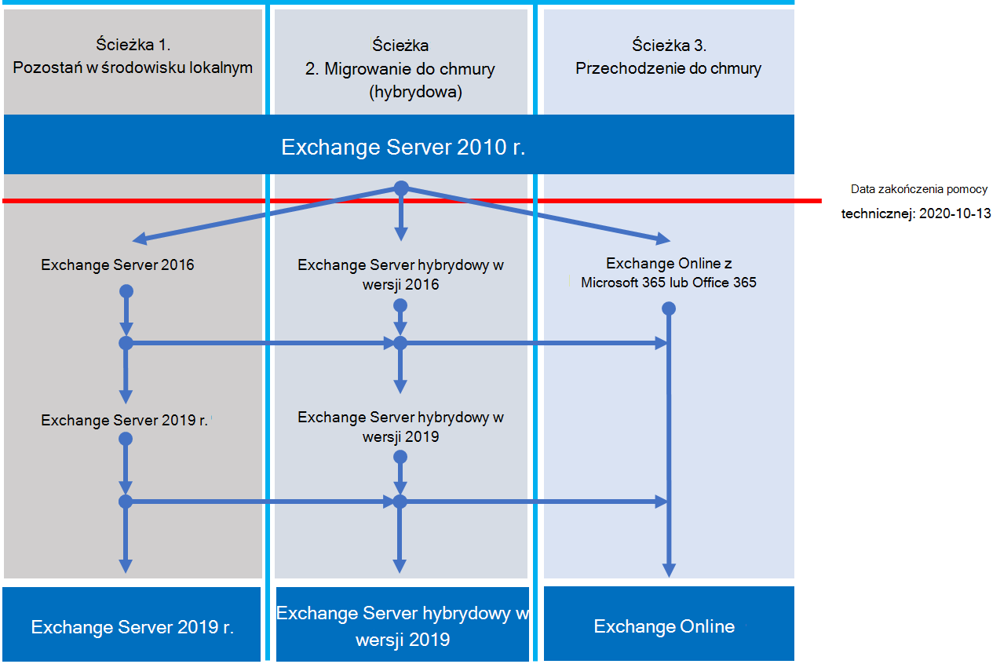

# Exchange 2010 r. plan zakończenia wsparcia

*Ten artykuł dotyczy zarówno Microsoft 365 Enterprise, jak i Office 365 Enterprise.*

Exchange Server 2010 r. osiągnęła koniec wsparcia **13 października 2020 r**. Jeśli migracja nie została jeszcze rozpoczęta z Exchange 2010 r. do Microsoft 365, Office 365 lub Exchange 2016 r., nadszedł czas, aby rozpocząć planowanie.

## Co oznacza *koniec wsparcia* ?

Większość produktów firmy Microsoft ma cykl życia pomocy technicznej, podczas którego otrzymują nowe funkcje, poprawki błędów, poprawki zabezpieczeń itd. Ten cykl życia zazwyczaj trwa 10 lat od początkowej wersji produktu. Koniec tego cyklu życia jest określany jako koniec wsparcia technicznego produktu. Ponieważ Exchange 2010 r. osiągnął koniec wsparcia 13 października 2020 r., firma Microsoft nie zapewnia już:

- Pomoc techniczna dotycząca problemów, które mogą wystąpić.
- Poprawki błędów w przypadku problemów, które mogą mieć wpływ na stabilność i użyteczność serwera.
- Poprawki zabezpieczeń dla luk w zabezpieczeniach, które mogą narazić serwer na naruszenia zabezpieczeń.
- Aktualizacje stref czasowych.

Instalacja programu Exchange 2010 będzie nadal działać po upływie tego terminu. Jednak ze względu na zmiany wymienione powyżej zdecydowanie zalecamy jak najszybszą migrację z Exchange 2010 r.

Aby uzyskać więcej informacji na temat zbliżania się do końca pomocy technicznej, zobacz [Zasoby ułatwiające uaktualnienie z serwerów i klientów Office 2010](upgrade-from-office-2010-servers-and-products.md).

## Jakie są moje opcje?

To świetny moment, aby zapoznać się z opcjami i przygotować plan migracji. Można:

- Przeprowadź pełną migrację do Microsoft 365. Migrowanie skrzynek pocztowych przy użyciu migracji jednorazowej, minimalnej hybrydowej lub pełnej migracji hybrydowej. Następnie usuń lokalne serwery Exchange i usługę Active Directory.
- Migrowanie serwerów Exchange 2010 do Exchange 2016 na serwerach lokalnych.

> [!IMPORTANT]
> Jeśli organizacja zdecyduje się migrować skrzynki pocztowe do Microsoft 365 ale planuje zachować Połączenie DirSync lub Azure AD w celu dalszego zarządzania kontami użytkowników z lokalna usługa Active Directory, musisz zachować co najmniej jeden serwer Exchange firmy Microsoft w środowisku lokalnym. Jeśli usuniesz wszystkie serwery Exchange, nie będzie można wprowadzać zmian Exchange adresatów w Exchange Online, ponieważ źródło urzędu pozostaje w lokalna usługa Active Directory. W tym miejscu należy wprowadzić zmiany. W tym scenariuszu dostępne są następujące opcje:
>
> - *Zalecane:* W przypadku migracji skrzynek pocztowych do Microsoft 365 i uaktualnienia serwerów do 13 października 2020 r. użyj Exchange 2010 r., aby nawiązać połączenie z Microsoft 365 i migrować skrzynki pocztowe. Następnie zmigruj Exchange 2010 r. do Exchange 2016 r. i likwiduj wszystkie pozostałe serwery Exchange 2010 r.
> - Jeśli migracja skrzynki pocztowej i uaktualnienie serwera lokalnego nie zostały ukończone do 13 października 2020 r., najpierw uaktualnij serwery lokalne Exchange 2010 do Exchange 2016 r. Następnie użyj programu Exchange 2016, aby nawiązać połączenie z Microsoft 365 i zmigrować skrzynki pocztowe.

> [!NOTE]
> Jest to nieco bardziej skomplikowane, ale można również migrować skrzynki pocztowe do Microsoft 365 podczas migracji lokalnych serwerów Exchange 2010 do Exchange 2016 roku.

Poniżej przedstawiono trzy ścieżki, które można wykonać, aby uniknąć zakończenia wsparcia dla Exchange Server 2010 roku.

Poniższe sekcje bardziej szczegółowo eksplorują każdą opcję.

## Migracja do platformy Microsoft 365

Migrowanie poczty e-mail do Microsoft 365 jest najlepszą i najprostszą opcją ułatwiającą wycofanie wdrożenia Exchange 2010 r. Migracja do Microsoft 365 umożliwia utworzenie pojedynczego przeskoku ze starej technologii do bieżących funkcji, w tym:

- Możliwości zgodności, takie jak zasady przechowywania, In-Place i blokada postępowania sądowego, wykrywanie elektroniczne w miejscu i nie tylko.
- Microsoft Teams.
- Power BI.
- Skoncentrowana skrzynka odbiorcza.
- MyAnalytics.

Microsoft 365 otrzymuje również nowe funkcje i środowiska, dzięki czemu twoja organizacja może od razu zacząć z nich korzystać. Ponadto nie musisz się martwić o:

- Zakup i konserwacja sprzętu.
- Płacenie za ciepło i chłodzenie serwerów.
- Aktualizowanie poprawek zabezpieczeń, produktów i stref czasowych.
- Obsługa magazynu i oprogramowania w celu obsługi wymagań dotyczących zgodności.
- Uaktualnianie do nowej wersji Exchange. Zawsze korzystasz z najnowszej wersji Exchange w Microsoft 365.

### Jak przeprowadzić migrację do Microsoft 365?

W zależności od organizacji masz kilka opcji, aby uzyskać dostęp do Microsoft 365. Najpierw należy wziąć pod uwagę kilka kwestii, takich jak:

- Liczba miejsc lub skrzynek pocztowych, które należy przenieść.
- Jak długo ma trwać migracja.
- Bez względu na to, czy podczas migracji potrzebna jest bezproblemowa integracja instalacji lokalnej z Microsoft 365.

W tej tabeli przedstawiono opcje migracji i najważniejsze czynniki, które określają, której metody użyć.

|Opcja migracji|Rozmiar organizacji|Długość|
|---|---|---|
|Migracja jednorazowa|Mniej niż 150 miejsc|Tydzień lub mniej|
|Minimalna migracja hybrydowa|Mniej niż 150 miejsc|Co najmniej kilka tygodni|
|Pełna migracja hybrydowa|Ponad 150 miejsc|Kilka tygodni lub więcej|

Poniższe sekcje zawierają omówienie tych metod. Aby uzyskać więcej informacji, zobacz [Wybieranie ścieżki migracji](https://support.office.com/article/Decide-on-a-migration-path-0d4f2396-9cef-43b8-9bd6-306d01df1e27).

### Migracja jednorazowa

Podczas migracji jednorazowej migrujesz wszystkie skrzynki pocztowe, grupy dystrybucyjne, kontakty itd., aby Office 365 w określonym dniu i o określonej godzinie. Po zakończeniu zamykasz lokalne serwery Exchange i rozpoczynasz korzystanie z Microsoft 365 wyłącznie.

Migracja jednorazowa doskonale nadaje się w przypadku małych organizacji, które nie mają wielu skrzynek pocztowych, chcą szybko Microsoft 365 i nie chcą zajmować się złożonością innych metod. Ale powinien zostać ukończony za tydzień lub mniej. Wymaga to od użytkowników ponownej konfiguracji profilów Outlook. Migracja jednorazowa może migrować do 2000 skrzynek pocztowych, ale zalecamy użycie jej maksymalnie przez 150. Jeśli spróbujesz przeprowadzić więcej migracji, może minąć czas na przeniesienie wszystkich skrzynek pocztowych przed upływem terminu, a personel pomocy technicznej IT może zostać przytłoczony prośbami o pomoc użytkownikom w ponownym skonfigurowaniu Outlook.

Oto kwestie, które należy wziąć pod uwagę podczas migracji jednorazowej:

- Microsoft 365 będzie musiał nawiązać połączenie z serwerami Exchange 2010 przy użyciu Outlook Anywhere przez port TCP 443.
- Wszystkie lokalne skrzynki pocztowe zostaną przeniesione do Microsoft 365.
- Potrzebne będzie konto administratora lokalnego, które ma dostęp do odczytu do skrzynek pocztowych użytkowników.
- Zaakceptowane domeny Exchange 2010, których chcesz użyć w Microsoft 365 muszą zostać dodane jako zweryfikowane domeny w usłudze.
- Między rozpoczęciem migracji a rozpoczęciem fazy ukończenia Microsoft 365 będzie okresowo synchronizować skrzynki pocztowe Microsoft 365 i lokalne. Dzięki temu można ukończyć migrację bez obaw o pozostawienie wiadomości e-mail w lokalnych skrzynkach pocztowych.
- Użytkownicy otrzymają nowe hasła tymczasowe dla swojego konta Microsoft 365. Po pierwszym zalogowaniu się do skrzynek pocztowych będą musieli je zmienić.
- Potrzebna będzie licencja Microsoft 365 obejmująca Exchange Online dla każdej migrowanych skrzynek pocztowych użytkownika.
- Użytkownicy będą musieli skonfigurować nowy profil Outlook na każdym z urządzeń i ponownie pobrać wiadomość e-mail. Ilość wiadomości e-mail pobranych przez Outlook może się różnić. Aby uzyskać więcej informacji, zobacz [Praca w trybie offline w Outlook](https://support.microsoft.com/office/f3a1251c-6dd5-4208-aef9-7c8c9522d633).

Aby dowiedzieć się więcej na temat migracji jednorazowej, zobacz:

- [Co musisz wiedzieć o migracji e-mail z jednorazowym dostępem](/Exchange/mailbox-migration/what-to-know-about-a-cutover-migration)
- [Przeprowadzanie migracji jednorazowej wiadomości e-mail do Office 365](/Exchange/mailbox-migration/cutover-migration-to-office-365)

### Minimalna migracja hybrydowa

W minimalnej wersji hybrydowej lub ekspresowej migracja przenosi kilkaset skrzynek pocztowych do Microsoft 365 w ciągu kilku tygodni. Ta metoda nie obsługuje zaawansowanych funkcji migracji hybrydowej, takich jak udostępnione informacje o kalendarzu wolny/zajęty.

Minimalna migracja hybrydowa jest doskonałym rozwiązaniem dla organizacji, które muszą poświęcić więcej czasu na migrację swoich skrzynek pocztowych do Microsoft 365, ale nadal planują ukończenie migracji w ciągu kilku tygodni. Niektóre korzyści wynikające z bardziej zaawansowanej *migracji w pełni hybrydowej* można uzyskać bez dużej złożoności. Możesz kontrolować, ile i które skrzynki pocztowe mają zostać zmigrowane w danym momencie. Microsoft 365 skrzynki pocztowe zostaną utworzone przy użyciu nazw użytkowników i haseł kont lokalnych. W przeciwieństwie do migracji jednorazowych użytkownicy nie muszą ponownie tworzyć swoich profilów Outlook.

Poniżej przedstawiono kwestie, które należy wziąć pod uwagę w kwestii minimalnej migracji hybrydowej:

- Konieczne będzie przeprowadzenie jednorazowej synchronizacji katalogów między serwerami lokalna usługa Active Directory i Microsoft 365.
- Użytkownicy będą mogli zalogować się do swojej skrzynki pocztowej Microsoft 365 przy użyciu tej samej nazwy użytkownika i hasła, co przed skrzynką pocztową.
- Potrzebna będzie licencja Microsoft 365 obejmująca Exchange Online dla każdej migrowanych skrzynek pocztowych użytkownika.
- Użytkownicy nie będą musieli konfigurować nowego profilu Outlook na większości swoich urządzeń, chociaż niektóre starsze telefony z systemem Android mogą potrzebować nowego profilu. Użytkownicy nie będą musieli ponownie załadować wiadomości e-mail.

Aby uzyskać więcej informacji, zobacz [Use Minimal Hybrid to quickly migrate Exchange mailboxes to Office 365 (Używanie minimalnej hybrydowej do szybkiej migracji Exchange skrzynek pocztowych do Office 365](/Exchange/mailbox-migration/use-minimal-hybrid-to-quickly-migrate)).

### Pełna hybryda

W przypadku pełnej migracji hybrydowej masz wiele setek, do dziesiątek tysięcy skrzynek pocztowych i przenosisz niektóre lub wszystkie do Microsoft 365. Ponieważ te migracje są zazwyczaj długoterminowe, migracje hybrydowe umożliwiają:

- Pokaż użytkownikom lokalnym informacje o kalendarzu wolny/zajęty dla użytkowników w Microsoft 365 i na odwrót.
- Zobacz ujednoliconą globalną listę adresów zawierającą adresatów zarówno w środowisku lokalnym, jak i w Microsoft 365.
- Wyświetl pełne Outlook właściwości adresatów dla wszystkich użytkowników, niezależnie od tego, czy są oni lokalni, czy w Microsoft 365.
- Bezpieczna komunikacja poczty e-mail między lokalnymi serwerami Exchange i Office 365 przy użyciu protokołu TLS i certyfikatów.
- Traktuj komunikaty wysyłane między lokalnymi serwerami Exchange i Microsoft 365 jako wewnętrzne, umożliwiając:
  - Być prawidłowo oceniane i przetwarzane przez agentów transportu i zgodności kierowania komunikatów wewnętrznych.
  - Pomiń filtry antyspamowe.

Pełne migracje hybrydowe są najlepsze dla organizacji, które oczekują, że pozostaną w konfiguracji hybrydowej przez wiele miesięcy lub dłużej. Funkcje wymienione wcześniej w tej sekcji oraz synchronizacja katalogów, lepsze zintegrowane funkcje zgodności oraz możliwość przenoszenia skrzynek pocztowych do i z Microsoft 365 przy użyciu ruchów skrzynki pocztowej online. Microsoft 365 staje się rozszerzeniem organizacji lokalnej.

Kwestie, które należy wziąć pod uwagę w przypadku migracji w pełni hybrydowej:

- Nie są one odpowiednie dla wszystkich organizacji. Ze względu na złożoność pełnych migracji hybrydowych organizacje z mniej niż kilkuset skrzynkami pocztowymi zwykle nie widzą korzyści, które uzasadniają nakład pracy i koszty. W takich przypadkach zalecamy rozważenie migracji jednorazowej lub minimalnej migracji hybrydowej.
- Synchronizację katalogów należy skonfigurować przy użyciu Połączenie Azure Active Directory (Azure AD) między serwerami lokalna usługa Active Directory i Microsoft 365.
- Użytkownicy będą mogli zalogować się do swojej skrzynki pocztowej Microsoft 365 przy użyciu tej samej nazwy użytkownika i hasła, których używają podczas logowania się do sieci lokalnej. (Ta funkcja wymaga usługi Azure AD Połączenie z synchronizacją haseł i/lub Active Directory Federation Services).
- Potrzebna jest licencja Microsoft 365 obejmująca Exchange Online dla każdej migrowanych skrzynek pocztowych użytkownika.
- Użytkownicy nie muszą konfigurować nowego profilu Outlook na większości swoich urządzeń, chociaż niektóre starsze telefony z systemem Android mogą potrzebować nowego profilu. Użytkownicy nie będą musieli ponownie załadować wiadomości e-mail.

> [!IMPORTANT]
> Jeśli organizacja zdecyduje się migrować skrzynki pocztowe do Microsoft 365 ale planuje zachować Połączenie DirSync lub Azure AD w celu dalszego zarządzania kontami użytkowników z lokalna usługa Active Directory, musisz zachować co najmniej jeden serwer Exchange lokalnie. Jeśli wszystkie serwery Exchange zostaną usunięte, nie będzie można wprowadzać zmian Exchange adresatów w Exchange Online. Dzieje się tak dlatego, że źródło urzędu pozostaje w lokalna usługa Active Directory i należy w nich wprowadzić zmiany.

Jeśli pełna migracja hybrydowa brzmi dobrze, zobacz następujące przydatne zasoby:

- [asystent wdrażania Exchange](/exchange/exchange-deployment-assistant)
- [wdrożenia hybrydowe Exchange Server](/exchange/exchange-hybrid)
- [Kreator konfiguracji hybrydowej](/exchange/hybrid-configuration-wizard)
- [Kreator konfiguracji hybrydowej — często zadawane pytania](/exchange/hybrid-configuration-wizard-faqs)
- [Wymagania wstępne wdrożenia hybrydowego](/exchange/hybrid-deployment-prerequisites)

## Uaktualnianie do nowszej wersji Exchange Server lokalnej

Jesteśmy przekonani, że uzyskujesz najlepszą wartość i środowisko użytkownika, w pełni migrując do Microsoft 365. Rozumiemy jednak, że niektóre organizacje muszą utrzymywać niektóre serwery Exchange lokalnie. Może to wynikać z wymagań prawnych, aby zagwarantować, że dane nie są przechowywane w obcym centrum danych, ponieważ masz unikatowe ustawienia lub wymagania, których nie można spełnić w chmurze, lub dlatego, że potrzebujesz Exchange do zarządzania skrzynkami pocztowymi w chmurze, ponieważ nadal używasz lokalnej usługi Active Directory. W każdym razie, jeśli utrzymujesz Exchange lokalnie, upewnij się, że środowisko Exchange 2010 r. zostało uaktualnione do co najmniej Exchange 2013 r. lub Exchange 2016 r.

Aby uzyskać najlepsze środowisko, zalecamy uaktualnienie pozostałego środowiska lokalnego do Exchange 2016 r. Nie musisz instalować programu Exchange Server 2013, jeśli chcesz przejść od Exchange Server 2010 r. do Exchange Server 2016 r.

Exchange 2016 r. zawiera wszystkie funkcje poprzednich wersji Exchange. Najściślej pasuje do środowiska dostępnego w Microsoft 365, chociaż niektóre funkcje są dostępne tylko w Microsoft 365. Zapoznaj się z kilkoma rzeczami, których ci brakowało:

|wersja Exchange|Funkcje|
|---|---|
|**Exchange 2013 r.**|Uproszczona architektura zmniejsza liczbę ról serwera do trzech (skrzynka pocztowa, dostęp klienta, transport brzegowy)|
||Zasady ochrony przed utratą danych (DLP), które pomagają chronić poufne informacje przed wyciekami|
||Ulepszone środowisko Outlook Web App|
|**Exchange 2016 r.**|*Funkcje z Exchange 2013 r. i ...*|
||Dalsze uproszczone role serwera tylko do skrzynki pocztowej i usługi Edge Transport|
||Ulepszono DLP wraz z integracją z SharePoint|
||Zwiększona odporność bazy danych|
||Współpraca dokumentów online|

|Kwestie do rozważenia|Więcej informacji|
|---|---|
|Daty zakończenia wsparcia technicznego|Podobnie jak Exchange 2010 r., każda wersja Exchange ma własną datę zakończenia wsparcia:    Exchange 2013 r. — kwiecień 2023 r.    Exchange 2016 r. — październik 2025 r.    Im wcześniejsza data zakończenia wsparcia technicznego, tym szybciej będzie konieczne przeprowadzenie kolejnej migracji. Kwiecień 2023 r. jest o wiele bliżej niż myślisz!|
|Ścieżka migracji do Exchange 2013 lub 2016 r.|Ścieżka migracji z Exchange 2010 r. do nowszej wersji jest taka sama, niezależnie od tego, czy wybrano opcję Exchange 2013 r., czy Exchange 2016 r.:    Zainstaluj Exchange 2013 lub 2016 w istniejącej organizacji Exchange 2010.    Przenieś usługi i inną infrastrukturę do Exchange 2013 lub 2016 roku.    Przenieś skrzynki pocztowe i foldery publiczne do Exchange 2013 lub 2016 Likwiduj pozostałe serwery Exchange 2010.|
|Współistnienie wersji|Podczas migracji do Exchange 2013 r. lub Exchange 2016 r. można zainstalować dowolną wersję w istniejącej organizacji Exchange 2010 r. Umożliwia to zainstalowanie co najmniej jednego serwera Exchange 2013 lub Exchange 2016 i przeprowadzenie migracji.|
|Sprzęt serwera|Wymagania sprzętowe serwera zostały zmienione z Exchange 2010 roku. Upewnij się, że sprzęt jest zgodny. Dowiedz się więcej o wymaganiach sprzętowych dla każdej wersji tutaj:    [wymagania systemowe Exchange 2016 r.](/Exchange/plan-and-deploy/system-requirements?view=exchserver-2016&preserve-view=true)    [wymagania systemowe Exchange 2013](/Exchange/exchange-2013-system-requirements-exchange-2013-help)    Dzięki znacznej poprawie wydajności Exchange oraz zwiększonej mocy obliczeniowej i pojemności magazynu na nowszych serwerach prawdopodobnie będziesz potrzebować mniejszej liczby serwerów do obsługi tej samej liczby skrzynek pocztowych.|
|Wersja systemu operacyjnego|Minimalna obsługiwana wersja systemu operacyjnego dla każdej wersji to:    Exchange 2016 - Windows Server 2012    Exchange 2013 r. — Windows Server 2008 R2 z dodatkiem SP1    Więcej informacji na temat obsługi systemu operacyjnego można znaleźć na [stronie Exchange Supportability Matrix(Macierz możliwości obsługi](/exchange/plan-and-deploy/supportability-matrix)).|
|Poziom funkcjonalności lasu usługi Active Directory|Minimalne obsługiwane poziomy funkcjonalności lasu usługi Active Directory dla każdej wersji to:    Exchange 2016 r. — Windows Server 2008 R2 SP1    Exchange 2013 — Windows Server 2003    Więcej informacji na temat obsługi poziomu funkcjonalności lasu można znaleźć w [Exchange Supportability Matrix](/exchange/plan-and-deploy/supportability-matrix).|
|Office wersje klienta|Minimalna obsługiwana Office wersji klienta dla każdej wersji to:    Exchange 2016 r. — Office 2010 r. (z najnowszymi aktualizacjami)    Exchange 2013 — Office 2007 SP3    Więcej informacji na temat obsługi klienta Office można znaleźć w [witrynie Exchange Supportability Matrix](/exchange/plan-and-deploy/supportability-matrix).|

Skorzystaj z następujących zasobów, aby ułatwić migrację:

- [asystent wdrażania Exchange](/exchange/exchange-deployment-assistant)
- Zmiany schematu usługi Active Directory dla Exchange [2016](/exchange/plan-and-deploy/active-directory/ad-schema-changes?view=exchserver-2016&preserve-view=true), [2013](/Exchange/exchange-2013-active-directory-schema-changes-exchange-2013-help)
- Wymagania systemowe dla Exchange [2016](/exchange/plan-and-deploy/system-requirements?view=exchserver-2016&preserve-view=true), [2013](/Exchange/exchange-2013-system-requirements-exchange-2013-help)
- Wymagania wstępne dotyczące Exchange [2016](/exchange/plan-and-deploy/prerequisites?view=exchserver-2016&preserve-view=true) r., [2013 r](/Exchange/exchange-2013-prerequisites-exchange-2013-help).

## Podsumowanie opcji dla klientów i serwerów Office 2010 oraz Windows 7

Aby zapoznać się z wizualnym podsumowaniem opcji uaktualniania, migracji i przenoszenia do chmury dla klientów i serwerów Office 2010 r. oraz Windows 7, zobacz [plakat zakończenia pomocy technicznej](../downloads/Office2010Windows7EndOfSupport.pdf).

Ten jednostronicowy plakat przedstawia różne ścieżki, które można podjąć, aby odpowiedzieć na produkty klienta i serwera Office 2010 i Windows 7, z wyróżnionymi preferowanymi ścieżkami i obsługą opcji w Microsoft 365 Enterprise.

Możesz również [pobrać](https://github.com/MicrosoftDocs/microsoft-365-docs/raw/public/microsoft-365/downloads/Office2010Windows7EndOfSupport.pdf) ten plakat i wydrukować go w formacie literowym, prawnym lub tabloidowym (11 x 17).

## Co zrobić, jeśli potrzebuję pomocy?

Jeśli przeprowadzasz migrację do Microsoft 365, możesz kwalifikować się do korzystania z naszej usługi Microsoft FastTrack. FastTrack udostępnia najlepsze rozwiązania, narzędzia i zasoby, dzięki czemu migracja do Microsoft 365 jest możliwie bezproblemowa. Co najlepsze, będziesz mieć inżyniera pomocy technicznej, który przeprowadzi Cię od planowania i projektowania po migrację ostatniej skrzynki pocztowej. Aby uzyskać więcej informacji na temat FastTrack, zobacz [Microsoft FastTrack](https://fasttrack.microsoft.com/).

Jeśli podczas migracji do Microsoft 365 wystąpią problemy i nie używasz FastTrack lub migrujesz do nowszej wersji Exchange Server, oto kilka zasobów, których możesz użyć:

- [Społeczność techniczna](https://social.technet.microsoft.com/Forums/office/home?category=exchangeserver)
- [Obsługa klienta](https://support.microsoft.com/gp/support-options-for-business)

## Artykuły pokrewne

[Zasoby ułatwiające uaktualnienie z serwerów i klientów Office 2010](upgrade-from-office-2010-servers-and-products.md)
