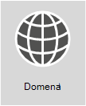

# <a name="external-domain-name-system-records-for-office-365"></a>Zewnętrzne rekordy systemu nazw domen dla Office 365



**Chcesz wyświetlić niestandardową listę rekordów DNS dla swojej Office 365 organizacji?** Informacje [potrzebne do utworzenia nowych rekordów DNS Office 365 domeny](../admin/get-help-with-domains/information-for-dns-records.md) w Office 365.

**Potrzebujesz pomocy krok po kroku, aby dodać te rekordy u hosta DNS Twojej domeny, takiego jak GoDaddy lub eNom?** [Znajdź linki do instrukcji krok po kroku dotyczących wielu popularnych hostów DNS](../admin/get-help-with-domains/create-dns-records-at-any-dns-hosting-provider.md).

**Chcesz użyć listy referencyjnej dla swojego własnego wdrożenia niestandardowego?** Poniższej listy należy użyć jako punktu referencyjnego dla Twojego niestandardowego Office 365 wdrażania. Musisz wybrać rekordy, które mają być stosowane do Twojej organizacji, i wypełnić odpowiednie wartości.

**Wstecz na planowanie** [sieci i dostosowywanie wydajności pod Office 365](./network-planning-and-performance.md).

Często trudno jest ustalić rekordy SPF i MX. Zaktualizowaliśmy nasze wskazówki dotyczące rekordów SPF na końcu tego artykułu. Ważną rzeczą, którą należy zapamiętać, jest to, że _możesz mieć tylko jeden rekord SPF dla swojej domeny_. Możesz mieć wiele rekordów MX; może to jednak powodować problemy związane z dostarczaniem poczty. Posiadanie pojedynczego rekordu MX, który kieruje pocztę e-mail do jednego systemu poczty, usuwa wiele potencjalnych problemów.
  
Poniższe sekcje uporządkowane są według usługi w programie Office 365. Aby wyświetlić niestandardową listę rekordów DNS Office 365 domeny, zaloguj się do usługi Office 365 i zbierz informacje potrzebne do utworzenia Office 365 [DNS](https://support.office.com/article/77f90d4a-dc7f-4f09-8972-c1b03ea85a67).
  
## <a name="external-dns-records-required-for-office-365-core-services"></a>Zewnętrzne rekordy DNS wymagane dla Office 365 (usługi podstawowe)
<a name="BKMK_ReqdCore"> </a>

Rekord TXT jest potrzebny do udowodnienia, że jesteś właścicielem domeny, i jest wymagany dla wszystkich klientów.

Rekord CNAME jest wymagany tylko dla klientów korzystających [Office 365 firmy 21Vianet](/microsoft-365/admin/services-in-china/services-in-china). Zapewnia ona możliwość kierowania Office 365 w celu uwierzytelnienia za pomocą odpowiedniej platformy tożsamości. 


  
|**Rekord DNS** <br/> |**Cel** <br/> |**Wartość do użycia** <br/> |**Dotyczy**|
|----------|-----------|------------|------------|
|**TXT** <br/> **(Weryfikacja domeny)** <br/> |Używany przez Office 365 tylko do weryfikacji, że jesteś właścicielem domeny. Nie ma wpływu na nic innego.  <br/> |**Host (Host):** @ (lub w przypadku niektórych dostawców hostingu DNS Twoja nazwa domeny)  <br/> **TXT Value (Wartość TXT):** _ciąg tekstowy dostarczony przez Office 365_  <br/> Kreator Office 365 **konfiguracji domeny** udostępnia wartości służące do utworzenia tego rekordu.  <br/> |Wszyscy klienci|
|**CNAME** <br/> **(Pakiet)** <br/> |Używany przez Office 365 do kierowania uwierzytelniania do odpowiedniej platformy tożsamości. [Więcej informacji](../admin/services-in-china/purpose-of-cname.md?viewFallbackFrom=o365-worldwide) <br/> **Uwaga**: ten rekord CNAME dotyczy tylko usługi Office 365 obsługiwanej przez firmę 21Vianet. Jeśli Twoja Office 365 jest obecna, a Twoja Office 365 nie jest obsługiwana przez firmę 21Vianet, użytkownikom w Twojej domenie niestandardowej zostanie wyświetlany *błąd "domena* niestandardowa nie jest w naszym systemie" i nie będzie można aktywować ich licencji usługi Office 365. [Więcej informacji](/office365/servicedescriptions/office-365-platform-service-description/office-365-operated-by-21vianet) |**Alias (Alias):** msoid  <br/> **Target (Wartość** docelowa): clientconfig.partner.microsoftonline-p.net.cn  <br/> | Tylko klienci z firmy 21Vianet|


## <a name="external-dns-records-required-for-email-in-office-365-exchange-online"></a>Zewnętrzne rekordy DNS wymagane dla poczty e-Office 365 (Exchange Online)
<a name="BKMK_ReqdCore"> </a>

Poczta e-Office 365 wymaga kilku różnych rekordów. Trzy podstawowe rekordy, których powinni używać wszyscy klienci, to rekordy wykrywania automatycznego, MX i SPF.
  
- **Rekord wykrywania automatycznego umożliwia** komputerom klienckim automatyczne Exchange i poprawne skonfigurowanie klienta.

- **Rekord MX wskazuje innym** systemom poczty, gdzie wysyłać pocztę e-mail dla Twojej domeny. **Uwaga:** Gdy zmienisz adres e-mail Office 365 przez zaktualizowanie rekordu MX domeny, WSZYSTKIE wiadomości e-mail wysyłane do tej domeny zaczną przychodzić do Office 365.  
Chcesz tylko przełączyć kilka adresów e-mail na Office 365? Możesz [pilotażowo Office 365 z kilkoma adresami e-mail w domenie niestandardowej](https://support.office.com/article/39cee536-6a03-40cf-b9c1-f301bb6001d7).

- **Rekord TXT dla SPF (TXT record for SPF** ) jest używany przez systemy poczty e-mail adresatów do weryfikacji, czy serwer wysyłający Twoją pocztę e-mail został przez Ciebie zatwierdzany. Pomaga to zapobiegać problemom, takim jak fałszowanie wiadomości e-mail i wyłudzanie informacji. Zobacz w [tym artykule](external-domain-name-system-records.md#BKMK_SPFrecords) zewnętrzne rekordy DNS wymagane dla rekordu SPF, aby dowiedzieć się, co należy uwzględnić w Twoim rekordzie.

Klienci korzystający z poczty e-mail Exchange federacji będą także potrzebować dodatkowego rekordu CNAME i TXT wymienionego u dołu tabeli.
  
|**Rekord DNS** <br/> |**Cel** <br/> |**Wartość do użycia** <br/> |
|----------|-----------|------------|
|**CNAME** <br/> **(Exchange Online)** <br/> |Ułatwia Outlook klientów w celu łatwego łączenia się z Exchange Online usługi wykrywania automatycznego. Funkcja wykrywania automatycznego automatycznie znajduje odpowiedniego Exchange Server hosta i konfiguruje Outlook użytkowników.  <br/> |**Alias (Alias):** Autodiscover  <br/> **Wartość docelowa:** autodiscover.outlook.com  <br/> |
|**MX** <br/> **(Exchange Online)** <br/> |Wysyła pocztę przychodzącą dla Twojej domeny do usługi Exchange Online w usłudze Office 365.  <br/> **Uwaga:** Gdy poczta e-mail będzie przepływać do Exchange Online, usuń rekordy MX, które wskazują stary system.   |**Domena:** Na przykład: contoso.com  <br/> **Docelowy serwer poczty e-mail:**\<MX token\>. mail.protection.outlook.com  <br/> **Preferencje/priorytet:** Niższe niż pozostałe rekordy MX (dzięki temu poczta jest dostarczana do Exchange Online) — na przykład 1 lub "low" (niski)  <br/>  Znajdź swoje urządzenie \<MX token\> , korzystając z następujących kroków:  <br/>  Zaloguj się w Office 365 przejdź do pozycji Domeny Office 365 administratorem\>.  <br/>  W kolumnie Akcja dla Twojej domeny wybierz pozycję Rozwiąż problemy.  <br/>  W sekcji MX records (Rekordy MX) wybierz pozycję What do I fix (Co naprawić?  <br/>  Postępuj zgodnie z instrukcjami na tej stronie, aby zaktualizować rekord MX.  <br/> [Co to jest priorytet rekordu MX?](../admin/setup/domains-faq.yml) <br/> |
|**SPF (TXT) (REKORD SPF (TXT)** <br/> **(Exchange Online)**  <br/> |Pomaga zapobiec używaniu Twojej domeny przez inne osoby do wysyłania spamu lub innych złośliwych wiadomości e-mail. Rekordy SPF (Sender Policy Framework) działają przez określenie serwerów, które są autoryzowane do wysyłania poczty e-mail z Twojej domeny.  <br/> |[Zewnętrzne rekordy DNS wymagane dla SPF](external-domain-name-system-records.md#BKMK_SPFrecords) <br/> |
|**TXT** <br/> **(Exchange federacji)** <br/> |Używany na Exchange do wdrożenia hybrydowego.  <br/> |**TXT record 1 (Rekord TXT 1):** Na przykład contoso.com skojarzony niestandardowo wygenerowany skrót potwierdzający weryfikację domeny (na przykład: Y96nu89138789315669824)  <br/> **TXT record 2 (Rekord TXT 2):** Na przykład exchangedelegation.contoso.com skojarzony niestandardowo wygenerowany skrót potwierdzający weryfikację domeny (na przykład: Y3259071352452626169)  <br/> |
|**CNAME** <br/> **(Exchange federacji)** <br/> |Ułatwia Outlook klientów w celu łatwego łączenia się z usługą Exchange Online za pomocą usługi wykrywania automatycznego, gdy Twoja firma Exchange federacji. Funkcja wykrywania automatycznego automatycznie znajduje Exchange Server hosta danych i konfiguruje Outlook użytkowników.  <br/> |**Alias (Alias):** Na przykład: Autodiscover.service.contoso.com  <br/> **Wartość docelowa:** autodiscover.outlook.com  <br/> |


## <a name="external-dns-records-required-for-skype-for-business-online"></a>Zewnętrzne rekordy DNS wymagane dla usługi Skype dla firm Online
<a name="BKMK_ReqdCore"> </a>

Podczas korzystania z adresów URL i zakresów adresów [IP](https://support.office.com/article/8548a211-3fe7-47cb-abb1-355ea5aa88a2#BKMK_LYO) Office 365, aby upewnić się, że sieć jest prawidłowo skonfigurowana, należy wykonać określone czynności.

> [!NOTE]
> Te rekordy DNS mają również zastosowanie do Teams, zwłaszcza w scenariuszu hybrydowym usług Teams i Skype dla firm, w których mogą wystąpić pewne problemy federacji.
  
|**Rekord DNS** <br/> |**Cel** <br/> |**Wartość do użycia** <br/> |
|----------|-----------|------------|
|**SRV** <br/> **(Skype dla firm Online)** <br/> |Pozwala Twojej Office 365 na udostępnianie funkcji wiadomości błyskawicznych klientom zewnętrznym, włączając federację SIP. Dowiedz się więcej [o Office 365 URL i zakresów adresów IP](https://support.office.com/article/8548a211-3fe7-47cb-abb1-355ea5aa88a2#BKMK_LYO).  <br/> |**Usługa:** sipfederationtls  <br/> **Protokół:** TCP  <br/> **Priorytet:** 100  <br/> **Waga:** 1  <br/> **Port:** 5061  <br/> **Target (Wartość** docelowa): sipfed.online.lync.com  <br/> **Uwaga:** Jeśli zapora lub serwer proxy blokuje wyszukiwania rekordu SRV w zewnętrznym systemie DNS, należy dodać ten rekord do wewnętrznego rekordu DNS.   |
|**SRV** <br/> **(Skype dla firm Online)** <br/> |Używany przez Skype dla firm do koordynowania przepływu informacji między klientami programu Lync.  <br/> |**Usługa:** sip  <br/> **Protokół:** TLS  <br/> **Priorytet:** 100  <br/> **Waga:** 1  <br/> **Port:** 443  <br/> **Target (Wartość** docelowa): sipdir.online.lync.com  <br/> |
|**CNAME** <br/> **(Skype dla firm Online)** <br/> |Używany przez klienta programu Lync do pomagania w Skype dla firm Online i logowania.  <br/> |**Alias (Alias):** sip  <br/> **Target (Wartość** docelowa): sipdir.online.lync.com  <br/> Aby uzyskać więcej informacji, [Office 365 adresy URL i zakresy adresów IP](https://support.office.com/article/8548a211-3fe7-47cb-abb1-355ea5aa88a2#BKMK_LYO).  <br/> |
|**CNAME** <br/> **(Skype dla firm Online)** <br/> |Używany przez klienta mobilnego programu Lync do pomagania w Skype dla firm Online i logowania.  <br/> |**Alias (Alias):** lyncdiscover  <br/> **Target (Wartość** docelowa): webdir.online.lync.com  <br/> |

## <a name="external-dns-records-required-for-office-365-single-sign-on"></a>Zewnętrzne rekordy DNS wymagane dla Office 365 single Sign-On
<a name="BKMK_ReqdCore"> </a>

|**Rekord DNS** <br/> |**Cel** <br/> |**Wartość do użycia** <br/> |
|----------|-----------|------------|
|**Host (A)** <br/> |Używany na przykład do logowania jednokrotnego (SSO). Udostępnia punkt końcowy dla Twoich użytkowników poza siedzibą firmy (oraz użytkowników lokalnych, jeśli chcesz) do łączenia się z Federniczymi serwerami proxy usług Active Directory Federation Services (AD FS) lub wirtualnym adresem IP (VIP) z obciążeniem zrównoważonym.  <br/> |**Target (Wartość docelowa):** Na przykład: sts.contoso.com  <br/> |

## <a name="external-dns-records-required-for-spf"></a>Zewnętrzne rekordy DNS wymagane dla SPF
<a name="BKMK_SPFrecords"> </a>

> [!IMPORTANT]
> Mechanizm SPF ułatwia zapobieganie podszywaniu się, ale istnieją techniki podszywania się, przed którymi mechanizm SPF nie chroni. Aby zapewnić ochronę przed tymi ustawieniami, po skonfigurowaniu spf należy również skonfigurować zabezpieczenia DKIM i DMARC dla Office 365. Aby rozpocząć, zobacz [Używanie funkcji DKIM](../security/office-365-security/use-dkim-to-validate-outbound-email.md) do sprawdzania poprawności wychodzących wiadomości e-mail wysłanych z domeny w Office 365. Następnie zobacz Używanie funkcji [DMARC do sprawdzania poprawności wiadomości e-mail Office 365](../security/office-365-security/use-dmarc-to-validate-email.md).
  
Rekordy SPF to rekordy TXT, które pomagają zapobiec używaniu Twojej domeny przez inne osoby do wysyłania spamu lub innych złośliwych wiadomości e-mail. Rekordy SPF (Sender Policy Framework) działają przez określenie serwerów, które są autoryzowane do wysyłania poczty e-mail z Twojej domeny.
  
Możesz mieć tylko jeden rekord SPF (czyli rekord TXT definiujący SPF) dla Twojej domeny. Ten jeden rekord może mieć kilka dołączeń, ale wynikowa całkowita liczba odnośników DNS nie może być większa niż 10 (pomaga to zapobiegać atakom typu odmowę usługi). Zobacz tabelę i inne przykłady poniżej, aby uzyskać pomoc przy tworzeniu lub aktualizowaniu odpowiednich wartości rekordu SPF dla Twojego środowiska.
  
### <a name="structure-of-an-spf-record"></a>Struktura rekordu SPF

Wszystkie rekordy SPF zawierają trzy elementy: deklarację, że jest to rekord SPF, domeny i adresy IP, które mają wysyłać pocztę e-mail, oraz regułę wymuszania. W prawidłowym rekordzie SPF są potrzebne wszystkie trzy. Oto przykład typowego rekordu SPF dla kont e-Office 365, gdy jest Exchange Online e-mail:
  
``` dns
TXT Name @
Values: v=spf1 include:spf.protection.outlook.com -all
```

System poczty e-mail odbieracy wiadomość e-mail z Twojej domeny przejmuje rekord SPF, a jeśli serwer poczty e-mail, który wysłał wiadomość, był serwerem poczty Office 365, wiadomość jest akceptowana. Jeśli serwer, który wysłał wiadomość, był na przykład Twoim starym systemem poczty lub złośliwym systemem, sprawdzanie rekordu SPF może się nie powieść i wiadomość nie zostanie dostarczona. Takie sprawdzanie pomaga zapobiec fałszersce i wyłudzaniu informacji.
  
### <a name="choose-the-spf-record-structure-you-need"></a>Wybieranie potrzebnej struktury rekordu SPF

W scenariuszach, w których nie używasz tylko poczty e-mail programu Exchange Online dla usługi Office 365 (na przykład gdy korzystasz również z poczty e-mail pochodzącej z usługi SharePoint Online), skorzystaj z poniższej tabeli, aby ustalić, co uwzględnić w wartości rekordu.
  
> [!NOTE]
> Jeśli Masz skomplikowany scenariusz, który obejmuje na przykład brzegowe serwery poczty e-mail do zarządzania ruchem poczty e-mail przez Twoją zaporę, będziesz mieć bardziej szczegółowy rekord SPF do skonfigurowania. Dowiedz się, jak: [Konfigurowanie rekordów SPF w programie Office 365 zapobiegania fałszerszem](../security/office-365-security/set-up-spf-in-office-365-to-help-prevent-spoofing.md). Aby dowiedzieć się więcej na temat sposobu działania spf Office 365 zobacz Jak Office 365 spf [(Sender Policy Framework) pomaga zapobiegać fałszersce](../security/office-365-security/how-office-365-uses-spf-to-prevent-spoofing.md).
  
| Numer|Jeśli używasz...  <br/> |Cel  <br/> |Dodaj te elementy  <br/> |
|:-----|:-----|:-----|:-----|
|1  <br/> |Wszystkie systemy poczty e-mail (wymagane)  <br/> |Wszystkie rekordy SPF zaczynają się od tej wartości  <br/> |v=spf1  <br/> |
|2  <br/> |Exchange Online (typowe)  <br/> |Używaj tylko za pomocą Exchange Online  <br/> |include:spf.protection.outlook.com  <br/> |
|3  <br/> |System poczty e-mail innej firmy (mniej typowe)  <br/> ||obejmują:\<email system like mail.contoso.com\>  <br/> |
|4  <br/> |Lokalnego systemu poczty e-mail (mniej typowe)  <br/> |Użyj, jeśli korzystasz z programu Exchange Online Protection lub Exchange Online innego systemu poczty  <br/> |ip4:\<0.0.0.0\>  <br/> ip6:\< : : \>  <br/> obejmują:\<mail.contoso.com\>  <br/> Wartość w nawiasach kwadratowych (\<\>) powinna być innymi systemami poczty, które będą wysyłać wiadomości e-mail dla Twojej domeny.  <br/> |
|5  <br/> |Wszystkie systemy poczty e-mail (wymagane)  <br/> ||— all  <br/> |

### <a name="example-adding-to-an-existing-spf-record"></a>Przykład: Dodawanie do istniejącego rekordu SPF
<a name="bkmk_addtospf"> </a>

Jeśli masz już rekord SPF, musisz dodać lub zaktualizować wartości dla Office 365. Załóżmy na przykład, że Twój istniejący rekord SPF dla contoso.com jest taki:
  
``` dns
TXT Name @
Values: v=spf1 ip4:60.200.100.30 include:smtp.adatum.com -all
```

Teraz aktualizujesz rekord SPF dla Office 365. Edytujesz bieżący rekord, aby mieć rekord SPF, który zawiera potrzebne wartości. W Office 365 "spf.protection.outlook.com".
  
Poprawne:
  
``` dns
TXT Name @
Values: v=spf1 ip4:60.200.100.30 include:spf.protection.outlook.com include:smtp.adatum.com -all
```

Niepoprawnie:
  
``` dns
Record 1:
TXT Name @
Values: v=spf1 ip4:60.200.100.30 include:smtp.adatum.com -all
Record 2:
Values: v=spf1 include:spf.protection.outlook.com -all
```

### <a name="more-examples-of-common-spf-values"></a>Więcej przykładów typowych wartości SPF
<a name="bkmk_addtospf"> </a>

Jeśli korzystasz z pełnego pakietu Office 365 i wysyłasz marketingowe wiadomości e-mail w Twoim imieniu za pomocą programu MailChimp, Twój rekord SPF w imieniu firmy contoso.com może wyglądać podobnie do poniższego, w którym użyto wierszy 1, 3 i 5 z powyższej tabeli. Pamiętaj, że wiersze 1 i 5 są wymagane.
  
``` dns
TXT Name @
Values: v=spf1 include:spf.protection.outlook.com include:servers.mcsv.net -all
```

Ewentualnie, jeśli masz konfigurację hybrydową usługi Exchange, w której wiadomości e-mail będą wysyłane zarówno z usługi Office 365, jak i z lokalnego systemu poczty, Twój rekord SPF w chmurze contoso.com może wyglądać tak:
  
``` dns
TXT Name @
Values: v=spf1 include:spf.protection.outlook.com include:mail.contoso.com -all
```

Oto kilka typowych przykładów, które mogą ułatwić dostosowanie istniejącego rekordu SPF podczas dodawania domeny do Office 365 poczty e-mail. Jeśli Masz skomplikowany scenariusz, który obejmuje na przykład brzegowe serwery poczty e-mail do zarządzania ruchem poczty e-mail przez Twoją zaporę, będziesz mieć bardziej szczegółowy rekord SPF do skonfigurowania. Dowiedz się, jak: [Konfigurowanie rekordów SPF w programie Office 365 zapobiegania fałszerszem](../security/office-365-security/set-up-spf-in-office-365-to-help-prevent-spoofing.md).
  
Oto krótki link, który możesz użyć, aby tu wrócić: [https://aka.ms/o365edns]()
