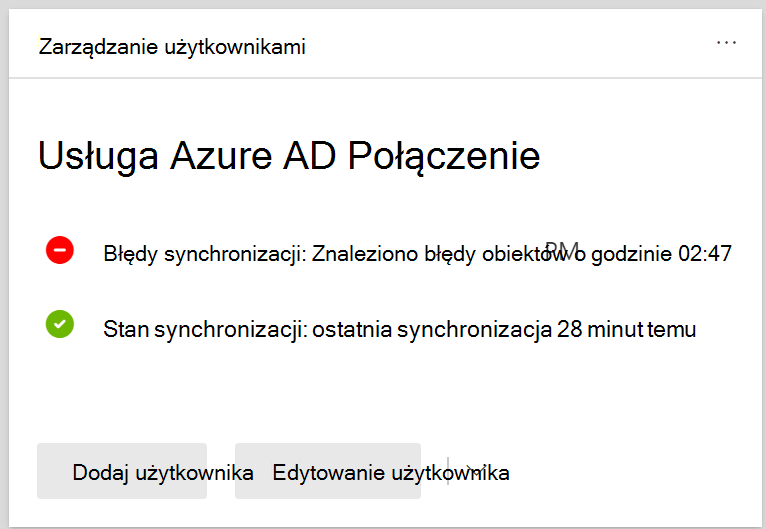

# Wyświetlanie błędów synchronizacji katalogów w programie Microsoft 365

Błędy synchronizacji katalogów można <a href="https://go.microsoft.com/fwlink/p/?linkid=2024339" target="_blank">wyświetlić w centrum administracyjne platformy Microsoft 365</a>. Wyświetlane są tylko błędy obiektów użytkownika. Aby wyświetlić błędy w programie PowerShell, zobacz [Identyfikowanie obiektów za pomocą usługi DirSyncProvisioningErrors](/azure/active-directory/hybrid/how-to-connect-syncservice-duplicate-attribute-resiliency).

## Wyświetlanie błędów synchronizacji katalogów w centrum administracyjne platformy Microsoft 365

Aby wyświetlić błędy w centrum administracyjne platformy Microsoft 365:
  
1. Zaloguj się [do centrum administracyjne platformy Microsoft 365 przy](https://admin.microsoft.com) użyciu konta administratora globalnego. 
    
2. Na stronie **głównej** zobaczysz kartę **Zarządzanie użytkownikami** . 
    
    
  
3. Na karcie wybierz pozycję **Błędy** synchronizacji w obszarze usługi **Azure AD Połączenie**, aby wyświetlić błędy na **stronie Błędy synchronizacji** katalogów.   
    
    

4. Wybierz dowolny z błędów, aby wyświetlić okienko szczegółów z informacjami o błędzie i poradami dotyczącymi sposobu jego rozwiązania.

   
  
Aby rozwiązać wszystkie zidentyfikowane problemy, zobacz rozwiązywanie problemów z [synchronizacją Microsoft 365](fix-problems-with-directory-synchronization.md) katalogów.