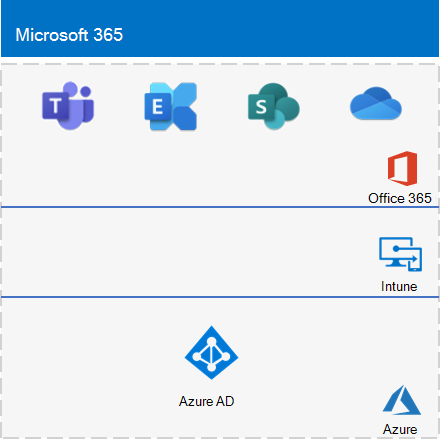

# <a name="the-lightweight-base-configuration"></a>Uproszczona konfiguracja podstawowa

*Ten przewodnik po laboratorium testowym może służyć zarówno do Microsoft 365 dla środowisk testowych dla przedsiębiorstw, jak i Office 365 Enterprise.*

W tym artykule opisano sposób tworzenia uproszczonego środowiska z subskrypcją Microsoft 365 E5 i komputerem z systemem Windows 10 Enterprise.


Tworzenie uproszczonego środowiska testowego obejmuje pięć faz:
- [Faza 1. Tworzenie subskrypcji Microsoft 365 E5](#phase-1-create-your-microsoft-365-e5-subscription)
- [Faza 2. Konfigurowanie subskrypcji wersji próbnej Office 365](#phase-2-configure-your-office-365-trial-subscription)
- [Faza 3. Dodawanie subskrypcji wersji próbnej Microsoft 365 E5](#phase-3-add-a-microsoft-365-e5-trial-subscription)
- [Faza 4. Tworzenie komputera Windows 10 Enterprise](#phase-4-create-a-windows-10-enterprise-computer)
- [Faza 5. Dołączanie komputera Windows 10 do usługi Azure AD](#phase-5-join-your-windows-10-computer-to-azure-ad)

Użyj wynikowego środowiska, aby przetestować funkcje i funkcje [Microsoft 365 dla przedsiębiorstw](https://www.microsoft.com/microsoft-365/enterprise).


  
> [!TIP]
> Aby uzyskać wizualną mapę na wszystkie artykuły w stosie Microsoft 365 for enterprise Test Lab Guide, zobacz [Microsoft 365 for enterprise Test Lab Guide Stack (Stos przewodników laboratorium testowego dla przedsiębiorstw](../downloads/Microsoft365EnterpriseTLGStack.pdf)).

>[!NOTE]
>Możesz wydrukować ten artykuł, aby zarejestrować konkretne informacje potrzebne dla tego środowiska w ciągu 30 dni subskrypcji Office 365 wersji próbnej. Subskrypcję trail można łatwo przedłużyć o kolejne 30 dni. W przypadku trwałego środowiska testowego utwórz nową płatną subskrypcję z oddzielną dzierżawą usługi Azure AD i niewielką liczbą licencji.

## <a name="phase-1-create-your-microsoft-365-e5-subscription"></a>Faza 1. Tworzenie subskrypcji Microsoft 365 E5

Rozpoczynamy od subskrypcji wersji próbnej Microsoft 365 E5, a następnie dodajemy do niej subskrypcję Microsoft 365 E5.

>[!NOTE]
>Zalecamy utworzenie subskrypcji wersji próbnej Office 365, aby środowisko testowe miało oddzielną dzierżawę usługi Azure AD od wszystkich subskrypcji płatnych, które obecnie masz. Ta separacja oznacza, że można dodawać i usuwać użytkowników i grupy w dzierżawie testowej bez wpływu na subskrypcje produkcyjne.

Aby rozpocząć Microsoft 365 E5 subskrypcję wersji próbnej, najpierw potrzebujesz fikcyjnej nazwy firmy i nowego konta Microsoft.
  
1. Zalecamy użycie wariantu nazwy firmy Contoso dla nazwy firmy, która jest fikcyjną firmą używaną w przykładowej zawartości firmy Microsoft, ale nie jest wymagana. Tutaj zarejestruj fikcyjną nazwę firmy: 
    
2. Aby utworzyć nowe konto Microsoft, przejdź do [https://outlook.com](https://outlook.com) witryny i utwórz konto przy użyciu nowego konta e-mail i adresu. Użyjesz tego konta, aby zarejestrować się w celu Office 365.
    
    - Tutaj zarejestruj imię i nazwisko nowego konta: 
    
    - Zarejestruj nowy adres konta e-mail tutaj: @outlook.com
    
### <a name="sign-up-for-an-office-365-e5-trial-subscription"></a>Tworzenie konta w celu Office 365 E5 subskrypcji wersji próbnej

1. W przeglądarce przejdź do [https://aka.ms/e5trial](https://aka.ms/e5trial)pozycji .
    
2. W kroku 1 strony **Podziękowania za wybranie Office 365 E5** wprowadź nowy adres konta e-mail.
3. W kroku 2 procesu subskrypcji trail wprowadź żądane informacje, a następnie wykonaj weryfikację.
4. W kroku 3 wprowadź nazwę organizacji, a następnie nazwę konta, które będzie administratorem globalnym subskrypcji.
5. W kroku 4 zapisz tutaj stronę logowania (wybierz i skopiuj): 
6. Zarejestruj identyfikator użytkownika tutaj: . onmicrosoft.com  
   Zarejestruj hasło wprowadzone w bezpiecznej lokalizacji.
   Ta wartość będzie nazywana **nazwą administratora globalnego**.
7. Wybierz **pozycję Przejdź do instalatora**.
8. W Office 365 E5 Instalatora wybierz pozycję **Kontynuuj korzystanie z *witryny organization.onmicrosoft.com* na potrzeby poczty e-mail i logowania**, a następnie wybierz pozycję **Zakończ i kontynuuj później**.

Powinien zostać wyświetlony Centrum administracyjne platformy Microsoft 365.
    
## <a name="phase-2-configure-your-office-365-trial-subscription"></a>Faza 2. Konfigurowanie subskrypcji wersji próbnej Office 365

W tej fazie skonfigurujesz subskrypcję z dodatkowymi użytkownikami i przypiszesz im Office 365 E5 licencji.
  
Aby nawiązać połączenie z subskrypcją przy użyciu modułu Azure Active Directory PowerShell for Graph z komputera, użyj instrukcji w [Połączenie, aby Microsoft 365 za pomocą programu PowerShell](connect-to-microsoft-365-powershell.md#connect-with-the-azure-active-directory-powershell-for-graph-module).
    
W oknie dialogowym **żądanie poświadczeń Windows PowerShell** wprowadź nazwę administratora globalnego (na przykład *jdoe@contosotoycompany.onmicrosoft.com*) i hasło.
  
Podaj nazwę organizacji (na przykład *contosotoycompany*), dwuznakowy kod kraju dla lokalizacji, typowe hasło konta, a następnie uruchom następujące polecenia w wierszu polecenia programu PowerShell:

```powershell
$orgName="<organization name>"
$loc="<two-character country code, such as US>"
$commonPW="<common user account password>"
$PasswordProfile=New-Object -TypeName Microsoft.Open.AzureAD.Model.PasswordProfile
$PasswordProfile.Password=$commonPW

$License = New-Object -TypeName Microsoft.Open.AzureAD.Model.AssignedLicense
$License.SkuId = (Get-AzureADSubscribedSku | Where-Object -Property SkuPartNumber -Value "ENTERPRISEPREMIUM" -EQ).SkuID
$LicensesToAssign = New-Object -TypeName Microsoft.Open.AzureAD.Model.AssignedLicenses
$LicensesToAssign.AddLicenses = $License

for($i=2;$i -le 4; $i++) {
    $userUPN= "user$($i)@$($orgName).onmicrosoft.com"
    New-AzureADUser -DisplayName "User $($i)" -GivenName User -SurName $i -UserPrincipalName $userUPN -UsageLocation $loc -AccountEnabled $true -PasswordProfile $PasswordProfile -MailNickName "user$($i)"
    $userObjectID = (Get-AzureADUser -SearchString $userupn).ObjectID
    Set-AzureADUserLicense -ObjectId $userObjectID -AssignedLicenses $LicensesToAssign
}
```
> [!NOTE]
> W tym miejscu użyto wspólnego hasła do automatyzacji i ułatwienia konfiguracji środowiska testowego. Oczywiście jest to zdecydowanie odradzane w przypadku subskrypcji produkcyjnych. 

### <a name="record-key-information-for-future-reference"></a>Rejestrowanie kluczowych informacji na potrzeby przyszłego odwołania

Jeśli te wartości nie zostały jeszcze zarejestrowane, zarejestruj je teraz:
  
- nazwa administrator globalny: .onmicrosoft.com (z kroku 6 fazy 1)
    
    Zapisz również hasło dla tego konta w bezpiecznej lokalizacji.
    
- Nazwa organizacji subskrypcji wersji próbnej:  (z kroku 4 fazy 1)
    
- Aby wyświetlić listę kont Użytkownik 2, Użytkownik 3, Użytkownik 4 i Użytkownik 5, uruchom następujące polecenie z modułu Windows Azure Active Directory, aby Windows PowerShell monit:
    
  ```powershell
  Get-AzureADUser | Sort UserPrincipalName | Select UserPrincipalName
  ```

    Tutaj zarejestruj nazwy kont:
    
  - Nazwa konta użytkownika 2: użytkownik2 @.onmicrosoft.com
    
  - Nazwa konta użytkownika 3: użytkownik3 @.onmicrosoft.com
    
  - Nazwa konta użytkownika 4: użytkownik4 @.onmicrosoft.com
    
  - Nazwa konta użytkownika 5: użytkownik5 @.onmicrosoft.com
    
    Zarejestruj również typowe hasło dla tych kont w bezpiecznej lokalizacji.
   
### <a name="using-an-office-365-test-environment"></a>Korzystanie ze środowiska testowego Office 365

Jeśli potrzebujesz tylko środowiska testowego Office 365, nie musisz czytać pozostałej części tego artykułu.

Aby uzyskać dodatkowe przewodniki laboratorium testowego, które dotyczą zarówno Office 365, jak i Microsoft 365, zobacz [Microsoft 365 dla przewodników laboratorium testowego dla przedsiębiorstw](m365-enterprise-test-lab-guides.md).
  
## <a name="phase-3-add-a-microsoft-365-e5-trial-subscription"></a>Faza 3. Dodawanie subskrypcji wersji próbnej Microsoft 365 E5

W tej fazie zarejestrujesz się w ramach subskrypcji wersji próbnej Microsoft 365 E5 i dodasz ją do tej samej organizacji co subskrypcja Office 365 E5 wersji próbnej.
  
Najpierw dodaj subskrypcję wersji próbnej Microsoft 365 E5 i przypisz nową licencję Microsoft 365 do konta administratora globalnego.
  
1. W prywatnym oknie przeglądarki internetowej użyj poświadczeń konta administratora globalnego, aby zalogować się do Centrum administracyjne platformy Microsoft 365 pod adresem [https://admin.microsoft.com](https://admin.microsoft.com).
    
2. Na stronie **Centrum administracyjne platformy Microsoft 365** w obszarze nawigacji po lewej stronie wybierz pozycję <a href="https://go.microsoft.com/fwlink/p/?linkid=868433" target="_blank">**RozliczeniaZakup**</a> >  usług.
    
3. Na stronie **Zakup usług** wybierz pozycję **Microsoft 365 E5**, a następnie wybierz pozycję **Uzyskaj bezpłatną wersję próbną**.

4. Na stronie **Microsoft 365 E5 Trial (Wersja próbna**) zdecyduj, że otrzymasz wiadomość SMS lub telefon, wprowadź swój numer telefonu, a następnie wybierz pozycję **Wyślij wiadomość SMS** lub **Zadzwoń do mnie**. Wykonaj weryfikację.

5. Na stronie **Potwierdź zamówienie** wybierz pozycję **Wypróbuj teraz**.

6. Na stronie **Potwierdzenie zamówienia** wybierz pozycję **Kontynuuj**.

7. W Centrum administracyjne platformy Microsoft 365 wybierz pozycję <a href="https://go.microsoft.com/fwlink/p/?linkid=834822" target="_blank">**UżytkownicyAktywni**</a> >  użytkownicy.

8. W **obszarze Aktywni użytkownicy** wybierz konto administratora.

9. Wybierz pozycję **Licencje i aplikacje**.

10. Wyłącz licencję dla Office 365 Enterprise E5 i włącz licencję dla Microsoft 365 E5.

11. Wybierz pozycję **Zapisz zmiany**, a następnie zamknij okienko informacji o koncie użytkownika.

Następnie powtórz kroki od 8 do 11 poprzedniej procedury dla wszystkich pozostałych kont (użytkownik 2, użytkownik 3, użytkownik 4 i użytkownik 5).
  
> [!NOTE]
> Długość subskrypcji wersji próbnej Microsoft 365 E5 wynosi 30 dni. W przypadku trwałego środowiska testowego przekonwertuj tę subskrypcję wersji próbnej na płatną subskrypcję z niewielką liczbą licencji.
  
Środowisko testowe ma teraz:
  
- Subskrypcja wersji próbnej Microsoft 365 E5.
- Wszystkie odpowiednie konta użytkowników (tylko administrator globalny lub wszystkie pięć kont użytkowników) mogą korzystać z Microsoft 365 E5.
    
Wynikowa konfiguracja, która dodaje Microsoft 365 E5, wygląda następująco:
  

  
## <a name="phase-4-create-a-windows-10-enterprise-computer"></a>Faza 4. Tworzenie komputera Windows 10 Enterprise

W tej fazie utworzysz autonomiczny komputer z systemem Windows 10 Enterprise jako komputer fizyczny, maszynę wirtualną lub maszynę wirtualną platformy Azure.
  
### <a name="physical-computer"></a>Komputer fizyczny

Na komputerze osobistym zainstaluj Windows 10 Enterprise. Wersję próbną Windows 10 Enterprise można pobrać [tutaj](https://www.microsoft.com/evalcenter/evaluate-windows-10-enterprise).
  
### <a name="virtual-machine"></a>Maszyna wirtualna

Użyj wybranej funkcji hypervisor, aby utworzyć maszynę wirtualną, a następnie zainstaluj na niej Windows 10 Enterprise. Wersję próbną Windows 10 Enterprise można pobrać [tutaj](https://www.microsoft.com/evalcenter/evaluate-windows-10-enterprise).
  
### <a name="virtual-machine-in-azure"></a>Maszyna wirtualna na platformie Azure

Aby utworzyć maszynę wirtualną Windows 10 w Microsoft Azure, ***musisz mieć subskrypcję opartą na Visual Studio***, która ma dostęp do obrazu dla Windows 10 Enterprise. Inne typy subskrypcji platformy Azure, takie jak subskrypcje próbne i płatne, nie mają dostępu do tego obrazu. Aby uzyskać najnowsze informacje, zobacz [Korzystanie z klienta Windows na platformie Azure w scenariuszach tworzenia i testowania](/azure/virtual-machines/windows/client-images).
  
> [!NOTE]
> Poniższe zestawy poleceń używają najnowszej wersji Azure PowerShell. Zobacz [Wprowadzenie z poleceniami cmdlet Azure PowerShell](/powershell/azureps-cmdlets-docs/). Te zestawy poleceń tworzą maszynę wirtualną Windows 10 Enterprise o nazwie WIN10 i całą jej wymaganą infrastrukturę, w tym grupę zasobów, konto magazynu i sieć wirtualną. Jeśli znasz już usługi infrastruktury platformy Azure, dostosuj te instrukcje do aktualnie wdrożonej infrastruktury.
  
Najpierw uruchom monit programu Microsoft PowerShell.
  
Zaloguj się do konta platformy Azure za pomocą tego polecenia.
  
```powershell
Connect-AzAccount
```

Pobierz nazwę subskrypcji przy użyciu tego polecenia.
  
```powershell
Get-AzSubscription | Sort Name | Select Name
```

Ustaw subskrypcję platformy Azure. Zastąp wszystkie elementy cudzysłowu \< and > , w tym znaki, poprawną nazwą.
  
```powershell
$subscr="<subscription name>"
Get-AzSubscription -SubscriptionName $subscr | Select-AzSubscription
```

Następnie utwórz nową grupę zasobów. Aby określić unikatową nazwę grupy zasobów, użyj tego polecenia, aby wyświetlić listę istniejących grup zasobów.
  
```powershell
Get-AzResourceGroup | Sort ResourceGroupName | Select ResourceGroupName
```

Utwórz nową grupę zasobów przy użyciu tych poleceń. Zastąp wszystkie elementy cudzysłowu \< and > , w tym znaki, prawidłowymi nazwami.
  
```powershell
$rgName="<resource group name>"
$locName="<location name, such as West US>"
New-AzResourceGroup -Name $rgName -Location $locName
```

Następnie utwórz nową sieć wirtualną i maszynę wirtualną WIN10 za pomocą tych poleceń. Po wyświetleniu monitu podaj nazwę i hasło konta administratora lokalnego win10 i zapisz je w bezpiecznej lokalizacji.
  
```powershell
$corpnetSubnet=New-AzVirtualNetworkSubnetConfig -Name Corpnet -AddressPrefix 10.0.0.0/24
New-AzVirtualNetwork -Name "M365Ent-TestLab" -ResourceGroupName $rgName -Location $locName -AddressPrefix 10.0.0.0/8 -Subnet $corpnetSubnet
$rule1=New-AzNetworkSecurityRuleConfig -Name "RDPTraffic" -Description "Allow RDP to all VMs on the subnet" -Access Allow -Protocol Tcp -Direction Inbound -Priority 100 -SourceAddressPrefix Internet -SourcePortRange * -DestinationAddressPrefix * -DestinationPortRange 3389
New-AzNetworkSecurityGroup -Name Corpnet -ResourceGroupName $rgName -Location $locName -SecurityRules $rule1
$vnet=Get-AzVirtualNetwork -ResourceGroupName $rgName -Name "M365Ent-TestLab"
$nsg=Get-AzNetworkSecurityGroup -Name Corpnet -ResourceGroupName $rgName
Set-AzVirtualNetworkSubnetConfig -VirtualNetwork $vnet -Name Corpnet -AddressPrefix "10.0.0.0/24" -NetworkSecurityGroup $nsg
$vnet | Set-AzVirtualNetwork
$pip=New-AzPublicIpAddress -Name WIN10-PIP -ResourceGroupName $rgName -Location $locName -AllocationMethod Dynamic
$nic=New-AzNetworkInterface -Name WIN10-NIC -ResourceGroupName $rgName -Location $locName -SubnetId $vnet.Subnets[0].Id -PublicIpAddressId $pip.Id
$vm=New-AzVMConfig -VMName WIN10 -VMSize Standard_A2_V2
$cred=Get-Credential -Message "Type the name and password of the local administrator account for WIN10."
$vm=Set-AzVMOperatingSystem -VM $vm -Windows -ComputerName WIN10 -Credential $cred -ProvisionVMAgent -EnableAutoUpdate
$vm=Set-AzVMSourceImage -VM $vm -PublisherName MicrosoftWindowsDesktop -Offer Windows-10 -Skus RS3-Pro -Version "latest"
$vm=Add-AzVMNetworkInterface -VM $vm -Id $nic.Id
$vm=Set-AzVMOSDisk -VM $vm -Name WIN10-TestLab-OSDisk -DiskSizeInGB 128 -CreateOption FromImage
New-AzVM -ResourceGroupName $rgName -Location $locName -VM $vm
```

## <a name="phase-5-join-your-windows-10-computer-to-azure-ad"></a>Faza 5. Dołączanie komputera Windows 10 do usługi Azure AD

Po utworzeniu maszyny fizycznej lub wirtualnej z Windows 10 Enterprise zaloguj się przy użyciu konta administratora lokalnego.
  
> [!NOTE]
> W przypadku maszyny wirtualnej na platformie Azure użyj  [tych instrukcji](/azure/virtual-machines/windows/connect-logon) , aby nawiązać z nią połączenie.
  
Następnie dołącz komputer WIN10 do dzierżawy usługi Azure AD subskrypcji Microsoft 365 E5.
  
1. Na pulpicie komputera WIN10 wybierz pozycję **Uruchom konta > Ustawienia > > Dostęp do > Połączenie służbowej**.
    
2. W oknie **dialogowym Konfigurowanie konta służbowego** wybierz pozycję **Dołącz do tego urządzenia, aby Azure Active Directory**.
    
3. Na **koncie służbowym** wprowadź nazwę konta administratora globalnego subskrypcji Microsoft 365 E5, a następnie wybierz pozycję **Dalej**.
    
4. W **obszarze Wprowadź hasło** wprowadź hasło konta administratora globalnego, a następnie wybierz pozycję **Zaloguj** się.
    
5. Po wyświetleniu monitu o upewnienie się, że jest to Twoja organizacja, wybierz pozycję **Dołącz**, a następnie wybierz pozycję **Gotowe**.
    
6. Zamknij okno ustawień.
    
Następnie zainstaluj Aplikacje Microsoft 365 dla przedsiębiorstw na komputerze WIN10:
  
1. Otwórz przeglądarkę Microsoft Edge i zaloguj się do [Centrum administracyjne platformy Microsoft 365](https://admin.microsoft.com) przy użyciu poświadczeń konta administratora globalnego.
    
2. Na karcie **Narzędzia główne Microsoft Office** wybierz pozycję **Zainstaluj Office**.
    
3. Po wyświetleniu monitu o czynności do wykonania wybierz pozycję **Uruchom**, a następnie wybierz pozycję **Tak** w obszarze **Kontrola konta użytkownika**.
    
4. Poczekaj, aż Office zakończy instalację. Gdy zobaczysz **, że wszystko jest ustawione!**, wybierz pozycję **Zamknij** dwa razy.
    
Wynikowe środowisko wygląda następująco:


Obejmuje to komputer WIN10 z następującymi elementami:

- Dołączono do dzierżawy usługi Azure AD subskrypcji Microsoft 365 E5.
- Zarejestrowane jako urządzenie usługi Azure AD w Microsoft Intune (EMS).
- Aplikacje Microsoft 365 dla przedsiębiorstw zainstalowana.
  
Teraz możesz eksperymentować z dodatkowymi funkcjami [Microsoft 365 dla przedsiębiorstw](https://www.microsoft.com/microsoft-365/enterprise).
  
## <a name="next-steps"></a>Następne kroki

Zapoznaj się z tymi dodatkowymi zestawami przewodników laboratorium testowego:
  
- [Tożsamości](m365-enterprise-test-lab-guides.md#identity)
- [Zarządzanie urządzeniami przenośnymi](m365-enterprise-test-lab-guides.md#mobile-device-management)
- [Ochrona informacji](m365-enterprise-test-lab-guides.md#information-protection)
   

## <a name="see-also"></a>Zobacz też

[Microsoft 365 dla przewodników laboratorium testowego w przedsiębiorstwie](m365-enterprise-test-lab-guides.md)

[Microsoft 365 dla przedsiębiorstw — omówienie](microsoft-365-overview.md)

[Dokumentacja dotycząca subskrypcji Microsoft 365 dla Przedsiębiorstw](/microsoft-365-enterprise/)
