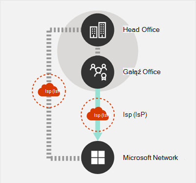
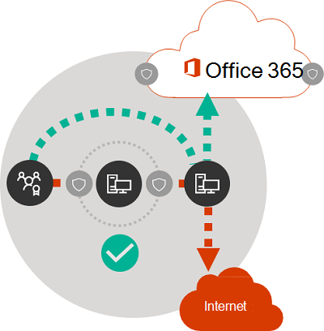

# Microsoft 365 dotyczących łączności sieciowej

*Ten artykuł dotyczy zarówno Microsoft 365 Enterprise, jak i Office 365 Enterprise.*

Przed rozpoczęciem planowania sieci pod Microsoft 365 sieci ważne jest zrozumienie zasad łączności w celu bezpiecznego zarządzania ruchem sieciowym Microsoft 365 i uzyskiwania najlepszej możliwej wydajności. Ten artykuł pomoże Ci zrozumieć najnowsze wskazówki dotyczące bezpiecznego optymalizowania Microsoft 365 sieci.
  
Tradycyjne sieci przedsiębiorstwa zaprojektowano przede wszystkim w celu zapewnienia użytkownikom dostępu do aplikacji i danych hostowanych w firmowych centrach danych z silnymi zabezpieczeniami obwodu. W tradycyjnym modelu założono, że użytkownicy będą mieć dostęp do aplikacji i danych z obwodu sieci firmowej, za pośrednictwem łączy WAN z oddziałów firmy lub zdalnie za pośrednictwem połączeń VPN.
  
Wdrożenie aplikacji SaaS, takich Microsoft 365, przenosi niektóre kombinacje usług i danych poza obwód sieci. Bez optymalizacji ruch między użytkownikami a aplikacjami SaaS podlega opóźnieniu wprowadzonemu przez inspekcję pakietów, spinki sieci, niezamierzone połączenia z geograficznymi punktami końcowymi i innymi czynnikami. Opis i wdrożenie wytycznych dotyczących optymalizacji klucza Microsoft 365 zapewnić najlepszą wydajność i niezawodność.
  
W tym artykule znajdziesz informacje na temat:
  
- [Microsoft 365 w](microsoft-365-network-connectivity-principles.md#BKMK_Architecture) zakresie łączności klienta z chmurą
- Zaktualizowane [Microsoft 365 i strategii dotyczące](microsoft-365-network-connectivity-principles.md#BKMK_Principles) łączności w celu optymalizacji ruchu sieciowego i działania użytkownika końcowego
- Usługa [Office 365 punktów](microsoft-365-network-connectivity-principles.md#BKMK_WebSvc) końcowych, która umożliwia administratorom sieci korzystanie z strukturalnej listy punktów końcowych do użycia w optymalizacji sieci
- [Nowe Office 365 kategorii punktów końcowych i](microsoft-365-network-connectivity-principles.md#BKMK_Categories) wskazówki dotyczące optymalizacji
- [Porównanie zabezpieczeń obwodu sieci z zabezpieczeniami punktów końcowych](microsoft-365-network-connectivity-principles.md#BKMK_SecurityComparison)
- [Opcje optymalizacji](microsoft-365-network-connectivity-principles.md#BKMK_IncOpt) przyrostowej dla Microsoft 365 ruchu
- Test [Microsoft 365 to](https://aka.ms/netonboard) nowe narzędzie do testowania podstawowej łączności z siecią Microsoft 365

## Microsoft 365 architekturze

Microsoft 365 to rozłożona chmura typu "oprogramowanie jako usługa" (Software-as-a-Service, SaaS), która zapewnia scenariusze zwiększające produktywność i współpracę za pośrednictwem zróżnicowanego zestawu usług i aplikacji, takich jak Exchange Online, SharePoint Online, Skype dla firm Online, Microsoft Teams, Exchange Online Protection, Office w przeglądarce i wiele innych. Określone aplikacje Microsoft 365 mogą mieć swoje unikatowe funkcje, ponieważ mają zastosowanie do sieci i łączności klienta z chmurą, jednak wszystkie te aplikacje mają pewne kluczowe podmioty główne, cele i wzorce architektury. Te zasady i wzorce architektury łączności są typowe dla wielu innych chmur SaaS, a jednocześnie różnią się od typowych modeli wdrażania chmur Platform-as-a-Service i Infrastructure-as-a-Service, takich jak Microsoft Azure.
  
Jedną z najbardziej istotnych funkcji architektonicznych aplikacji Microsoft 365 (często nieodebranych lub mylonych przez architektów sieci) jest to, że jest to usługa o prawdziwie rozpowszechnianej globalnej dystrybucji w kontekście sposobu łączenia się użytkowników z usługą. Położenie docelowej dzierżawy usługi Microsoft 365 jest ważne, aby zrozumieć lokalizację przechowywania danych klientów w chmurze, ale środowisko użytkownika w usłudze Microsoft 365 nie wymaga bezpośredniego połączenia z dyskami zawierającymi dane. Środowisko użytkownika z Microsoft 365 (w tym z wydajnością, niezawodnością i innymi ważnymi cechami jakości) obejmuje łączność za pośrednictwem wysoce rozproszonego frontu drzwi usługi, które są skalowane w setki lokalizacji firmy Microsoft na całym świecie. W większości przypadków najlepsze środowisko użytkownika uzyskuje się, zezwalając sieci klienta na rozsyłanie żądań użytkowników do najbliższego punktu wejścia usługi Microsoft 365 zamiast łączenia się z usługą Microsoft 365 przez punkt ruchu wychodzącego w centralnym miejscu lub regionie.
  
W przypadku większości klientów użytkownicy Microsoft 365 się w wielu lokalizacjach. Aby osiągnąć najlepsze wyniki, należy przyjrzeć się zasadom opisanym w tym dokumencie z punktu widzenia skali (nie skalowania), skupiając się na optymalizacji łączności z najbliższym punktem obecności w sieci globalnej firmy Microsoft, a nie do lokalizacji geograficznej dzierżawy usługi Microsoft 365. W zasadzie oznacza Microsoft 365, że mimo że dane dzierżawy mogą być przechowywane w określonej lokalizacji geograficznej, środowisko obsługi dzierżawy Microsoft 365 pozostaje rozproszone i może być obecne w bardzo blisko (sieci) odległości od każdej lokalizacji użytkownika końcowego, która ma dzierżawę.
  
## Microsoft 365 dotyczących łączności

Firma Microsoft zaleca stosowanie poniższych zasad w celu zapewnienia optymalnej Microsoft 365 i wydajności. Za pomocą tych Microsoft 365 łączności możesz zarządzać ruchem i uzyskać najlepszą wydajność podczas łączenia się z siecią Microsoft 365.
  
Podstawowym celem projektu sieci powinno być zminimalizowanie opóźnień przez skrócenie czasu rundy (RTT, Round-trip Time) z Twojej sieci do globalnej sieci firmy Microsoft — podstawowej sieci publicznej firmy Microsoft, która łączy wszystkie centra danych firmy Microsoft z małymi opóźnieniami i punktami wejścia aplikacji w chmurze na całym świecie. Więcej informacji o globalnej sieci firmy Microsoft można znaleźć w te sposób, w jaki firma [Microsoft tworzy swoją szybką i niezawodną sieć globalną](https://azure.microsoft.com/blog/how-microsoft-builds-its-fast-and-reliable-global-network/).
  

### Identyfikowanie i rozróżnianie Microsoft 365 ruchu

  
Identyfikowanie Microsoft 365 sieciowego jest pierwszym krokiem odróżniania tego ruchu od ogólnego ruchu sieciowego powiązanego z Internetem. Microsoft 365 można zoptymalizować łączność, implementując różne metody, takie jak optymalizacja tras sieciowych, reguły zapory, ustawienia serwera proxy przeglądarki i pomijanie urządzeń do inspekcji sieci w przypadku niektórych punktów końcowych.
  
Poprzednie Microsoft 365 optymalizacji po podzielonej Microsoft 365 na dwie kategorie: **Wymagane** i **Opcjonalne**. W związku z tym, że dodano punkty końcowe do obsługi nowych usług i funkcji usługi Microsoft 365, przeorganizowaliśmy Microsoft 365 punkty końcowe w trzy **kategorie: Optymalizuj****,** Zezwalaj i **Domyślne**. Wskazówki dla każdej kategorii dotyczą wszystkich punktów końcowych w kategorii, co ułatwia zrozumienie i zaimplementowanie optymalizacji.
  
Aby uzyskać więcej informacji Microsoft 365 kategoriach punktów końcowych i metodach optymalizacji, zobacz sekcję Office 365 [kategorii punktów końcowych](microsoft-365-network-connectivity-principles.md#BKMK_Categories).
  
Firma Microsoft publikuje teraz wszystkie Microsoft 365 punkty końcowe jako usługę sieci Web i udostępnia wskazówki dotyczące najlepszego wykorzystania tych danych. Aby uzyskać więcej informacji na temat zdalnego dostępu do punktów Microsoft 365 i pracy z ich punktami końcowymi, zobacz artykuł Office 365 [adresy URL i zakresy adresów IP](https://support.office.com/article/office-365-urls-and-ip-address-ranges-8548a211-3fe7-47cb-abb1-355ea5aa88a2?ui=en-US&amp;rs=en-US&amp;ad=US).
  

### Egress połączeń sieciowych lokalnie

  
Lokalny ruch wychodzący do systemu DNS i Internetu ma kluczowe znaczenie dla zmniejszania opóźnień połączeń i zapewniania, że połączenia użytkowników są dokonywane w najbliższym punkcie wejścia do Microsoft 365 sieciowych. W złożonej topologii sieci ważne jest wdrożenie razem zarówno lokalnego serwera DNS, jak i lokalnego internetowego ruchu wychodzącego. Aby uzyskać więcej informacji na Microsoft 365 przekierowywuje połączenia klienta do najbliższego punktu wprowadzania, zobacz artykuł [Łączność z klientem](https://support.office.com/article/client-connectivity-4232abcf-4ae5-43aa-bfa1-9a078a99c78b).
  
Przed nadejściem usług w chmurze, takich Microsoft 365, łączność internetowa użytkowników końcowych jako czynnik projektu w architekturze sieci była stosunkowo prosta. Gdy usługi internetowe i witryny sieci Web są rozproszone po świecie, opóźnienie między firmowym punktem docelowym a dowolnym punktem końcowym miejsca docelowego w dużym stopniu jest funkcją odległości geograficznej.
  
W tradycyjnej architekturze sieci wszystkie wychodzące połączenia internetowe przechodzenie przez sieć firmową i ruch wychodzący z lokalizacji centralnej. W związku z tym, że oferty firmy Microsoft w chmurze doły, architektura sieci o rozproszonej stronie Internetu ma kluczowe znaczenie dla obsługi usług w chmurze, które są wrażliwe na opóźnienia. Globalna sieć firmy Microsoft została zaprojektowana tak, aby spełniała wymagania dotyczące opóźnień dzięki infrastrukturze drzwi frontowych usługi rozłożonej (Distributed Service Front Door), dynamicznej tkaninie punktów wejścia globalnego, które rozsyła połączenia przychodzącej usługi w chmurze do najbliższego punktu wejścia. Ma to na celu zmniejszenie długości ostatniej mili dla klientów chmury firmy Microsoft przez efektywne skrócenie trasy między klientem a chmurą.
  
Enterprise sieci WAN są często zaprojektowane do blokowania ruchu sieciowego do centralnej firmy w celu inspekcji przed rozpoczęciem ruchu wychodzącego do Internetu, zazwyczaj za pośrednictwem jednego lub większej liczby serwerów proxy. Poniższy diagram przedstawia taką topologię sieci.
  

  
Ponieważ Microsoft 365 działa w globalnej sieci firmy Microsoft, która obejmuje serwery frontoronowe na całym świecie, serwer front end często znajduje się blisko lokalizacji użytkownika. Dzięki udostępniniu lokalnego punktu ruchu wychodzącego do Internetu i skonfigurowaniu wewnętrznych serwerów DNS w celu zapewnienia lokalnej rozpoznawania nazw dla punktów końcowych usługi Microsoft 365 ruch sieciowy przeznaczony dla usługi Microsoft 365 może połączyć się z serwerami front-end programu Microsoft 365 tak blisko, jak to tylko możliwe, z użytkownikami. Na poniższym diagramie przedstawiono przykład topologii sieci, która umożliwia użytkownikom łączącym się z głównej biura, oddziału firmy i lokalizacji zdalnej obserwowanie najkrótszej trasy do najbliższego Microsoft 365 punktu wejścia.
  

  
Skrócenie ścieżki sieciowej do punktów wejścia w ten sposób może poprawić wydajność łączności i środowisko użytkownika końcowego w programie Microsoft 365, Microsoft 365 także zmniejszyć wpływ przyszłych zmian architektury sieci na wydajność i niezawodność usługi Microsoft 365.
  
Ponadto żądania DNS mogą wprowadzać opóźnienia, jeśli serwer DNS, który odpowiada, jest odległy lub zajęty. Opóźnienie rozpoznawania nazw można zminimalizować, inicjowanie obsługi lokalnych serwerów DNS w lokalizacjach gałęzi i upewnianie się, że rekordy DNS zostały odpowiednio skonfigurowane w celu ich odpowiedniego buforowania.
  
Mimo że regionalny ruch wychodzący może dobrze działać w przypadku usługi Microsoft 365, optymalnym modelem łączności będzie zawsze zapewnienie ruchu wychodzącego z sieci w lokalizacji użytkownika, niezależnie od tego, czy znajduje się on w sieci firmowej, czy w lokalizacji zdalnej, takiej jak dom, hotel, kawiarnie czy lotniska. Ten lokalny model bezpośredniego ruchu wychodzącego przedstawiono na poniższym diagramie.
  

  
Przedsiębiorstwa, które przyjęły Microsoft 365 mogą korzystać z architektury Microsoft Global Network Front Door usługi distributed przez zapewnienie, że połączenia użytkowników z siecią Microsoft 365 przejdą najkrótszą możliwą trasą do najbliższego punktu wejścia Microsoft Global Network. W tym celu lokalna architektura sieci ruchu wychodzącego umożliwia Microsoft 365 ruchu wychodzącego przez najbliższy ruch wychodzący, niezależnie od lokalizacji użytkownika.
  
Lokalna architektura ruchów wychodzącej oferuje następujące korzyści w  przeciwieństwie do tradycyjnego modelu:
  
- Zapewnia optymalną Microsoft 365 przez optymalizację długości trasy. Połączenia użytkowników końcowych są dynamicznie kierowane do najbliższego punktu Microsoft 365 przez infrastrukturę drzwi frontowych usługi rozproszonej.
- Zmniejsza obciążenie firmowej infrastruktury sieciowej, umożliwiając lokalny ruch wychodzący.
- Zabezpiecza połączenia po obu stronach, korzystając z funkcji zabezpieczeń punktów końcowych klienta i zabezpieczeń chmury.

### Unikaj spinek sieciowych

  
Z zasady najkrótsza, najbardziej bezpośrednia trasa między użytkownikiem a najbliższym Microsoft 365 końcowym oferuje najlepszą wydajność. Spinka sieciowa występuje, gdy ruch sieci WAN lub VPN powiązany z określonym miejscem docelowym jest najpierw przekierowywany do innej lokalizacji pośredniej (takiej jak stos zabezpieczeń, broker dostępu w chmurze lub oparta na chmurze brama sieci Web), wprowadzając opóźnienia i potencjalne przekierowywanie do geograficznie odległego punktu końcowego. Ponadto spinki sieci mogą być spowodowane nieefektywne routingu/komunikacji równorzędnej lub suboptimalnym (zdalnym) odnośnikami DNS.
  
Aby mieć pewność, że łączność z usługą Microsoft 365 nie podlega spince sieci nawet w przypadku lokalnego ruchu wychodzącego, sprawdź, czy używany u dostawcy usług internetowych ruch wychodzący dla lokalizacji użytkownika ma bezpośrednią relację komunikacji równorzędnej z siecią globalną firmy Microsoft w pobliżu tej lokalizacji. Możesz również skonfigurować routing ruchu wychodzącego w celu bezpośredniego wysyłania zaufanego ruchu Microsoft 365, w odróżnieniu od serwera proxy lub katalogowania przez innego dostawcę zabezpieczeń sieciowych lub chmurowego, który przetwarza Twój ruch internetowy. Lokalne rozpoznawanie nazw DNS dla punktów końcowych Microsoft 365 pomaga zapewnić, że oprócz routingu bezpośredniego dla połączeń użytkowników używane są najbliższe Microsoft 365 wejścia.
  
Jeśli używasz sieci lub zabezpieczeń opartych na chmurze na Microsoft 365, upewnij się, że wynik spinki jest oceniany i ich wpływ Microsoft 365 jest zrozumiały. Można to zrobić, analizując liczbę i lokalizacje lokalizacji, za pośrednictwem których ruch jest przesyłany dalej w relacji do różnych oddziałów firmy i punktów komunikacji równorzędnej globalnej firmy Microsoft, jakość relacji komunikacji równorzędnej sieci usługodawca z usługą usługodawca z usługą sieciową i firmą Microsoft, a także wpływ powrotu do infrastruktury firmy usługodawca na wydajność. usługodawca
  
Ze względu na dużą liczbę lokalizacji rozłożonych z punktami wejścia do usługi Microsoft 365 i ich odległością od użytkowników końcowych ruch routingu Microsoft 365 do sieci lub dostawcy zabezpieczeń innej firmy może mieć negatywny wpływ na połączenia Microsoft 365, jeśli sieć dostawcy nie jest skonfigurowana pod celu zapewnienia optymalnego Microsoft 365 komunikacji równorzędnej.
  

### Ocenianie obejść serwerów proxy, urządzeń do inspekcji ruchu i zduplikowanych technologii zabezpieczeń

  
Enterprise klienci powinni zapoznać się z metodami zmniejszenia ryzyka i zabezpieczeń sieci w szczególności dla ruchu powiązanego z usługą Microsoft 365 i używać funkcji zabezpieczeń programu Microsoft 365, aby ograniczyć zależność od uwierzytelniania, wpływania na wydajność i kosztownych technologii zabezpieczeń sieciowych dla ruchu sieciowego firmy Microsoft 365.
  
Większość sieci przedsiębiorstw wymusza bezpieczeństwo sieci dla ruchu internetowego przy użyciu technologii, takich jak proxy, inspekcja SSL, inspekcja pakietów i systemy ochrony przed utratą danych. Te technologie zapewniają istotne środki zaradcze dla ogólnych żądań internetowych, ale mogą znacznie zmniejszyć wydajność, skalowalność i jakość środowiska użytkownika końcowego stosowanego do Microsoft 365 końcowych.
  

#### Office 365 sieci Web Punkty końcowe

Microsoft 365 administratorzy mogą używać skryptu lub wywołania REST do używania strukturalnej listy punktów końcowych z usługi sieci Web Punkty końcowe usługi Office 365 i aktualizować konfiguracje zapór obwodowych i innych urządzeń sieciowych. Dzięki temu ruch powiązany z siecią Microsoft 365 jest identyfikowany, traktowany odpowiednio i zarządzany inaczej niż ruch sieciowy powiązany dla ogólnych i często nieznanych witryn internetowych. Aby uzyskać więcej informacji na temat korzystania z usługi sieci Web Office 365 endpoints, zobacz artykuł Office 365 [URL i zakresów adresów IP](https://support.office.com/article/office-365-urls-and-ip-address-ranges-8548a211-3fe7-47cb-abb1-355ea5aa88a2?ui=en-US&amp;rs=en-US&amp;ad=US).
  
#### Skrypty PAC (automatyczna konfiguracja serwera proxy)

Microsoft 365 mogą tworzyć skrypty PAC (konfiguracja automatyczna serwera proxy), które mogą być dostarczane na komputery użytkowników za pośrednictwem tabletu WPAD lub obiektu zasad grupy. Skrypty PAC mogą być używane do pomijania serwerów proxy dla żądań sieci Microsoft 365 od użytkowników sieci WAN lub VPN, dzięki czemu ruch sieci Microsoft 365 może korzystać z bezpośrednich połączeń internetowych zamiast przechodzenia do sieci firmowej.
  
#### Microsoft 365 funkcje zabezpieczeń

Firma Microsoft jest przejrzysta w zakresie bezpieczeństwa, zabezpieczeń operacyjnych i zmniejszenia ryzyka związanego z Microsoft 365 i punktami końcowymi sieci, które reprezentują. Microsoft 365 wbudowane funkcje zabezpieczeń są dostępne w celu zmniejszenia ryzyka związanego z zabezpieczeniami sieci, takich jak ochrona przed utratą danych, ochrona przed wirusami, uwierzytelnianie wieloskładnikowe, skrytka klienta, program Defender for Office 365, analizy zagrożeń Microsoft 365, Microsoft 365 bezpieczny wynik, Exchange Online Protection i Network DDOS Security.
  
Aby uzyskać więcej informacji na temat centrum danych firmy Microsoft i zabezpieczeń globalnej sieci, zobacz [Centrum zaufania firmy Microsoft](https://www.microsoft.com/trustcenter/security).
  
## Nowe Office 365 kategorii punktów końcowych

Office 365 punkty końcowe reprezentują zróżnicowany zestaw adresów sieciowych i podsieci. Punktami końcowymi mogą być adresy URL, adresy IP lub zakresy adresów IP, a niektóre punkty końcowe są wymienione z określonymi portami TCP/UDP. Adresy URL mogą być nazwami FQDN, *account.office.net* adresami URL symboli wieloznacznych *\*, na przykład office365.com*.
  
> [!NOTE]
> Lokalizacje Office 365 końcowych w sieci nie są bezpośrednio związane z lokalizacją danych Microsoft 365 dzierżawy. Z tego powodu klienci powinni spojrzeć na Microsoft 365 jako usługę globalną i nie powinni próbować blokować połączeń sieciowych do Office 365 na podstawie kryteriów geograficznych.
  
W naszych poprzednich wskazówkach dotyczących zarządzania Microsoft 365, punkty końcowe zostały zorganizowane w dwie kategorie: **Wymagane** i **Opcjonalne**. Punkty końcowe w poszczególnych kategoriach wymagały innej optymalizacji w zależności od krytycznego poziomu usługi, a wielu klientów napotykało trudności w justowania stosowania tych samych optymalizacji sieciowych do pełnej listy adresów URL i IP usługi Office 365.
  
W nowym modelu punkty końcowe są podzielone na trzy **kategorie: Optimize** (Optymalizuj), **Allow** (Zezwalaj) i **Default** (Domyślne), co zapewnia opartą na priorytecie tabelę przestawną opartą na tym, gdzie mają być koncentrowane działania optymalizacji sieci w celu realizacji najlepszych ulepszeń wydajności i zwrotu z inwestycji. Punkty końcowe są konsolidowane w powyższych kategoriach w zależności od wrażliwości efektywnego interfejsu użytkownika na jakość sieci, głośność i wydajność koperty scenariuszy i łatwości implementacji. Zalecane optymalizacje można stosować w ten sam sposób do wszystkich punktów końcowych w danej kategorii.
  
- **Do** łączności z każdą usługą sieci Office 365 są wymagane punkty końcowe optymalizowania i reprezentują ponad 75% Office 365, połączeń i ilości danych. Te punkty końcowe reprezentują Office 365, które są najbardziej poufne dla wydajności, opóźnień i dostępności sieci. Wszystkie punkty końcowe są hostowane w centrach danych firmy Microsoft. Stopa zmiany punktów końcowych w tej kategorii będzie znacznie mniejsza niż w przypadku punktów końcowych w pozostałych dwóch kategoriach. Ta kategoria zawiera niewielki (uporządkowany z ~10) zestaw adresów URL kluczy i zdefiniowany zestaw podsieci IP przeznaczonych dla podstawowych obciążeń pracą usługi Office 365, takich jak Exchange Online, SharePoint Online, Skype dla firm Online i Microsoft Teams.

    Skondensowana lista dobrze zdefiniowanych punktów końcowych o krytycznym znaczeniu powinna ułatwić szybsze i łatwiejsze planowanie i implementowanie optymalizacji sieci o wysokiej wartości dla tych miejsc docelowych.

    Do punktów  *końcowych optymalizowania*  należą *https://outlook.office365.com*: *, https://\<tenant\>.sharepoint.com* i *https://\<tenant\>-my.sharepoint.com*.

    Metody optymalizacji obejmują:

  - *Pomijanie punktów* końcowych optymalizowania na urządzeniach sieciowych i usługach, które wykonują przechwytywanie ruchu, odszyfrowywanie protokołu SSL, dogłębną inspekcję pakietów i filtrowanie zawartości.
  - Pomijaj lokalne urządzenia proxy i oparte na chmurze usługi proxy często używane do ogólnego przeglądania Internetu.
  - Określanie priorytetu oceny tych punktów końcowych jako w pełni zaufanych przez infrastrukturę sieciową i systemy obwodowe.
  - Określanie priorytetów ograniczania lub eliminowania kierowania kierowania sieci WAN do punktów końcowych opartych na Internecie oraz ułatwienia bezpośredniego dystrybucji ruchu wychodzącego dla tych punktów końcowych, jak to tylko możliwe, w pobliżu lokalizacji użytkowników/gałęzi.
  - Usprawnij bezpośrednią łączność z tymi punktami końcowymi w chmurze dla użytkowników sieci VPN, implementując rozdzielanie na wc.
  - Upewnij się, że adresy IP zwracane przez rozpoznawanie nazw DNS są zgodne ze ścieżką routingu ruchu wychodzącego dla tych punktów końcowych.
  - Priorytetyzowanie tych punktów końcowych na poziomie integracji SD-WAN w celu bezpośredniego routingu z minimalnymi opóźnieniami do najbliższego internetowego punktu komunikacji równorzędnej globalnej firmy Microsoft.

- **Zezwalaj** na punkty końcowe są wymagane na potrzeby łączności z określonymi Office 365 i funkcjami, ale nie są tak poufne, jak w przypadku wydajności i opóźnień sieciowych, jak w kategorii *Optymalizowanie*. Ogólne wykorzystanie miejsca zajmowanego przez te punkty końcowe w sieci w kontekście przepustowości i liczby połączeń również jest mniejsze. Te punkty końcowe są dedykowane dla Office 365 i są hostowane w centrach danych firmy Microsoft. Reprezentują one szeroki zestaw usług Office 365 oraz ich zależności (według kolejności ~100 adresów URL) i powinny ulec zmianie z większą szybkością niż w kategorii *Optymalizowanie.* Nie wszystkie punkty końcowe w tej kategorii są skojarzone ze zdefiniowanymi dedykowanymi podsieciami IP.

    Optymalizacja sieci dla  punktów końcowych zezwalania może poprawić Office 365 użytkownika, ale niektórzy klienci mogą zdecydować się na bardziej zawężenie zakresu tych optymalizacji, aby zminimalizować zmiany w ich sieci.

    Przykładami *punktów końcowych Allow* (Zezwalaj *) są https://\*.protection.outlook.com* i *https://accounts.accesscontrol.windows.net*.

    Metody optymalizacji obejmują:

  - *Obejście Zezwalaj* na punkty końcowe na urządzeniach sieciowych i usługach, które wykonują przechwytywanie ruchu, odszyfrowywanie protokołu SSL, dogłębną inspekcję pakietów i filtrowanie zawartości.
  - Określanie priorytetu oceny tych punktów końcowych jako w pełni zaufanych przez infrastrukturę sieciową i systemy obwodowe.
  - Określanie priorytetów ograniczania lub eliminowania kierowania kierowania sieci WAN do punktów końcowych opartych na Internecie oraz ułatwienia bezpośredniego dystrybucji ruchu wychodzącego dla tych punktów końcowych, jak to tylko możliwe, w pobliżu lokalizacji użytkowników/gałęzi.
  - Upewnij się, że adresy IP zwracane przez rozpoznawanie nazw DNS są zgodne ze ścieżką routingu ruchu wychodzącego dla tych punktów końcowych.
  - Priorytetyzowanie tych punktów końcowych na poziomie integracji SD-WAN w celu bezpośredniego routingu z minimalnymi opóźnieniami do najbliższego internetowego punktu komunikacji równorzędnej globalnej firmy Microsoft.

- **Domyślne** punkty końcowe reprezentują Office 365 i zależności, które nie wymagają żadnej optymalizacji, i mogą być traktowane przez sieci klientów jako normalny ruch powiązany z Internetem. Niektóre punkty końcowe w tej kategorii mogą nie być hostowane w centrach danych firmy Microsoft. Przykłady:  *https://odc.officeapps.live.com*  i  *https://appexsin.stb.s-msn.com*.

Aby uzyskać więcej informacji Office 365 na temat technik optymalizacji sieci, zobacz artykuł Zarządzanie Office 365 [punktami końcowymi](managing-office-365-endpoints.md).
  
## Porównanie zabezpieczeń obwodu sieci z zabezpieczeniami punktów końcowych

Celem tradycyjnych zabezpieczeń sieci jest ochrona obwodu sieci firmowej przed dostępem osób do sieci i złośliwymi wykorzystywaniami. W związku z Microsoft 365 niektórych usług sieciowych i danych są częściowo lub całkowicie migrowane do chmury w organizacji. Podobnie jak w przypadku wszelkich podstawowych zmian architektury sieci ten proces wymaga ponownej oceny zabezpieczeń sieci, uwzględniającej wyłaniające się czynniki:
  
- W związku z tym, że są przyjęte usługi w chmurze, usługi sieciowe i dane są rozpowszechniane między lokalnymi centrami danych a chmurą, a zabezpieczenia obwodu nie są już odpowiednie samodzielnie.
- Użytkownicy zdalni łączą się z zasobami firmowymi zarówno w lokalnych centrach danych, jak i w chmurze z lokalizacji niepodległych, takich jak domy, hotele i kawiarnie.
- Funkcje zabezpieczeń oparte na celach są coraz częściej wbudowane w usługi w chmurze i mogą potencjalnie uzupełniać lub zamieniać istniejące systemy zabezpieczeń.

Firma Microsoft oferuje szeroką gamę funkcji zabezpieczeń Microsoft 365 oraz udostępnia wskazówki preskrybujące najlepsze rozwiązania dotyczące zabezpieczeń, które mogą pomóc w zapewnianiu bezpieczeństwa danych i sieci na Microsoft 365. Oto zalecane najlepsze rozwiązania:
  
- **Korzystanie z uwierzytelniania wieloskładnikowego** Uwierzytelniania wieloskładnikowego dodaje dodatkową warstwę ochrony do silnej strategii dotyczącej haseł, wymagając od użytkowników potwierdzenia połączenia telefonicznego, wiadomości SMS lub powiadomienia aplikacji na smartfonie po prawidłowym wprowadzeniu hasła.

- **Korzystanie z programu Microsoft Defender dla aplikacji w chmurze** Skonfiguruj zasady w celu śledzenia nieomytnych działań i działania na ich podstawie. Skonfiguruj alerty za pomocą usługi Microsoft Defender dla aplikacji w chmurze, aby administratorzy mogą przeglądać nietypowe lub ryzykowne działania użytkowników, takie jak pobieranie dużych ilości danych, wiele nieudanych prób logowania lub połączenia z nieznanych lub niebezpiecznych adresów IP.

- **Konfigurowanie ochrony przed utratą danych (DLP)** Zasady DLP pozwalają identyfikować poufne dane i tworzyć zasady zapobiegające przypadkowemu lub celowemu udostępnieniu danych przez użytkowników. Usługi DLP działa w Microsoft 365 sieciach Exchange Online, SharePoint Online i OneDrive, dzięki czemu użytkownicy mogą zachować zgodność bez przerywania przepływu pracy.

- **Korzystanie z skrytki klienta** Jako administrator Microsoft 365 klienta możesz sterować dostępem inżyniera pomocy technicznej firmy Microsoft do Twoich danych podczas sesji pomocy. W przypadkach, gdy inżynier wymaga dostępu do Twoich danych, aby rozwiązać problem, skrytka klienta umożliwia zatwierdzenie lub odrzucenie żądania dostępu.

- **Użyj Office 365 bezpiecznego** wyniku Narzędzie do analizy zabezpieczeń, które zaleca, co można zrobić, aby dodatkowo zmniejszyć ryzyko. Bezpieczny wynik przeszukuje ustawienia Microsoft 365 i działania oraz porównuje je z planem bazowym ustalonym przez firmę Microsoft. Wyniki są zgodne z najlepszymi rozwiązaniami w zakresie zabezpieczeń.

Należy zwrócić uwagę na następujące zagadnienia związane z udoskonalonym zabezpieczeniami:
  
- Przeniesienie wyróżnienia z zabezpieczeń obwodu na zabezpieczenia punktów końcowych przez stosowanie funkcji zabezpieczeń Office klienta w chmurze.
  - Zmniejszanie obwodu zabezpieczeń do centrum danych
  - Włączanie równoważnego zaufania dla urządzeń użytkowników w biurze lub w lokalizacjach zdalnych
  - Skup się na zabezpieczaniu lokalizacji danych i lokalizacji użytkownika
  - Zarządzane komputery użytkowników mają wyższy poziom zaufania dzięki zabezpieczeń punktom końcowym
- Zarządzanie wszystkimi zabezpieczeniami informacji bez skupiania się wyłącznie na obwodzie
  - Ponowne definiowanie sieci WAN i tworzenie zabezpieczeń sieci obwodowej przez umożliwienie zaufanego ruchu na ominięcie urządzeń zabezpieczających i rozdzielenie urządzeń niezawiązanych z sieciami gościa Wi-Fi sieci
  - Zmniejszanie wymagań dotyczących zabezpieczeń sieci firmowej sieci WAN
  - Niektóre urządzenia zabezpieczeń sieci obwodowej, takie jak zapory, są nadal wymagane, ale zmniejsza się obciążenie
  - Zapewnia lokalny ruch wychodzący dla Microsoft 365 ruchu
- Poprawki można poprawić stopniowo, zgodnie z opisem w sekcji [Optymalizacja przyrostowa](microsoft-365-network-connectivity-principles.md#BKMK_IncOpt) . Niektóre techniki optymalizacji mogą oferować lepsze współczynniki kosztów i korzyści w zależności od architektury sieci i należy wybrać optymalizacje najbardziej sensowne dla organizacji.

Aby uzyskać więcej informacji Microsoft 365 na temat zabezpieczeń i zgodności, zobacz artykuły Microsoft 365 [na](../security/index.yml) temat zabezpieczeń [i Microsoft 365 zgodności](../compliance/index.yml).
  
## Optymalizacja przyrostowa

Wcześniej w tym artykule reprezentowaliśmy doskonały model łączności sieciowej dla oprogramowania SaaS, ale w przypadku wielu dużych organizacji o historycznych złożonych architekturach sieciowych bezpośrednie bezpośrednie zmiany nie będą praktyczne. W tej sekcji omówiono kilka zmian przyrostowych, które mogą pomóc w Microsoft 365 wydajności i niezawodności.
  
Metody, które będą stosowane do optymalizowania Microsoft 365 będzie się różnić w zależności od topologii sieci i urządzeń sieciowych, które zaimplementowano. Duże przedsiębiorstwa z wieloma lokalizacjami i złożonymi praktykami w zakresie zabezpieczeń sieci muszą opracować strategię uwzględniającą większość lub wszystkie zasady wymienione w sekcji zasady łączności Microsoft 365, [natomiast](microsoft-365-network-connectivity-principles.md#BKMK_Principles) mniejsze organizacje muszą rozważyć tylko jedną lub dwie.
  
Możesz podchodzić do optymalizacji jako proces przyrostowy, stosując każdą metodę kolejno. W poniższej tabeli wymieniono metody optymalizacji klucza w celu ich wpływu na opóźnienie i niezawodność dla największej liczby użytkowników.
  
|**Metoda optymalizacji**|**Opis**|**Wpływ**|
|:-----|:-----|:-----|
|Lokalne rozpoznawanie nazw DNS i internetowy ruch wychodzący    |Inicjowanie obsługi lokalnych serwerów DNS w poszczególnych lokalizacjach i Microsoft 365 połączeń wychodzących do Internetu tak blisko lokalizacji użytkownika, jak to tylko możliwe.    | Minimalizowanie opóźnienia     Ulepsz niezawodną łączność z najbliższym Microsoft 365 wejścia    |
|Dodawanie regionalnych punktów wychodzącej    |Jeśli Twoja sieć firmowa ma wiele lokalizacji, ale tylko jeden punkt ruchu wychodzącego, dodaj regionalne punkty ruchu wychodzącego, aby umożliwić użytkownikom nawiązywanie połączeń z najbliższym Microsoft 365 punktem wejścia.    | Minimalizowanie opóźnienia     Ulepsz niezawodną łączność z najbliższym Microsoft 365 wejścia    |
|Pomijanie serwerów proxy i urządzeń do inspekcji    |Skonfiguruj przeglądarki za pomocą plików PAC, które wysyłają Microsoft 365 bezpośrednio do punktów wychodzących.    Skonfiguruj routery brzegowe i zapory, aby zezwalały Microsoft 365 ruchu bez inspekcji.    | Minimalizowanie opóźnienia     Zmniejszanie obciążenia urządzeń sieciowych    |
|Włączanie połączenia bezpośredniego dla użytkowników sieci VPN    |W przypadku użytkowników sieci VPN Microsoft 365 połączenia bezpośrednie z sieci użytkownika, a nie przez interfejs VPN, dzięki zaimplementowaniu rozdzielania rozdzielania.    | Minimalizowanie opóźnienia     Ulepsz niezawodną łączność z najbliższym Microsoft 365 wejścia    |
|Migrowanie z tradycyjnej sieci WAN do sieci SD-WAN    |SD-WANs (software defined wide area networks) upraszczają zarządzanie siecią WAN i poprawiają wydajność, zastępując tradycyjne routery WAN urządzeniami wirtualnymi, podobnie jak wirtualizacja zasobów obliczeniowych przy użyciu maszyn wirtualnych.    | Poprawa wydajności i możliwości zarządzania ruchem WAN     Zmniejszanie obciążenia urządzeń sieciowych    |

## Tematy pokrewne

[Microsoft 365 na temat łączności sieciowej](microsoft-365-networking-overview.md)

[Zarządzanie Office 365 punktami końcowymi](managing-office-365-endpoints.md)

[Adresy URL i zakresy adresów IP usługi Office 365](urls-and-ip-address-ranges.md)

[Office 365 adresu IP i usługi sieci Web adresu URL](microsoft-365-ip-web-service.md)

[Ocenianie Microsoft 365 sieciowej](assessing-network-connectivity.md)

[Planowanie sieci i dostosowywanie wydajności dla Microsoft 365](network-planning-and-performance.md)

[Office 365 wydajności przy użyciu planu bazowego i historii wydajności](performance-tuning-using-baselines-and-history.md)

[Plan rozwiązywania problemów z wydajnością Office 365](performance-troubleshooting-plan.md)

[Sieci dostarczania zawartości](content-delivery-networks.md)

[Microsoft 365 test łączności](https://aka.ms/netonboard)

[Jak firma Microsoft tworzy swoją szybką i niezawodną sieć globalną](https://azure.microsoft.com/blog/how-microsoft-builds-its-fast-and-reliable-global-network/)

[Office 365 blog sieciowy](https://techcommunity.microsoft.com/t5/Office-365-Networking/bd-p/Office365Networking)
