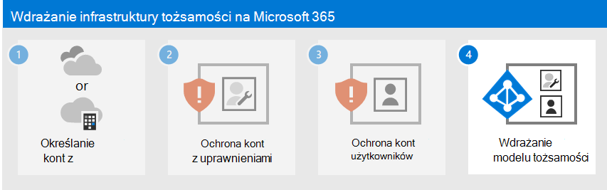

# Krok 3. Ochrona kont użytkowników Microsoft 365

Aby zwiększyć bezpieczeństwo logowań użytkowników:

- Korzystanie z Windows Hello dla firm
- Korzystanie z ochrony haseł Azure Active Directory (Azure AD)
- Korzystanie z uwierzytelniania wieloskładnikowego (MFA)
- Wdrażanie konfiguracji tożsamości i dostępu do urządzeń
- Ochrona przed naruszeniem poświadczeń za pomocą usługi Azure AD Identity Protection

## Windows Hello dla firm

Windows Hello dla firm w Windows 10 Enterprise zastępuje hasła silnym uwierzytelnianiem dwuskładnikowym podczas logowania się na urządzeniu Windows. Te dwa czynniki to nowy typ poświadczeń użytkownika powiązany z urządzeniem oraz dane biometryczne lub numer PIN.

Aby uzyskać więcej informacji, zobacz [omówienie Windows Hello dla firm](/windows/security/identity-protection/hello-for-business/hello-overview).

## Ochrona haseł w usłudze Azure AD

Usługa Azure AD Password Protection wykrywa i blokuje znane słabe hasła i ich warianty, a także może blokować dodatkowe słabe terminy specyficzne dla twojej organizacji. Domyślne listy haseł z zakazem globalnym są automatycznie stosowane do wszystkich użytkowników w dzierżawie usługi Azure AD. Dodatkowe wpisy można zdefiniować na niestandardowej liście zakazanych haseł. Gdy użytkownicy zmieniają lub resetują swoje hasła, te listy zakazanych haseł są sprawdzane w celu wymuszenia użycia silnych haseł.

Aby uzyskać więcej informacji, zobacz [Konfigurowanie ochrony hasłem w usłudze Azure AD](/azure/active-directory/authentication/concept-password-ban-bad).

## MFA

Uwierzytelnianie wieloskładnikowe wymaga, aby logowania użytkowników podlegać dodatkowej weryfikacji poza hasłem konta użytkownika. Nawet jeśli złośliwy użytkownik określi hasło konta użytkownika, musi być również w stanie odpowiedzieć na dodatkową weryfikację, taką jak wiadomość SMS wysłana do smartfona przed udzieleniem dostępu.

Pierwszym krokiem korzystania z uwierzytelniania wieloskładnikowego jest [wymaganie go dla wszystkich kont administratorów](protect-your-global-administrator-accounts.md), znanych również jako konta uprzywilejowane. Poza tym pierwszym krokiem firma Microsoft zaleca uwierzytelnianie wieloskładnikowe dla wszystkich użytkowników.

Istnieją trzy sposoby, aby wymagać od użytkowników używania uwierzytelniania wieloskładnikowego na podstawie planu Microsoft 365.

| Plan | Zalecenie |
|---------|---------|
|Wszystkie plany Microsoft 365 (bez licencji Azure AD — wersja Premium P1 lub P2)     |[Włącz wartości domyślne zabezpieczeń w usłudze Azure AD](/azure/active-directory/fundamentals/concept-fundamentals-security-defaults). Ustawienia domyślne zabezpieczeń w usłudze Azure AD obejmują uwierzytelnianie wieloskładnikowe dla użytkowników i administratorów.   |
|Microsoft 365 E3 (w tym licencje Azure AD — wersja Premium P1)     | Użyj [typowych zasad dostępu warunkowego](/azure/active-directory/conditional-access/concept-conditional-access-policy-common) , aby skonfigurować następujące zasady:  - [Wymagaj uwierzytelniania wieloskładnikowego dla administratorów](/azure/active-directory/conditional-access/howto-conditional-access-policy-admin-mfa)  - [Wymagaj uwierzytelniania wieloskładnikowego dla wszystkich użytkowników](/azure/active-directory/conditional-access/howto-conditional-access-policy-all-users-mfa)   - [Blokowanie starszego uwierzytelniania](/azure/active-directory/conditional-access/howto-conditional-access-policy-block-legacy)       |
|Microsoft 365 E5 (w tym licencje Azure AD — wersja Premium P2)     | Korzystając z usługi Azure AD Identity Protection, rozpocznij implementowanie zalecanego przez firmę Microsoft zestawu dostępu warunkowego i powiązanych zasad, tworząc te dwie zasady:  - [Wymagaj uwierzytelniania wieloskładnikowego, gdy ryzyko logowania jest średnie lub wysokie](/azure/active-directory/conditional-access/howto-conditional-access-policy-risk)  - [Użytkownicy wysokiego ryzyka muszą zmienić hasło](/azure/active-directory/conditional-access/howto-conditional-access-policy-risk-user)       |
| | |

### Ustawienia domyślne zabezpieczeń

Wartości domyślne zabezpieczeń to nowa funkcja dla subskrypcji Microsoft 365 i Office 365 płatnych lub próbnych utworzonych po 21 października 2019 r. Te subskrypcje mają włączone wartości domyślne zabezpieczeń, co ***wymaga od wszystkich użytkowników używania uwierzytelniania wieloskładnikowego z aplikacją Microsoft Authenticator***.
 
Użytkownicy mają 14 dni na zarejestrowanie się w usłudze MFA przy użyciu aplikacji Microsoft Authenticator ze swoich smartfonów, co rozpoczyna się od pierwszego zalogowania się po włączeniu ustawień domyślnych zabezpieczeń. Po upływie 14 dni użytkownik nie będzie mógł się zalogować do momentu ukończenia rejestracji usługi MFA.

Ustawienia domyślne zabezpieczeń zapewniają, że wszystkie organizacje mają podstawowy poziom zabezpieczeń logowania użytkownika, który jest domyślnie włączony. Wartości domyślne zabezpieczeń można wyłączyć na korzyść uwierzytelniania wieloskładnikowego z zasadami dostępu warunkowego lub dla poszczególnych kont.

Aby uzyskać więcej informacji, zobacz [omówienie ustawień domyślnych zabezpieczeń](/azure/active-directory/fundamentals/concept-fundamentals-security-defaults).

### Zasady dostępu warunkowego

Zasady dostępu warunkowego to zestaw reguł określających warunki oceny logowań i udzielania dostępu. Można na przykład utworzyć zasady dostępu warunkowego, które stanowią:

- Jeśli nazwa konta użytkownika jest członkiem grupy dla użytkowników, do których przypisano Exchange, użytkownika, hasło, zabezpieczenia, SharePoint, **administratora Exchange**, **administratora SharePoint** lub **administratora globalnego**, przed zezwoleniem na dostęp należy wymagać uwierzytelniania wieloskładnikowego.

Te zasady umożliwiają wymaganie uwierzytelniania wieloskładnikowego na podstawie członkostwa w grupie, zamiast próbować skonfigurować indywidualne konta użytkowników dla uwierzytelniania wieloskładnikowego, gdy są przypisane lub nieprzypisane z tych ról administratora.

Możesz również użyć zasad dostępu warunkowego, aby uzyskać bardziej zaawansowane możliwości, takie jak wymaganie, aby logowanie odbywało się ze zgodnego urządzenia, takiego jak laptop z systemem Windows 10.

Dostęp warunkowy wymaga licencji Azure AD — wersja Premium P1, które są dołączone do Microsoft 365 E3 i E5.

Aby uzyskać więcej informacji, zobacz [omówienie dostępu warunkowego](/azure/active-directory/conditional-access/overview).

### Używanie tych metod razem

Należy pamiętać o następujących kwestiach:

- Nie można włączyć wartości domyślnych zabezpieczeń, jeśli są włączone jakiekolwiek zasady dostępu warunkowego.
- Nie można włączyć żadnych zasad dostępu warunkowego, jeśli masz włączone ustawienia domyślne zabezpieczeń.

Jeśli ustawienia domyślne zabezpieczeń są włączone, wszyscy nowi użytkownicy są monitowane o rejestrację uwierzytelniania wieloskładnikowego i korzystanie z aplikacji Microsoft Authenticator. 

W tej tabeli przedstawiono wyniki włączania uwierzytelniania wieloskładnikowego z wartościami domyślnymi zabezpieczeń i zasadami dostępu warunkowego.

| Metoda | Włączone | Wyłączona | Dodatkowa metoda uwierzytelniania |
|:-------|:-----|:-------|:-------|
| **Ustawienia domyślne zabezpieczeń**  | Nie można używać zasad dostępu warunkowego | Może używać zasad dostępu warunkowego | aplikacja Microsoft Authenticator |
| **Zasady dostępu warunkowego** | Jeśli są włączone, nie można włączyć wartości domyślnych zabezpieczeń | Jeśli wszystkie są wyłączone, można włączyć ustawienia domyślne zabezpieczeń  | Użytkownik określa podczas rejestracji uwierzytelniania wieloskładnikowego  |
||||

## Konfiguracje Zero Trust dostępu do tożsamości i urządzeń

Zero Trust ustawienia i zasady dostępu do tożsamości i urządzeń są zalecanymi funkcjami wymagań wstępnych i ich ustawieniami w połączeniu z zasadami dostępu warunkowego, Intune i usługi Azure AD Identity Protection, które określają, czy należy udzielić danego żądania dostępu i na jakich warunkach. To określenie jest oparte na koncie użytkownika logowania, używanym urządzeniu, aplikacji używanej przez użytkownika w celu uzyskania dostępu, lokalizacji, z której jest wykonywane żądanie dostępu, oraz ocenie ryzyka żądania. Ta funkcja pomaga zagwarantować, że tylko zatwierdzone użytkownicy i urządzenia będą mogli uzyskiwać dostęp do krytycznych zasobów.

>[!Note]
>Usługa Azure AD Identity Protection wymaga licencji Azure AD — wersja Premium P2, które są dołączone do Microsoft 365 E5.
>

Zasady dostępu do tożsamości i urządzeń są zdefiniowane tak, aby były używane w trzech warstwach: 

- Ochrona według planu bazowego to minimalny poziom zabezpieczeń tożsamości i urządzeń uzyskujących dostęp do aplikacji i danych.
- Ochrona poufna zapewnia dodatkowe zabezpieczenia dla określonych danych. Tożsamości i urządzenia podlegają wyższym poziomom wymagań dotyczących zabezpieczeń i kondycji urządzeń.
- Ochrona środowisk z wysoce regulowanymi lub sklasyfikowanymi danymi dotyczy zazwyczaj niewielkich ilości danych, które są wysoce sklasyfikowane, zawierają wpisy tajne handlowe lub podlegają przepisom dotyczącym danych. Tożsamości i urządzenia podlegają znacznie wyższym poziomom wymagań dotyczących zabezpieczeń i kondycji urządzeń. 

Te warstwy i odpowiednie konfiguracje zapewniają spójne poziomy ochrony danych, tożsamości i urządzeń.

Firma Microsoft zdecydowanie zaleca konfigurowanie i wdrażanie Zero Trust zasad dostępu do tożsamości i urządzeń w organizacji, w tym określonych ustawień dla Microsoft Teams, Exchange Online i SharePoint. Aby uzyskać więcej informacji, zobacz [Zero Trust konfiguracje tożsamości i dostępu do urządzeń](../security/office-365-security/microsoft-365-policies-configurations.md).

## Ochrona tożsamości w usłudze Azure AD

W tej sekcji dowiesz się, jak skonfigurować zasady chroniące przed naruszeniem poświadczeń, w których osoba atakująca określa nazwę konta użytkownika i hasło w celu uzyskania dostępu do usług i danych w chmurze organizacji. Usługa Azure AD Identity Protection oferuje szereg sposobów zapobiegania naruszaniu poświadczeń konta użytkownika przez osobę atakującą.

Usługa Azure AD Identity Protection umożliwia:

|Możliwości|Opis|
|:---------|:---------|
| Określanie i rozwiązywanie potencjalnych luk w zabezpieczeniach tożsamości organizacji | Usługa Azure AD używa uczenia maszynowego do wykrywania anomalii i podejrzanych działań, takich jak logowania i działania po zalogowaniu. Korzystając z tych danych, usługa Azure AD Identity Protection generuje raporty i alerty, które ułatwiają ocenę problemów i podjęcie akcji.|
|Wykrywanie podejrzanych akcji związanych z tożsamościami organizacji i automatyczne reagowanie na nie|Można skonfigurować zasady oparte na ryzyku, które automatycznie reagują na wykryte problemy po osiągnięciu określonego poziomu ryzyka. Te zasady, oprócz innych mechanizmów kontroli dostępu warunkowego udostępnianych przez usługę Azure AD i Microsoft Intune, mogą automatycznie blokować dostęp lub podejmować działania naprawcze, w tym resetowanie haseł i wymaganie uwierzytelniania wieloskładnikowego usługi Azure AD na potrzeby kolejnych logowań. |
| Badanie podejrzanych zdarzeń i rozwiązywanie ich za pomocą akcji administracyjnych | Zdarzenia o podwyższonym ryzyku można zbadać, korzystając z informacji o zdarzeniu dotyczącym zabezpieczeń. Dostępne są podstawowe przepływy pracy umożliwiające śledzenie badań i inicjowanie akcji korygowania, takich jak resetowanie haseł. |
|||

Zobacz [więcej informacji o usłudze Azure AD Identity Protection](/azure/active-directory/identity-protection/overview-identity-protection).

Zobacz [kroki włączania usługi Azure AD Identity Protection](/azure/active-directory/identity-protection/howto-identity-protection-configure-risk-policies).

## Zasoby techniczne administratora dotyczące uwierzytelniania wieloskładnikowego i bezpiecznych logowań

- [Uwierzytelnianie wieloskładnikowe dla Microsoft 365](../admin/security-and-compliance/multi-factor-authentication-microsoft-365.md)
- [Wdrażanie tożsamości dla Microsoft 365](deploy-identity-solution-overview.md)
- [Filmy szkoleniowe dotyczące usługi Azure AD w akademii platformy Azure](https://www.youtube.com/watch?v=pN8o0owHfI0&list=PL-V4YVm6AmwUFpC3rXr2i2piRQ708q_ia)
- [Konfigurowanie zasad rejestracji usługi Azure AD Multi-Factor Authentication](/azure/active-directory/identity-protection/howto-identity-protection-configure-mfa-policy)
- [Konfiguracje dostępu do tożsamości i urządzeń](../security/office-365-security/microsoft-365-policies-configurations.md)

## Następny krok

Przejdź do kroku 4, aby wdrożyć infrastrukturę tożsamości na podstawie wybranego modelu tożsamości:

- [Tożsamość tylko w chmurze](cloud-only-identities.md)
- [Tożsamość hybrydowa](prepare-for-directory-synchronization.md)
