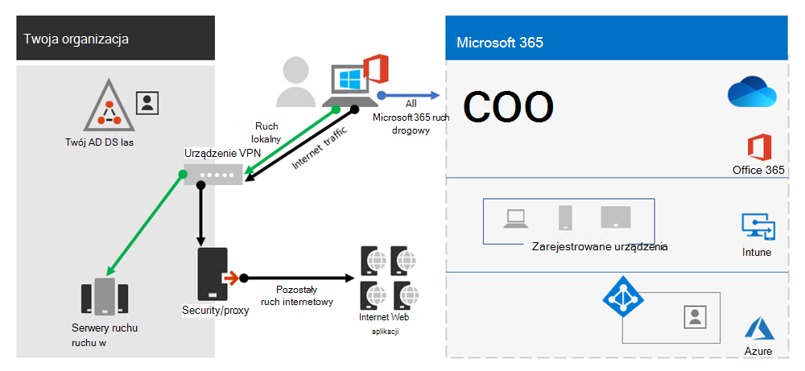

# Typowe scenariusze rozdzielania sieci VPN dla sieci Microsoft 365

>[!NOTE]
>Ten artykuł jest częścią zestawu artykułów dotyczących optymalizacji Microsoft 365 zdalnych.

>- Aby uzyskać omówienie korzystania z rozdzielania dzielonego sieci VPN w celu zoptymalizowania Microsoft 365 dla użytkowników zdalnych, zobacz Omówienie: rozdzielanie sieci VPN dla sieci [Microsoft 365](microsoft-365-vpn-split-tunnel.md).
>- Aby uzyskać szczegółowe wskazówki dotyczące implementowania rozdzielania sieci VPN, zobacz [Implementowanie](microsoft-365-vpn-implement-split-tunnel.md) rozdzielania sieci VPN na Microsoft 365.
>- Aby uzyskać wskazówki dotyczące zabezpieczania Teams ruchu multimedialnego w środowiskach rozdzielanych sieci VPN, zobacz Zabezpieczanie sieci Teams sieci multimedialnej na Teams [sieci VPN](microsoft-365-vpn-securing-teams.md).
>- Aby uzyskać informacje na temat konfigurowania usługi Stream i zdarzeń na żywo w środowiskach VPN, zobacz Szczególne zagadnienia dotyczące przesyłania strumieniowego i wydarzeń na żywo w [środowiskach VPN](microsoft-365-vpn-stream-and-live-events.md).
>- Aby uzyskać informacje na temat optymalizowania Microsoft 365 wydajności dzierżawy na całym świecie dla użytkowników w Chinach, zobacz Microsoft 365 [optymalizację wydajności dla użytkowników w Chinach](microsoft-365-networking-china.md).

Na poniższej liście przedstawiono najbardziej typowe scenariusze sieci VPN w środowiskach przedsiębiorstwa. Większość klientów w tradycyjnej obsłudze modelu 1 (połączenia VPN z Tunnel). Ta sekcja pomoże w krótkim i bezpiecznym przejściu do modelu **2**, który można uzyskać przy stosunkowo niewielkim nałocie pracy i ma niezwykle duże korzyści z wydajnością sieci i środowiskiem użytkownika.

| Model | Opis |
| --- | --- |
| [1. Wymuszone połączenia VPN Tunnel](#1-vpn-forced-tunnel) | 100% ruchu przechodzi do klienta VPN, łącznie z lokalnym, Internetem i wszystkimi usługami O365/M365 |
| [2. VPN Wymuszane Tunnel z kilkoma wyjątkami](#2-vpn-forced-tunnel-with-a-small-number-of-trusted-exceptions) | Vpn jest domyślnie używany (domyślnie prowadzi do sieci VPN), a w przypadku kilku najważniejszych wyklucznych scenariuszy można kierować |
| [3. Vpn wymuszane Tunnel z szerokimi wyjątkami](#3-vpn-forced-tunnel-with-broad-exceptions) | Vpn jest domyślnie używany (domyślnie prowadzi trasę do sieci VPN), z szerokimi wyjątkami, które mogą kierować (na przykład wszystkie połączenia Microsoft 365, Wszystkie usługi Salesforce, Wszystkie powiększenie) |
| [4. Selektywny Tunnel VPN](#4-vpn-selective-tunnel) | Vpn jest używany tylko w przypadku usług opartych na corpnet. Trasa domyślna (Internet i wszystkie usługi internetowe) działa bezpośrednio. |
| [5. Brak połączenia VPN](#5-no-vpn) | Odmiana ciągu #2. Zamiast starszego połączenia VPN wszystkie usługi Corpnet są publikowane przy użyciu nowoczesnych metod zabezpieczeń (takich jak Zscaler ZPA, Azure Active Directory (Azure AD) Proxy/MCAS itp.). |

## 1. Wymuszone połączenia VPN Tunnel

Najczęstszy scenariusz początkowy dla większości klientów korporacyjnych. Używany jest wymuszony interfejs VPN, co oznacza, że 100% ruchu jest przekierowywowywowy do sieci firmowej niezależnie od tego, czy punkt końcowy znajduje się w sieci firmowej. Każdy ruch zewnętrzny (internetowy), taki jak Microsoft 365 lub przeglądanie Internetu, jest następnie przypięty z powrotem z lokalnego sprzętu zabezpieczającego, takiego jak proxy. W bieżącej sytuacji z prawie 100% użytkowników pracujących zdalnie ten model obciąża infrastrukturę sieci VPN, co może znacznie utrudnić wydajność całego ruchu firmowego, przez co przedsiębiorstwa mogą pracować wydajnie w czasie kryzysowej sytuacji.

## 2. Vpn Wymuszane Tunnel z niewielką liczbą zaufanych wyjątków

Znacznie bardziej efektywne działanie w przedsiębiorstwie. Ten model pozwala na obejście obwodu sieci VPN i bezpośrednie kierowanie się do usługi sieci Microsoft 365 punktów końcowych o wysokim obciążeniach i opóźnieniach. W ten sposób znacznie zwiększa się wydajność usług ładowanych oraz zmniejsza się obciążenie infrastruktury sieci VPN, dzięki czemu elementy, które wciąż wymagają jej działania, wymagają niższej zawartości zasobów. Jest to model, w którym skupimy się na udzielaniu pomocy przy przejściu do tego modelu, ponieważ umożliwia szybkie szybkie działanie z wieloma wynikami dodatnimi.

## 3. Vpn wymuszane Tunnel z szerokimi wyjątkami

Rozszerza zakres modelu 2. Zamiast wysyłać bezpośrednio małą grupę zdefiniowanych punktów końcowych, cały ruch jest przesyłany bezpośrednio do zaufanych usług, takich jak Microsoft 365 i SalesForce. To dodatkowo zmniejsza obciążenie firmowej infrastruktury VPN i poprawia wydajność zdefiniowanych usług. Ponieważ ten model może zająć więcej czasu na ocenę chłoniania i zaimplementowanie go, prawdopodobnie będzie to etap, który można podjąć iteratywnie w późniejszym terminie, gdy model drugi zostanie pomyślnie wdrożyny.

## 4. Połączenia selektywne VPN Tunnel

Odwraca trzeci model w tym, że tylko ruch oznaczony jako ma firmowy adres IP jest wysyłany w dół ścieżki vpn, przez co ścieżka internetowa jest trasą domyślną dla wszystkich innych. Ten model wymaga, aby organizacja była dobrze na ścieżce do  zerowego zaufania w celu bezpiecznego wdrożenia tego modelu. Należy zauważyć, że ten model lub jego zmiana prawdopodobnie stanie się z czasem niezbędnym domyślnym ustawieniem w miarę przechodzenia większej liczby usług z sieci firmowej do chmury.

Firma Microsoft używa tego modelu wewnętrznie. Aby uzyskać więcej informacji na temat implementacji sieci VPN przez firmę Microsoft, zobacz Uruchamianie w sieci VPN: W jaki sposób firma Microsoft łączy się ze swoimi [pracownikami zdalnymi](https://www.microsoft.com/itshowcase/blog/running-on-vpn-how-microsoft-is-keeping-its-remote-workforce-connected/?elevate-lv).

## 5. Brak połączenia VPN

Bardziej zaawansowana wersja modelu numer 2, w której wszelkie usługi wewnętrzne są publikowane za pomocą nowoczesnego podejścia zabezpieczeń lub rozwiązania SDWAN, takiego jak serwer proxy usługi Azure AD, usługa Defender dla aplikacji w chmurze, skalr ZPA itp.

## Artykuły pokrewne

[Omówienie: rozdzielanie sieci VPN na Microsoft 365](microsoft-365-vpn-split-tunnel.md)

[Implementowanie rozdzielania sieci VPN na Microsoft 365](microsoft-365-vpn-implement-split-tunnel.md)

[Zabezpieczanie Teams multimediów na przykład przez rozdzielanie sieci VPN](microsoft-365-vpn-securing-teams.md)

[Szczególne zagadnienia dotyczące przesyłania strumienia i wydarzeń na żywo w środowiskach VPN](microsoft-365-vpn-stream-and-live-events.md)

[Microsoft 365 wydajności dla użytkowników w Chinach](microsoft-365-networking-china.md)

[Microsoft 365 dotyczące łączności sieciowej](microsoft-365-network-connectivity-principles.md)

[Ocenianie Microsoft 365 sieciowej](assessing-network-connectivity.md)

[Microsoft 365 sieci i dostosowywania wydajności](network-planning-and-performance.md)

[Nowoczesne mechanizmy kontroli zabezpieczeń można zapewnić specjalistom zabezpieczeń i informatykom w alternatywnych, obecnie unikatowych scenariuszach pracy zdalnej (blog zespołu zabezpieczeń firmy Microsoft)](https://www.microsoft.com/security/blog/2020/03/26/alternative-security-professionals-it-achieve-modern-security-controls-todays-unique-remote-work-scenarios/)

[Zwiększanie wydajności sieci VPN w firmie Microsoft: Windows 10 profilów SIECI VPN w celu umożliwienia automatycznego na połączenia](https://www.microsoft.com/itshowcase/enhancing-remote-access-in-windows-10-with-an-automatic-vpn-profile)

[Vpn: jak firma Microsoft łączy się ze swoimi pracownikami zdalnymi](https://www.microsoft.com/itshowcase/blog/running-on-vpn-how-microsoft-is-keeping-its-remote-workforce-connected/?elevate-lv)

[Sieć globalna firmy Microsoft](/azure/networking/microsoft-global-network)
