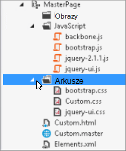

# Minifikacja i tworzenie pakietów w u SharePoint Online

W tym artykule opisano, jak za pomocą technik minifikacji i tworzenie pakietów oraz programu Web Essentials zmniejszyć liczbę żądań HTTP i skrócić czas ładowania stron w umacie SharePoint Online.
  
Podczas dostosowywania witryny sieci Web możesz dodać dużą liczbę dodatkowych plików do serwera w celu obsługi dostosowania. Dodanie dodatkowego kodu JavaScript, arkusza CSS i obrazów zwiększa liczbę żądań HTTP do serwera, co z kolei powoduje zwiększenie czasu wyświetlania strony internetowej. Jeśli masz wiele plików tego samego typu, możesz utworzyć z nich pakiet, aby przyspieszyć ich pobieranie.
  
W przypadku plików JavaScript i CSS możesz również użyć podejścia nazywanego minifikacją, które pozwala zmniejszyć całkowity rozmiar plików przez usunięcie odstępów i innych znaków, które nie są potrzebne.
  
## Zminifikowanie i tworzenie pakietów plików JavaScript i CSS za pomocą oprogramowania Web Essentials

Do programowania w pakiecie plików CSS i JavaScript możesz używać oprogramowania innych firm, takiego jak Web Essentials.
  
> [!IMPORTANT]
> Web Essentials to projekt społecznościowy typu Open Source innej firmy. To oprogramowanie jest rozszerzeniem oprogramowania do wersji Visual Studio 2012 i Visual Studio 2013 i nie jest obsługiwane przez firmę Microsoft. Aby pobrać oprogramowanie Web Essentials, odwiedź witrynę internetową pod witrynie [https://vswebessentials.com/download](https://go.microsoft.com/fwlink/p/?LinkId=525629).
  
Web Essentials oferuje dwie formy pakietów:
  
- .bundle: dla plików CSS i JavaScript
- sprite: dotyczy obrazów (dostępne tylko w programie Visual Studio 2013)

Składników Web Essentials możesz używać, jeśli masz istniejącą funkcję z pewnymi elementami marki, do których odwołują się w obrębie niestandardowej strony wzorcowej, takimi jak:
  

  
### Aby utworzyć pakiet TE000127218 i CSS w programie Web Essentials
  
1. W Visual Studio w Eksploratorze rozwiązań zaznacz pliki, które chcesz dołączyć do pakietu.
2. Kliknij prawym przyciskiem myszy zaznaczone pliki, a następnie z menu kontekstowego wybierz polecenie **Web Essentials** \> **Create JavaScript bundle file** . Przykład:

    
  
## Wyświetlanie wyników tworzenie pakietów plików JavaScript i CSS

Podczas tworzenia pakietu JavaScript i CSS oprogramowanie Web Essentials tworzy plik XML nazywany plikiem przepisu, który identyfikuje pliki JavaScript i CSS, a także niektóre inne informacje o konfiguracji:
  

  
Ponadto, jeśli flaga mifikacji w przepisie na tworzenie pakietu ma wartość "true", pliki są zmniejszane i powiązane ze sobą. Oznacza to, że utworzono nowe, zminifikowane wersje plików JavaScript, do których można odwoływać się na stronie wzorcowej.
  

  
Podczas ładowania strony z witryny sieci Web można za pomocą narzędzi deweloperskiej przeglądarki internetowej, takich jak program Internet Explorer 11, sprawdzić liczbę żądań wysłanych do serwera i czas ładowania każdego pliku.
  
Na poniższej ilustracji przedstawiono wynik ładowania plików JavaScript i CSS przed zminifikacją.
  

  
Po opakowaniu razem plików CSS i JavaScript liczba żądań została upuszczona do 74, a czas pobierania poszczególnych plików był tylko nieznacznie dłuższy niż w przypadku oryginalnych plików:
  

  
Po pakietów plik pakietu JavaScript został znacznie zmniejszony z 815 KB do 365 KB:
  

  
## Tworzenie pakietów obrazów przez utworzenie grafika obrazów

Podobnie jak w przypadku programowania plików JavaScript i CSS można połączyć wiele małych ikon i innych typowych obrazów w większy arkusz, a następnie za pomocą arkusza CSS odsłonić poszczególne obrazy. Zamiast pobierania poszczególnych obrazów przeglądarka internetowa użytkownika raz pobiera arkusz plików, a następnie buforuje go na komputerze lokalnym. Zwiększa to wydajność ładowania stron przez zmniejszenie liczby pobrań i odebrań do serwera sieci Web.
  
### Aby utworzyć sprite obrazu w programie Web Essentials**
  
1. W Visual Studio w Eksploratorze rozwiązań zaznacz pliki, które chcesz dołączyć do pakietu.
2. Kliknij prawym przyciskiem myszy zaznaczone pliki, a następnie z menu kontekstowego wybierz pozycję **Web Essentials** \> **Create image sprite** . Przykład:

    
  
3. Wybierz lokalizację zapisu pliku sprite. Plik sprite jest plikiem XML, który opisuje ustawienia i pliki obiektu. Na poniższych ilustracjach przedstawiono przykładowy plik PNG obiektu i odpowiadający mu plik XML sprite.

    
  
    
