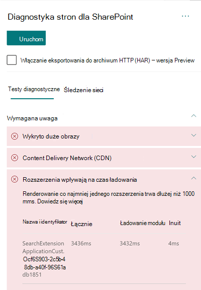

# Optymalizowanie wydajności rozszerzenia niestandardowego na SharePoint nowoczesnych stron witryny w trybie online

Ten artykuł pomoże Ci zrozumieć, jak określić, jak rozszerzenia niestandardowe wpływają na opóźnienia odbierane przez użytkownika i jak rozwiązać typowe problemy.

## Używanie narzędzia Diagnostyka stron SharePoint do analizowania rozszerzeń niestandardowych

Narzędzie Diagnostyka stron dla programu SharePoint to rozszerzenie przeglądarki dla nowych przeglądarek Microsoft Edge (https://www.microsoft.com/edge)i Chrome), które analizuje zarówno nowoczesne portal SharePoint Online, jak i klasyczne strony witryn publikowania. To narzędzie udostępnia raport dla każdej analizowanej strony pokazujący, jak ta strona działa w stosunku do zdefiniowanego zestawu kryteriów wydajności. Aby zainstalować narzędzie Diagnostyka stron dla SharePoint informacji, odwiedź stronę Używanie narzędzia Diagnostyka stron dla usługi [SharePoint Online](page-diagnostics-for-spo.md).

>[!NOTE]
>Narzędzie Diagnostyka stron działa tylko w SharePoint Online i nie można go używać na SharePoint stronie systemu.

Podczas analizowania strony witryny programu SharePoint za pomocą narzędzia Diagnostyka stron dla programu SharePoint możesz wyświetlić informacje o rozszerzeniach niestandardowych, które przekraczają metrykę planu bazowego w rozszerzeniach mają wpływ  na czas ładowania i/lub wynik zbyt wielu używanych rozszerzeń  w okienku Testy diagnostyczne  

Możliwe wyniki:

- **Wymagana uwaga** (kolor czerwony): dowolne _niestandardowe_ rozszerzenie, które trwa dłużej niż **jedną** sekundę w celu załadowania. Całkowity czas ładowania wyświetlany w wynikach testów jest rozbity na moduł i init. Ponadto jeśli na stronie jest zbyt wiele rozszerzeń, mogą one mieć wpływ na czas ładowania strony, co zostanie wyróżnione, jeśli na stronie zostanie  użytych co najmniej siedem rozszerzeń.
- **Możliwości udoskonalania** (żółty)  Jeśli zostanie użytych co najmniej pięć rozszerzeń, zostaną one wyróżnione w tej sekcji jako ostrzeżenie, dopóki nie zostanie użytych co najmniej siedem rozszerzeń, które zostaną wówczas wyróżnione jako Wymagane uwagi.
- **Nie jest wymagane żadne** działanie (kolor zielony): Ładowanie nie trwa dłużej niż jedną sekundę.

Jeśli rozszerzenie wpływa na czas ładowania strony lub jest zbyt wiele rozszerzeń na stronie, wynik pojawi się w sekcji Wymagane uwagi wyników. Kliknij wynik, aby wyświetlić szczegółowe informacje o tym, które rozszerzenie jest ładowane wolno lub zbyt wiele rozszerzeń zostało wyróżnione. Przyszłe aktualizacje narzędzia Diagnostyka stron dla programu SharePoint mogą obejmować aktualizacje reguł analizy, dlatego upewnij się, że zawsze masz najnowszą wersję tego narzędzia.

Dostępne w wynikach informacje obejmują:

- **Nazwa i identyfikator** pokazuje informacje identyfikujące, które mogą pomóc w odnalezieniu rozszerzenia na stronie
- **Suma** pokazuje całkowity czas ładowania i inicjowania modułu przez rozszerzenie. Jest to całkowity względny czas wykonywania na stronie przez rozszerzenie, od początku do końca.
- **Ładowanie modułu** pokazuje czas pobierania, oceniania i ładowania rozszerzeń JavaScript i plików CSS. Następnie rozpocznie się proces init.
- **Init** pokazuje czas, który należy wziąć na rozszerzenie w celu zainicjowania danych.

  Jest to asynchroniczne wywołanie, a czas init to obliczenie czasu dla funkcji onInit, gdy zwrócona obietnica zostanie rozwiązana.

Te informacje są udostępniane projektantom i deweloperom w rozwiązywaniu problemów. Te informacje powinny być udostępniane zespołowi projektoweowi i zespołowi programistów.

## Omówienie rozszerzeń

SharePoint Framework (SPFx) można używać w celu rozszerzenia SharePoint użytkownika. Dzięki SharePoint Framework narzędzi SharePoint możesz dostosować więcej elementów interfejsu użytkownika, w tym obszary powiadomień, paski narzędzi i widoki danych list.

Rozszerzenia mogą mieć duży wpływ na wydajność strony SharePoint, ponieważ wymaga to również procesora i zasobów sieciowych do wykonania wymaganej pracy.

Istnieją cztery typy rozszerzeń:

- **Elementy do dostosowywania** aplikacji dodają skrypty do strony i mają dostęp do znanych symboli zastępczych elementów HTML oraz rozszerzają je o renderowanie niestandardowe.
- **Dostosowywanie pól** udostępnia zmodyfikowane widoki danych dla pól na liście.
- **Zestawy** poleceń rozszerzają SharePoint poleceń w celu dodawania nowych akcji i zapewniają kod po stronie klienta, za pomocą których można zaimplementować zachowania.
- **Modyfikator zapytań wyszukiwania (tylko podgląd)** jest wywoływany tuż przed wykonaniem zapytania wyszukiwania.

## Rozwiązywanie problemów z wydajnością rozszerzenia

Postępuj zgodnie z wskazówkami w tej sekcji, aby zidentyfikować i rozwiązać problemy z wydajnością rozszerzeń wymienionych w sekcjach Rozszerzenia wpływające na czas **ładowania** stron.

>[!NOTE]
>Dostosowywanie aplikacji może być wykonywane na wczesnym etapie cyklu życia strony i może mieć wpływ na wydajność innych rozszerzeń na stronie.

Wyniki inspekcji w narzędziu diagnostycznym strony zawierają dwa etapy wykonywania rozszerzenia w celu zidentyfikowania potencjalnego wpływu na wydajność.

- **Ładowanie** modułu to czas ładowania rozszerzenia, na co wpływa rozmiar rozszerzenia, dlatego warto owiązyć tylko niezbędne biblioteki w rozszerzeniach i wybierać biblioteki o jaśniejszym rozmiarze.
- **Init** to czas inicjowania rozszerzenia i deweloperów rozszerzeń, którzy powinni zastanowić się, czy rozszerzenie wykonywanie niepotrzebnej pracy lub wykonanie zbyt wielu poleceń na etapie inicjowania.

Autorzy stron mogą również użyć wyniku inspekcji, aby sprawdzić, czy strona ma zbyt wiele rozszerzeń, ponieważ zbyt wiele rozszerzeń ma negatywny wpływ na wydajność strony.

- **Rozmiar i zależności rozszerzenia**
  - Korzystanie z Office 365 CDN jest wymagane do optymalnego pobierania zasobów statycznych. Pochodzenie CDN jest preferowane w przypadku _plików js/css_. Aby uzyskać więcej informacji na temat korzystania z Office 365 CDN, zobacz Używanie Office 365 Content Delivery Network [(CDN) z usługą SharePoint Online](use-microsoft-365-cdn-with-spo.md).
  - Ponowne używanie ram, _takich jak React_ _i_ importy tkanin, które są częścią SharePoint Framework (SPFx). Aby uzyskać więcej informacji, [zobacz Omówienie SharePoint Framework](/sharepoint/dev/spfx/sharepoint-framework-overview).
  - Upewnij się, że korzystasz z najnowszej wersji pakietu SharePoint Framework i uaktualnij je do nowych wersji w przyszłych wersjach.
- **Pobieranie i buforowanie danych**
  - Jeśli rozszerzenie korzysta z dodatkowych wywołań serwera w celu pobrania danych w celu ich wyświetlenia, upewnij się, że te interfejsy API serwera są szybkie i/lub implementują buforowanie po stronie klienta (na przykład używanie _localStorage_ lub _IndexDB_ w przypadku większych zestawów).
  - Jeśli do renderowania krytycznych danych jest wymaganych wiele połączeń, rozważ grupowanie na serwerze lub inne metody konsolidowania żądań w jednym wywołaniu.
  - Ewentualnie, jeśli niektóre elementy danych wymagają wolniejszego interfejsu API, ale nie są krytyczne do początkowego renderowania, oddziel je do oddzielnego wywołania, które jest wykonywane po renderowaniu krytycznych danych.
  - Jeśli wiele części używa tych samych danych, używaj wspólnej warstwy danych, aby uniknąć zduplikowanych połączeń.
- **Czas renderowania**
  - Wszelkie źródła multimediów, takie jak obrazy i klipy wideo, powinny mieć rozmiar do limitów kontenera, urządzenia i/lub sieci, aby uniknąć pobierania niepotrzebnych dużych zasobów. Aby uzyskać więcej informacji na temat zależności zawartości, zobacz Używanie Office 365 Content Delivery Network [(CDN) z usługą SharePoint Online](use-microsoft-365-cdn-with-spo.md).
  - Unikaj wywołań interfejsu API, które powodują ponowne przepływy, złożone reguły CSS lub skomplikowane animacje. Aby uzyskać więcej informacji, zobacz [Minimalizowanie układu ponownego układu przeglądarki](https://developers.google.com/speed/docs/insights/browser-reflow).
  - Unikaj używania zadań uruchomionych w łańcuch, których wykonywanie jest długie. Zamiast tego należy rozdzielić długo wykonywane zadania na oddzielne kolejki. Aby uzyskać więcej informacji, zobacz [Optymalizowanie wykonywania kodu JavaScript](https://developers.google.com/web/fundamentals/performance/rendering/optimize-javascript-execution).
  - Rezerwuj odpowiednie miejsce na asynchroniczne renderowanie multimediów lub elementów wizualnych, aby uniknąć pominiętych ramek i zacinania (znanego _również jako jank_).
  - Jeśli funkcja używana w określonej przeglądarce nie obsługuje renderowania, załaduj wypełnienie polyfill lub wyklucz uruchomiony kod zależny. Jeśli ta funkcja nie jest krytyczna, usuwaj zasoby, takie jak programy obsługi zdarzeń, aby uniknąć wycieków pamięci.

Zanim dokonasz poprawek stron w celu rozwiązania problemów z wydajnością zanotuj czas ładowania stron w wynikach analizy. Uruchom ponownie narzędzie po poprawce, aby sprawdzić, czy nowy wynik nie jest w standardzie bazowym, i sprawdź czas ładowania nowej strony, aby sprawdzić, czy w programie Wiad.

>[!NOTE]
>Czas ładowania stron może się różnić w zależności od różnych czynników, takich jak obciążenie sieci, godzina dnia i inne warunki przejściowy. Należy przetestować czas ładowania strony kilka razy przed wprowadzeniem zmian i po ich wymuseniu, aby ułatwić uśredninie wyników.

## Tematy pokrewne

[Dostosowywanie SharePoint online](tune-sharepoint-online-performance.md)

[Dostosowywanie Office 365 wydajności](tune-microsoft-365-performance.md)

[Wydajność w nowoczesnym SharePoint klienta](/sharepoint/modern-experience-performance)

[Sieci dostarczania zawartości](content-delivery-networks.md)

[Używanie Office 365 Content Delivery Network (CDN) z usługą SharePoint Online](use-microsoft-365-cdn-with-spo.md)