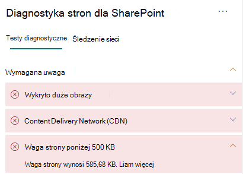

# Optymalizowanie wagi stron na SharePoint nowoczesnych stron witryny w trybie online

SharePoint Nowoczesne strony witryny w trybie online zawierają szeregowy kod, który jest wymagany do renderowania zawartości strony, w tym obrazów, tekstu, obiektów w obszarze zawartości pod paskami nawigacji/poleceń i innymi kodami HTML, które są strukturyą strony. Weight (Waga strony) to miara tego kodu HTML i powinna być ograniczona w celu zapewnienia optymalnego czasu ładowania stron.

Ten artykuł pomoże Ci w zrozumieniu sposobu zmniejszenia wagi stron na nowoczesnych stronach witryny.

>[!NOTE]
>Aby uzyskać więcej informacji na temat wydajności w nowoczesnych SharePoint Online, zobacz Wydajność w [nowoczesnym SharePoint sieci](/sharepoint/modern-experience-performance).

## Używanie narzędzia Diagnostyka SharePoint do analizowania wagi stron

Narzędzie Diagnostyka stron dla programu SharePoint to rozszerzenie przeglądarki dla nowych przeglądarek Microsoft Edge (https://www.microsoft.com/edge)i Chrome), które analizuje zarówno nowoczesne portal SharePoint Online, jak i klasyczne strony witryn publikowania. To narzędzie udostępnia raport dla każdej analizowanej strony pokazujący, jak ta strona działa w stosunku do zdefiniowanego zestawu kryteriów wydajności. Aby zainstalować narzędzie Diagnostyka stron dla SharePoint informacji, odwiedź stronę Używanie narzędzia Diagnostyka stron dla usługi [SharePoint Online](page-diagnostics-for-spo.md).

>[!NOTE]
>Narzędzie Diagnostyka stron działa tylko w SharePoint Online i nie można go używać na SharePoint stronie systemu.

Podczas analizowania strony SharePoint za pomocą narzędzia Diagnostyka SharePoint strony można wyświetlić informacje o stronie w obszarze Waga strony poniżej **500 KB** wyniku okienka Testy diagnostyczne. Jeśli waga strony jest poniżej wartości bazowej, wynik zostanie wyświetlony na zielono, a kolor czerwony, jeśli waga strony jest większa niż wartość planu bazowego.

Możliwe wyniki:

- **Wymagana uwaga** (kolor czerwony): waga strony przekracza 500 KB
- **Nie jest wymagane żadne działanie** (kolor zielony): Waga strony jest poniżej 500 KB

Jeśli w sekcji Wymagana uwaga jest wyświetlany wynik o wysokości poniżej **500 KB**, możesz kliknąć wynik, aby uzyskać szczegółowe informacje.

## Rozwiązywanie problemów dotyczących wagi stron

Jeśli waga strony przekracza 500 KB, możesz poprawić ogólny czas ładowania stron, zmniejszając liczbę składników Web Part i ograniczając zawartość stron do odpowiedniego stopnia.

Ogólne wskazówki dotyczące zmniejszania wagi strony obejmują:

- Ogranicz zawartość strony do rozsądnej ilości i używaj wielu stron dla powiązanej zawartości.
- Zminimalizuj użycie składników Web Part, które mają duży rozmiar torby na właściwość.
- Używaj nieinterakcyjnych widoków rzutowania, jeśli to możliwe.
- Optymalizuj rozmiary obrazów, odpowiednio do rozmiaru obrazów, stosując skompresowane formaty obrazów i upewniając się, że są one pobierane z CDN.

Dodatkowe wskazówki dotyczące ograniczania wagi stron można znaleźć w następującym artykule:

- [Optymalizowanie wydajności strony w SharePoint](/sharepoint/dev/general-development/optimize-page-performance-in-sharepoint)

Zanim dokonasz poprawek stron w celu rozwiązania problemów z wydajnością zanotuj czas ładowania stron w wynikach analizy. Uruchom ponownie narzędzie po poprawce, aby sprawdzić, czy nowy wynik nie jest w standardzie bazowym, i sprawdź czas ładowania nowej strony, aby sprawdzić, czy w programie Wiad.

>[!NOTE]
>Czas ładowania stron może się różnić w zależności od różnych czynników, takich jak obciążenie sieci, godzina dnia i inne warunki przejściowy. Należy przetestować czas ładowania strony kilka razy przed wprowadzeniem zmian i po ich wymuseniu, aby ułatwić uśredninie wyników.

## Tematy pokrewne

[Dostosowywanie SharePoint online](tune-sharepoint-online-performance.md)

[Dostosowywanie Office 365 wydajności](tune-microsoft-365-performance.md)

[Wydajność w nowoczesnym SharePoint klienta](/sharepoint/modern-experience-performance)

[Sieci dostarczania zawartości](content-delivery-networks.md)

[Używanie Office 365 Content Delivery Network (CDN) z usługą SharePoint Online](use-microsoft-365-cdn-with-spo.md)